# 蘑菇博客QQ小程序发布指南

## 前言

这阵子使用 [uniapp](https://uniapp.dcloud.io/) 和 [ColorUI](https://github.com/weilanwl/ColorUI) 搭建了蘑菇博客的移动端应用，uniapp是使用vue.js开发的前端应用框架，可以做到开发一套代码，可发布到iOS、Android、H5、以及各种小程序（微信/支付宝/百度/头条/QQ/钉钉/淘宝）、快应用等多个平台，下面演示一下uniapp打包成QQ小程序后的效果图。


## 下载HbuildX

我们首先下载uniapp推荐的编辑器 [HbuildX](https://www.dcloud.io/hbuilderx.html)

## 导入项目

下载完成后，我们将uniapp_mogu_web项目导入到我们的HbuildX编辑器中，然后点击上方的发布按钮

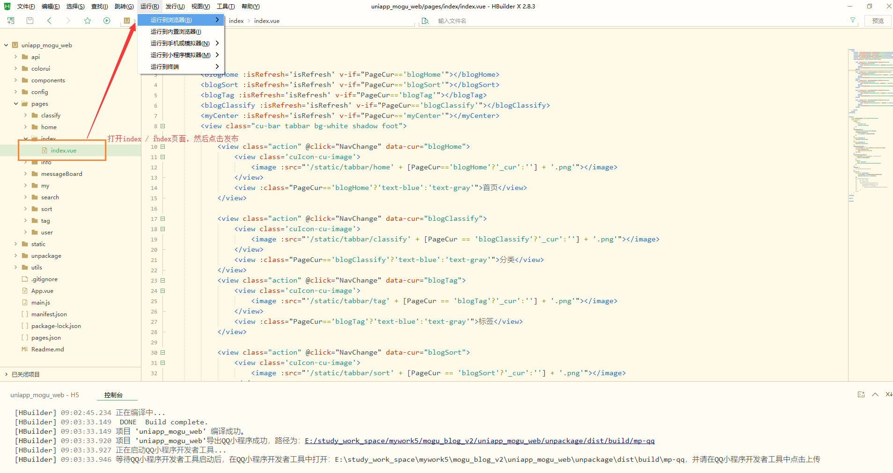

然后选择 chrome，等待一段时间后，就会弹出页面

> tip：需要注意，我们启动uniapp项目的时候，必须确保我们的后台服务已经成功启动了
>
> 同时我们还需要打开  index/ index页面

运行成功后的页面如下所示

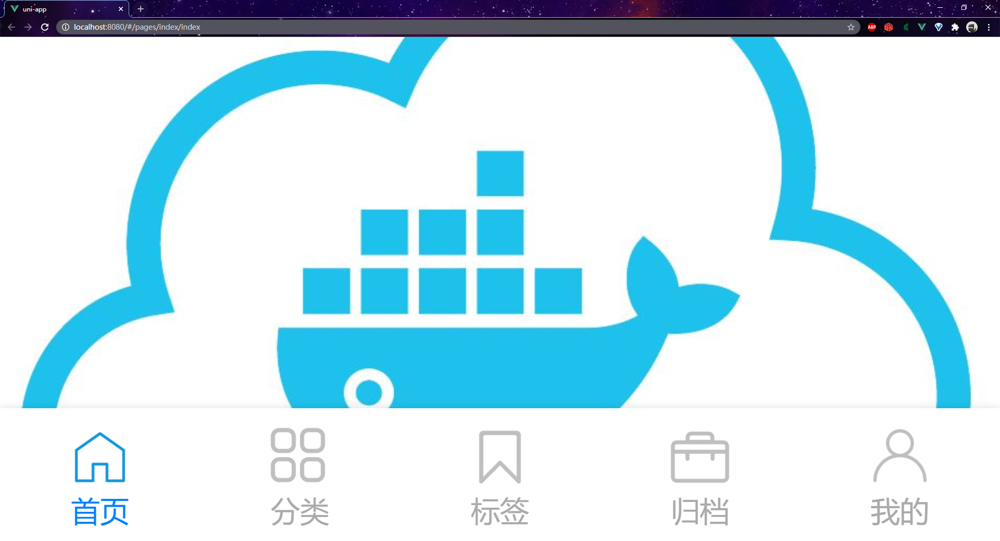

这个时候，我们就需要打开F12的页面，然后点击手机端，这个时候就能够看到项目已经成功运行了

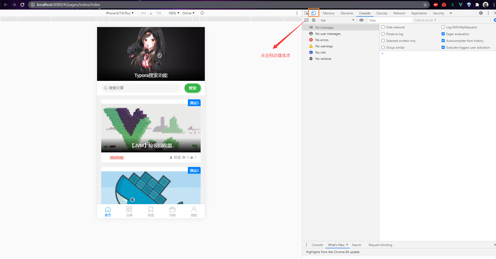

## QQ小程序

uniapp可以打包成QQ小程序、微信小程序、APP等，但是因为微信小程序需要交费 300元，本着省钱的原则，决定就发布成QQ小程序，因为小程序支持个人发布

### 下载QQ小程序开发者工具

因为uniapp需要转换成QQ小程序的代码，因此我们首先需要下载 [QQ小程序开发工具](https://q.qq.com/wiki/tools/devtool/)

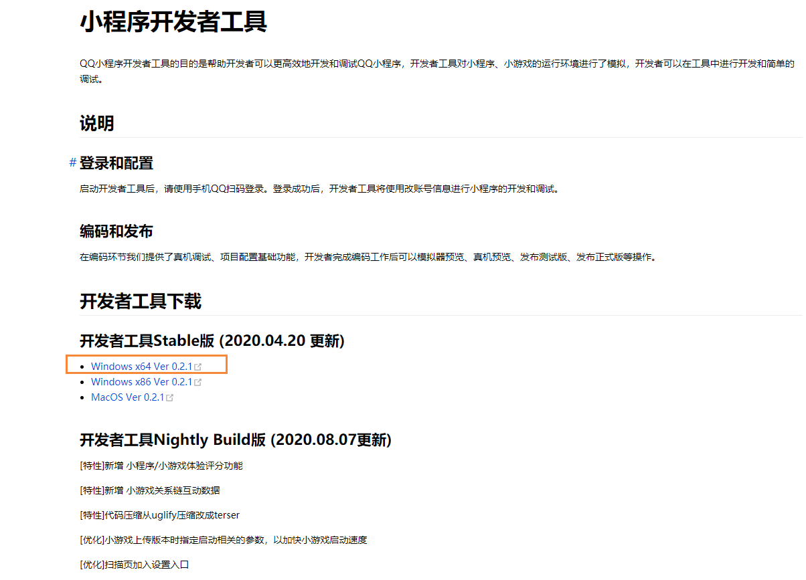


### 修改配置

如果我们发布一个QQ小程序体验版本，这个时候就可以使用 IP+端口的方式，如下我们首先找到config文件，修改里面的配置，改成自己的线上的ip

```js
export const appConfig = {

    tokenKey: 'Authorization',
	
	// 开发环境
    // WEB_API: 'http://localhost:8603',
	// PICTURE_API: 'http://localhost:8602',
	
	// 演示环境
	WEB_API: 'http://120.78.126.96:8603',
	PICTURE_API: 'http://120.78.126.96:8602',
	
	// 正式环境
	// WEB_API: 'https://apiweb.moguit.cn',
	// PICTURE_API: 'https://apipicture.moguit.cn',
}
```

如果你想发布项目的话，那么就需要拥有域名 和 配置对应的https了，因为我们小程序只用到了两个端口，所以我们只需要对这两个端口都配置一下https即可~， 关于如何配置，可以参考这篇博客

[Linux下通过nginx配置https](http://www.moguit.cn/#/info?blogUid=cc8dff10a58c4f740a1f52cc962465da)

在我们配置好 https后，也就是上面提到的正式环境

```bash
WEB_API: 'https://apiweb.moguit.cn',
PICTURE_API: 'https://apipicture.moguit.cn',
```

我们还需要把这两个合法访问的域名添加到QQ小程序的后台页面

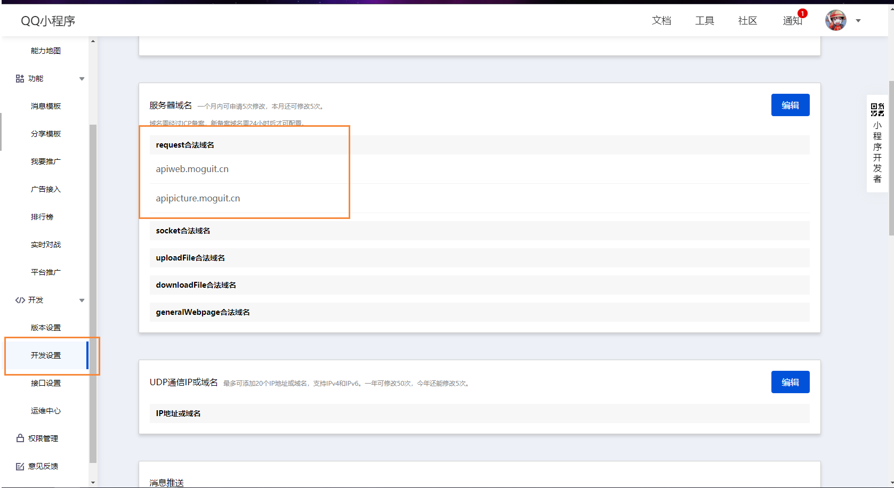

### 打包

上述操作完成后，我们回到HbuildX页面，然后点击 发行 -> 小程序-QQ 

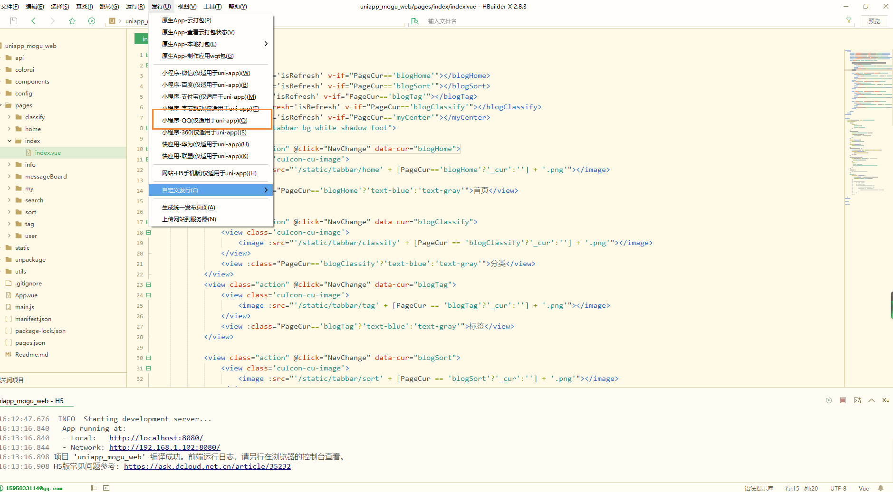

然后填写小程序名称和小程序AppID

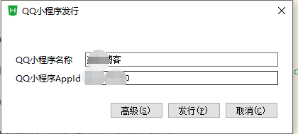

关于AppId的获取，我们需要到  https://q.qq.com/ 页面进行申请，然后完成后，我们找到AppID

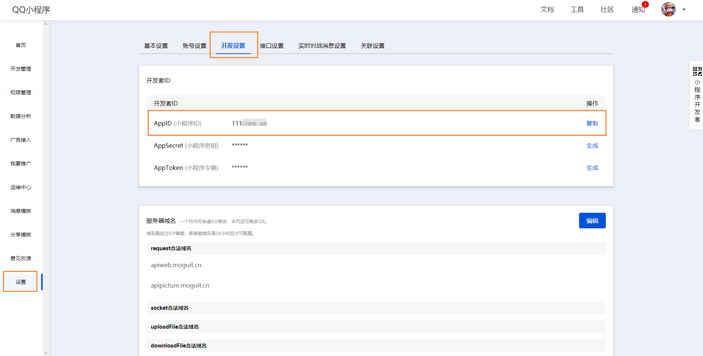

复制到对应的AppID到我们的HbuildX中，点击发行

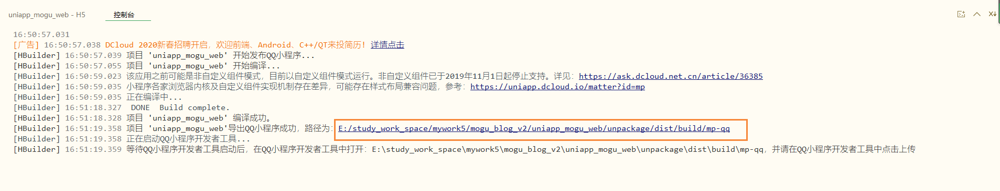

下面就得到了我们QQ小程序开发工具，然后打开我们的上面路径中的程序

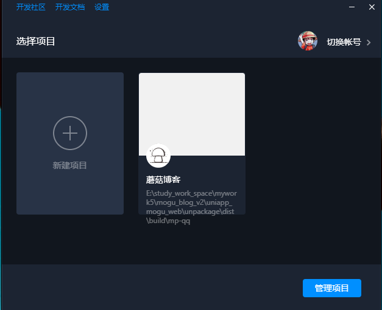

打开程序后，我们选择详情，然后点击不校验域名【如果是https域名访问，就不需要】

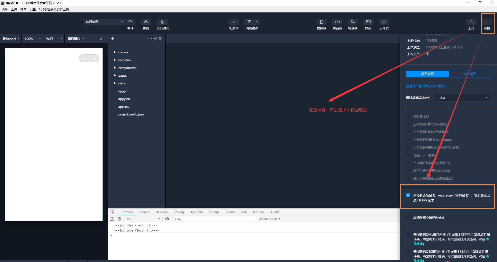

然后在看左边的项目，就能够成功运行项目了

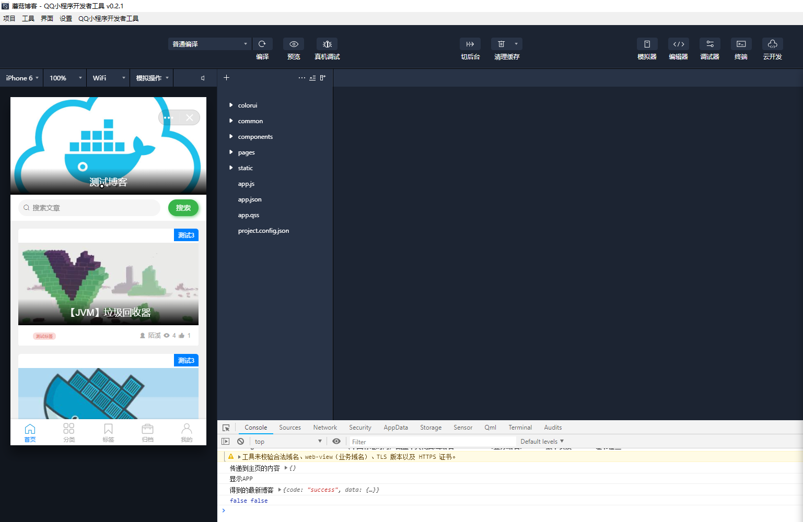

这个时候，我们就需要点击右上角的上传

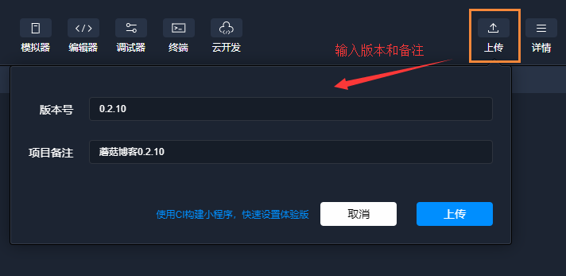

然后在到我们的QQ小程序页面，找到刚刚的QQ小程序页面，选择设为体验版本，扫描即可进行体验

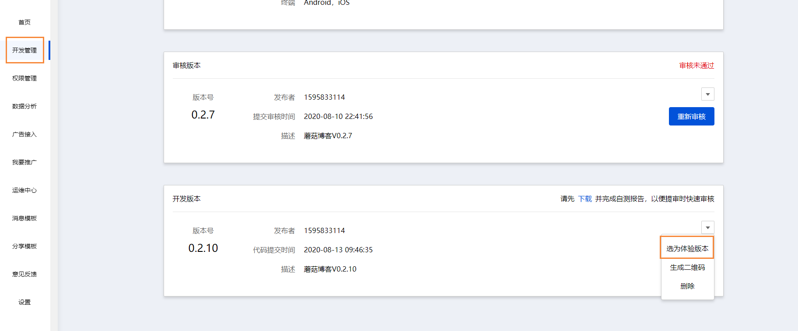

## 发布QQ小程序

我们点击开发版本上的提交审核按钮，即可发布小程序。但是在发布小程序的时候，我也遇到了好几个坑，首先是第一次发布的时候

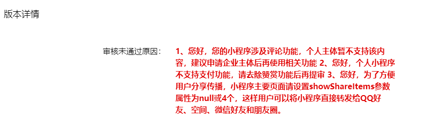

也就是因为申请的是个人小程序，因此不支持打赏和评论的功能，所以为了解决这个问题，我们将增加开关语句用来控制小程序的评论和打赏模块的显示，我们到  系统配置 -> 网站配置 -> 评论&打赏

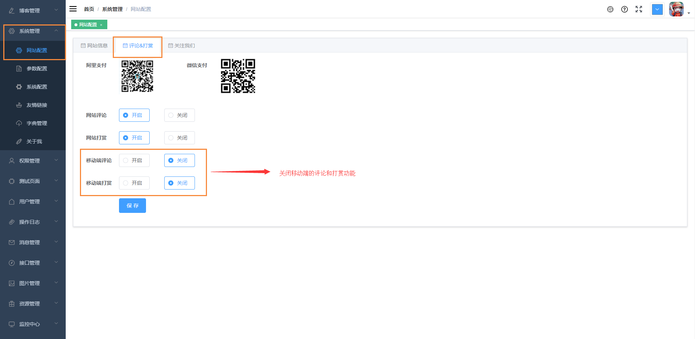

然后在看我们的小程序端，这个时候就没有评论和打赏相关功能了

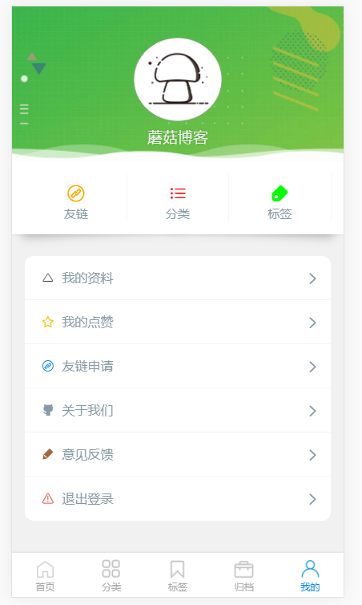

我们对比之前的页面，发现已经将评论和打赏功能给关闭了，达到审核的要求

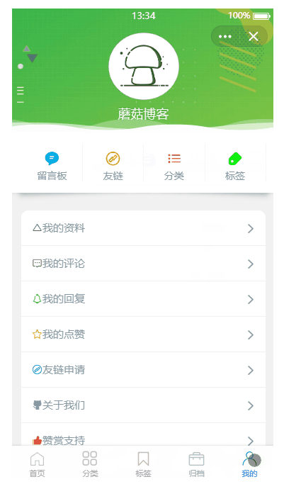

当我修改完上述的问题后，再次提交代码

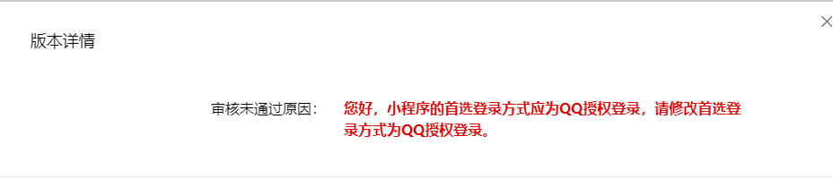

提示小程序还需要支持QQ授权登录，这个时候我们就需要去申请QQ授权，我们到[QQ互联](https://connect.qq.com/)

然后创建我们的小程序，在这之前，我们需要进行审核，按照要求完成QQ互联的审核即可

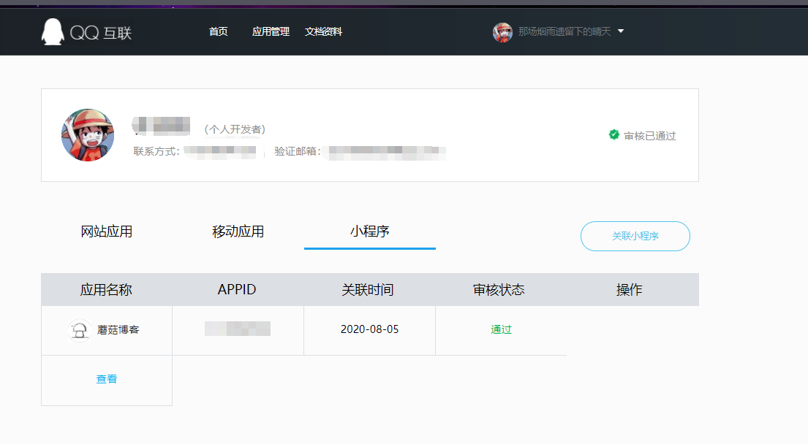

然后我们点击查看按钮，点击申请unionid

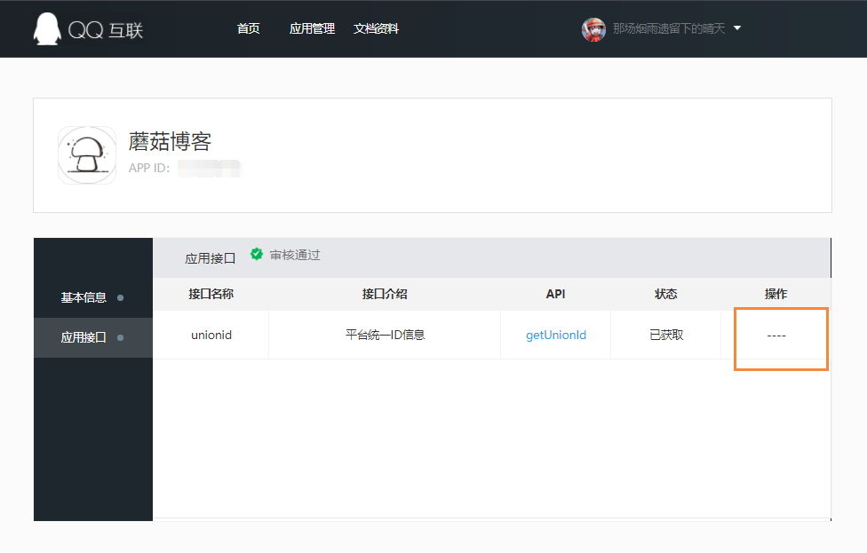

完成这一系列的操作后，我们回到QQ小程序页面

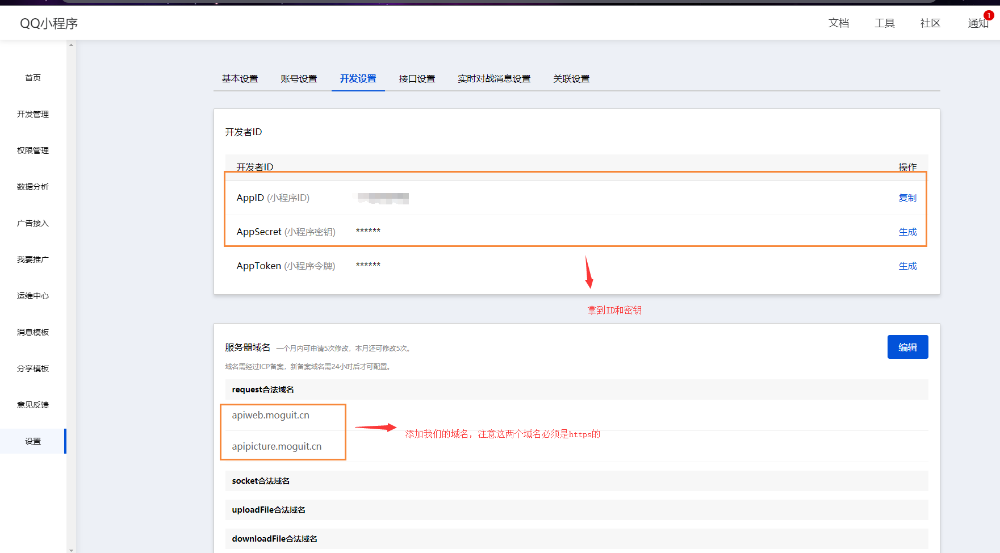

最后到我们的nacos页面，http://localhost:8848/nacos/#/login，找到 mogu-web-dev.yaml配置，然后修改 appid 和 secret，也就是上面我们复制的

```bash
# uniapp相关配置
uniapp:
  qq:
    appid: XXXXXXXXXXXXXX  # 改成自己的
    secret: XXXXXXXXXXXXXX  # 改成自己的
    grant_type: authorization_code
```

修改完成后，我们到我们的小程序登录页面，进行QQ一键登录

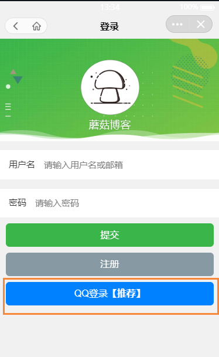

如果能够成功登录，代表配置已经正常


这个时候我们就可以重新打包程序了，然后点击发布，最后在提交审核


经过一系列的操作，我们的小程序也终于通过了审核~，回到版本设置页面，点击发布即可

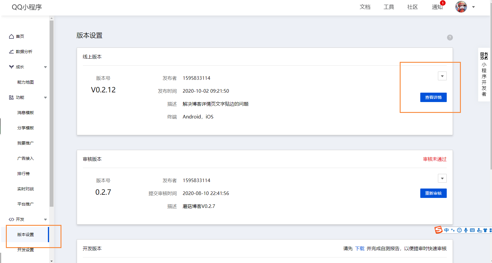