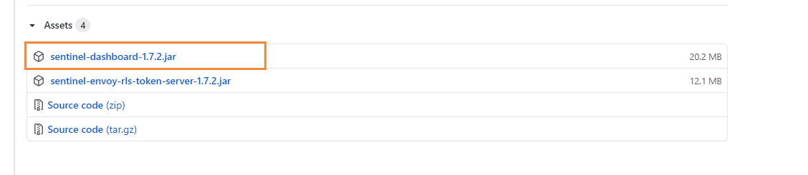
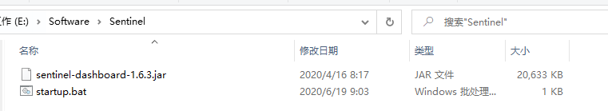
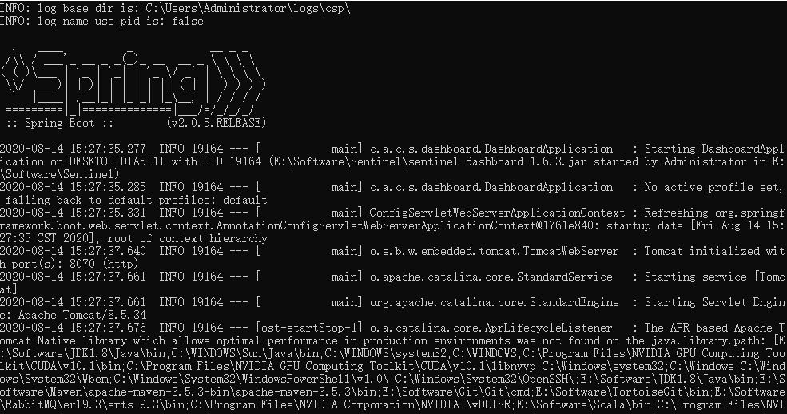
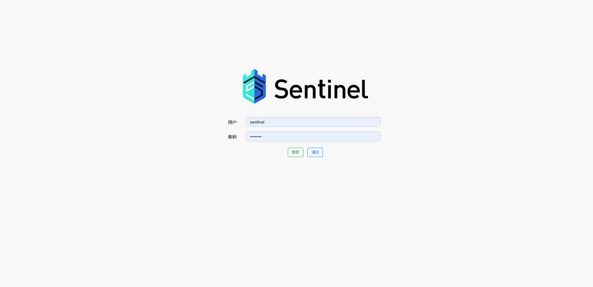
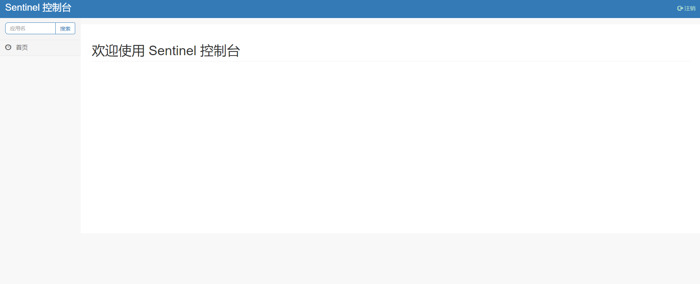
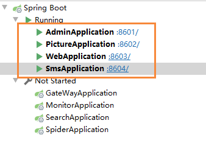
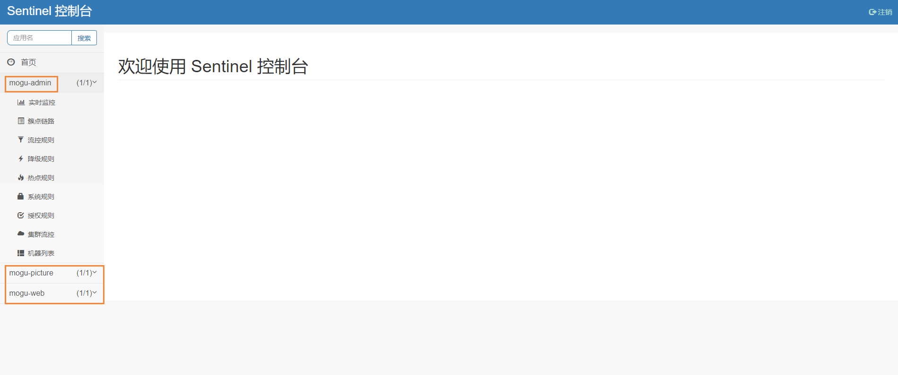
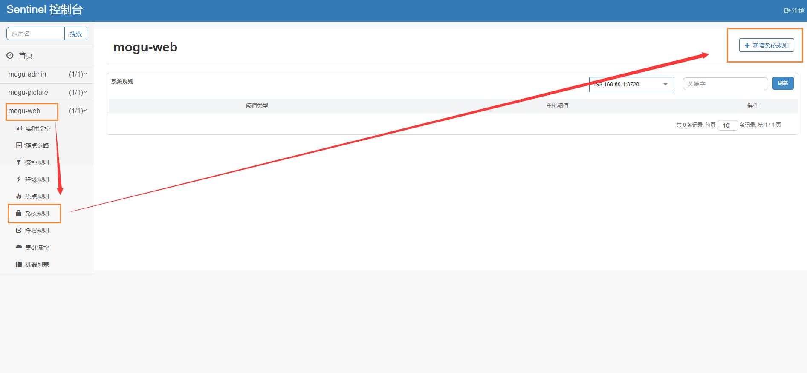
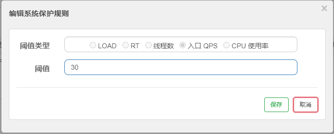

# 蘑菇博客Sentinel安装指南

## 前言

Sentinel被称为分布式系统的流量防卫兵，相当于Hystrix

Hystrix存在的问题

- 需要我们程序员自己手工搭建监控平台
- 没有一套web界面可以给我们进行更加细粒度化的配置，流量控制，速率控制，服务熔断，服务降级。。

这个时候Sentinel运营而生

- 单独一个组件，可以独立出来
- 直接界面化的细粒度统一配置

更详细的介绍可以参考这篇博客，这里只是讲解一下Sentinel的安装过程

[【SpringCloud】使用Sentinel实现熔断和限流](http://moguit.cn/#/info?blogUid=408e9c889ebf96a66af2adfdc258ba5f)

## 安装Sentinel

首先我们到Sentinel的[Github官网](https://github.com/alibaba/Sentinel/releases)，下载对应的jar包



> 如果Github下载缓慢，可以使用 [备用下载地址](https://wws.lanzous.com/iXUolhrte2j)

下载完成后，放到我们的Sentinel文件夹下



我们可以通过 java -jar命令来启动，但是每次输入命令也挺麻烦的，因此我们可以制作一个bat脚本，点击启动

我们创建一个startup.bat脚本，然后写入以下内容，指定端口号为 8070

```bash
start java -jar sentinel-dashboard-1.6.3.jar --server.port=8070
```



然后我们输入URL： http://localhost:8070/，然后输入默认的账号和密码

> 账号：sentinel
>
> 密码：sentinel



进入后，因为我们的项目还没有启动，所以看不到对应的配置信息



到这里为止，Sentinel流控就已经安装完成了，后续的操作我们可以参考下面的博客进行 

[window环境下配置蘑菇博客环境](http://moguit.cn/#/info?blogUid=082ca226cf2e4103b0ffa6e6c13d7b14)

>因为我们将Eureka替换成Nacos，所以我们只需要启动服务为
>
>mogu-sms、mogu-picture、mogu-admin、mogu-web



然后在启动前端服务后，再次查看Sentinel，我们就看到了三个微服务被监控了



然后我们打开 mogu-web，点击系统规则，然后新增系统规则



我们设置一个入口QPS为 30，也就是每秒30个请求



然后我们打开首页  http://localhost:9527/，发现能够正常的访问，但是如果我们反复的刷新该页面，当超过对应的QPS数后，就会出现500页面了


到这里为止，Sentinel的安装就完成了，如果想要了解更加复杂的规则，可以参考上面提到的[那篇博客](http://moguit.cn/#/info?blogUid=408e9c889ebf96a66af2adfdc258ba5f)