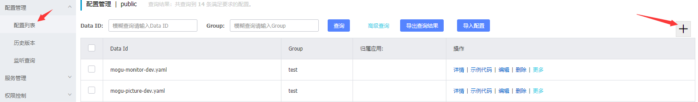
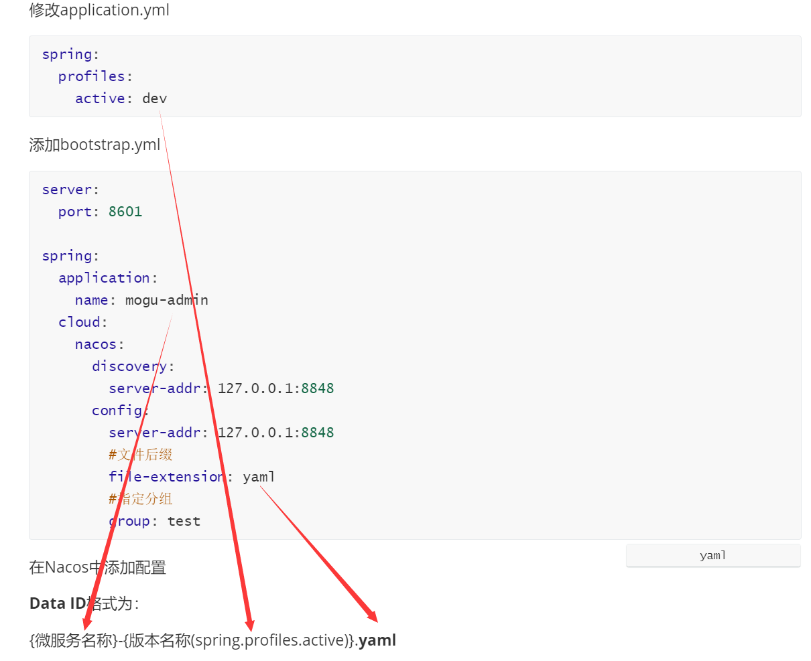
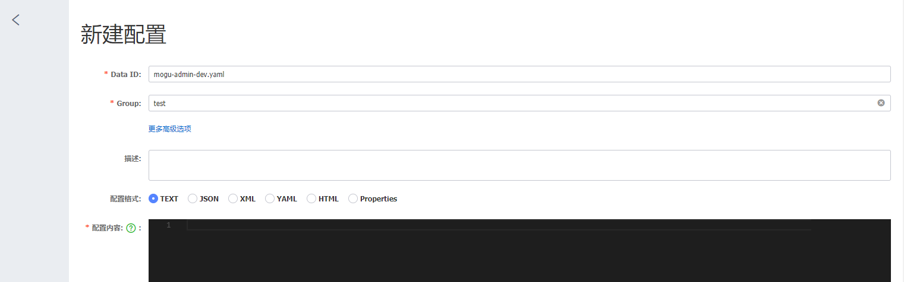

# 蘑菇博客从Eureka迁移到Nacos

## 前言

这阵子为了学习一下Nacos的实际使用，决定将蘑菇博客从Eureka迁移到Nacos作为服务发现组件，同时将配置文件也托管到Nacos服务器中，下面是我具体迁移过程中遇到的一些问题，做个说明方便以后查阅和解决。

## 下载和参考

- [nacos下载地址](https://github.com/alibaba/nacos/releases)
- [nacos文档](https://nacos.io)
-  [使用Nacos实现服务注册发现以及服务限流等功能](http://moguit.cn/#/info?blogUid=e6e619349d31dded928c9265c5a9c672)

## 服务发现与注册

### 主工程

在主pom.xml中添加Nacos相关依赖

```xml
<dependency>
    <groupId>com.alibaba.cloud</groupId>
    <artifactId>spring-cloud-alibaba-dependencies</artifactId>
    <version>2.1.0.RELEASE</version>
    <type>pom</type>
    <scope>import</scope>
</dependency>
```

### 各个微服务

在需要注册的微服务xml文件中添加Nacos服务发现依赖

```xml
<!-- 添加Nacos相关依赖-->
<dependency>
    <groupId>com.alibaba.cloud</groupId>
    <artifactId>spring-cloud-starter-alibaba-nacos-discovery</artifactId>
</dependency>
```

### 注释Euerka相关依赖

在yml文件中添加服务发现配置，以及监控暴露。

```
spring:
  #nacos相关配置
  cloud:
     nacos:
       discovery:
         server-addr: localhost:8848

#监控          
management:
  endpoints:
    web:
      exposure:
        include: '*'
```

### 替换服务发现注解

```java
//@EnableEurekaServer
@@EnableDiscoveryClient
```

## Nacos  config配置

### 修改Nacos启动内存大小

进入 nacos/bin/

修改startup.sh中jvm的内存大小，根据自己的机器情况决定。

```sh
if [[ "${MODE}" == "standalone" ]]; then
    JAVA_OPT="${JAVA_OPT} -Xms128m -Xmx256m -Xmn256m"
    JAVA_OPT="${JAVA_OPT} -Dnacos.standalone=true"
else
    if [[ "${EMBEDDED_STORAGE}" == "embedded" ]]; then
        JAVA_OPT="${JAVA_OPT} -DembeddedStorage=true"
    fi
    JAVA_OPT="${JAVA_OPT} -server -Xms256m -Xmx512m -Xmn128m -XX:MetaspaceSize=128m -XX:MaxMetaspaceSize=320m"
    JAVA_OPT="${JAVA_OPT} -XX:-OmitStackTraceInFastThrow -XX:+HeapDumpOnOutOfMemoryError -XX:HeapDumpPath=${BASE_DIR}/logs/java_heapdump.hprof"
    JAVA_OPT="${JAVA_OPT} -XX:-UseLargePages"
```

## Nacos+MySql持久化配置

### 启动服务器

### Linux/Unix/Mac

启动命令(standalone代表着单机模式运行，非集群模式):

```
sh startup.sh -m standalone
```

如果您使用的是ubuntu系统，或者运行脚本报错提示[[符号找不到，可尝试如下运行：

```
bash startup.sh -m standalone
```

#### Windows

启动命令：

```
cmd startup.cmd
```

或者双击startup.cmd运行文件。找到数据库新建脚本nacos/conf/nacos-mysql.sql，创建数据库nacos_config并执行脚本

### issus:部分老msql版本

先检查一下是不是数据库被限制了索引的大小

```
SHOW variables like 'innodb_large_prefix'
```

如果查询的值是OFF的话 执行下面命令

```
SET GLOBAL INNODB_LARGE_PREFIX = ON;
```


执行完了 之后 还得查看当前的innodb_file_format引擎格式类型是不是BARRACUDA执行

```
SHOW variables like 'innodb_file_format'
```

如果不是的话则需要修改

```
SET GLOBAL innodb_file_format = BARRACUDA;
```

 创建表的时候指定表的 row format 格式为 Dynamic 或者 Compressed，如下示例：

```mysql
create table idx_length_test_02

id int auto_increment primary key,

name varchar(255)

)

ROW_FORMAT=DYNAMIC default charset utf8mb4;
```

找到nacos/conf/application.properties, 修改添加

```properties
spring.datasource.platform=mysql
db.num=1
db.url.0=jdbc:mysql://127.0.0.1:3306/nacos_config?characterEncoding=utf8&connectTimeout=1000&socketTimeout=3000&autoReconnect=true
db.user=root
db.password=root
```

然后重启Nacos

## 其它需要上传application.yml的微服务

添加pom依赖

```xml
<dependency>
    <groupId>com.alibaba.cloud</groupId>
    <artifactId>spring-cloud-starter-alibaba-nacos-config</artifactId>
</dependency>
```

修改application.yml

```yml
spring:
  profiles:
    active: dev
```

添加bootstrap.yml

```yaml
server:
  port: 8601

spring:
  application:
    name: mogu-admin
  cloud:
    nacos:
      discovery:
        server-addr: 127.0.0.1:8848
      config:
        server-addr: 127.0.0.1:8848
        #文件后缀
        file-extension: yaml
        #指定分组
        group: test
```

## 在Nacos中添加配置

初始用户名密码：nacos

点击配置列表，然后添加配置：




**Data ID**格式为：

{微服务名称}-{版本名称(spring.profiles.active)}.**yaml**



例如：



Group对应bootstrap.yml中的nacos.config.group

