# 蘑菇博客配置七牛云存储

## 前言

因为之前有个老哥希望蘑菇博客能够支持七牛云存储，因此这阵子将博客的图片存储服务器进行了改造，支持图片上传至七牛云，同时增加了系统管理，用于设置七牛云的相关的配置以及本地图片服务器配置

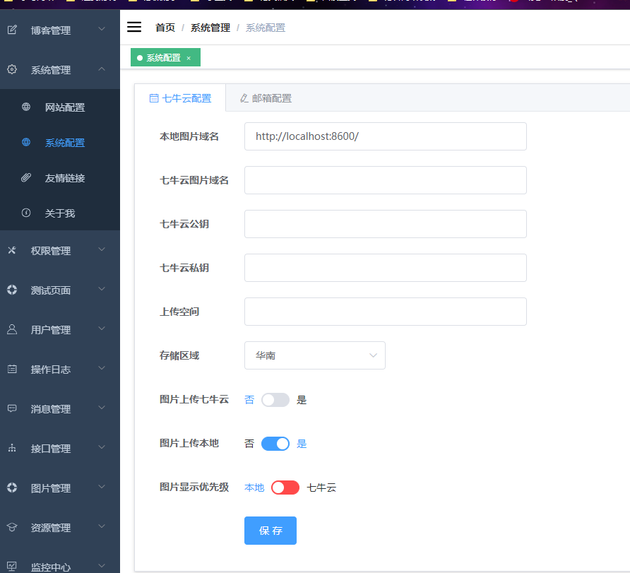

其中：

- 本地图片域名：指的是图片存储在本地时，nginx进行静态资源映射时候的域名
- 七牛云图片域名：即七牛云的绑定的图片访问域名
- 七牛云公钥
- 七牛云私钥
- 上传空间
- 存储区域
- 图片上传七牛云：开启开关后，图片就会上传至七牛云
- 图片上传本地：开启后，图片将会上传本地服务器（注意 这两个开关至少需要开启一个）
- 图片显示优先级：指的是前端的图片是显示的图片服务器的，还是七牛云上的

## 配置七牛云

我们需要在七牛云的官网上进行注册，注册过程比较繁琐

注册后，登录七牛云，然后选择对象存储，点击创建空间

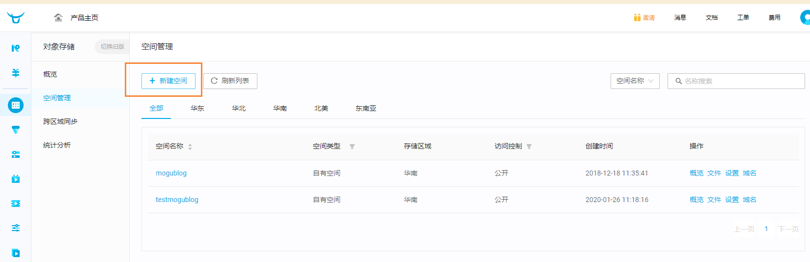

如下所示，我创建了一个mogublog的存储空间，因为我提前先创建好了，所以提示已占用

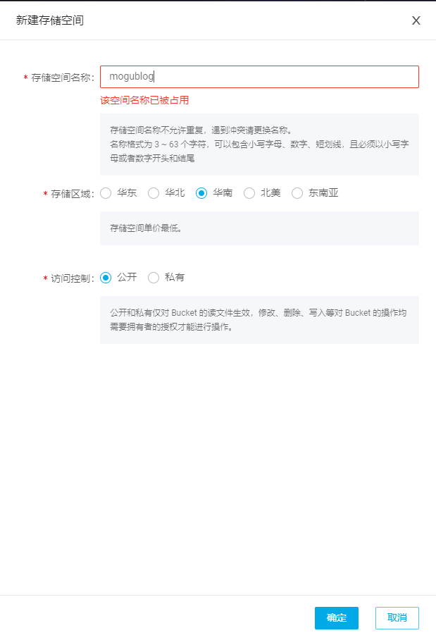

创建完成后，我们点击空间名称

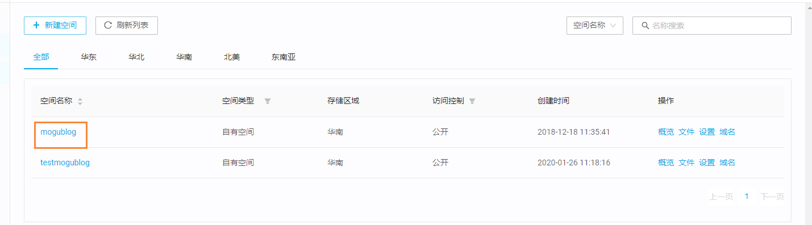

然后我们需要绑定加速域名，因为只有域名，我们才能够访问到我们上传至七牛云的图片

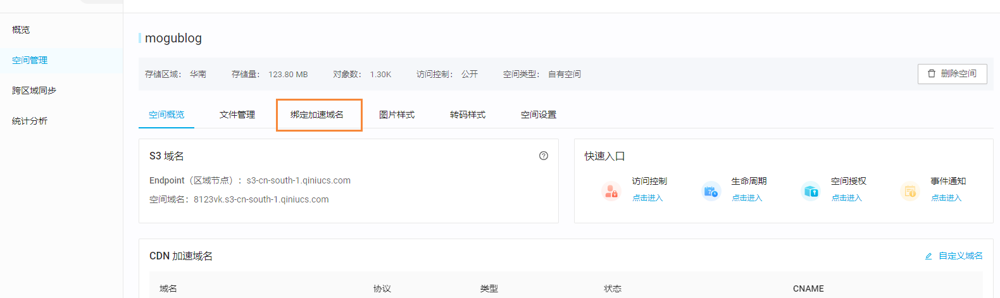

设置我们需要绑定的域名

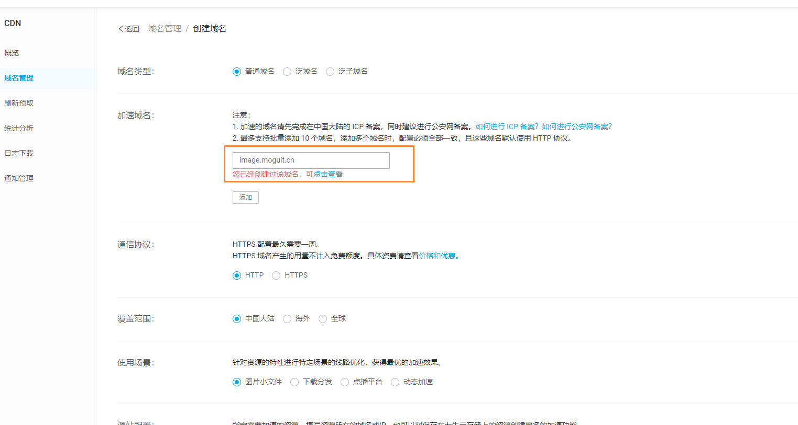

设置完成后，我们回到刚刚的页面，复制CNAME

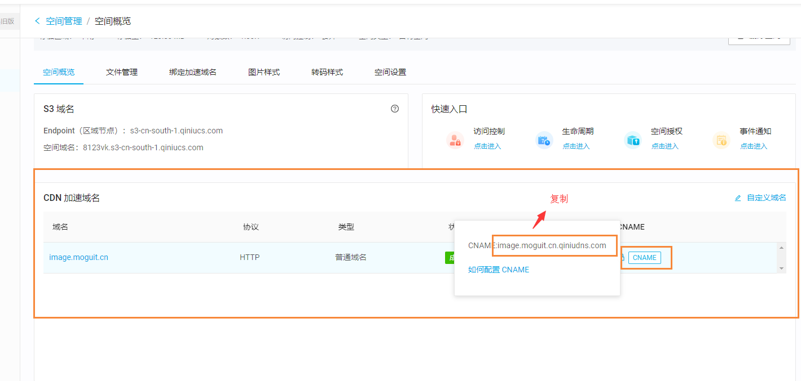

然后到阿里云域名解析，添加一条解析记录

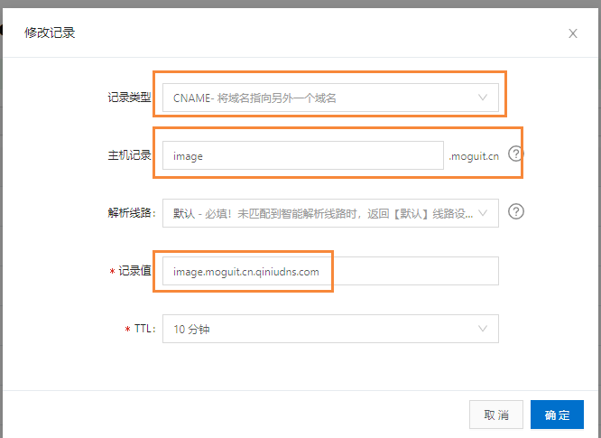

选择CNAME类型，即当我们访问 image.moguit.cn域名时候，会自动解析至 image.moguit.cn.qiniudns.com

然后设置成功后，我们稍等一会，然后到七牛云的文件管理，上传一个图片测试一下

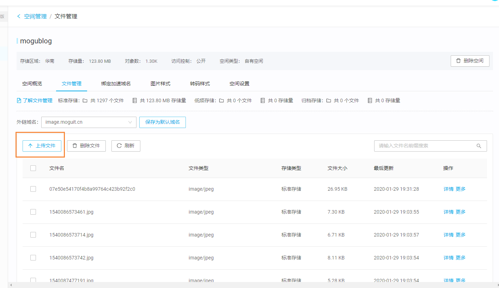

上传后，点击详情，如果能够显示图片，说明已经配置成功

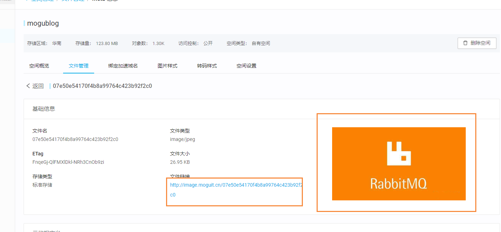

那我们回到个人中心页面，获取到密钥 AK 和 SK

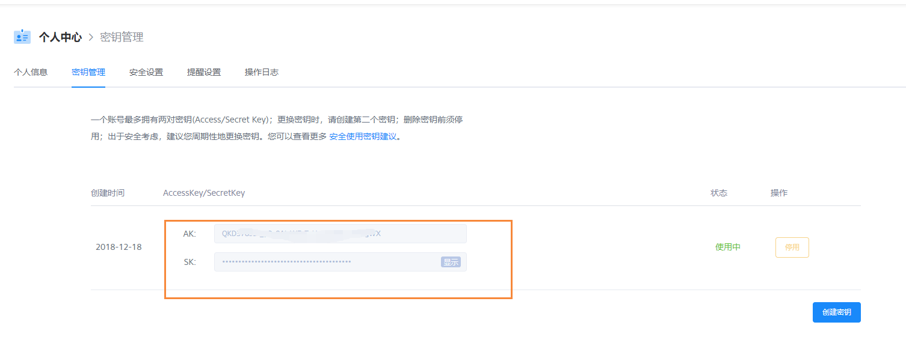

以及刚刚我们创建的空间名称 以及  地区，填入到蘑菇博客的系统配置中，同时设置图片上传七牛云，以及图片优先级设置为七牛云

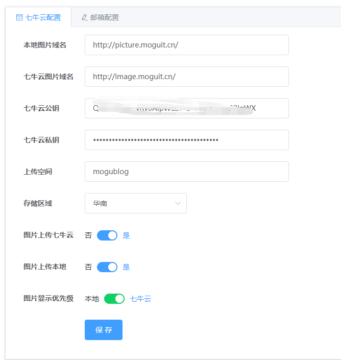

我们到图片管理，重新上传图片后，则成功将图片上传到了七牛云中