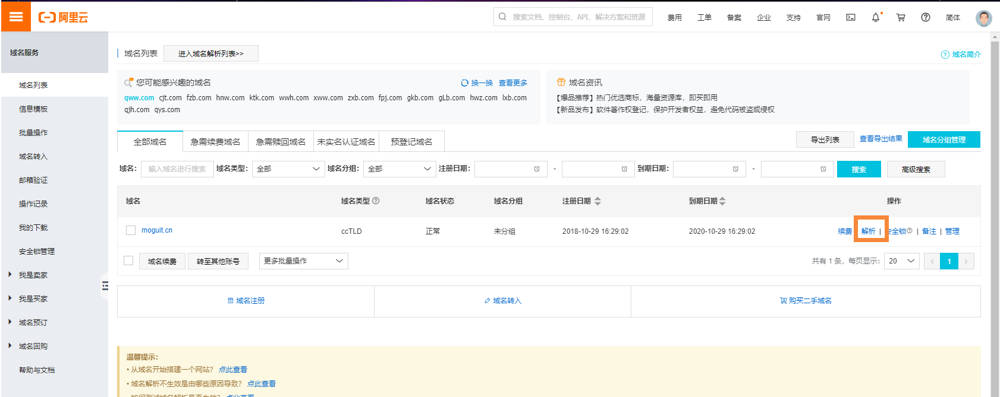
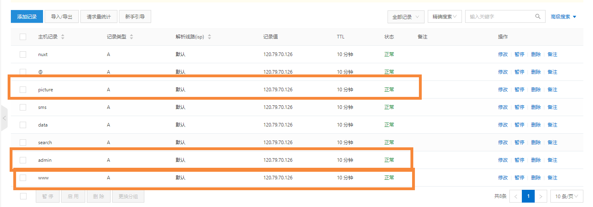
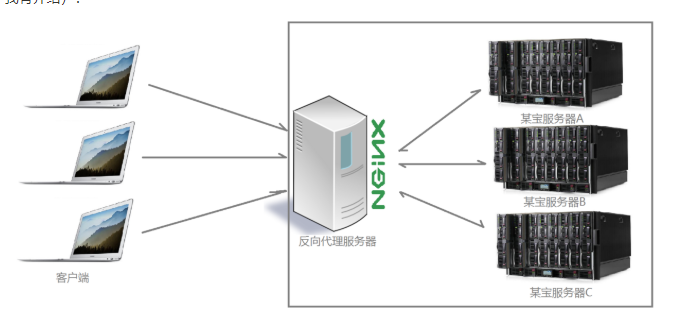

# 蘑菇博客配置域名解析

## 前言

最近有些小伙伴申请到了自己的域名，然后想配置域名的方式来访问蘑菇博客，最近想着还是写一篇博客，来帮助大家能够快速的进行配置

## 阿里云配置域名解析

如果是在阿里云购买的域名，我们首先搜索域名，进入后，点击解析



我们配置好对应的二级域名


这里我主要配置的二级域名有：

```
# 前台首页
www.moguit.cn
# 后台首页
admin.moguit.cn
# 图片域名
picture.moguit.cn
```

添加完成后，如下所示



## 修改nginx配置

因为我们把3个域名都同时解析到了同一个服务器下，那这里我们就需要用到nginx的另外一个功能了：反向代理



我们将请求都发送到nginx服务器，然后nginx在通过不同的域名，转发到对应服务器或者目录下

如果对Nginx的功能感兴趣的小伙伴，可以看这个博客：[漫画图解Nginx反向代理](http://moguit.cn/#/info?blogUid=eeee688ebb314db6a643e658679ce48a)

在阿里云域名配置完解析后，我们就需要修改我们的nginx配置文件了

使用命令编辑配置文件：

```
vim /soft/nginx/conf/nginx.conf
```

然后将下面的 80端口下的 server_name，改成之前在阿里云配置的的二级域名即可

```
    server {
        listen      80;
        server_name  www.moguit.cn;
        location / {
                root   /home/mogu_blog/vue_mogu_web/dist;
                index  index.html index.htm;
        }
    }

    server {
        listen      80;
        server_name  admin.moguit.cn;
        location / {
                root   /home/mogu_blog/vue_mogu_admin/dist;
                index  index.html index.htm;
        }
    }

    server {
        listen      80;
        server_name  picture.moguit.cn;
        location / {
                root   /home/mogu_blog/mogu_data/;
                index  index.html index.htm;
        }
    }

```

这里主要讲讲 www.moguit.cn 域名解析过程：

```
    server {
        listen      80;
        server_name  www.moguit.cn;
        location / {
                root   /home/mogu_blog/vue_mogu_web/dist;
                index  index.html index.htm;
        }
    }
```

当我们在浏览器输入 www.moguit.cn ， 首先会通过阿里云的域名解析，也就是我们刚刚配置的，然后解析到我们的服务器中，因为 www.moguit.cn后面没有加端口号，也就是默认使用的 http协议的默认端口号80，所以我们需要通过nginx来监听80端口，也就是  listen      80  

然后因为我们刚刚配置了好多二级域名：www.moguit.cn 、admin.moguit.cn 、picture.moguit.cn

那么它是怎么区分对应的请求呢？

这里就用到了第二个属性了，server_name会监听来自不同域名下的请求，假设这个请求是从www.moguit.cn下过来呢，那么就匹配下面的路径了，这里location / 就代表根目录，也就是说通过 www.moguit.cn就将该请求解析到 /home/mogu_blog/vue_mogu_web/dist 的 index.html页面

所以综上：访问www.moguit.cn  就将该请求转发到了  /home/mogu_blog/vue_mogu_web/dist/index.html 页面上，该页面也就是我们刚刚vue打包好的静态文件，然后将页面显示在用户的浏览器，最后通过浏览器渲染，请求后台的api接口渲染对应的数据

同理，admin.moguit.cn  和 picture.moguit.cn也是一样的道理了

## 图片解析过程

这里在提一下图片解析的过程，对于下面这样一张图片

```
http://picture.moguit.cn/blog/admin/jpg/2019/2/12/1549957665851.jpg
```

首先：http://picture.moguit.cn 会被我们服务器的nginx所拦截，然后映射到/home/mogu_blog/mogu_data/ 目录下那么剩下的部分：/blog/admin/jpg/2019/2/12/1549957665851.jpg

也会添加到映射目录的后面，最终请求的是服务器下的这个文件：

```
/home/mogu_blog/mogu_data/blog/admin/jpg/2019/2/12/1549957665851.jpg
```

然后在将该文件返回到浏览器

## 使用百度云加速域名访问

上面我讲的是蘑菇博客的阿里云域名解析，如果大家想使用百度云加速域名访问的话，可以在看完这篇博客后，将域名解析换成百度的解析，具体配置可以参考这篇博客：[如何使用百度云加速提升网站访问速度](http://moguit.cn/#/info?blogUid=af053959672343f8a139ec27fd534c6c)