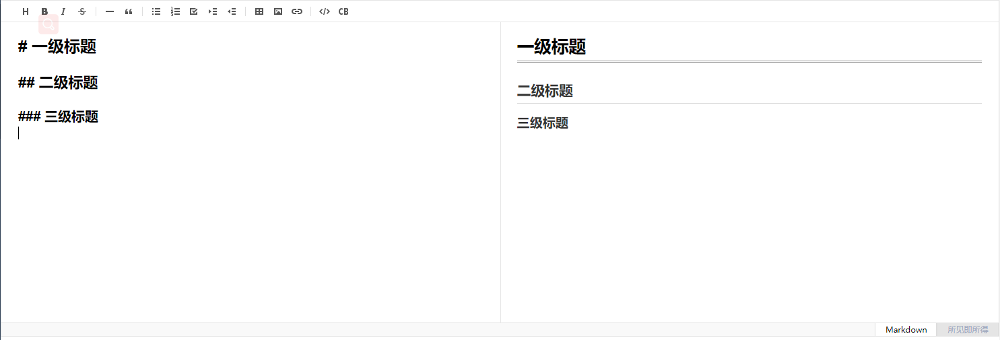

# Vue集成MarkDown编辑器tui-editor

## 前言

前阵子有个老哥希望蘑菇博客能够支持Markdown语法，因为蘑菇博客使用的是富文本编辑器CKEditor，虽然说里面能支持Markdown，但是不能很好的转换，因此想集成一个Markdown编辑器进去，后面发现了tui-editor，tui.editor（TOAST UI Editor）是一款所见即所得的Markdown编辑器。TOAST UI Editor提供Markdown模式和WYSIWYG模式。它的功能非常强大，你可以编辑表格，UML图和图表等。

## 安装Tui-editor

- 所见即所得。你在编辑Markdown的同时，可以预览生成的HTML页面。
- 异步滚动。可以在Markdown和预览之间进行异步滚动。
- 列表自动缩进。
- 语法高亮。

```
npm install --save tui-editor
```

## 安装CodeMirror

CodeMirror是一个用JavaScript为浏览器实现的多功能文本编辑器。它专门用于编辑代码，并提供了100多种语言模式和各种插件，实现了更高级的编辑功能。每种语言都提供了功能齐全的代码和语法高亮显示，以帮助阅读和编辑复杂的代码

```
 npm install --save codemirror
```

## 封装插件 MarkdownEditor

index.vue文件

```
<template>
  <div :id="id" />
</template>

<script>
// deps for editor
import 'codemirror/lib/codemirror.css' // codemirror
import 'tui-editor/dist/tui-editor.css' // editor ui
import 'tui-editor/dist/tui-editor-contents.css' // editor content

import Editor from 'tui-editor'
import defaultOptions from './default-options'

export default {
  name: 'MarkdownEditor',
  props: {
    value: {
      type: String,
      default: ''
    },
    id: {
      type: String,
      required: false,
      default() {
        return 'markdown-editor-' + +new Date() + ((Math.random() * 1000).toFixed(0) + '')
      }
    },
    options: {
      type: Object,
      default() {
        return defaultOptions
      }
    },
    mode: {
      type: String,
      default: 'markdown'
    },
    height: {
      type: String,
      required: false,
      default: '300px'
    },
    language: {
      type: String,
      required: false,
      default: 'en_US' // https://github.com/nhnent/tui.editor/tree/master/src/js/langs
    }
  },
  data() {
    return {
      editor: null
    }
  },
  computed: {
    editorOptions() {
      const options = Object.assign({}, defaultOptions, this.options)
      options.initialEditType = this.mode
      options.height = this.height
      options.language = this.language
      return options
    }
  },
  watch: {
    value(newValue, preValue) {
      if (newValue !== preValue && newValue !== this.editor.getValue()) {
        this.editor.setValue(newValue)
      }
    },
    language(val) {
      this.destroyEditor()
      this.initEditor()
    },
    height(newValue) {
      this.editor.height(newValue)
    },
    mode(newValue) {
      this.editor.changeMode(newValue)
    }
  },
  mounted() {
    this.initEditor()
  },
  destroyed() {
    this.destroyEditor()
  },
  methods: {
    initEditor() {
      this.editor = new Editor({
        el: document.getElementById(this.id),
        ...this.editorOptions
      })
      if (this.value) {
        this.editor.setValue(this.value)
      }
      this.editor.on('change', () => {
        this.$emit('input', this.editor.getValue())
      })
    },
    destroyEditor() {
      if (!this.editor) return
      this.editor.off('change')
      this.editor.remove()
    },
    setValue(value) {
      this.editor.setValue(value)
    },
    getValue() {
      return this.editor.getValue()
    },
    setHtml(value) {
      this.editor.setHtml(value)
    },
    getHtml() {
      return this.editor.getHtml()
    }
  }
}
</script>
```

default-options.js配置文件

```
// doc: https://nhnent.github.io/tui.editor/api/latest/ToastUIEditor.html#ToastUIEditor
export default {
  minHeight: '200px',
  previewStyle: 'vertical',
  useCommandShortcut: true,
  useDefaultHTMLSanitizer: true,
  usageStatistics: false,
  hideModeSwitch: false,
  toolbarItems: [
    'heading',
    'bold',
    'italic',
    'strike',
    'divider',
    'hr',
    'quote',
    'divider',
    'ul',
    'ol',
    'task',
    'indent',
    'outdent',
    'divider',
    'table',
    'image',
    'link',
    'divider',
    'code',
    'codeblock'
  ]
}
```

## 使用

```
<template>
  <div class="components-container">

    <div class="editor-container">
      <markdown-editor ref="markdownEditor" v-model="content" :language="language" height="500px" />
    </div>

    <div v-html="html" />
  </div>
</template>

<script>
  import MarkdownEditor from '@/components/MarkdownEditor'

  export default {
    name: 'MarkdownDemo',
    components: { MarkdownEditor },
    data() {
      return {
        content: "# 我是测试内容",
        html: '',
        languageTypeList: {
          'en': 'en_US',
          'zh': 'zh_CN',
          'es': 'es_ES'
        }
      }
    },
    computed: {
      language() {
        return this.languageTypeList['zh']
      }
    },
    methods: {
      getHtml() {
        this.html = this.$refs.markdownEditor.getHtml()
        console.log(this.html)
      }
    }
  }
</script>

<style scoped>
  .editor-container{
    margin-bottom: 30px;
  }
</style>
```

## 最终效果

