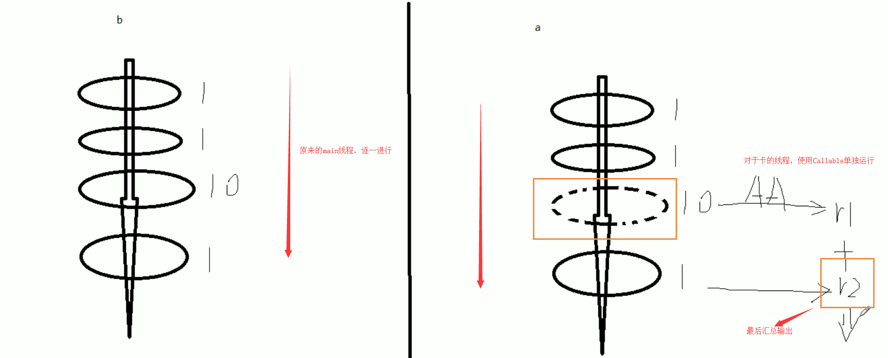
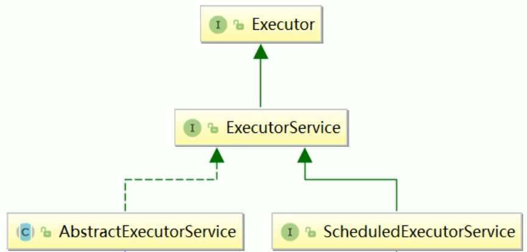
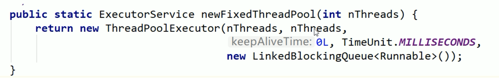
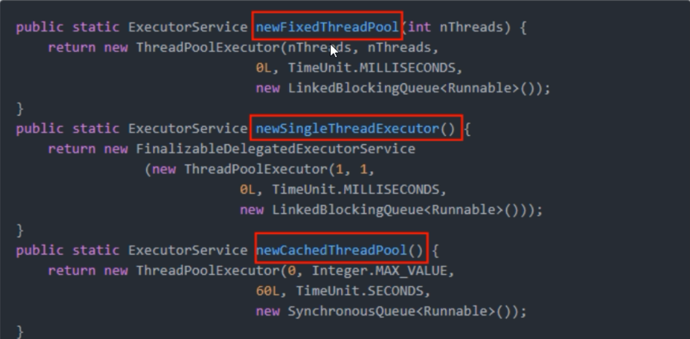
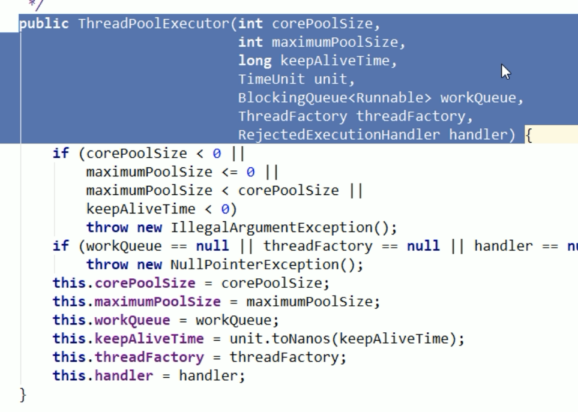
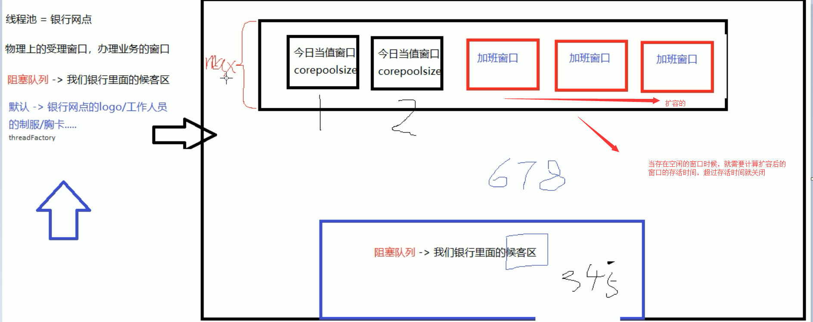
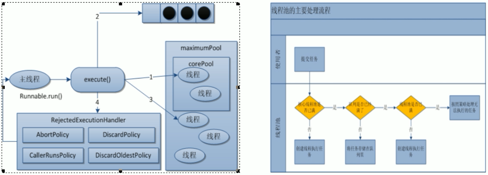

# 线程池（Java中有哪些方法获取多线程）

## 前言

获取多线程的方法，我们都知道有三种，还有一种是实现Callable接口

- 实现Runnable接口
- 实现Callable接口
- 实例化Thread类
- 使用线程池获取

## Callable接口

Callable接口，是一种让线程执行完成后，能够返回结果的

在说到Callable接口的时候，我们不得不提到Runnable接口

```
/**
 * 实现Runnable接口
 */
class MyThread implements Runnable {

    @Override
    public void run() {

    }
}
```

我们知道，实现Runnable接口的时候，需要重写run方法，也就是线程在启动的时候，会自动调用的方法

同理，我们实现Callable接口，也需要实现call方法，但是这个时候我们还需要有返回值，这个Callable接口的应用场景一般就在于批处理业务，比如转账的时候，需要给一会返回结果的状态码回来，代表本次操作成功还是失败

```
/**
 * Callable有返回值
 * 批量处理的时候，需要带返回值的接口（例如支付失败的时候，需要返回错误状态）
 *
 */
class MyThread2 implements Callable<Integer> {

    @Override
    public Integer call() throws Exception {
        System.out.println("come in Callable");
        return 1024;
    }
}
```

最后我们需要做的就是通过Thread线程， 将MyThread2实现Callable接口的类包装起来

这里需要用到的是FutureTask类，他实现了Runnable接口，并且还需要传递一个实现Callable接口的类作为构造函数

```
// FutureTask：实现了Runnable接口，构造函数又需要传入 Callable接口
// 这里通过了FutureTask接触了Callable接口
FutureTask<Integer> futureTask = new FutureTask<>(new MyThread2());
```

然后在用Thread进行实例化，传入实现Runnabnle接口的FutureTask的类

```
Thread t1 = new Thread(futureTask, "aaa");
t1.start();
```

最后通过 futureTask.get() 获取到返回值

```
// 输出FutureTask的返回值
System.out.println("result FutureTask " + futureTask.get());
```

这就相当于原来我们的方式是main方法一条龙之心，后面在引入Callable后，对于执行比较久的线程，可以单独新开一个线程进行执行，最后在进行汇总输出

最后需要注意的是 要求获得Callable线程的计算结果，如果没有计算完成就要去强求，会导致阻塞，直到计算完成



也就是说 futureTask.get() 需要放在最后执行，这样不会导致主线程阻塞

也可以使用下面算法，使用类似于自旋锁的方式来进行判断是否运行完毕

```
// 判断futureTask是否计算完成
while(!futureTask.isDone()) {

}
```

### 注意

多个线程执行 一个FutureTask的时候，只会计算一次

```
FutureTask<Integer> futureTask = new FutureTask<>(new MyThread2());

// 开启两个线程计算futureTask
new Thread(futureTask, "AAA").start();
new Thread(futureTask, "BBB").start();
```

如果我们要两个线程同时计算任务的话，那么需要这样写，需要定义两个futureTask

```
FutureTask<Integer> futureTask = new FutureTask<>(new MyThread2());
FutureTask<Integer> futureTask2 = new FutureTask<>(new MyThread2());

// 开启两个线程计算futureTask
new Thread(futureTask, "AAA").start();

new Thread(futureTask2, "BBB").start();
```

## ThreadPoolExecutor

### 为什么用线程池

线程池做的主要工作就是控制运行的线程的数量，处理过程中，将任务放入到队列中，然后线程创建后，启动这些任务，如果线程数量超过了最大数量的线程排队等候，等其它线程执行完毕，再从队列中取出任务来执行。

它的主要特点为：线程复用、控制最大并发数、管理线程

线程池中的任务是放入到阻塞队列中的

### 线程池的好处

多核处理的好处是：省略的上下文的切换开销

原来我们实例化对象的时候，是使用 new关键字进行创建，到了Spring后，我们学了IOC依赖注入，发现Spring帮我们将对象已经加载到了Spring容器中，只需要通过@Autowrite注解，就能够自动注入，从而使用

因此使用多线程有下列的好处

- 降低资源消耗。通过重复利用已创建的线程，降低线程创建和销毁造成的消耗
- 提高响应速度。当任务到达时，任务可以不需要等到线程创建就立即执行
- 提高线程的可管理性。线程是稀缺资源，如果无线创建，不仅会消耗系统资源，还会降低系统的稳定性，使用线程池可以进行统一的分配，调优和监控

### 架构说明

Java中线程池是通过Executor框架实现的，该框架中用到了Executor，Executors（代表工具类），ExecutorService，ThreadPoolExecutor这几个类。




### 创建线程池

- Executors.newFixedThreadPool(int i) ：创建一个拥有 i 个线程的线程池
  - 执行长期的任务，性能好很多
  - 创建一个定长线程池，可控制线程数最大并发数，超出的线程会在队列中等待
- Executors.newSingleThreadExecutor：创建一个只有1个线程的 单线程池
  - 一个任务一个任务执行的场景
  - 创建一个单线程化的线程池，它只会用唯一的工作线程来执行任务，保证所有任务按照指定顺序执行
- Executors.newCacheThreadPool();  创建一个可扩容的线程池
  - 执行很多短期异步的小程序或者负载教轻的服务器
  - 创建一个可缓存线程池，如果线程长度超过处理需要，可灵活回收空闲线程，如无可回收，则新建新线程
- Executors.newScheduledThreadPool(int corePoolSize)：线程池支持定时以及周期性执行任务，创建一个corePoolSize为传入参数，最大线程数为整形的最大数的线程池

具体使用，首先我们需要使用Executors工具类，进行创建线程池，这里创建了一个拥有5个线程的线程池

```
// 一池5个处理线程（用池化技术，一定要记得关闭）
ExecutorService threadPool = Executors.newFixedThreadPool(5);

// 创建一个只有一个线程的线程池
ExecutorService threadPool = Executors.newSingleThreadExecutor();

// 创建一个拥有N个线程的线程池，根据调度创建合适的线程
ExecutorService threadPool = Executors.newCacheThreadPool();
```

然后我们执行下面的的应用场景

```
模拟10个用户来办理业务，每个用户就是一个来自外部请求线程
```

我们需要使用 threadPool.execute执行业务，execute需要传入一个实现了Runnable接口的线程

```
threadPool.execute(() -> {
	System.out.println(Thread.currentThread().getName() + "\t 给用户办理业务");
});
```

然后我们使用完毕后关闭线程池

```
threadPool.shutdown();
```

完整代码为：

```
/**
 * 第四种获取 / 使用 Java多线程的方式，通过线程池
 * @author: 陌溪
 * @create: 2020-03-17-15:59
 */
public class MyThreadPoolDemo {
    public static void main(String[] args) {

        // Array  Arrays(辅助工具类)
        // Collection Collections(辅助工具类)
        // Executor Executors(辅助工具类)


        // 一池5个处理线程（用池化技术，一定要记得关闭）
        ExecutorService threadPool = Executors.newFixedThreadPool(5);

        // 模拟10个用户来办理业务，每个用户就是一个来自外部请求线程
        try {

            // 循环十次，模拟业务办理，让5个线程处理这10个请求
            for (int i = 0; i < 10; i++) {
                final int tempInt = i;
                threadPool.execute(() -> {
                    System.out.println(Thread.currentThread().getName() + "\t 给用户:" + tempInt + " 办理业务");
                });
            }
        } catch (Exception e) {
            e.printStackTrace();
        } finally {
            threadPool.shutdown();
        }

    }
}
```

最后结果：

```
pool-1-thread-1	 给用户:0 办理业务
pool-1-thread-5	 给用户:4 办理业务
pool-1-thread-1	 给用户:5 办理业务
pool-1-thread-4	 给用户:3 办理业务
pool-1-thread-2	 给用户:1 办理业务
pool-1-thread-3	 给用户:2 办理业务
pool-1-thread-2	 给用户:9 办理业务
pool-1-thread-4	 给用户:8 办理业务
pool-1-thread-1	 给用户:7 办理业务
pool-1-thread-5	 给用户:6 办理业务
```

我们能够看到，一共有5个线程，在给10个用户办理业务


### 创建周期性执行任务的线程池

Executors.newScheduledThreadPool(int corePoolSize)：

**线程池支持定时以及周期性执行任务，创建一个corePoolSize为传入参数，最大线程数为整形的最大数的线程池**

底层使用 ScheduledThreadPoolExecutor 来实现 ScheduledThreadPoolExecutor 为ThreadPoolExecutor子类

```java
public ScheduledThreadPoolExecutor(int corePoolSize) {
        super(corePoolSize, Integer.MAX_VALUE, 0, NANOSECONDS,
              new DelayedWorkQueue());
}
```

#### 执行方法

```java
    /**
     * @throws RejectedExecutionException {@inheritDoc}
     * @throws NullPointerException       {@inheritDoc}
     * command：执行的任务 Callable或Runnable接口实现类
	 * delay：延时执行任务的时间
	 * unit：延迟时间单位
     */
    public ScheduledFuture<?> schedule(Runnable command,
                                       long delay,
                                       TimeUnit unit)
```


```java
    /**
     * @throws RejectedExecutionException {@inheritDoc}
     * @throws NullPointerException       {@inheritDoc}
     * @throws IllegalArgumentException   {@inheritDoc}
     * command：执行的任务 Callable或Runnable接口实现类
	 * initialDelay 第一次执行任务延迟时间
	 * period 连续执行任务之间的周期，从上一个任务开始执行时计算延迟多少开始执行下一个任务，但是还会等上一个任务结束之后。
	 * unit：延迟时间单位
     */
    public ScheduledFuture<?> scheduleAtFixedRate(Runnable command,
                                                  long initialDelay,
                                                  long period,
                                                  TimeUnit unit)
```


```java
    /**
     * @throws RejectedExecutionException {@inheritDoc}
     * @throws NullPointerException       {@inheritDoc}
     * @throws IllegalArgumentException   {@inheritDoc}
     * command：执行的任务 Callable或Runnable接口实现类
	 * initialDelay 第一次执行任务延迟时间
	 * delay：连续执行任务之间的周期，从上一个任务全部执行完成时计算延迟多少开始执行下一个任务
	 * unit：延迟时间单位
     */
    public ScheduledFuture<?> scheduleWithFixedDelay(Runnable command,
                                                     long initialDelay,
                                                     long delay,
                                                     TimeUnit unit)
```

## 底层实现

我们通过查看源码，点击了Executors.newSingleThreadExecutor 和 Executors.newFixedThreadPool能够发现底层都是使用了ThreadPoolExecutor



我们可以看到线程池的内部，还使用到了LinkedBlockingQueue 链表阻塞队列

同时在查看Executors.newCacheThreadPool 看到底层用的是 SynchronousBlockingQueue阻塞队列

最后查看一下，完整的三个创建线程的方法




## 线程池的重要参数



线程池在创建的时候，一共有7大参数

- corePoolSize：核心线程数，线程池中的常驻核心线程数
  - 在创建线程池后，当有请求任务来之后，就会安排池中的线程去执行请求任务，近似理解为今日当值线程
  - 当线程池中的线程数目达到corePoolSize后，就会把到达的队列放到缓存队列中
- maximumPoolSize：线程池能够容纳同时执行的最大线程数，此值必须大于等于1、
  - 相当有扩容后的线程数，这个线程池能容纳的最多线程数
- keepAliveTime：多余的空闲线程存活时间
  - 当线程池数量超过corePoolSize时，当空闲时间达到keepAliveTime值时，多余的空闲线程会被销毁，直到只剩下corePoolSize个线程为止
  - 默认情况下，只有当线程池中的线程数大于corePoolSize时，keepAliveTime才会起作用
- unit：keepAliveTime的单位
- workQueue：任务队列，被提交的但未被执行的任务（类似于银行里面的候客区）
  - LinkedBlockingQueue：链表阻塞队列
  - SynchronousBlockingQueue：同步阻塞队列
- threadFactory：表示生成线程池中工作线程的线程工厂，用于创建线程池 一般用默认即可
- handler：拒绝策略，表示当队列满了并且工作线程大于线程池的最大线程数（maximumPoolSize3）时，如何来拒绝请求执行的Runnable的策略

当营业窗口和阻塞队列中都满了时候，就需要设置拒绝策略




## 拒绝策略

以下所有拒绝策略都实现了RejectedExecutionHandler接口

- AbortPolicy：默认，直接抛出RejectedExcutionException异常，阻止系统正常运行
- DiscardPolicy：直接丢弃任务，不予任何处理也不抛出异常，如果运行任务丢失，这是一种好方案
- CallerRunsPolicy：该策略既不会抛弃任务，也不会抛出异常，而是将某些任务回退到调用者
- DiscardOldestPolicy：抛弃队列中等待最久的任务，然后把当前任务加入队列中尝试再次提交当前任务

## 线程池底层工作原理

### 线程池运行架构图



文字说明

1. 在创建了线程池后，等待提交过来的任务请求

2. 当调用execute()方法添加一个请求任务时，线程池会做出如下判断

   1. 如果正在运行的线程池数量小于corePoolSize，那么马上创建线程运行这个任务
   2. 如果正在运行的线程数量大于或等于corePoolSize，那么将这个任务放入队列
   3. 如果这时候队列满了，并且正在运行的线程数量还小于maximumPoolSize，那么还是创建非核心线程like运行这个任务；
   4. 如果队列满了并且正在运行的线程数量大于或等于maximumPoolSize，那么线程池会启动饱和拒绝策略来执行

3. 当一个线程完成任务时，它会从队列中取下一个任务来执行

4. 当一个线程无事可做操作一定的时间(keepAliveTime)时，线程池会判断：

   1. 如果当前运行的线程数大于corePoolSize，那么这个线程就被停掉
   2. 所以线程池的所有任务完成后，它会最终收缩到corePoolSize的大小

   

以顾客去银行办理业务为例，谈谈线程池的底层工作原理

1. 最开始假设来了两个顾客，因为corePoolSize为2，因此这两个顾客直接能够去窗口办理
2. 后面又来了三个顾客，因为corePool已经被顾客占用了，因此只有去候客区，也就是阻塞队列中等待
3. 后面的人又陆陆续续来了，候客区可能不够用了，因此需要申请增加处理请求的窗口，这里的窗口指的是线程池中的线程数，以此来解决线程不够用的问题
4. 假设受理窗口已经达到最大数，并且请求数还是不断递增，此时候客区和线程池都已经满了，为了防止大量请求冲垮线程池，已经需要开启拒绝策略
5. 临时增加的线程会因为超过了最大存活时间，就会销毁，最后从最大数削减到核心数

## 为什么不用默认创建的线程池？

线程池创建的方法有：固定数的，单一的，可变的，那么在实际开发中，应该使用哪个？

我们一个都不用，在生产环境中是使用自己自定义的

为什么不用 Executors 中JDK提供的？

根据阿里巴巴手册：并发控制这章

- 线程资源必须通过线程池提供，不允许在应用中自行显式创建线程
  - 使用线程池的好处是减少在创建和销毁线程上所消耗的时间以及系统资源的开销，解决资源不足的问题，如果不使用线程池，有可能造成系统创建大量同类线程而导致消耗完内存或者“过度切换”的问题
- 线程池不允许使用Executors去创建，而是通过 ThreadPoolExecutor 的方式，这样的处理方式让写的同学更加明确线程池的运行规则，规避资源耗尽的风险
  - Executors返回的线程池对象弊端如下：
    - FixedThreadPool和SingleThreadPool：
      - 运行的请求队列长度为：Integer.MAX_VALUE，可能会堆积大量的请求，从而导致OOM
    - CacheThreadPool和ScheduledThreadPool
      - 运行的请求队列长度为：Integer.MAX_VALUE，线程数上限太大导致oom

## 手写线程池

### 采用默认拒绝策略

从上面我们知道，因为默认的Executors创建的线程池，底层都是使用LinkBlockingQueue作为阻塞队列的，而LinkBlockingQueue虽然是有界的，但是它的界限是 Integer.MAX_VALUE 大概有20多亿，可以相当是无界的了，因此我们要使用ThreadPoolExecutor自己手动创建线程池，然后指定阻塞队列的大小

下面我们创建了一个 核心线程数为2，最大线程数为5，并且阻塞队列数为3的线程池

```
        // 手写线程池
        final Integer corePoolSize = 2;
        final Integer maximumPoolSize = 5;
        final Long keepAliveTime = 1L;

        // 自定义线程池，只改变了LinkBlockingQueue的队列大小
        ExecutorService executorService = new ThreadPoolExecutor(
                corePoolSize,
                maximumPoolSize,
                keepAliveTime,
                TimeUnit.SECONDS,
                new LinkedBlockingQueue<>(3),
                Executors.defaultThreadFactory(),
                new ThreadPoolExecutor.AbortPolicy());
```

然后使用for循环，模拟10个用户来进行请求

```
      // 模拟10个用户来办理业务，每个用户就是一个来自外部请求线程
        try {

            // 循环十次，模拟业务办理，让5个线程处理这10个请求
            for (int i = 0; i < 10; i++) {
                final int tempInt = i;
                executorService.execute(() -> {
                    System.out.println(Thread.currentThread().getName() + "\t 给用户:" + tempInt + " 办理业务");
                });
            }
        } catch (Exception e) {
            e.printStackTrace();
        } finally {
            executorService.shutdown();
        }
```

但是在用户执行到第九个的时候，触发了异常，程序中断

```
pool-1-thread-1	 给用户:0 办理业务
pool-1-thread-4	 给用户:6 办理业务
pool-1-thread-3	 给用户:5 办理业务
pool-1-thread-2	 给用户:1 办理业务
pool-1-thread-2	 给用户:4 办理业务
pool-1-thread-5	 给用户:7 办理业务
pool-1-thread-4	 给用户:2 办理业务
pool-1-thread-3	 给用户:3 办理业务
java.util.concurrent.RejectedExecutionException: Task com.moxi.interview.study.thread.MyThreadPoolDemo$$Lambda$1/1747585824@4dd8dc3 rejected from java.util.concurrent.ThreadPoolExecutor@6d03e736[Running, pool size = 5, active threads = 3, queued tasks = 0, completed tasks = 5]
	at java.util.concurrent.ThreadPoolExecutor$AbortPolicy.rejectedExecution(ThreadPoolExecutor.java:2047)
	at java.util.concurrent.ThreadPoolExecutor.reject(ThreadPoolExecutor.java:823)
	at java.util.concurrent.ThreadPoolExecutor.execute(ThreadPoolExecutor.java:1369)
	at com.moxi.interview.study.thread.MyThreadPoolDemo.main(MyThreadPoolDemo.java:34)
```

这是因为触发了拒绝策略，而我们设置的拒绝策略是默认的AbortPolicy，也就是抛异常的

触发条件是，请求的线程大于 阻塞队列大小 + 最大线程数 = 8 的时候，也就是说第9个线程来获取线程池中的线程时，就会抛出异常从而报错退出。

### 采用CallerRunsPolicy拒绝策略

当我们更好其它的拒绝策略时，采用CallerRunsPolicy拒绝策略，也称为回退策略，就是把任务丢回原来的请求开启线程着，我们看运行结果

```
pool-1-thread-1	 给用户:0 办理业务
pool-1-thread-5	 给用户:7 办理业务
pool-1-thread-4	 给用户:6 办理业务
main	 给用户:8 办理业务
pool-1-thread-3	 给用户:5 办理业务
pool-1-thread-2	 给用户:1 办理业务
pool-1-thread-3	 给用户:9 办理业务
pool-1-thread-4	 给用户:4 办理业务
pool-1-thread-5	 给用户:3 办理业务
pool-1-thread-1	 给用户:2 办理业务
```

我们发现，输出的结果里面出现了main线程，因为线程池出发了拒绝策略，把任务回退到main线程，然后main线程对任务进行处理

### 采用 DiscardPolicy 拒绝策略

```
pool-1-thread-1	 给用户:0 办理业务
pool-1-thread-3	 给用户:5 办理业务
pool-1-thread-1	 给用户:2 办理业务
pool-1-thread-2	 给用户:1 办理业务
pool-1-thread-1	 给用户:4 办理业务
pool-1-thread-5	 给用户:7 办理业务
pool-1-thread-4	 给用户:6 办理业务
pool-1-thread-3	 给用户:3 办理业务
```

采用DiscardPolicy拒绝策略会，线程池会自动把后面的任务都直接丢弃，也不报异常，当任务无关紧要的时候，可以采用这个方式

### 采用DiscardOldestPolicy拒绝策略

```
pool-1-thread-1	 给用户:0 办理业务
pool-1-thread-4	 给用户:6 办理业务
pool-1-thread-1	 给用户:4 办理业务
pool-1-thread-3	 给用户:5 办理业务
pool-1-thread-2	 给用户:1 办理业务
pool-1-thread-1	 给用户:9 办理业务
pool-1-thread-4	 给用户:8 办理业务
pool-1-thread-5	 给用户:7 办理业务
```

这个策略和刚刚差不多，会把最久的队列中的任务替换掉

## 线程池的合理参数

生产环境中如何配置 corePoolSize 和 maximumPoolSize

这个是根据具体业务来配置的，分为CPU密集型和IO密集型

- CPU密集型

CPU密集的意思是该任务需要大量的运算，而没有阻塞，CPU一直全速运行

CPU密集任务只有在真正的多核CPU上才可能得到加速（通过多线程）

而在单核CPU上，无论你开几个模拟的多线程该任务都不可能得到加速，因为CPU总的运算能力就那些

CPU密集型任务配置尽可能少的线程数量：

一般公式：CPU核数 + 1个线程数


- IO密集型


由于IO密集型任务线程并不是一直在执行任务，则可能多的线程，如 CPU核数 * 2


IO密集型，即该任务需要大量的IO操作，即大量的阻塞

在单线程上运行IO密集型的任务会导致浪费大量的CPU运算能力花费在等待上

所以IO密集型任务中使用多线程可以大大的加速程序的运行，即使在单核CPU上，这种加速主要就是利用了被浪费掉的阻塞时间。


IO密集时，大部分线程都被阻塞，故需要多配置线程数：

参考公式：CPU核数 / (1 - 阻塞系数)      阻塞系数在0.8 ~ 0.9左右

例如：8核CPU：8/ (1 - 0.9) = 80个线程数
