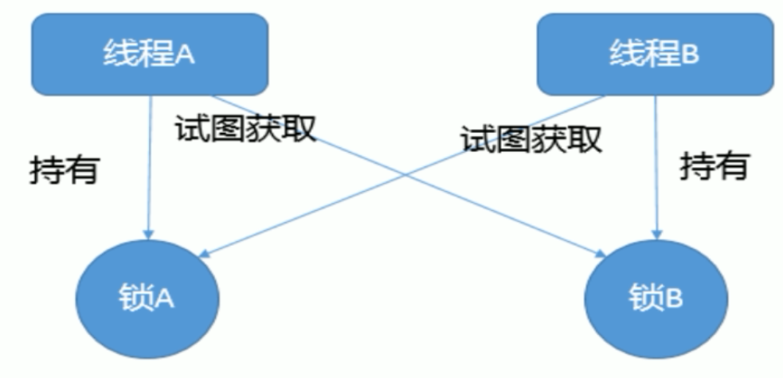
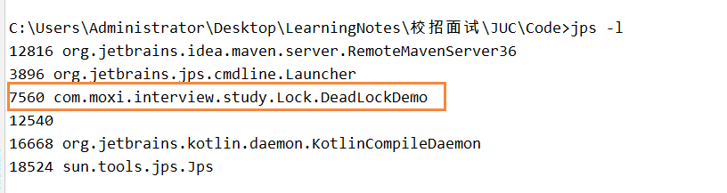

# 死锁编码及定位分析

## 概念

死锁是指两个或多个以上的进程在执行过程中，因争夺资源而造成一种互相等待的现象，若无外力干涉那他们都将无法推进下去。如果资源充足，进程的资源请求都能够得到满足，死锁出现的可能性就很低，否则就会因争夺有限的资源而陷入死锁。



## 产生死锁的原因

- 系统资源不足
- 进程运行推进的顺序不对
- 资源分配不当

## 死锁产生的四个必要条件

- 互斥
  - 解决方法：把互斥的共享资源封装成可同时访问
- 占有且等待
  - 解决方法：进程请求资源时，要求它不占有任何其它资源，也就是它必须一次性申请到所有的资源，这种方式会导致资源效率低。
- 非抢占式
  - 解决方法：如果进程不能立即分配资源，要求它不占有任何其他资源，也就是只能够同时获得所有需要资源时，才执行分配操作
- 循环等待
  - 解决方法：对资源进行排序，要求进程按顺序请求资源。

## 死锁代码

我们创建了一个资源类，然后让两个线程分别持有自己的锁，同时在尝试获取别人的，就会出现死锁现象

```
/**
 * 死锁小Demo
 * 死锁是指两个或多个以上的进程在执行过程中，
 * 因争夺资源而造成一种互相等待的现象，
 * 若无外力干涉那他们都将无法推进下去
 * @author: 陌溪
 * @create: 2020-03-18-17:58
 */

import java.util.concurrent.TimeUnit;

/**
 * 资源类
 */
class HoldLockThread implements Runnable{

    private String lockA;
    private String lockB;

    // 持有自己的锁，还想得到别人的锁

    public HoldLockThread(String lockA, String lockB) {
        this.lockA = lockA;
        this.lockB = lockB;
    }


    @Override
    public void run() {
        synchronized (lockA) {
            System.out.println(Thread.currentThread().getName() + "\t 自己持有" + lockA + "\t 尝试获取：" + lockB);

            try {
                TimeUnit.SECONDS.sleep(2);
            } catch (InterruptedException e) {
                e.printStackTrace();
            }

            synchronized (lockB) {
                System.out.println(Thread.currentThread().getName() + "\t 自己持有" + lockB + "\t 尝试获取：" + lockA);
            }
        }
    }
}
public class DeadLockDemo {
    public static void main(String[] args) {
        String lockA = "lockA";
        String lockB = "lockB";

        new Thread(new HoldLockThread(lockA, lockB), "t1").start();

        new Thread(new HoldLockThread(lockB, lockA), "t2").start();
    }
}
```

运行结果，main线程无法结束

```
t1	 自己持有lockA	 尝试获取：lockB
t2	 自己持有lockB	 尝试获取：lockA
```

## 如何排查死锁

当我们出现死锁的时候，首先需要使用jps命令查看运行的程序

```
jps -l
```

我们能看到DeadLockDemo这个类，一直在运行



在使用jstack查看堆栈信息

```
jstack  7560   # 后面参数是 jps输出的该类的pid
```

得到的结果

```
Found one Java-level deadlock:
=============================
"t2":
  waiting to lock monitor 0x000000001cfc0de8 (object 0x000000076b696e80, a java.lang.String),
  which is held by "t1"
"t1":
  waiting to lock monitor 0x000000001cfc3728 (object 0x000000076b696eb8, a java.lang.String),
  which is held by "t2"

Java stack information for the threads listed above:
===================================================
"t2":
        at com.moxi.interview.study.Lock.HoldLockThread.run(DeadLockDemo.java:42)
        - waiting to lock <0x000000076b696e80> (a java.lang.String)
        - locked <0x000000076b696eb8> (a java.lang.String)
        at java.lang.Thread.run(Thread.java:745)
"t1":
        at com.moxi.interview.study.Lock.HoldLockThread.run(DeadLockDemo.java:42)
        - waiting to lock <0x000000076b696eb8> (a java.lang.String)
        - locked <0x000000076b696e80> (a java.lang.String)
        at java.lang.Thread.run(Thread.java:745)

Found 1 deadlock.
```

通过查看最后一行，我们看到  Found 1 deadlock，即存在一个死锁