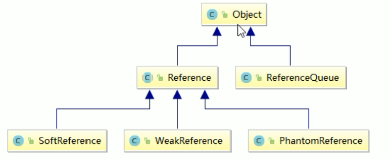
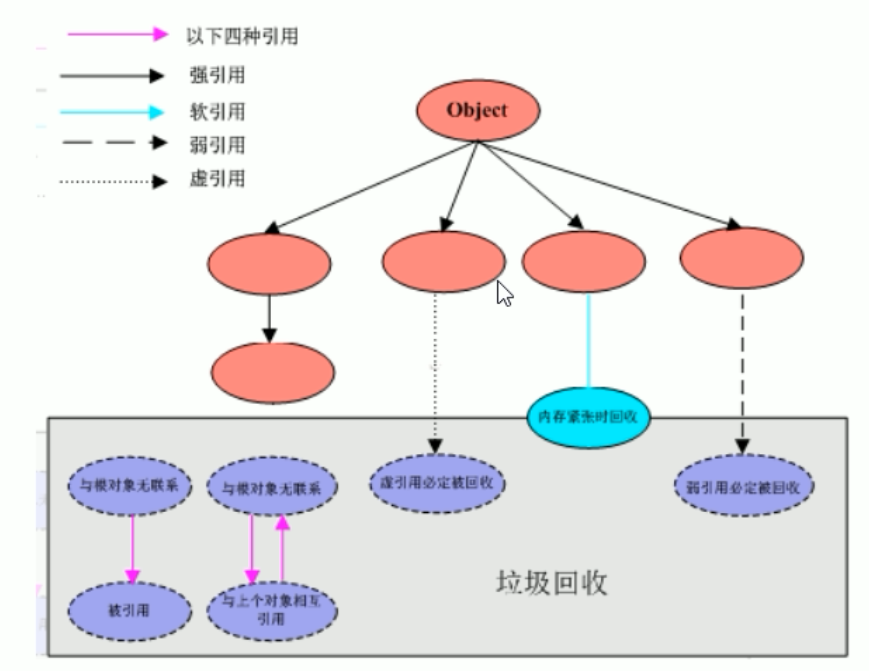

# Java中的引用

## 前言

在原来的时候，我们谈到一个类的实例化

```
Person p = new Person()
```

在等号的左边，就是一个对象的引用，存储在栈中

而等号右边，就是实例化的对象，存储在堆中

其实这样的一个引用关系，就被称为强引用

## 整体架构



## 强引用

当内存不足的时候，JVM开始垃圾回收，对于强引用的对象，就算是出现了OOM也不会对该对象进行回收，打死也不回收~！

强引用是我们最常见的普通对象引用，只要还有一个强引用指向一个对象，就能表明对象还“活着”，垃圾收集器不会碰这种对象。在Java中最常见的就是强引用，把一个对象赋给一个引用变量，这个引用变量就是一个强引用。当一个对象被强引用变量引用时，它处于可达状态，它是不可能被垃圾回收机制回收的，即使该对象以后永远都不会被用到，JVM也不会回收，因此强引用是造成Java内存泄漏的主要原因之一。

对于一个普通的对象，如果没有其它的引用关系，只要超过了引用的作用于或者显示地将相应（强）引用赋值为null，一般可以认为就是可以被垃圾收集的了（当然具体回收时机还是要看垃圾回收策略）

强引用小例子：

```
/**
 * 强引用
 * @author: 陌溪
 * @create: 2020-03-23-16:25
 */
public class StrongReferenceDemo {

    public static void main(String[] args) {
        // 这样定义的默认就是强应用
        Object obj1 = new Object();

        // 使用第二个引用，指向刚刚创建的Object对象
        Object obj2 = obj1;

        // 置空
        obj1 = null;

        // 垃圾回收
        System.gc();

        System.out.println(obj1);

        System.out.println(obj2);
    }
}
```

输出结果我们能够发现，即使 obj1 被设置成了null，然后调用gc进行回收，但是也没有回收实例出来的对象，obj2还是能够指向该地址，也就是说垃圾回收器，并没有将该对象进行垃圾回收

```
null
java.lang.Object@14ae5a5
```

## 软引用

软引用是一种相对弱化了一些的引用，需要用Java.lang.ref.SoftReference类来实现，可以让对象豁免一些垃圾收集，对于只有软引用的对象来讲：

- 当系统内存充足时，它不会被回收
- 当系统内存不足时，它会被回收

软引用通常在对内存敏感的程序中，比如高速缓存就用到了软引用，内存够用 的时候就保留，不够用就回收

具体使用

```
/**
 * 软引用
 *
 * @author: 陌溪
 * @create: 2020-03-23-16:39
 */
public class SoftReferenceDemo {

    /**
     * 内存够用的时候
     */
    public static void softRefMemoryEnough() {
        // 创建一个强应用
        Object o1 = new Object();
        // 创建一个软引用
        SoftReference<Object> softReference = new SoftReference<>(o1);
        System.out.println(o1);
        System.out.println(softReference.get());

        o1 = null;
        // 手动GC
        System.gc();

        System.out.println(o1);
        System.out.println(softReference.get());
    }

    /**
     * JVM配置，故意产生大对象并配置小的内存，让它的内存不够用了导致OOM，看软引用的回收情况
     * -Xms5m -Xmx5m -XX:+PrintGCDetails
     */
    public static void softRefMemoryNoEnough() {

        System.out.println("========================");
        // 创建一个强应用
        Object o1 = new Object();
        // 创建一个软引用
        SoftReference<Object> softReference = new SoftReference<>(o1);
        System.out.println(o1);
        System.out.println(softReference.get());

        o1 = null;

        // 模拟OOM自动GC
        try {
            // 创建30M的大对象
            byte[] bytes = new byte[30 * 1024 * 1024];
        } catch (Exception e) {
            e.printStackTrace();
        } finally {
            System.out.println(o1);
            System.out.println(softReference.get());
        }

    }

    public static void main(String[] args) {

        softRefMemoryEnough();

        softRefMemoryNoEnough();
    }
}

```

我们写了两个方法，一个是内存够用的时候，一个是内存不够用的时候

我们首先查看内存够用的时候，首先输出的是 o1 和 软引用的 softReference，我们都能够看到值

然后我们把o1设置为null，执行手动GC后，我们发现softReference的值还存在，说明内存充足的时候，软引用的对象不会被回收

```
java.lang.Object@14ae5a5
java.lang.Object@14ae5a5

[GC (System.gc()) [PSYoungGen: 1396K->504K(1536K)] 1504K->732K(5632K), 0.0007842 secs] [Times: user=0.00 sys=0.00, real=0.00 secs] 
[Full GC (System.gc()) [PSYoungGen: 504K->0K(1536K)] [ParOldGen: 228K->651K(4096K)] 732K->651K(5632K), [Metaspace: 3480K->3480K(1056768K)], 0.0058450 secs] [Times: user=0.00 sys=0.00, real=0.01 secs] 

null
java.lang.Object@14ae5a5
```

下面我们看当内存不够的时候，我们使用了JVM启动参数配置，给初始化堆内存为5M

```
-Xms5m -Xmx5m -XX:+PrintGCDetails
```

但是在创建对象的时候，我们创建了一个30M的大对象

```
// 创建30M的大对象
byte[] bytes = new byte[30 * 1024 * 1024];
```

这就必然会触发垃圾回收机制，这也是中间出现的垃圾回收过程，最后看结果我们发现，o1 和 softReference都被回收了，因此说明，软引用在内存不足的时候，会自动回收

```
java.lang.Object@7f31245a
java.lang.Object@7f31245a

[GC (Allocation Failure) [PSYoungGen: 31K->160K(1536K)] 682K->811K(5632K), 0.0003603 secs] [Times: user=0.00 sys=0.00, real=0.00 secs] 
[GC (Allocation Failure) [PSYoungGen: 160K->96K(1536K)] 811K->747K(5632K), 0.0006385 secs] [Times: user=0.00 sys=0.00, real=0.00 secs] 
[Full GC (Allocation Failure) [PSYoungGen: 96K->0K(1536K)] [ParOldGen: 651K->646K(4096K)] 747K->646K(5632K), [Metaspace: 3488K->3488K(1056768K)], 0.0067976 secs] [Times: user=0.02 sys=0.00, real=0.01 secs] 
[GC (Allocation Failure) [PSYoungGen: 0K->0K(1536K)] 646K->646K(5632K), 0.0004024 secs] [Times: user=0.00 sys=0.00, real=0.00 secs] 
[Full GC (Allocation Failure) [PSYoungGen: 0K->0K(1536K)] [ParOldGen: 646K->627K(4096K)] 646K->627K(5632K), [Metaspace: 3488K->3488K(1056768K)], 0.0065506 secs] [Times: user=0.00 sys=0.00, real=0.01 secs] 

null
null
```

## 弱引用

不管内存是否够，只要有GC操作就会进行回收

弱引用需要用 `java.lang.ref.WeakReference` 类来实现，它比软引用生存期更短

对于只有弱引用的对象来说，只要垃圾回收机制一运行，不管JVM的内存空间是否足够，都会回收该对象占用的空间。

```
/**
 * 弱引用
 *
 * @author: 陌溪
 * @create: 2020-03-24-10:18
 */
public class WeakReferenceDemo {
    public static void main(String[] args) {
        Object o1 = new Object();
        WeakReference<Object> weakReference = new WeakReference<>(o1);
        System.out.println(o1);
        System.out.println(weakReference.get());
        o1 = null;
        System.gc();
        System.out.println(o1);
        System.out.println(weakReference.get());
    }
}
```

我们看结果，能够发现，我们并没有制造出OOM内存溢出，而只是调用了一下GC操作，垃圾回收就把它给收集了

```
java.lang.Object@14ae5a5
java.lang.Object@14ae5a5

[GC (System.gc()) [PSYoungGen: 5246K->808K(76288K)] 5246K->816K(251392K), 0.0008236 secs] [Times: user=0.00 sys=0.00, real=0.00 secs] 
[Full GC (System.gc()) [PSYoungGen: 808K->0K(76288K)] [ParOldGen: 8K->675K(175104K)] 816K->675K(251392K), [Metaspace: 3494K->3494K(1056768K)], 0.0035953 secs] [Times: user=0.00 sys=0.00, real=0.00 secs] 

null
null
```

## 软引用和弱引用的使用场景

场景：假如有一个应用需要读取大量的本地图片

- 如果每次读取图片都从硬盘读取则会严重影响性能
- 如果一次性全部加载到内存中，又可能造成内存溢出

此时使用软引用可以解决这个问题

设计思路：使用HashMap来保存图片的路径和相应图片对象关联的软引用之间的映射关系，在内存不足时，JVM会自动回收这些缓存图片对象所占的空间，从而有效地避免了OOM的问题

```
Map<String, SoftReference<String>> imageCache = new HashMap<String, SoftReference<Bitmap>>();
```

### WeakHashMap是什么？

比如一些常常和底层打交道的，mybatis等，底层都应用到了WeakHashMap

WeakHashMap和HashMap类似，只不过它的Key是使用了弱引用的，也就是说，当执行GC的时候，HashMap中的key会进行回收，下面我们使用例子来测试一下

我们使用了两个方法，一个是普通的HashMap方法

我们输入一个Key-Value键值对，然后让它的key置空，然后在查看结果

```
    private static void myHashMap() {
        Map<Integer, String> map = new HashMap<>();
        Integer key = new Integer(1);
        String value = "HashMap";

        map.put(key, value);
        System.out.println(map);

        key = null;

        System.gc();

        System.out.println(map);
    }
```

第二个是使用了WeakHashMap，完整代码如下

```
/**
 * WeakHashMap
 * @author: 陌溪
 * @create: 2020-03-24-11:33
 */
public class WeakHashMapDemo {
    public static void main(String[] args) {
        myHashMap();
        System.out.println("==========");
        myWeakHashMap();
    }

    private static void myHashMap() {
        Map<Integer, String> map = new HashMap<>();
        Integer key = new Integer(1);
        String value = "HashMap";

        map.put(key, value);
        System.out.println(map);

        key = null;

        System.gc();

        System.out.println(map);
    }

    private static void myWeakHashMap() {
        Map<Integer, String> map = new WeakHashMap<>();
        Integer key = new Integer(1);
        String value = "WeakHashMap";

        map.put(key, value);
        System.out.println(map);

        key = null;

        System.gc();

        System.out.println(map);
    }
}
```

最后输出结果为：

```
{1=HashMap}
{1=HashMap}
==========
{1=WeakHashMap}
{}
```

从这里我们看到，对于普通的HashMap来说，key置空并不会影响，HashMap的键值对，因为这个属于强引用，不会被垃圾回收。

但是WeakHashMap，在进行GC操作后，弱引用的就会被回收

## 虚引用

### 概念

虚引用又称为幽灵引用，需要`java.lang.ref.PhantomReference` 类来实现

顾名思义，就是形同虚设，与其他几种引用都不同，虚引用并不会决定对象的生命周期。

如果一个对象持有虚引用，那么它就和没有任何引用一样，在任何时候都可能被垃圾回收器回收，它不能单独使用也不能通过它访问对象，虚引用必须和引用队列ReferenceQueue联合使用。

虚引用的主要作用和跟踪对象被垃圾回收的状态，仅仅是提供一种确保对象被finalize以后，做某些事情的机制。

PhantomReference的get方法总是返回null，因此无法访问对象的引用对象。其意义在于说明一个对象已经进入finalization阶段，可以被gc回收，用来实现比finalization机制更灵活的回收操作

换句话说，设置虚引用关联的唯一目的，就是在这个对象被收集器回收的时候，收到一个系统通知或者后续添加进一步的处理，Java技术允许使用finalize()方法在垃圾收集器将对象从内存中清除出去之前，做必要的清理工作

这个就相当于Spring AOP里面的后置通知

### 场景

一般用于在回收时候做通知相关操作

## 引用队列 ReferenceQueue

软引用，弱引用，虚引用在回收之前，需要在引用队列保存一下

我们在初始化的弱引用或者虚引用的时候，可以传入一个引用队列

```
Object o1 = new Object();

// 创建引用队列
ReferenceQueue<Object> referenceQueue = new ReferenceQueue<>();

// 创建一个弱引用
WeakReference<Object> weakReference = new WeakReference<>(o1, referenceQueue);
```

那么在进行GC回收的时候，弱引用和虚引用的对象都会被回收，但是在回收之前，它会被送至引用队列中

完整代码如下：

```
/**
 * 虚引用
 *
 * @author: 陌溪
 * @create: 2020-03-24-12:09
 */
public class PhantomReferenceDemo {

    public static void main(String[] args) {

        Object o1 = new Object();

        // 创建引用队列
        ReferenceQueue<Object> referenceQueue = new ReferenceQueue<>();

        // 创建一个弱引用
        WeakReference<Object> weakReference = new WeakReference<>(o1, referenceQueue);

        // 创建一个弱引用
//        PhantomReference<Object> weakReference = new PhantomReference<>(o1, referenceQueue);

        System.out.println(o1);
        System.out.println(weakReference.get());
        // 取队列中的内容
        System.out.println(referenceQueue.poll());

        o1 = null;
        System.gc();
        System.out.println("执行GC操作");

        try {
            TimeUnit.SECONDS.sleep(2);
        } catch (InterruptedException e) {
            e.printStackTrace();
        }

        System.out.println(o1);
        System.out.println(weakReference.get());
        // 取队列中的内容
        System.out.println(referenceQueue.poll());

    }
}
```

运行结果

```
java.lang.Object@14ae5a5
java.lang.Object@14ae5a5
null
执行GC操作
null
null
java.lang.ref.WeakReference@7f3124
```

从这里我们能看到，在进行垃圾回收后，我们弱引用对象，也被设置成null，但是在队列中还能够导出该引用的实例，这就说明在回收之前，该弱引用的实例被放置引用队列中了，我们可以通过引用队列进行一些后置操作

## GCRoots和四大引用小总结

- 红色部分在垃圾回收之外，也就是强引用的

- 蓝色部分：属于软引用，在内存不够的时候，才回收
- 虚引用和弱引用：每次垃圾回收的时候，都会被干掉，但是它在干掉之前还会存在引用队列中，我们可以通过引用队列进行一些通知机制

