# 垃圾收集器

## GC垃圾回收算法和垃圾收集器关系

> 天上飞的理念，要有落地的实现（垃圾收集器就是GC垃圾回收算法的实现）
>
> GC算法是内存回收的方法论，垃圾收集器就是算法的落地实现

GC算法主要有以下几种

- 引用计数（几乎不用，无法解决循环引用的问题）
- 复制拷贝（用于新生代）
- 标记清除（用于老年代）
- 标记整理（用于老年代）

因为目前为止还没有完美的收集器出现，更没有万能的收集器，只是针对具体应用最合适的收集器，进行分代收集（那个代用什么收集器）

## 四种主要的垃圾收集器

- Serial：串行回收  `-XX:+UseSeriallGC`
- Parallel：并行回收  `-XX:+UseParallelGC`
- CMS：并发标记清除
- G1
- ZGC：（java 11 出现的）

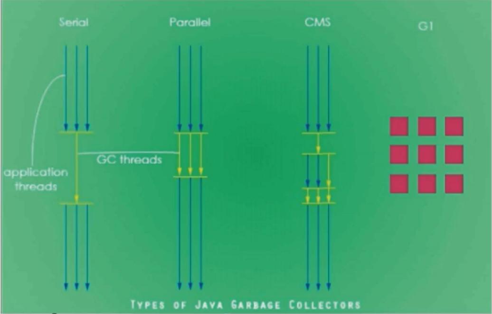


### Serial

串行垃圾回收器，它为单线程环境设计且值使用一个线程进行垃圾收集，会暂停所有的用户线程，只有当垃圾回收完成时，才会重新唤醒主线程继续执行。所以不适合服务器环境

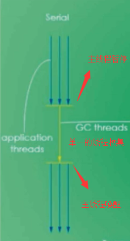

### Parallel

并行垃圾收集器，多个垃圾收集线程并行工作，此时用户线程也是阻塞的，适用于科学计算 / 大数据处理等弱交互场景，也就是说Serial 和 Parallel其实是类似的，不过是多了几个线程进行垃圾收集，但是主线程都会被暂停，但是并行垃圾收集器处理时间，肯定比串行的垃圾收集器要更短

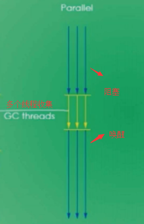

### CMS

并发标记清除，用户线程和垃圾收集线程同时执行（不一定是并行，可能是交替执行），不需要停顿用户线程，互联网公司都在使用，适用于响应时间有要求的场景。并发是可以有交互的，也就是说可以一边进行收集，一边执行应用程序。

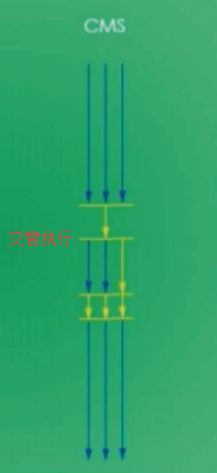


### G1

G1垃圾回收器将堆内存分割成不同区域，然后并发的进行垃圾回收


## 垃圾收集器总结

注意：并行垃圾回收在单核CPU下可能会更慢


## 查看默认垃圾收集器

使用下面JVM命令，查看配置的初始参数

```
-XX:+PrintCommandLineFlags
```

然后运行一个程序后，能够看到它的一些初始配置信息

```
-XX:InitialHeapSize=266376000 -XX:MaxHeapSize=4262016000 -XX:+PrintCommandLineFlags -XX:+UseCompressedClassPointers -XX:+UseCompressedOops -XX:-UseLargePagesIndividualAllocation -XX:+UseParallelGC
```

移动到最后一句，就能看到 `-XX:+UseParallelGC` 说明使用的是并行垃圾回收

```
-XX:+UseParallelGC
```


## 默认垃圾收集器有哪些

Java中一共有7大垃圾收集器

- UserSerialGC：串行垃圾收集器
- UserParallelGC：并行垃圾收集器
- UseConcMarkSweepGC：（CMS）并发标记清除
- UseParNewGC：年轻代的并行垃圾回收器
- UseParallelOldGC：老年代的并行垃圾回收器
- UseG1GC：G1垃圾收集器
- UserSerialOldGC：串行老年代垃圾收集器（已经被移除）

底层源码

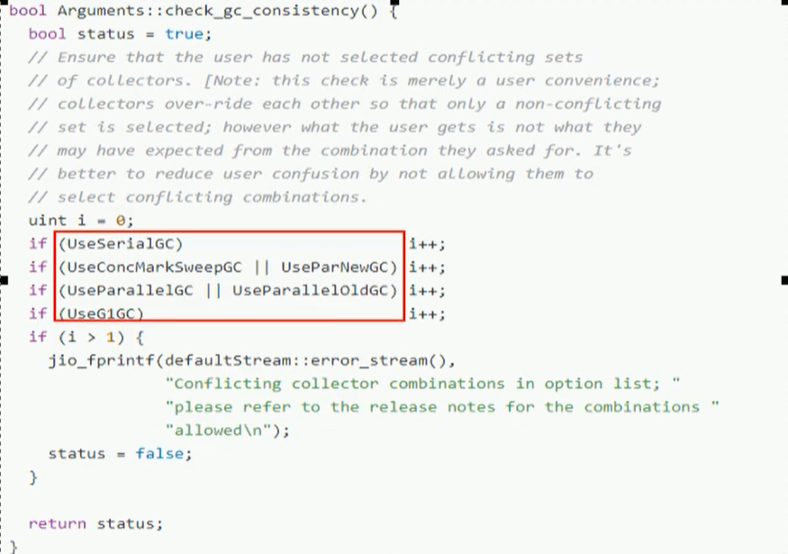


## 各垃圾收集器的使用范围

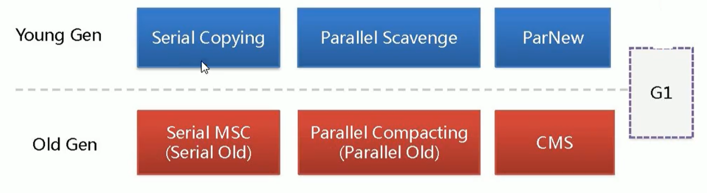

新生代使用的：

- Serial Copying： UserSerialGC，串行垃圾回收器
- Parallel Scavenge：UserParallelGC，并行垃圾收集器
- ParNew：UserParNewGC，新生代并行垃圾收集器


老年区使用的：

- Serial Old：UseSerialOldGC，老年代串行垃圾收集器
- Parallel Compacting（Parallel Old）：UseParallelOldGC，老年代并行垃圾收集器
- CMS：UseConcMarkSwepp，并行标记清除垃圾收集器


各区都能使用的：

G1：UseG1GC，G1垃圾收集器


垃圾收集器就来具体实现这些GC算法并实现内存回收，不同厂商，不同版本的虚拟机实现差别很大，HotSpot中包含的收集器如下图所示：

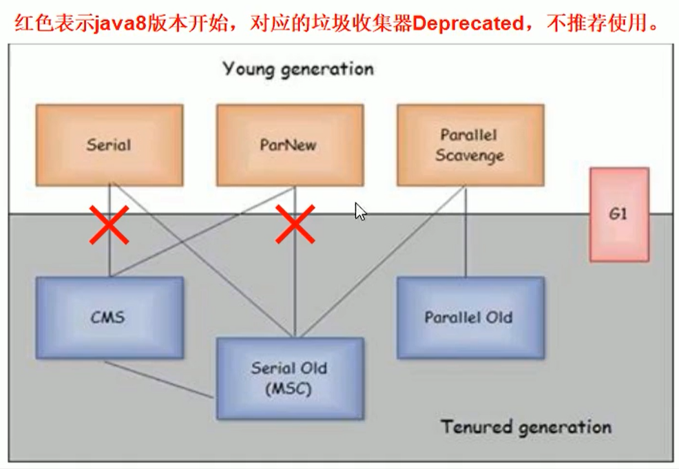


## 部分参数说明

- DefNew：Default New Generation
- Tenured：Old
- ParNew：Parallel New Generation
- PSYoungGen：Parallel Scavenge
- ParOldGen：Parallel Old Generation

## Java中的Server和Client模式

使用范围：一般使用Server模式，Client模式基本不会使用

操作系统

- 32位的Window操作系统，不论硬件如何都默认使用Client的JVM模式
- 32位的其它操作系统，2G内存同时有2个cpu以上用Server模式，低于该配置还是Client模式
- 64位只有Server模式

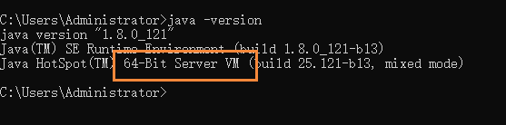


## 新生代下的垃圾收集器

### 串行GC(Serial)

串行GC（Serial）（Serial Copying）

是一个单线程单线程的收集器，在进行垃圾收集时候，必须暂停其他所有的工作线程直到它收集结束。


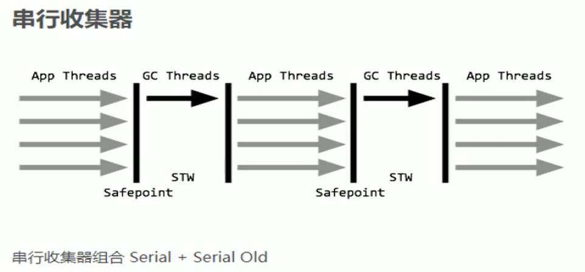

串行收集器是最古老，最稳定以及效率高的收集器，只使用一个线程去回收但其在垃圾收集过程中可能会产生较长的停顿(Stop-The-World 状态)。 虽然在收集垃圾过程中需要暂停所有其它的工作线程，但是它简单高效，对于限定单个CPU环境来说，没有线程交互的开销可以获得最高的单线程垃圾收集效率，因此Serial垃圾收集器依然是Java虚拟机运行在Client模式下默认的新生代垃圾收集器

对应JVM参数是：-XX:+UseSerialGC

开启后会使用：Serial(Young区用) + Serial Old(Old区用) 的收集器组合

表示：新生代、老年代都会使用串行回收收集器，新生代使用复制算法，老年代使用标记-整理算法

```
-Xms10m -Xmx10m -XX:PrintGCDetails -XX:+PrintConmandLineFlags -XX:+UseSerialGC
```

### 并行GC(ParNew)

并行收集器，使用多线程进行垃圾回收，在垃圾收集，会Stop-the-World暂停其他所有的工作线程直到它收集结束

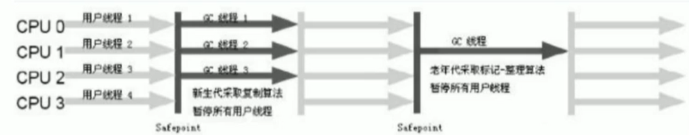

ParNew收集器其实就是Serial收集器新生代的并行多线程版本，最常见的应用场景时配合老年代的CMS GC工作，其余的行为和Serial收集器完全一样，ParNew垃圾收集器在垃圾收集过程中同样也要暂停所有其他的工作线程。它是很多Java虚拟机运行在Server模式下新生代的默认垃圾收集器。

常见对应JVM参数：-XX:+UseParNewGC     启动ParNew收集器，只影响新生代的收集，不影响老年代

开启上述参数后，会使用：ParNew（Young区用） + Serial Old的收集器组合，新生代使用复制算法，老年代采用标记-整理算法

```
-Xms10m -Xmx10m -XX:PrintGCDetails -XX:+PrintConmandLineFlags -XX:+UseParNewGC
```

但是会出现警告，即 ParNew 和 Serial Old 这样搭配，Java8已经不再被推荐


备注： -XX:ParallelGCThreads   限制线程数量，默认开启和CPU数目相同的线程数


### 并行回收GC（Parallel）/ （Parallel Scavenge）

因为Serial 和 ParNew都不推荐使用了，因此现在新生代默认使用的是Parallel Scavenge，也就是新生代和老年代都是使用并行

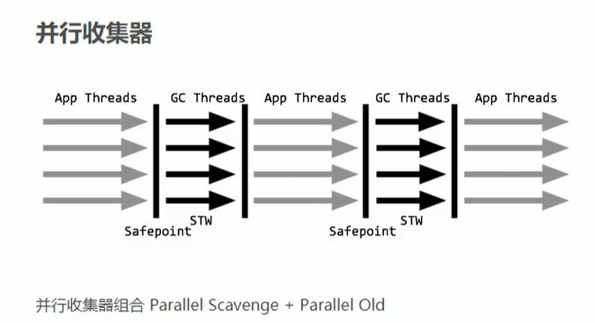

Parallel Scavenge收集器类似ParNew也是一个新生代垃圾收集器，使用复制算法，也是一个并行的多线程的垃圾收集器，俗称吞吐量优先收集器。一句话：串行收集器在新生代和老年代的并行化

它关注的重点是：

可控制的吞吐量（Thoughput = 运行用户代码时间 / (运行用户代码时间 + 垃圾收集时间) ），也即比如程序运行100分钟，垃圾收集时间1分钟，吞吐量就是99%。高吞吐量意味着高效利用CPU时间，它多用于在后台运算而不需要太多交互的任务。

自适应调节策略也是ParallelScavenge收集器与ParNew收集器的一个重要区别。（自适应调节策略：虚拟机会根据当前系统的运行情况收集性能监控信息，动态调整这些参数以提供最合适的停顿时间( -XX:MaxGCPauseMills)）或最大的吞吐量。

常用JVM参数：-XX:+UseParallelGC 或 -XX:+UseParallelOldGC（可互相激活）使用Parallel Scanvenge收集器

开启该参数后：新生代使用复制算法，老年代使用标记-整理算法

```
-Xms10m -Xmx10m -XX:PrintGCDetails -XX:+PrintConmandLineFlags -XX:+UseParallelGC
```


## 老年代下的垃圾收集器

### 串行GC（Serial Old） / (Serial MSC)

Serial Old是Serial垃圾收集器老年代版本，它同样是一个单线程的收集器，使用标记-整理算法，这个收集器也主要是运行在Client默认的Java虚拟机中默认的老年代垃圾收集器

在Server模式下，主要有两个用途（了解，版本已经到8及以后）

- 在JDK1.5之前版本中与新生代的Parallel Scavenge收集器搭配使用（Parallel Scavenge + Serial Old）
- 作为老年代版中使用CMS收集器的后备垃圾收集方案。

配置方法：

```
-Xms10m -Xmx10m -XX:PrintGCDetails -XX:+PrintConmandLineFlags -XX:+UseSerialOldlGC
```

该垃圾收集器，目前已经不推荐使用了

### 并行GC（Parallel Old）/ （Parallel MSC）

Parallel Old收集器是Parallel Scavenge的老年代版本，使用多线程的标记-整理算法，Parallel Old收集器在JDK1.6才开始提供。

在JDK1.6之前，新生代使用ParallelScavenge收集器只能搭配老年代的Serial Old收集器，只能保证新生代的吞吐量优先，无法保证整体的吞吐量。在JDK1.6以前(Parallel Scavenge + Serial Old)

Parallel Old正是为了在老年代同样提供吞吐量优先的垃圾收集器，如果系统对吞吐量要求比较高，JDK1.8后可以考虑新生代Parallel Scavenge和老年代Parallel Old 收集器的搭配策略。在JDK1.8及后（Parallel Scavenge + Parallel Old）

JVM常用参数：

```
-XX +UseParallelOldGC：使用Parallel Old收集器，设置该参数后，新生代Parallel+老年代 Parallel Old
```

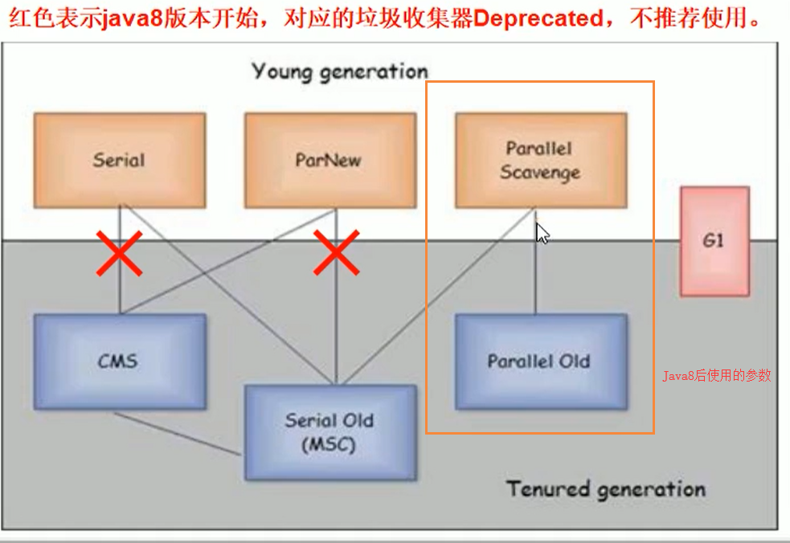


使用老年代并行收集器：

```
-Xms10m -Xmx10m -XX:PrintGCDetails -XX:+PrintConmandLineFlags -XX:+UseParallelOldlGC
```


### 并发标记清除GC（CMS）

CMS收集器（Concurrent Mark Sweep：并发标记清除）是一种以最短回收停顿时间为目标的收集器

适合应用在互联网或者B/S系统的服务器上，这类应用尤其重视服务器的响应速度，希望系统停顿时间最短。

CMS非常适合堆内存大，CPU核数多的服务器端应用，也是G1出现之前大型应用的首选收集器。

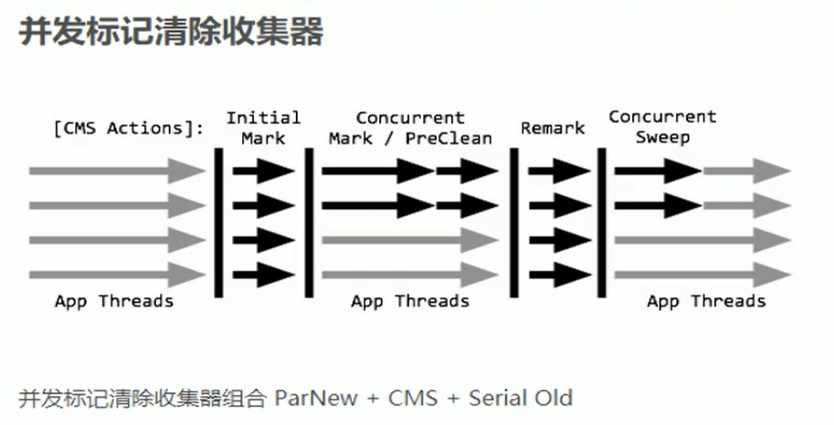

Concurrent Mark Sweep：并发标记清除，并发收集低停顿，并发指的是与用户线程一起执行

开启该收集器的JVM参数： -XX:+UseConcMarkSweepGC  开启该参数后，会自动将 -XX:+UseParNewGC打开，开启该参数后，使用ParNew(young 区用）+ CMS（Old 区用） + Serial Old 的收集器组合，Serial Old将作为CMS出错的后备收集器

```
-Xms10m -Xmx10m -XX:+PrintGCDetails -XX:+UseConcMarkSweepGC
```


#### 四个步骤

- 初始标记（CMS initial mark）
  - 只是标记一个GC Roots 能直接关联的对象，速度很快，仍然需要暂停所有的工作线程
- 并发标记（CMS concurrent mark）和用户线程一起
  - 进行GC Roots跟踪过程，和用户线程一起工作，不需要暂停工作线程。主要标记过程，标记全部对象
- 重新标记（CMS remark）
  - 为了修正在并发标记期间，因用户程序继续运行而导致标记产生变动的那一部分对象的标记记录，仍然需要暂停所有的工作线程，由于并发标记时，用户线程依然运行，因此在正式清理前，在做修正
- 并发清除（CMS concurrent sweep）和用户线程一起
  - 清除GC Roots不可达对象，和用户线程一起工作，不需要暂停工作线程。基于标记结果，直接清理对象，由于耗时最长的并发标记和并发清除过程中，垃圾收集线程可以和用户现在一起并发工作，所以总体上来看CMS收集器的内存回收和用户线程是一起并发地执行。


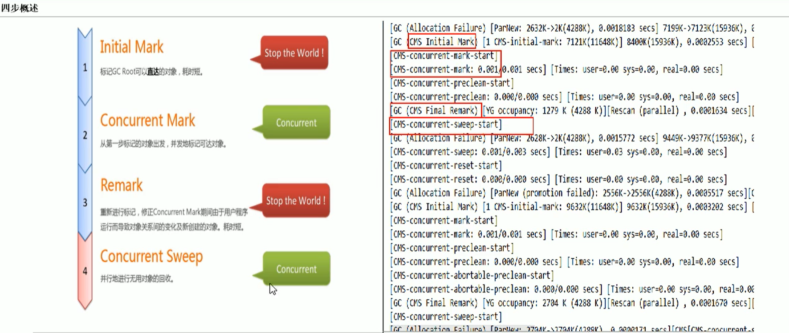

优点：并发收集低停顿

缺点：并发执行，对CPU资源压力大，采用的标记清除算法会导致大量碎片

由于并发进行，CMS在收集与应用线程会同时增加对堆内存的占用，也就是说，CMS必须在老年代堆内存用尽之前完成垃圾回收，否则CMS回收失败时，将触发担保机制，串行老年代收集器将会以STW方式进行一次GC，从而造成较大的停顿时间

标记清除算法无法整理空间碎片，老年代空间会随着应用时长被逐步耗尽，最后将不得不通过担保机制对堆内存进行压缩，CMS也提供了参数 -XX:CMSFullGCSBeForeCompaction（默认0，即每次都进行内存整理）来指定多少次CMS收集之后，进行一次压缩的Full GC


## 垃圾收集器如何选择

### 组合的选择

- 单CPU或者小内存，单机程序
  - -XX:+UseSerialGC
- 多CPU，需要最大的吞吐量，如后台计算型应用
  - -XX:+UseParallelGC（这两个相互激活）
  - -XX:+UseParallelOldGC
- 多CPU，追求低停顿时间，需要快速响应如互联网应用
  - -XX:+UseConcMarkSweepGC
  - -XX:+ParNewGC

|          参数           |     新生代垃圾收集器     | 新生代算法 |                       老年代垃圾收集器                       | 老年代算法 |
| :---------------------: | :----------------------: | :--------: | :----------------------------------------------------------: | :--------: |
|    -XX:+UseSerialGC     |         SerialGC         |    复制    |                         SerialOldGC                          |  标记整理  |
|    -XX:+UseParNewGC     |          ParNew          |    复制    |                         SerialOldGC                          |  标记整理  |
|   -XX:+UseParallelGC    |   Parallel [Scavenge]    |    复制    |                         Parallel Old                         |  标记整理  |
| -XX:+UseConcMarkSweepGC |          ParNew          |    复制    | CMS + Serial Old的收集器组合，Serial Old作为CMS出错的后备收集器 |  标记清除  |
|      -XX:+UseG1GC       | G1整体上采用标记整理算法 |  局部复制  |                                                              |            |


## G1垃圾收集器


### 开启G1垃圾收集器

```
-XX:+UseG1GC
```

### 以前收集器的特点

- 年轻代和老年代是各自独立且连续的内存块
- 年轻代收集使用单eden + S0 + S1 进行复制算法
- 老年代收集必须扫描珍整个老年代区域
- 都是以尽可能少而快速地执行GC为设计原则

### G1是什么

G1：Garbage-First 收集器，是一款面向服务端应用的收集器，应用在多处理器和大容量内存环境中，在实现高吞吐量的同时，尽可能满足垃圾收集暂停时间的要求。另外，它还具有一下特征：

- 像CMS收集器一样，能与应用程序并发执行
- 整理空闲空间更快
- 需要更多的时间来预测GC停顿时间
- 不希望牺牲大量的吞吐量性能
- 不需要更大的Java Heap

G1收集器设计目标是取代CMS收集器，它同CMS相比，在以下方面表现的更出色

- G1是一个有整理内存过程的垃圾收集器，不会产生很多内存碎片。
- G1的Stop The World（STW）更可控，G1在停顿时间上添加了预测机制，用户可以指定期望停顿时间。


CMS垃圾收集器虽然减少了暂停应用程序的运行时间，但是它还存在着内存碎片问题。于是，为了去除内存碎片问题，同时又保留CMS垃圾收集器低暂停时间的优点，JAVA7发布了一个新的垃圾收集器-G1垃圾收集器

G1是在2012奶奶才在JDK1.7中可用，Oracle官方计划在JDK9中将G1变成默认的垃圾收集器以替代CMS，它是一款面向服务端应用的收集器，主要应用在多CPU和大内存服务器环境下，极大减少垃圾收集的停顿时间，全面提升服务器的性能，逐步替换Java8以前的CMS收集器

主要改变时：Eden，Survivor和Tenured等内存区域不再是连续了，而是变成一个个大小一样的region，每个region从1M到32M不等。一个region有可能属于Eden，Survivor或者Tenured内存区域。

### 特点

- G1能充分利用多CPU，多核环境硬件优势，尽量缩短STW
- G1整体上采用标记-整理算法，局部是通过复制算法，不会产生内存碎片
- 宏观上看G1之中不再区分年轻代和老年代。把内存划分成多个独立的子区域（Region），可以近似理解为一个围棋的棋盘
- G1收集器里面将整个内存区域都混合在一起了，但其本身依然在小范围内要进行年轻代和老年代的区分，保留了新生代和老年代，但他们不再是物理隔离的，而是通过一部分Region的集合且不需要Region是连续的，也就是说依然会采取不同的GC方式来处理不同的区域
- G1虽然也是分代收集器，但整个内存分区不存在物理上的年轻代和老年代的区别，也不需要完全独立的Survivor（to space）堆做复制准备，G1只有逻辑上的分代概念，或者说每个分区都可能随G1的运行在不同代之间前后切换。

### 底层原理

Region区域化垃圾收集器，化整为零，打破了原来新生区和老年区的壁垒，避免了全内存扫描，只需要按照区域来进行扫描即可。

区域化内存划片Region，整体遍为了一些列不连续的内存区域，避免了全内存区的GC操作。

核心思想是将整个堆内存区域分成大小相同的子区域（Region），在JVM启动时会自动设置子区域大小

在堆的使用上，G1并不要求对象的存储一定是物理上连续的，只要逻辑上连续即可，每个分区也不会固定地为某个代服务，可以按需在年轻代和老年代之间切换。启动时可以通过参数`-XX:G1HeapRegionSize=n` 可指定分区大小（1MB~32MB，且必须是2的幂），默认将整堆划分为2048个分区。

大小范围在1MB~32MB，最多能设置2048个区域，也即能够支持的最大内存为：32MB*2048 = 64G内存

Region区域化垃圾收集器

### Region区域化垃圾收集器

G1将新生代、老年代的物理空间划分取消了


同时对内存进行了区域划分

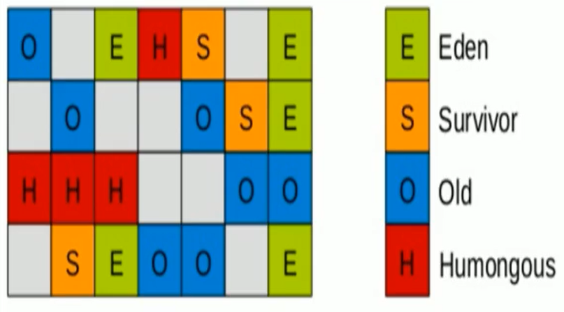

G1算法将堆划分为若干个区域（Reign），它仍然属于分代收集器，这些Region的一部分包含新生代，新生代的垃圾收集依然采用暂停所有应用线程的方式，将存活对象拷贝到老年代或者Survivor空间

这些Region的一部分包含老年代，G1收集器通过将对象从一个区域复制到另外一个区域，完成了清理工作。这就意味着，在正常的处理过程中，G1完成了堆的压缩（至少是部分堆的压缩），这样也就不会有CMS内存碎片的问题存在了。

在G1中，还有一种特殊的区域，叫做Humongous（巨大的）区域，如果一个对象占用了空间超过了分区容量50%以上，G1收集器就认为这是一个巨型对象，这些巨型对象默认直接分配在老年代，但是如果他是一个短期存在的巨型对象，就会对垃圾收集器造成负面影响，为了解决这个问题，G1划分了一个Humongous区，它用来专门存放巨型对象。如果一个H区装不下一个巨型对象，那么G1会寻找连续的H区来存储，为了能找到连续的H区，有时候不得不启动Full GC。

### 回收步骤

针对Eden区进行收集，Eden区耗尽后会被触发，主要是小区域收集 + 形成连续的内存块，避免内碎片

- Eden区的数据移动到Survivor区，加入出现Survivor区空间不够，Eden区数据会晋升到Old区
- Survivor区的数据移动到新的Survivor区，部分数据晋升到Old区
- 最后Eden区收拾干净了，GC结束，用户的应用程序继续执行

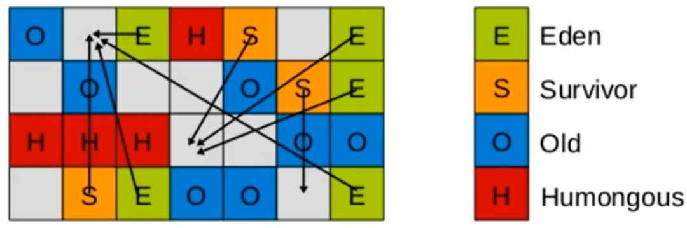

回收完成后

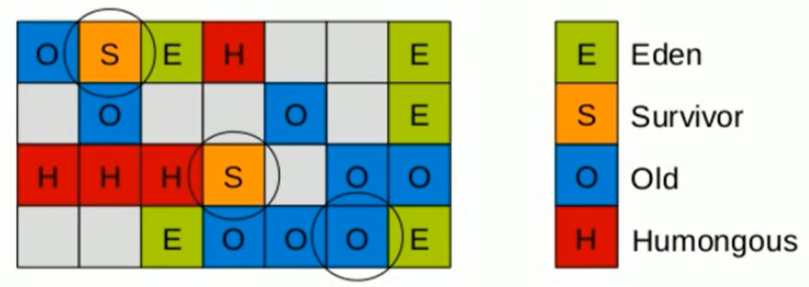

小区域收集 + 形成连续的内存块，最后在收集完成后，就会形成连续的内存空间，这样就解决了内存碎片的问题

### 四步过程

- 初始标记：只标记GC Roots能直接关联到的对象
- 并发标记：进行GC Roots Tracing（链路扫描）的过程
- 最终标记：修正并发标记期间，因为程序运行导致标记发生变化的那一部分对象
- 筛选回收：根据时间来进行价值最大化回收

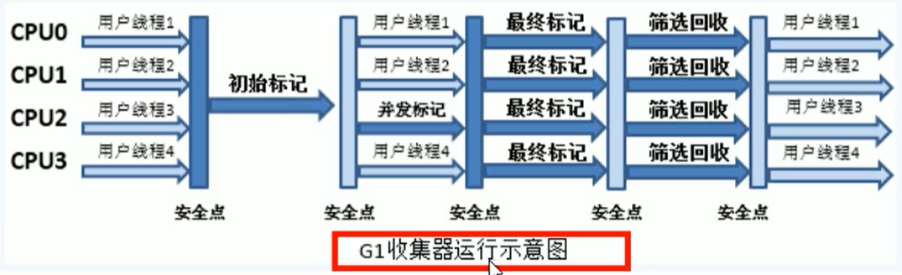

### 参数配置

开发人员仅仅需要申明以下参数即可

三步归纳：`-XX:+UseG1GC  -Xmx32G  -XX:MaxGCPauseMillis=100`

-XX:MaxGCPauseMillis=n：最大GC停顿时间单位毫秒，这是个软目标，JVM尽可能停顿小于这个时间

### G1和CMS比较

- G1不会产生内碎片
- 是可以精准控制停顿。该收集器是把整个堆（新生代、老年代）划分成多个固定大小的区域，每次根据允许停顿的时间去收集垃圾最多的区域。

## SpringBoot结合JVMGC

启动微服务时候，就可以带上JVM和GC的参数

- IDEA开发完微服务工程
- maven进行clean package
- 要求微服务启动的时候，同时配置我们的JVM/GC的调优参数
  - 我们就可以根据具体的业务配置我们启动的JVM参数

例如：

```
java -Xms1024m -Xmx1024 -XX:UseG1GC -jar   xxx.jar
```

