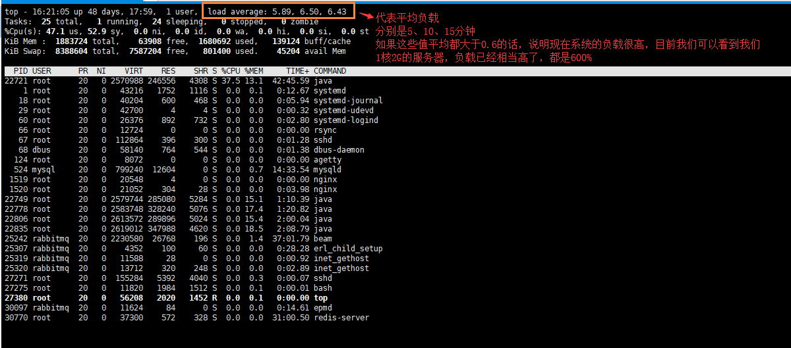
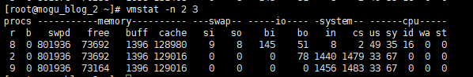
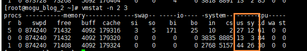
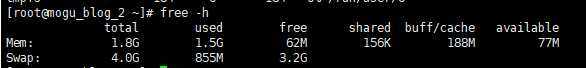
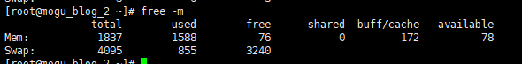
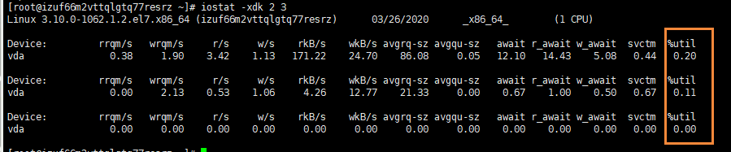
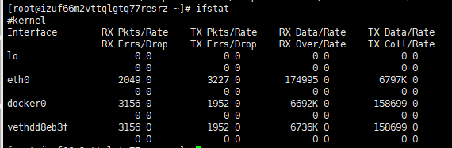
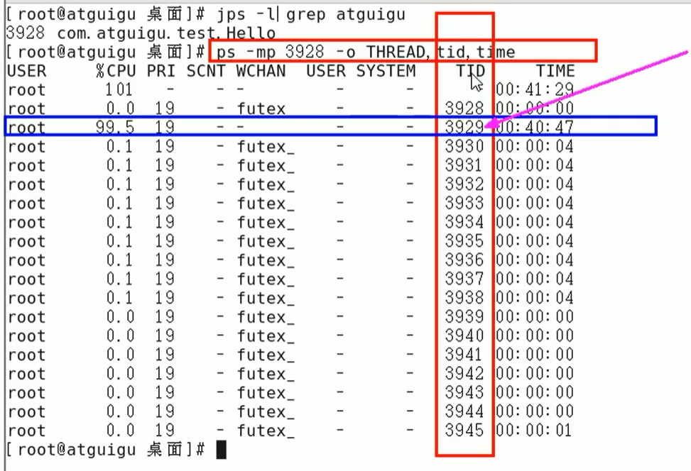
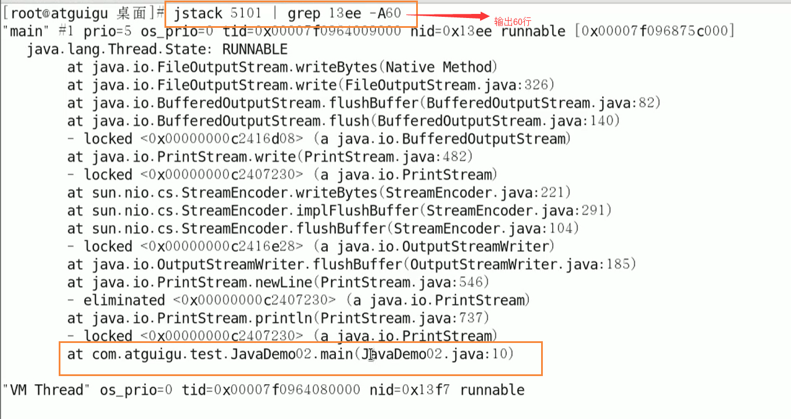

# Linux诊断原因

## 命令集合

### 整机：top，查看整机系统新能

使用top命令的话，重点关注的是 %CPU、%MEM 、load average 三个指标

在这个命令下，按1的话，可以看到每个CPU的占用情况

uptime：系统性能命令的精简版

### CPU：vmstat

- 查看CPU（包含但是不限于）
- 查看额外
  - 查看所有CPU核信息：mpstat -p ALL 2
  - 每个进程使用CPU的用量分解信息：pidstat -u 1 -p 进程编号

命令格式：`vmstat -n 2 3`

一般vmstat工具的使用是通过两个数字参数来完成的，第一个参数是残阳的时间间隔数（单位秒），第二个参数是采样的次数

**procs**

​		r：运行和等待的CPU时间片的进程数，原则上1核的CPU的运行队列不要超过2，整个系统的运行队列不超过总核数的2倍，否则代表系统压力过大，我们看蘑菇博客测试服务器，能发现都超过了2，说明现在压力过大

​		b：等待资源的进程数，比如正在等待磁盘I/O、网络I/O等

**cpu**

​	us：用户进程消耗CPU时间百分比，us值高，用户进程消耗CPU时间多，如果长期大于50%，优化程序

​	sy：内核进程消耗的CPU时间百分比

​	us + sy 参考值为80%，如果us + sy 大于80%，说明可能存在CPU不足，从上面的图片可以看出，us + sy还没有超过百分80，因此说明蘑菇博客的CPU消耗不是很高

​	id：处于空闲的CPU百分比

​	wa：系统等待IO的CPU时间百分比

​	st：来自于一个虚拟机偷取的CPU时间比

### 内存：free

- 应用程序可用内存数：free -m

- 应用程序可用内存/系统物理内存 > 70% 内存充足

- 应用程序可用内存/系统物理内存 < 20% 内存不足，需要增加内存
- 20% <  应用程序可用内存/系统物理内存 < 70%，表示内存基本够用

free -h：以人类能看懂的方式查看物理内存

free -m：以MB为单位，查看物理内存

free -g：以GB为单位，查看物理内存

### 硬盘：df

格式：`df -h  /`  (-h：human，表示以人类能看到的方式换算)

- 硬盘IO：iostat

系统慢有两种原因引起的，一个是CPU高，一个是大量IO操作

格式：`iostat -xdk 2 3`

磁盘块设备分布：

rkB /s：每秒读取数据量kB；

wkB/s：每秒写入数据量kB；

svctm I/O：请求的平均服务时间，单位毫秒

await I/O：请求的平均等待时间，单位毫秒，值越小，性能越好

util：一秒钟有百分几的时间用于I/O操作。接近100%时，表示磁盘带宽跑满，需要优化程序或者增加磁盘；

rkB/s，wkB/s根据系统应用不同会有不同的值，但有规律遵循：长期、超大数据读写，肯定不正常，需要优化程序读取。

svctm的值与await的值很接近，表示几乎没有I/O等待，磁盘性能好，如果await的值远高于svctm的值，则表示I/O队列等待太长，需要优化程序或更换更快磁盘

### 网络IO：ifstat

- 默认本地没有，下载ifstat

## 生产环境服务器变慢，诊断思路和性能评估

记一次印象深刻的故障？

结合Linux 和 JDK命令一起分析，步骤如下

- 使用top命令找出CPU占比最高的

- ps -ef 或者 jps 进一步定位，得知是一个怎么样的后台程序出的问题

- 定位到具体线程或者代码

  - ps -mp 进程  -o THREAD，tid，time
  - 参数解释
    - -m：显示所有的线程
    - -p：pid进程使用CPU的时间
    - -o：该参数后是用户自定义格式

  

- 将需要的线程ID转换为16进制格式（英文小写格式）

  - printf “%x\n” 有问题的线程ID

- jstack 进程ID | grep tid（16进制线程ID小写英文） -A60

  精准定位到错误的地方

