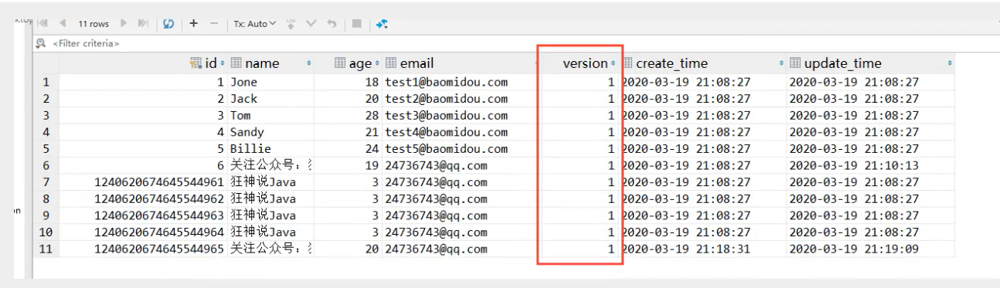

# 乐观锁和悲观锁

## 乐观锁

### 概念

乐观锁：顾名思义，就是十分乐观，它总是认为不会出现问题，无论干什么都不去上锁~，如果出现了问题，再次更新值测试，这里使用了version字段。

也就是每次更新的时候同时维护一个version字段

### 乐观锁实现方式

- 取出记录时，获取当前的version
- 更新时，带上这个version
- 执行更新时，set version = newVersion where version = oldVersion
- 如果version不对，就更新失败

```
乐观锁：1：先查询，获得版本号 version =1

-- A 线程
update user set name = "陌溪", version = version + 1 
where id = 2 and version = 1

-- B 线程抢先完成，这个时候Version = 2，导致A修改失败
update user set name = "陌溪", version = version + 1 
where id = 2 and version = 1
```

## MybatisPlus使用乐观锁

首先需要在数据库增加version字典，默认为1



然后在实体类增加对应的字段

```
// 乐观锁Version注解
@Version
private Integer version;
```

注册组件，在MybatisPlusConfig中配置

```
// 注册乐观锁
@Bean
public OptimisticLockerInterceptor optimisticLockerInterceptor() {
	return new OptimisticLockerInterceptor();
}
```


## 悲观锁

顾名思义，就是十分悲观，它总是认为什么时候都会出现问题，无论什么操作都会上锁，再次操作