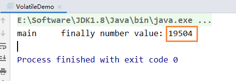
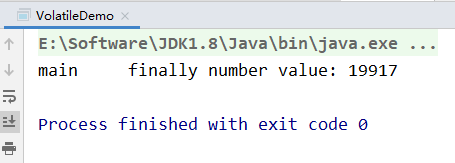
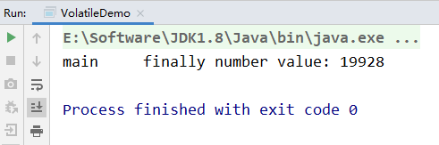
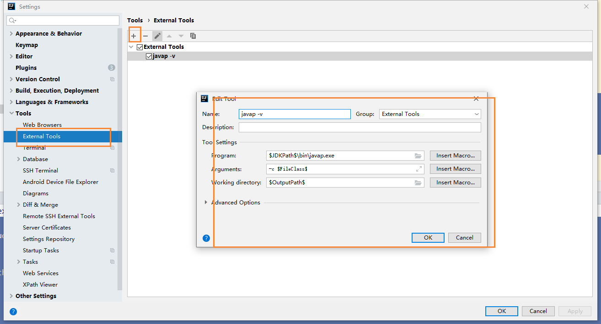
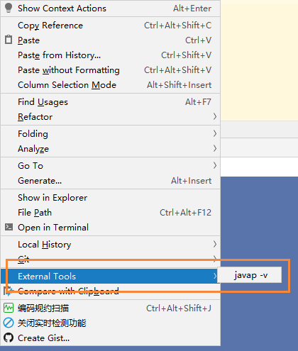
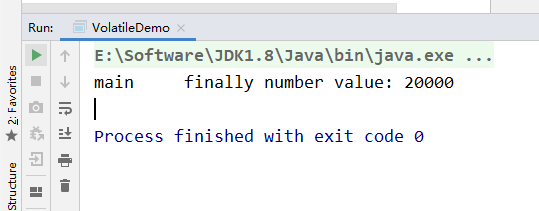
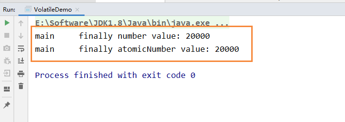

# Volatile不保证原子性

## 前言

通过前面对JMM的介绍，我们知道，各个线程对主内存中共享变量的操作都是各个线程各自拷贝到自己的工作内存进行操作后在写回到主内存中的。

这就可能存在一个线程AAA修改了共享变量X的值，但是还未写入主内存时，另外一个线程BBB又对主内存中同一共享变量X进行操作，但此时A线程工作内存中共享变量X对线程B来说是不可见，这种工作内存与主内存同步延迟现象就造成了可见性问题。

## 原子性

不可分割，完整性，也就是说某个线程正在做某个具体业务时，中间不可以被加塞或者被分割，需要具体完成，要么同时成功，要么同时失败。

数据库也经常提到事务具备原子性

## 代码测试

为了测试volatile是否保证原子性，我们创建了20个线程，然后每个线程分别循环1000次，来调用number++的方法

```
        MyData myData = new MyData();

        // 创建10个线程，线程里面进行1000次循环
        for (int i = 0; i < 20; i++) {
            new Thread(() -> {
                // 里面
                for (int j = 0; j < 1000; j++) {
                    myData.addPlusPlus();
                }
            }, String.valueOf(i)).start();
        }
```

最后通过 Thread.activeCount()，来感知20个线程是否执行完毕，这里判断线程数是否大于2，为什么是2？因为默认是有两个线程的，一个main线程，一个gc线程

```
// 需要等待上面20个线程都计算完成后，在用main线程取得最终的结果值
while(Thread.activeCount() > 2) {
    // yield表示不执行
    Thread.yield();
}
```

然后在线程执行完毕后，我们在查看number的值，假设volatile保证原子性的话，那么最后输出的值应该是

20 * 1000 = 20000,

完整代码如下所示：

```

/**
 * Volatile Java虚拟机提供的轻量级同步机制
 *
 * 可见性（及时通知）
 * 不保证原子性
 * 禁止指令重排
 *
 * @author: 陌溪
 * @create: 2020-03-09-15:58
 */

import java.util.concurrent.TimeUnit;

/**
 * 假设是主物理内存
 */
class MyData {
    /**
     * volatile 修饰的关键字，是为了增加 主线程和线程之间的可见性，只要有一个线程修改了内存中的值，其它线程也能马上感知
     */
    volatile int number = 0;

    public void addTo60() {
        this.number = 60;
    }

    /**
     * 注意，此时number 前面是加了volatile修饰
     */
    public void addPlusPlus() {
        number ++;
    }
}

/**
 * 验证volatile的可见性
 * 1、 假设int number = 0， number变量之前没有添加volatile关键字修饰
 * 2、添加了volatile，可以解决可见性问题
 *
 * 验证volatile不保证原子性
 * 1、原子性指的是什么意思？
 */
public class VolatileDemo {

    public static void main(String args []) {

        MyData myData = new MyData();

        // 创建10个线程，线程里面进行1000次循环
        for (int i = 0; i < 20; i++) {
            new Thread(() -> {
                // 里面
                for (int j = 0; j < 1000; j++) {
                    myData.addPlusPlus();
                }
            }, String.valueOf(i)).start();
        }

        // 需要等待上面20个线程都计算完成后，在用main线程取得最终的结果值
        // 这里判断线程数是否大于2，为什么是2？因为默认是有两个线程的，一个main线程，一个gc线程
        while(Thread.activeCount() > 2) {
            // yield表示不执行
            Thread.yield();
        }

        // 查看最终的值
        // 假设volatile保证原子性，那么输出的值应该为：  20 * 1000 = 20000
        System.out.println(Thread.currentThread().getName() + "\t finally number value: " + myData.number);

    }
}
```

最终结果我们会发现，number输出的值并没有20000，而且是每次运行的结果都不一致的，这说明了volatile修饰的变量不保证原子性

第一次：



第二次：



第三次：



## 为什么出现数值丢失


各自线程在写入主内存的时候，出现了数据的丢失，而引起的数值缺失的问题

下面我们将一个简单的number++操作，转换为字节码文件一探究竟

```
public class T1 {
    volatile int n = 0;
    public void add() {
        n++;
    }
}
```

转换后的字节码文件

```
public class com.moxi.interview.study.thread.T1 {
  volatile int n;

  public com.moxi.interview.study.thread.T1();
    Code:
       0: aload_0
       1: invokespecial #1                  // Method java/lang/Object."<init>":()V
       4: aload_0
       5: iconst_0
       6: putfield      #2                  // Field n:I
       9: return

  public void add();
    Code:
       0: aload_0
       1: dup
       2: getfield      #2                  // Field n:I
       5: iconst_1
       6: iadd
       7: putfield      #2                  // Field n:I
      10: return
}
```

这里查看字节码的操作，是用到了IDEA的javap命令

我们首先，使用IDEA提供的External Tools，来扩展javap命令



完成上述操作后，我们在需要查看字节码的文件下，右键选择 External Tools即可



如果出现了找不到指定类，那是因为我们创建的是spring boot的maven项目，我们之前需要执行mvn package命令，进行打包操作，将其编译成class文件

移动到底部，有一份字节码指令对照表，方便我们进行阅读

下面我们就针对 add() 这个方法的字节码文件进行分析

```
  public void add();
    Code:
       0: aload_0
       1: dup
       2: getfield      #2    // Field n:I
       5: iconst_1
       6: iadd
       7: putfield      #2    // Field n:I
      10: return
```

我们能够发现 n++这条命令，被拆分成了3个指令

- 执行`getfield` 从主内存拿到原始n
- 执行`iadd` 进行加1操作
- 执行`putfileld` 把累加后的值写回主内存 

假设我们没有加 `synchronized`那么第一步就可能存在着，三个线程同时通过getfield命令，拿到主存中的 n值，然后三个线程，各自在自己的工作内存中进行加1操作，但他们并发进行  `iadd` 命令的时候，因为只能一个进行写，所以其它操作会被挂起，假设1线程，先进行了写操作，在写完后，volatile的可见性，应该需要告诉其它两个线程，主内存的值已经被修改了，但是因为太快了，其它两个线程，陆续执行 `iadd`命令，进行写入操作，这就造成了其他线程没有接受到主内存n的改变，从而覆盖了原来的值，出现写丢失，这样也就让最终的结果少于20000

## 如何解决

因此这也说明，在多线程环境下 number ++ 在多线程环境下是非线程安全的，解决的方法有哪些呢？

- 在方法上加入 synchronized

```
    public synchronized void addPlusPlus() {
        number ++;
    }
```

运行结果：



我们能够发现引入synchronized关键字后，保证了该方法每次只能够一个线程进行访问和操作，最终输出的结果也就为20000

## 其它解决方法

上面的方法引入synchronized，虽然能够保证原子性，但是为了解决number++，而引入重量级的同步机制，有种 杀鸡焉用牛刀

除了引用synchronized关键字外，还可以使用JUC下面的原子包装类，即刚刚的int类型的number，可以使用AtomicInteger来代替

```
    /**
     *  创建一个原子Integer包装类，默认为0
      */
    AtomicInteger atomicInteger = new AtomicInteger();

    public void addAtomic() {
        // 相当于 atomicInter ++
        atomicInteger.getAndIncrement();
    }
```

然后同理，继续刚刚的操作

```
        // 创建10个线程，线程里面进行1000次循环
        for (int i = 0; i < 20; i++) {
            new Thread(() -> {
                // 里面
                for (int j = 0; j < 1000; j++) {
                    myData.addPlusPlus();
                    myData.addAtomic();
                }
            }, String.valueOf(i)).start();
        }
```

最后输出

```
        // 假设volatile保证原子性，那么输出的值应该为：  20 * 1000 = 20000
        System.out.println(Thread.currentThread().getName() + "\t finally number value: " + myData.number);
        System.out.println(Thread.currentThread().getName() + "\t finally atomicNumber value: " + myData.atomicInteger);
```

下面的结果，一个是引入synchronized，一个是使用了原子包装类AtomicInteger




## 字节码指令表

为了方便阅读JVM字节码文件，我从网上找了一份字节码指令表

引用：https://segmentfault.com/a/1190000008722128

| 字节码 | 助记符          | 指令含义                                                     |
| ------ | --------------- | ------------------------------------------------------------ |
| 0x00   | nop             | None                                                         |
| 0x01   | aconst_null     | 将null推送至栈顶                                             |
| 0x02   | iconst_m1       | 将int型-1推送至栈顶                                          |
| 0x03   | iconst_0        | 将int型0推送至栈顶                                           |
| 0x04   | iconst_1        | 将int型1推送至栈顶                                           |
| 0x05   | iconst_2        | 将int型2推送至栈顶                                           |
| 0x06   | iconst_3        | 将int型3推送至栈顶                                           |
| 0x07   | iconst_4        | 将int型4推送至栈顶                                           |
| 0x08   | iconst_5        | 将int型5推送至栈顶                                           |
| 0x09   | lconst_0        | 将long型0推送至栈顶                                          |
| 0x0a   | lconst_1        | 将long型1推送至栈顶                                          |
| 0x0b   | fconst_0        | 将float型0推送至栈顶                                         |
| 0x0c   | fconst_1        | 将float型1推送至栈顶                                         |
| 0x0d   | fconst_2        | 将float型2推送至栈顶                                         |
| 0x0e   | dconst_0        | 将double型0推送至栈顶                                        |
| 0x0f   | dconst_1        | 将double型1推送至栈顶                                        |
| 0x10   | bipush          | 将单字节的常量值(-128~127)推送至栈顶                         |
| 0x11   | sipush          | 将一个短整型常量(-32768~32767)推送至栈顶                     |
| 0x12   | ldc             | 将int,float或String型常量值从常量池中推送至栈顶              |
| 0x13   | ldc_w           | 将int,float或String型常量值从常量池中推送至栈顶(宽索引)      |
| 0x14   | ldc2_w          | 将long或double型常量值从常量池中推送至栈顶(宽索引)           |
| 0x15   | iload           | 将指定的int型本地变量推送至栈顶                              |
| 0x16   | lload           | 将指定的long型本地变量推送至栈顶                             |
| 0x17   | fload           | 将指定的float型本地变量推送至栈顶                            |
| 0x18   | dload           | 将指定的double型本地变量推送至栈顶                           |
| 0x19   | aload           | 将指定的引用类型本地变量推送至栈顶                           |
| 0x1a   | iload_0         | 将第一个int型本地变量推送至栈顶                              |
| 0x1b   | iload_1         | 将第二个int型本地变量推送至栈顶                              |
| 0x1c   | iload_2         | 将第三个int型本地变量推送至栈顶                              |
| 0x1d   | iload_3         | 将第四个int型本地变量推送至栈顶                              |
| 0x1e   | lload_0         | 将第一个long型本地变量推送至栈顶                             |
| 0x1f   | lload_1         | 将第二个long型本地变量推送至栈顶                             |
| 0x20   | lload_2         | 将第三个long型本地变量推送至栈顶                             |
| 0x21   | lload_3         | 将第四个long型本地变量推送至栈顶                             |
| 0x22   | fload_0         | 将第一个float型本地变量推送至栈顶                            |
| 0x23   | fload_1         | 将第二个float型本地变量推送至栈顶                            |
| 0x24   | fload_2         | 将第三个float型本地变量推送至栈顶                            |
| 0x25   | fload_3         | 将第四个float型本地变量推送至栈顶                            |
| 0x26   | dload_0         | 将第一个double型本地变量推送至栈顶                           |
| 0x27   | dload_1         | 将第二个double型本地变量推送至栈顶                           |
| 0x28   | dload_2         | 将第三个double型本地变量推送至栈顶                           |
| 0x29   | dload_3         | 将第四个double型本地变量推送至栈顶                           |
| 0x2a   | aload_0         | 将第一个引用类型本地变量推送至栈顶                           |
| 0x2b   | aload_1         | 将第二个引用类型本地变量推送至栈顶                           |
| 0x2c   | aload_2         | 将第三个引用类型本地变量推送至栈顶                           |
| 0x2d   | aload_3         | 将第四个引用类型本地变量推送至栈顶                           |
| 0x2e   | iaload          | 将int型数组指定索引的值推送至栈顶                            |
| 0x2f   | laload          | 将long型数组指定索引的值推送至栈顶                           |
| 0x30   | faload          | 将float型数组指定索引的值推送至栈顶                          |
| 0x31   | daload          | 将double型数组指定索引的值推送至栈顶                         |
| 0x32   | aaload          | 将引用类型数组指定索引的值推送至栈顶                         |
| 0x33   | baload          | 将boolean或byte型数组指定索引的值推送至栈顶                  |
| 0x34   | caload          | 将char型数组指定索引的值推送至栈顶                           |
| 0x35   | saload          | 将short型数组指定索引的值推送至栈顶                          |
| 0x36   | istore          | 将栈顶int型数值存入指定本地变量                              |
| 0x37   | lstore          | 将栈顶long型数值存入指定本地变量                             |
| 0x38   | fstore          | 将栈顶float型数值存入指定本地变量                            |
| 0x39   | dstore          | 将栈顶double型数值存入指定本地变量                           |
| 0x3a   | astore          | 将栈顶引用类型数值存入指定本地变量                           |
| 0x3b   | istore_0        | 将栈顶int型数值存入第一个本地变量                            |
| 0x3c   | istore_1        | 将栈顶int型数值存入第二个本地变量                            |
| 0x3d   | istore_2        | 将栈顶int型数值存入第三个本地变量                            |
| 0x3e   | istore_3        | 将栈顶int型数值存入第四个本地变量                            |
| 0x3f   | lstore_0        | 将栈顶long型数值存入第一个本地变量                           |
| 0x40   | lstore_1        | 将栈顶long型数值存入第二个本地变量                           |
| 0x41   | lstore_2        | 将栈顶long型数值存入第三个本地变量                           |
| 0x42   | lstore_3        | 将栈顶long型数值存入第四个本地变量                           |
| 0x43   | fstore_0        | 将栈顶float型数值存入第一个本地变量                          |
| 0x44   | fstore_1        | 将栈顶float型数值存入第二个本地变量                          |
| 0x45   | fstore_2        | 将栈顶float型数值存入第三个本地变量                          |
| 0x46   | fstore_3        | 将栈顶float型数值存入第四个本地变量                          |
| 0x47   | dstore_0        | 将栈顶double型数值存入第一个本地变量                         |
| 0x48   | dstore_1        | 将栈顶double型数值存入第二个本地变量                         |
| 0x49   | dstore_2        | 将栈顶double型数值存入第三个本地变量                         |
| 0x4a   | dstore_3        | 将栈顶double型数值存入第四个本地变量                         |
| 0x4b   | astore_0        | 将栈顶引用型数值存入第一个本地变量                           |
| 0x4c   | astore_1        | 将栈顶引用型数值存入第二个本地变量                           |
| 0x4d   | astore_2        | 将栈顶引用型数值存入第三个本地变量                           |
| 0x4e   | astore_3        | 将栈顶引用型数值存入第四个本地变量                           |
| 0x4f   | iastore         | 将栈顶int型数值存入指定数组的指定索引位置                    |
| 0x50   | lastore         | 将栈顶long型数值存入指定数组的指定索引位置                   |
| 0x51   | fastore         | 将栈顶float型数值存入指定数组的指定索引位置                  |
| 0x52   | dastore         | 将栈顶double型数值存入指定数组的指定索引位置                 |
| 0x53   | aastore         | 将栈顶引用型数值存入指定数组的指定索引位置                   |
| 0x54   | bastore         | 将栈顶boolean或byte型数值存入指定数组的指定索引位置          |
| 0x55   | castore         | 将栈顶char型数值存入指定数组的指定索引位置                   |
| 0x56   | sastore         | 将栈顶short型数值存入指定数组的指定索引位置                  |
| 0x57   | pop             | 将栈顶数值弹出(数值不能是long或double类型的)                 |
| 0x58   | pop2            | 将栈顶的一个(对于非long或double类型)或两个数值(对于非long或double的其他类型)弹出 |
| 0x59   | dup             | 复制栈顶数值并将复制值压入栈顶                               |
| 0x5a   | dup_x1          | 复制栈顶数值并将两个复制值压入栈顶                           |
| 0x5b   | dup_x2          | 复制栈顶数值并将三个(或两个)复制值压入栈顶                   |
| 0x5c   | dup2            | 复制栈顶一个(对于long或double类型)或两个(对于非long或double的其他类型)数值并将复制值压入栈顶 |
| 0x5d   | dup2_x1         | dup_x1指令的双倍版本                                         |
| 0x5e   | dup2_x2         | dup_x2指令的双倍版本                                         |
| 0x5f   | swap            | 将栈顶最顶端的两个数值互换(数值不能是long或double类型)       |
| 0x60   | iadd            | 将栈顶两int型数值相加并将结果压入栈顶                        |
| 0x61   | ladd            | 将栈顶两long型数值相加并将结果压入栈顶                       |
| 0x62   | fadd            | 将栈顶两float型数值相加并将结果压入栈顶                      |
| 0x63   | dadd            | 将栈顶两double型数值相加并将结果压入栈顶                     |
| 0x64   | isub            | 将栈顶两int型数值相减并将结果压入栈顶                        |
| 0x65   | lsub            | 将栈顶两long型数值相减并将结果压入栈顶                       |
| 0x66   | fsub            | 将栈顶两float型数值相减并将结果压入栈顶                      |
| 0x67   | dsub            | 将栈顶两double型数值相减并将结果压入栈顶                     |
| 0x68   | imul            | 将栈顶两int型数值相乘并将结果压入栈顶                        |
| 0x69   | lmul            | 将栈顶两long型数值相乘并将结果压入栈顶                       |
| 0x6a   | fmul            | 将栈顶两float型数值相乘并将结果压入栈顶                      |
| 0x6b   | dmul            | 将栈顶两double型数值相乘并将结果压入栈顶                     |
| 0x6c   | idiv            | 将栈顶两int型数值相除并将结果压入栈顶                        |
| 0x6d   | ldiv            | 将栈顶两long型数值相除并将结果压入栈顶                       |
| 0x6e   | fdiv            | 将栈顶两float型数值相除并将结果压入栈顶                      |
| 0x6f   | ddiv            | 将栈顶两double型数值相除并将结果压入栈顶                     |
| 0x70   | irem            | 将栈顶两int型数值作取模运算并将结果压入栈顶                  |
| 0x71   | lrem            | 将栈顶两long型数值作取模运算并将结果压入栈顶                 |
| 0x72   | frem            | 将栈顶两float型数值作取模运算并将结果压入栈顶                |
| 0x73   | drem            | 将栈顶两double型数值作取模运算并将结果压入栈顶               |
| 0x74   | ineg            | 将栈顶int型数值取负并将结果压入栈顶                          |
| 0x75   | lneg            | 将栈顶long型数值取负并将结果压入栈顶                         |
| 0x76   | fneg            | 将栈顶float型数值取负并将结果压入栈顶                        |
| 0x77   | dneg            | 将栈顶double型数值取负并将结果压入栈顶                       |
| 0x78   | ishl            | 将int型数值左移指定位数并将结果压入栈顶                      |
| 0x79   | lshl            | 将long型数值左移指定位数并将结果压入栈顶                     |
| 0x7a   | ishr            | 将int型数值右(带符号)移指定位数并将结果压入栈顶              |
| 0x7b   | lshr            | 将long型数值右(带符号)移指定位数并将结果压入栈顶             |
| 0x7c   | iushr           | 将int型数值右(无符号)移指定位数并将结果压入栈顶              |
| 0x7d   | lushr           | 将long型数值右(无符号)移指定位数并将结果压入栈顶             |
| 0x7e   | iand            | 将栈顶两int型数值"按位与"并将结果压入栈顶                    |
| 0x7f   | land            | 将栈顶两long型数值"按位与"并将结果压入栈顶                   |
| 0x80   | ior             | 将栈顶两int型数值"按位或"并将结果压入栈顶                    |
| 0x81   | lor             | 将栈顶两long型数值"按位或"并将结果压入栈顶                   |
| 0x82   | ixor            | 将栈顶两int型数值"按位异或"并将结果压入栈顶                  |
| 0x83   | lxor            | 将栈顶两long型数值"按位异或"并将结果压入栈顶                 |
| 0x84   | iinc            | 将指定int型变量增加指定值(如i++, i--, i+=2等)                |
| 0x85   | i2l             | 将栈顶int型数值强制转换为long型数值并将结果压入栈顶          |
| 0x86   | i2f             | 将栈顶int型数值强制转换为float型数值并将结果压入栈顶         |
| 0x87   | i2d             | 将栈顶int型数值强制转换为double型数值并将结果压入栈顶        |
| 0x88   | l2i             | 将栈顶long型数值强制转换为int型数值并将结果压入栈顶          |
| 0x89   | l2f             | 将栈顶long型数值强制转换为float型数值并将结果压入栈顶        |
| 0x8a   | l2d             | 将栈顶long型数值强制转换为double型数值并将结果压入栈顶       |
| 0x8b   | f2i             | 将栈顶float型数值强制转换为int型数值并将结果压入栈顶         |
| 0x8c   | f2l             | 将栈顶float型数值强制转换为long型数值并将结果压入栈顶        |
| 0x8d   | f2d             | 将栈顶float型数值强制转换为double型数值并将结果压入栈顶      |
| 0x8e   | d2i             | 将栈顶double型数值强制转换为int型数值并将结果压入栈顶        |
| 0x8f   | d2l             | 将栈顶double型数值强制转换为long型数值并将结果压入栈顶       |
| 0x90   | d2f             | 将栈顶double型数值强制转换为float型数值并将结果压入栈顶      |
| 0x91   | i2b             | 将栈顶int型数值强制转换为byte型数值并将结果压入栈顶          |
| 0x92   | i2c             | 将栈顶int型数值强制转换为char型数值并将结果压入栈顶          |
| 0x93   | i2s             | 将栈顶int型数值强制转换为short型数值并将结果压入栈顶         |
| 0x94   | lcmp            | 比较栈顶两long型数值大小, 并将结果(1, 0或-1)压入栈顶         |
| 0x95   | fcmpl           | 比较栈顶两float型数值大小, 并将结果(1, 0或-1)压入栈顶; 当其中一个数值为`NaN`时, 将-1压入栈顶 |
| 0x96   | fcmpg           | 比较栈顶两float型数值大小, 并将结果(1, 0或-1)压入栈顶; 当其中一个数值为`NaN`时, 将1压入栈顶 |
| 0x97   | dcmpl           | 比较栈顶两double型数值大小, 并将结果(1, 0或-1)压入栈顶; 当其中一个数值为`NaN`时, 将-1压入栈顶 |
| 0x98   | dcmpg           | 比较栈顶两double型数值大小, 并将结果(1, 0或-1)压入栈顶; 当其中一个数值为`NaN`时, 将1压入栈顶 |
| 0x99   | ifeq            | 当栈顶int型数值等于0时跳转                                   |
| 0x9a   | ifne            | 当栈顶int型数值不等于0时跳转                                 |
| 0x9b   | iflt            | 当栈顶int型数值小于0时跳转                                   |
| 0x9c   | ifge            | 当栈顶int型数值大于等于0时跳转                               |
| 0x9d   | ifgt            | 当栈顶int型数值大于0时跳转                                   |
| 0x9e   | ifle            | 当栈顶int型数值小于等于0时跳转                               |
| 0x9f   | if_icmpeq       | 比较栈顶两int型数值大小, 当结果等于0时跳转                   |
| 0xa0   | if_icmpne       | 比较栈顶两int型数值大小, 当结果不等于0时跳转                 |
| 0xa1   | if_icmplt       | 比较栈顶两int型数值大小, 当结果小于0时跳转                   |
| 0xa2   | if_icmpge       | 比较栈顶两int型数值大小, 当结果大于等于0时跳转               |
| 0xa3   | if_icmpgt       | 比较栈顶两int型数值大小, 当结果大于0时跳转                   |
| 0xa4   | if_icmple       | 比较栈顶两int型数值大小, 当结果小于等于0时跳转               |
| 0xa5   | if_acmpeq       | 比较栈顶两引用型数值, 当结果相等时跳转                       |
| 0xa6   | if_acmpne       | 比较栈顶两引用型数值, 当结果不相等时跳转                     |
| 0xa7   | goto            | 无条件跳转                                                   |
| 0xa8   | jsr             | 跳转至指定的16位offset位置, 并将jsr的下一条指令地址压入栈顶  |
| 0xa9   | ret             | 返回至本地变量指定的index的指令位置(一般与jsr或jsr_w联合使用) |
| 0xaa   | tableswitch     | 用于switch条件跳转, case值连续(可变长度指令)                 |
| 0xab   | lookupswitch    | 用于switch条件跳转, case值不连续(可变长度指令)               |
| 0xac   | ireturn         | 从当前方法返回int                                            |
| 0xad   | lreturn         | 从当前方法返回long                                           |
| 0xae   | freturn         | 从当前方法返回float                                          |
| 0xaf   | dreturn         | 从当前方法返回double                                         |
| 0xb0   | areturn         | 从当前方法返回对象引用                                       |
| 0xb1   | return          | 从当前方法返回void                                           |
| 0xb2   | getstatic       | 获取指定类的静态域, 并将其压入栈顶                           |
| 0xb3   | putstatic       | 为指定类的静态域赋值                                         |
| 0xb4   | getfield        | 获取指定类的实例域, 并将其压入栈顶                           |
| 0xb5   | putfield        | 为指定类的实例域赋值                                         |
| 0xb6   | invokevirtual   | 调用实例方法                                                 |
| 0xb7   | invokespecial   | 调用超类构建方法, 实例初始化方法, 私有方法                   |
| 0xb8   | invokestatic    | 调用静态方法                                                 |
| 0xb9   | invokeinterface | 调用接口方法                                                 |
| 0xba   | invokedynamic   | 调用动态方法                                                 |
| 0xbb   | new             | 创建一个对象, 并将其引用引用值压入栈顶                       |
| 0xbc   | newarray        | 创建一个指定的原始类型(如int, float, char等)的数组, 并将其引用值压入栈顶 |
| 0xbd   | anewarray       | 创建一个引用型(如类, 接口, 数组)的数组, 并将其引用值压入栈顶 |
| 0xbe   | arraylength     | 获取数组的长度值并压入栈顶                                   |
| 0xbf   | athrow          | 将栈顶的异常抛出                                             |
| 0xc0   | checkcast       | 检验类型转换, 检验未通过将抛出 ClassCastException            |
| 0xc1   | instanceof      | 检验对象是否是指定类的实际, 如果是将1压入栈顶, 否则将0压入栈顶 |
| 0xc2   | monitorenter    | 获得对象的锁, 用于同步方法或同步块                           |
| 0xc3   | monitorexit     | 释放对象的锁, 用于同步方法或同步块                           |
| 0xc4   | wide            | 扩展本地变量的宽度                                           |
| 0xc5   | multianewarray  | 创建指定类型和指定维度的多维数组(执行该指令时, 操作栈中必须包含各维度的长度值), 并将其引用压入栈顶 |
| 0xc6   | ifnull          | 为null时跳转                                                 |
| 0xc7   | ifnonnull       | 不为null时跳转                                               |
| 0xc8   | goto_w          | 无条件跳转(宽索引)                                           |
| 0xc9   | jsr_w           | 跳转至指定的32位offset位置, 并将jsr_w的下一条指令地址压入栈顶 |