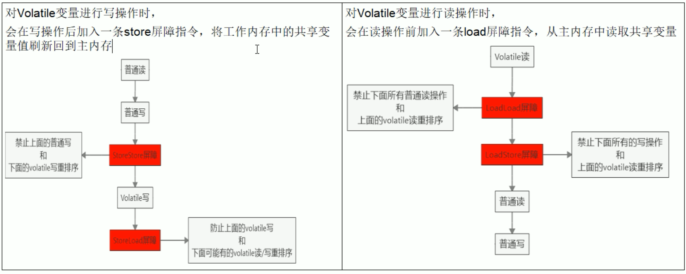

# Volatile禁止指令重排

计算机在执行程序时，为了提高性能，编译器和处理器常常会对指令重排，一般分为以下三种：

```
源代码 -> 编译器优化的重排 -> 指令并行的重排 -> 内存系统的重排 -> 最终执行指令
```

单线程环境里面确保最终执行结果和代码顺序的结果一致

处理器在进行重排序时，必须要考虑指令之间的`数据依赖性`

多线程环境中线程交替执行，由于编译器优化重排的存在，两个线程中使用的变量能否保证一致性是无法确定的，结果无法预测。

## 指令重排 - example 1

```
public void mySort() {
	int x = 11;
	int y = 12;
	x = x + 5;
	y = x * x;
}
```

按照正常单线程环境，执行顺序是 1 2 3 4

但是在多线程环境下，可能出现以下的顺序：

- 2 1 3 4
- 1 3 2 4 

上述的过程就可以当做是指令的重排，即内部执行顺序，和我们的代码顺序不一样

但是指令重排也是有限制的，即不会出现下面的顺序

- 4 3 2 1

因为处理器在进行重排时候，必须考虑到指令之间的数据依赖性

因为步骤 4：需要依赖于 y的申明，以及x的申明，故因为存在数据依赖，无法首先执行

### 例子

int a,b,x,y = 0

| 线程1         | 线程2  |
| ------------- | ------ |
| x = a;        | y = b; |
| b = 1;        | a = 2; |
|               |        |
| x = 0;  y = 0 |        |

因为上面的代码，不存在数据的依赖性，因此编译器可能对数据进行重排

| 线程1         | 线程2  |
| ------------- | ------ |
| b = 1;        | a = 2; |
| x = a;        | y = b; |
|               |        |
| x = 2;  y = 1 |        |

这样造成的结果，和最开始的就不一致了，这就是导致重排后，结果和最开始的不一样，因此为了防止这种结果出现，volatile就规定禁止指令重排，为了保证数据的一致性

## 指令重排 - example 2

比如下面这段代码

```
/**
 * ResortSeqDemo
 *
 * @author: 陌溪
 * @create: 2020-03-10-16:08
 */
public class ResortSeqDemo {
    int a= 0;
    boolean flag = false;

    public void method01() {
        a = 1;
        flag = true;
    }

    public void method02() {
        if(flag) {
            a = a + 5;
            System.out.println("reValue:" + a);
        }
    }
}
```

我们按照正常的顺序，分别调用method01()  和 method02() 那么，最终输出就是 a = 6

但是如果在多线程环境下，因为方法1 和 方法2，他们之间不能存在数据依赖的问题，因此原先的顺序可能是

```
a = 1;
flag = true;

a = a + 5;
System.out.println("reValue:" + a);
        
```

但是在经过编译器，指令，或者内存的重排后，可能会出现这样的情况

```
flag = true;

a = a + 5;
System.out.println("reValue:" + a);

a = 1;
```

也就是先执行 flag = true后，另外一个线程马上调用方法2，满足 flag的判断，最终让a + 5，结果为5，这样同样出现了数据不一致的问题

为什么会出现这个结果：多线程环境中线程交替执行，由于编译器优化重排的存在，两个线程中使用的变量能否保证一致性是无法确定的，结果无法预测。

这样就需要通过volatile来修饰，来保证线程安全性

## Volatile针对指令重排做了啥

Volatile实现禁止指令重排优化，从而避免了多线程环境下程序出现乱序执行的现象

首先了解一个概念，内存屏障（Memory Barrier）又称内存栅栏，是一个CPU指令，它的作用有两个：

- 保证特定操作的顺序
- 保证某些变量的内存可见性（利用该特性实现volatile的内存可见性）

由于编译器和处理器都能执行指令重排的优化，如果在指令间插入一条Memory Barrier则会告诉编译器和CPU，不管什么指令都不能和这条Memory Barrier指令重排序，也就是说 `通过插入内存屏障禁止在内存屏障前后的指令执行重排序优化`。 内存屏障另外一个作用是刷新出各种CPU的缓存数，因此任何CPU上的线程都能读取到这些数据的最新版本。



也就是过在Volatile的写 和 读的时候，加入屏障，防止出现指令重排的

## 线程安全获得保证

工作内存与主内存同步延迟现象导致的可见性问题

- 可通过synchronized或volatile关键字解决，他们都可以使一个线程修改后的变量立即对其它线程可见

对于指令重排导致的可见性问题和有序性问题

- 可以使用volatile关键字解决，因为volatile关键字的另一个作用就是禁止重排序优化

## 总线嗅探

