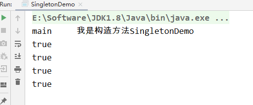
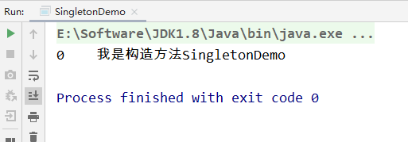
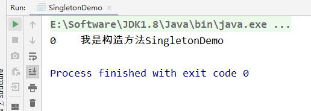

# Volatile的应用

## 单例模式DCL代码

首先回顾一下，单线程下的单例模式代码

```
/**
 * SingletonDemo（单例模式）
 *
 * @author: 陌溪
 * @create: 2020-03-10-16:40
 */
public class SingletonDemo {

    private static SingletonDemo instance = null;

    private SingletonDemo () {
        System.out.println(Thread.currentThread().getName() + "\t 我是构造方法SingletonDemo");
    }

    public static SingletonDemo getInstance() {
        if(instance == null) {
            instance = new SingletonDemo();
        }
        return instance;
    }

    public static void main(String[] args) {
        // 这里的 == 是比较内存地址
        System.out.println(SingletonDemo.getInstance() == SingletonDemo.getInstance());
        System.out.println(SingletonDemo.getInstance() == SingletonDemo.getInstance());
        System.out.println(SingletonDemo.getInstance() == SingletonDemo.getInstance());
        System.out.println(SingletonDemo.getInstance() == SingletonDemo.getInstance());
    }
}
```

最后输出的结果




但是在多线程的环境下，我们的单例模式是否还是同一个对象了

```
/**
 * SingletonDemo（单例模式）
 *
 * @author: 陌溪
 * @create: 2020-03-10-16:40
 */
public class SingletonDemo {

    private static SingletonDemo instance = null;

    private SingletonDemo () {
        System.out.println(Thread.currentThread().getName() + "\t 我是构造方法SingletonDemo");
    }

    public static SingletonDemo getInstance() {
        if(instance == null) {
            instance = new SingletonDemo();
        }
        return instance;
    }

    public static void main(String[] args) {
        for (int i = 0; i < 10; i++) {
            new Thread(() -> {
                SingletonDemo.getInstance();
            }, String.valueOf(i)).start();
        }
    }
}
```

从下面的结果我们可以看出，我们通过SingletonDemo.getInstance() 获取到的对象，并不是同一个，而是被下面几个线程都进行了创建，那么在多线程环境下，单例模式如何保证呢？


### 解决方法1

引入synchronized关键字

```
    public synchronized static SingletonDemo getInstance() {
        if(instance == null) {
            instance = new SingletonDemo();
        }
        return instance;
    }
```

输出结果



我们能够发现，通过引入Synchronized关键字，能够解决高并发环境下的单例模式问题

但是synchronized属于重量级的同步机制，它只允许一个线程同时访问获取实例的方法，但是为了保证数据一致性，而减低了并发性，因此采用的比较少

### 解决方法2

通过引入DCL   Double Check Lock   双端检锁机制

就是在进来和出去的时候，进行检测

```
    public static SingletonDemo getInstance() {
        if(instance == null) {
            // 同步代码段的时候，进行检测
            synchronized (SingletonDemo.class) {
                if(instance == null) {
                    instance = new SingletonDemo();
                }
            }
        }
        return instance;
    }
```

最后输出的结果为：



从输出结果来看，确实能够保证单例模式的正确性，但是上面的方法还是存在问题的

DCL（双端检锁）机制不一定是线程安全的，原因是有指令重排的存在，加入volatile可以禁止指令重排

原因是在某一个线程执行到第一次检测的时候，读取到 instance 不为null，instance的引用对象可能没有完成实例化。因为 instance = new SingletonDemo()；可以分为以下三步进行完成：

- memory = allocate();   // 1、分配对象内存空间
- instance(memory);   // 2、初始化对象
- instance = memory;  // 3、设置instance指向刚刚分配的内存地址，此时instance != null

但是我们通过上面的三个步骤，能够发现，步骤2 和 步骤3之间不存在 数据依赖关系，而且无论重排前 还是重排后，程序的执行结果在单线程中并没有改变，因此这种重排优化是允许的。

- memory = allocate();   // 1、分配对象内存空间
- instance = memory;  // 3、设置instance指向刚刚分配的内存地址，此时instance != null，但是对象还没有初始化完成
- instance(memory);   // 2、初始化对象

这样就会造成什么问题呢？

也就是当我们执行到重排后的步骤2，试图获取instance的时候，会得到null，因为对象的初始化还没有完成，而是在重排后的步骤3才完成，因此执行单例模式的代码时候，就会重新在创建一个instance实例

`指令重排只会保证串行语义的执行一致性（单线程），但并不会关系多线程间的语义一致性`

所以当一条线程访问instance不为null时，由于instance实例未必已初始化完成，这就造成了线程安全的问题

所以需要引入volatile，来保证出现指令重排的问题，从而保证单例模式的线程安全性

```
private static volatile SingletonDemo instance = null;
```

### 最终代码

```
/**
 * SingletonDemo（单例模式）
 *
 * @author: 陌溪
 * @create: 2020-03-10-16:40
 */
public class SingletonDemo {

    private static volatile SingletonDemo instance = null;

    private SingletonDemo () {
        System.out.println(Thread.currentThread().getName() + "\t 我是构造方法SingletonDemo");
    }

    public static SingletonDemo getInstance() {
        if(instance == null) {
            // a 双重检查加锁多线程情况下会出现某个线程虽然这里已经为空，但是另外一个线程已经执行到d处
            synchronized (SingletonDemo.class) //b
            { 
           //c不加volitale关键字的话有可能会出现尚未完全初始化就获取到的情况。原因是内存模型允许无序写入
                if(instance == null) { 
                	// d 此时才开始初始化
                    instance = new SingletonDemo();
                }
            }
        }
        return instance;
    }

    public static void main(String[] args) {
//        // 这里的 == 是比较内存地址
//        System.out.println(SingletonDemo.getInstance() == SingletonDemo.getInstance());
//        System.out.println(SingletonDemo.getInstance() == SingletonDemo.getInstance());
//        System.out.println(SingletonDemo.getInstance() == SingletonDemo.getInstance());
//        System.out.println(SingletonDemo.getInstance() == SingletonDemo.getInstance());

        for (int i = 0; i < 10; i++) {
            new Thread(() -> {
                SingletonDemo.getInstance();
            }, String.valueOf(i)).start();
        }
    }
}
```

