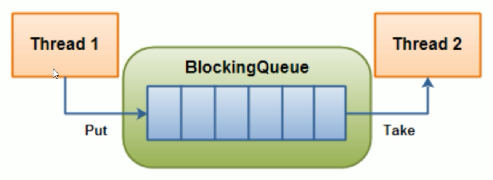
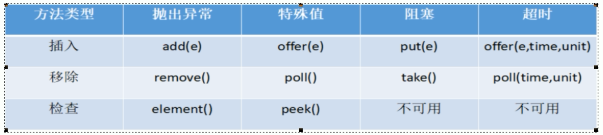

# 阻塞队列

## 概念

### 队列

队列就可以想成是一个数组，从一头进入，一头出去，排队买饭

### 阻塞队列

BlockingQueue   阻塞队列，排队拥堵，首先它是一个队列，而一个阻塞队列在数据结构中所起的作用大致如下图所示：



线程1往阻塞队列中添加元素，而线程2从阻塞队列中移除元素

- `当阻塞队列是空时，从队列中获取元素的操作将会被阻塞`
  - 当蛋糕店的柜子空的时候，无法从柜子里面获取蛋糕

- `当阻塞队列是满时，从队列中添加元素的操作将会被阻塞`
  - 当蛋糕店的柜子满的时候，无法继续向柜子里面添加蛋糕了

也就是说 试图从空的阻塞队列中获取元素的线程将会被阻塞，直到其它线程往空的队列插入新的元素

同理，试图往已经满的阻塞队列中添加新元素的线程，直到其它线程往满的队列中移除一个或多个元素，或者完全清空队列后，使队列重新变得空闲起来，并后续新增

## 为什么要用？

去海底捞吃饭，大厅满了，需要进候厅等待，但是这些等待的客户能够对商家带来利润，因此我们非常欢迎他们阻塞

在多线程领域：所谓的阻塞，在某些清空下会挂起线程（即阻塞），一旦条件满足，被挂起的线程又会自动唤醒

### 为什么需要BlockingQueue

好处是我们不需要关心什么时候需要阻塞线程，什么时候需要唤醒线程，因为这一切BlockingQueue都帮你一手包办了

在concurrent包发布以前，在多线程环境下，我们每个程序员都必须自己取控制这些细节，尤其还要兼顾效率和线程安全，而这会给我们的程序带来不小的复杂度。

## 架构

```
// 你用过List集合类

// ArrayList集合类熟悉么？

// 还用过 CopyOnWriteList  和 BlockingQueue
```

BlockingQueue阻塞队列是属于一个接口，底下有七个实现类

- ArrayBlockQueue：由数组结构组成的有界阻塞队列
- LinkedBlockingQueue：由链表结构组成的有界（但是默认大小 Integer.MAX_VALUE）的阻塞队列
  - 有界，但是界限非常大，相当于无界，可以当成无界
- PriorityBlockQueue：支持优先级排序的无界阻塞队列
- DelayQueue：使用优先级队列实现的延迟无界阻塞队列
- SynchronousQueue：不存储元素的阻塞队列，也即单个元素的队列
  - 生产一个，消费一个，不存储元素，不消费不生产
- LinkedTransferQueue：由链表结构组成的无界阻塞队列
- LinkedBlockingDeque：由链表结构组成的双向阻塞队列


这里需要掌握的是：ArrayBlockQueue、LinkedBlockingQueue、SynchronousQueue


## BlockingQueue核心方法




| 抛出异常 | 当阻塞队列满时：在往队列中add插入元素会抛出 IIIegalStateException：Queue full                      当阻塞队列空时：再往队列中remove移除元素，会抛出NoSuchException |
| -------- | ------------------------------------------------------------ |
| 特殊性   | 插入方法，成功true，失败false       移除方法：成功返回出队列元素，队列没有就返回空 |
| 一直阻塞 | 当阻塞队列满时，生产者继续往队列里put元素，队列会一直阻塞生产线程直到put数据or响应中断退出， 当阻塞队列空时，消费者线程试图从队列里take元素，队列会一直阻塞消费者线程直到队列可用。 |
| 超时退出 | 当阻塞队列满时，队里会阻塞生产者线程一定时间，超过限时后生产者线程会退出 |


### 抛出异常组

但执行add方法，向已经满的ArrayBlockingQueue中添加元素时候，会抛出异常

```
// 阻塞队列，需要填入默认值
BlockingQueue<String> blockingQueue = new ArrayBlockingQueue<>(3);

System.out.println(blockingQueue.add("a"));
System.out.println(blockingQueue.add("b"));
System.out.println(blockingQueue.add("c"));

System.out.println(blockingQueue.add("XXX"));
```

运行后：

```
true
true
true
Exception in thread "main" java.lang.IllegalStateException: Queue full
	at java.util.AbstractQueue.add(AbstractQueue.java:98)
	at java.util.concurrent.ArrayBlockingQueue.add(ArrayBlockingQueue.java:312)
	at com.moxi.interview.study.queue.BlockingQueueDemo.main(BlockingQueueDemo.java:25)
```

同时如果我们多取出元素的时候，也会抛出异常，我们假设只存储了3个值，但是取的时候，取了四次

```
// 阻塞队列，需要填入默认值
BlockingQueue<String> blockingQueue = new ArrayBlockingQueue<>(3);
System.out.println(blockingQueue.add("a"));
System.out.println(blockingQueue.add("b"));
System.out.println(blockingQueue.add("c"));

System.out.println(blockingQueue.remove());
System.out.println(blockingQueue.remove());
System.out.println(blockingQueue.remove());
System.out.println(blockingQueue.remove());
```

那么出现异常

```
true
true
true
a
b
c
Exception in thread "main" java.util.NoSuchElementException
	at java.util.AbstractQueue.remove(AbstractQueue.java:117)
	at com.moxi.interview.study.queue.BlockingQueueDemo.main(BlockingQueueDemo.java:30)
```

### 布尔类型组

我们使用 offer的方法，添加元素时候，如果阻塞队列满了后，会返回false，否者返回true

同时在取的时候，如果队列已空，那么会返回null

```
BlockingQueue blockingQueue = new ArrayBlockingQueue(3);

System.out.println(blockingQueue.offer("a"));
System.out.println(blockingQueue.offer("b"));
System.out.println(blockingQueue.offer("c"));
System.out.println(blockingQueue.offer("d"));

System.out.println(blockingQueue.poll());
System.out.println(blockingQueue.poll());
System.out.println(blockingQueue.poll());
System.out.println(blockingQueue.poll());
```

运行结果

```
true
true
true
false
a
b
c
null
```

### 阻塞队列组

我们使用 put的方法，添加元素时候，如果阻塞队列满了后，添加消息的线程，会一直阻塞，直到队列元素减少，会被清空，才会唤醒

一般在消息中间件，比如RabbitMQ中会使用到，因为需要保证消息百分百不丢失，因此只有让它阻塞

```
BlockingQueue<String> blockingQueue = new ArrayBlockingQueue<>(3);
blockingQueue.put("a");
blockingQueue.put("b");
blockingQueue.put("c");
System.out.println("================");

blockingQueue.take();
blockingQueue.take();
blockingQueue.take();
blockingQueue.take();
```

同时使用take取消息的时候，如果内容不存在的时候，也会被阻塞


### 不见不散组

offer( )  ， poll 加时间

使用offer插入的时候，需要指定时间，如果2秒还没有插入，那么就放弃插入

```
BlockingQueue<String> blockingQueue = new ArrayBlockingQueue<>(3);
System.out.println(blockingQueue.offer("a", 2L, TimeUnit.SECONDS));
System.out.println(blockingQueue.offer("b", 2L, TimeUnit.SECONDS));
System.out.println(blockingQueue.offer("c", 2L, TimeUnit.SECONDS));
System.out.println(blockingQueue.offer("d", 2L, TimeUnit.SECONDS));
```

同时取的时候也进行判断

```
System.out.println(blockingQueue.poll(2L, TimeUnit.SECONDS));
System.out.println(blockingQueue.poll(2L, TimeUnit.SECONDS));
System.out.println(blockingQueue.poll(2L, TimeUnit.SECONDS));
System.out.println(blockingQueue.poll(2L, TimeUnit.SECONDS));
```

如果2秒内取不出来，那么就返回null

## SynchronousQueue

SynchronousQueue没有容量，与其他BlockingQueue不同，SynchronousQueue是一个不存储的BlockingQueue，每一个put操作必须等待一个take操作，否者不能继续添加元素

下面我们测试SynchronousQueue添加元素的过程

首先我们创建了两个线程，一个线程用于生产，一个线程用于消费

生产的线程分别put了 A、B、C这三个字段

```
BlockingQueue<String> blockingQueue = new SynchronousQueue<>();

new Thread(() -> {
    try {       
        System.out.println(Thread.currentThread().getName() + "\t put A ");
        blockingQueue.put("A");
       
        System.out.println(Thread.currentThread().getName() + "\t put B ");
        blockingQueue.put("B");        
        
        System.out.println(Thread.currentThread().getName() + "\t put C ");
        blockingQueue.put("C");        
        
    } catch (InterruptedException e) {
        e.printStackTrace();
    }
}, "t1").start();
```

消费线程使用take，消费阻塞队列中的内容，并且每次消费前，都等待5秒

```
        new Thread(() -> {
            try {

                try {
                    TimeUnit.SECONDS.sleep(5);
                } catch (InterruptedException e) {
                    e.printStackTrace();
                }
                blockingQueue.take();
                System.out.println(Thread.currentThread().getName() + "\t take A ");

                try {
                    TimeUnit.SECONDS.sleep(5);
                } catch (InterruptedException e) {
                    e.printStackTrace();
                }
                blockingQueue.take();
                System.out.println(Thread.currentThread().getName() + "\t take B ");

                try {
                    TimeUnit.SECONDS.sleep(5);
                } catch (InterruptedException e) {
                    e.printStackTrace();
                }
                blockingQueue.take();
                System.out.println(Thread.currentThread().getName() + "\t take C ");

            } catch (InterruptedException e) {
                e.printStackTrace();
            }
        }, "t2").start();
```

最后结果输出为：

```
t1	 put A 
t2	 take A 

5秒后...

t1	 put B 
t2	 take B 

5秒后...

t1	 put C 
t2	 take C 
```

我们从最后的运行结果可以看出，每次t1线程向队列中添加阻塞队列添加元素后，t1输入线程就会等待 t2消费线程，t2消费后，t2处于挂起状态，等待t1在存入，从而周而复始，形成 一存一取的状态

## 阻塞队列的用处

### 生产者消费者模式

一个初始值为0的变量，两个线程对其交替操作，一个加1，一个减1，来5轮

关于多线程的操作，我们需要记住下面几句

- 线程 操作 资源类
- 判断 干活 通知
- 防止虚假唤醒机制

我们下面实现一个简单的生产者消费者模式，首先有资源类ShareData

```
/**
 * 资源类
 */
class ShareData {

    private int number = 0;

    private Lock lock = new ReentrantLock();

    private Condition condition = lock.newCondition();

    public void increment() throws Exception{
        // 同步代码块，加锁
        lock.lock();
        try {
            // 判断
            while(number != 0) {
                // 等待不能生产
                condition.await();
            }

            // 干活
            number++;

            System.out.println(Thread.currentThread().getName() + "\t " + number);

            // 通知 唤醒
            condition.signalAll();
        } catch (Exception e) {
            e.printStackTrace();
        } finally {
            lock.unlock();
        }
    }

    public void decrement() throws Exception{
        // 同步代码块，加锁
        lock.lock();
        try {
            // 判断
            while(number == 0) {
                // 等待不能消费
                condition.await();
            }

            // 干活
            number--;

            System.out.println(Thread.currentThread().getName() + "\t " + number);

            // 通知 唤醒
            condition.signalAll();
        } catch (Exception e) {
            e.printStackTrace();
        } finally {
            lock.unlock();
        }
    }

}
```

里面有一个number变量，同时提供了increment 和 decrement的方法，分别让number 加1和减1

但是我们在进行判断的时候，为了防止出现虚假唤醒机制，不能使用if来进行判断，而应该使用while

```
// 判断
while(number != 0) {
    // 等待不能生产
    condition.await();
}
```

不能使用 if判断

```
// 判断
if(number != 0) {
    // 等待不能生产
    condition.await();
}
```

完整代码

```
/**
 * 生产者消费者 传统版
 * 题目：一个初始值为0的变量，两个线程对其交替操作，一个加1，一个减1，来5轮
 * @author: 陌溪
 * @create: 2020-03-16-21:38
 */
/**
 * 线程 操作 资源类
 * 判断 干活 通知
 * 防止虚假唤醒机制
 */

/**
 * 资源类
 */
class ShareData {

    private int number = 0;

    private Lock lock = new ReentrantLock();

    private Condition condition = lock.newCondition();

    public void increment() throws Exception{
        // 同步代码块，加锁
        lock.lock();
        try {
            // 判断
            while(number != 0) {
                // 等待不能生产
                condition.await();
            }

            // 干活
            number++;

            System.out.println(Thread.currentThread().getName() + "\t " + number);

            // 通知 唤醒
            condition.signalAll();
        } catch (Exception e) {
            e.printStackTrace();
        } finally {
            lock.unlock();
        }
    }

    public void decrement() throws Exception{
        // 同步代码块，加锁
        lock.lock();
        try {
            // 判断
            while(number == 0) {
                // 等待不能消费
                condition.await();
            }

            // 干活
            number--;

            System.out.println(Thread.currentThread().getName() + "\t " + number);

            // 通知 唤醒
            condition.signalAll();
        } catch (Exception e) {
            e.printStackTrace();
        } finally {
            lock.unlock();
        }
    }

}
public class ProdConsumerTraditionDemo {

    public static void main(String[] args) {

        // 高内聚，低耦合    内聚指的是，一个空调，自身带有调节温度高低的方法

        ShareData shareData = new ShareData();

        // t1线程，生产
        new Thread(() -> {
            for (int i = 0; i < 5; i++) {
                try {
                    shareData.increment();
                } catch (Exception e) {
                    e.printStackTrace();
                }
            }
        }, "t1").start();

        // t2线程，消费
        new Thread(() -> {
            for (int i = 0; i < 5; i++) {
                try {
                    shareData.decrement();
                } catch (Exception e) {
                    e.printStackTrace();
                }
            }
        }, "t2").start();
    }
}
```

最后运行成功后，我们一个进行生产，一个进行消费

```
t1	 1
t2	 0
t1	 1
t2	 0
t1	 1
t2	 0
t1	 1
t2	 0
t1	 1
t2	 0
```

## 生成者和消费者3.0

在concurrent包发布以前，在多线程环境下，我们每个程序员都必须自己去控制这些细节，尤其还要兼顾效率和线程安全，则这会给我们的程序带来不小的时间复杂度

现在我们使用新版的阻塞队列版生产者和消费者，使用：volatile、CAS、atomicInteger、BlockQueue、线程交互、原子引用

```
/**
 * 生产者消费者  阻塞队列版
 * 使用：volatile、CAS、atomicInteger、BlockQueue、线程交互、原子引用
 *
 * @author: 陌溪
 * @create: 2020-03-17-11:13
 */

class MyResource {
    // 默认开启，进行生产消费
    // 这里用到了volatile是为了保持数据的可见性，也就是当TLAG修改时，要马上通知其它线程进行修改
    private volatile boolean FLAG = true;

    // 使用原子包装类，而不用number++
    private AtomicInteger atomicInteger = new AtomicInteger();

    // 这里不能为了满足条件，而实例化一个具体的SynchronousBlockingQueue
    BlockingQueue<String> blockingQueue = null;

    // 而应该采用依赖注入里面的，构造注入方法传入
    public MyResource(BlockingQueue<String> blockingQueue) {
        this.blockingQueue = blockingQueue;
        // 查询出传入的class是什么
        System.out.println(blockingQueue.getClass().getName());
    }

    /**
     * 生产
     * @throws Exception
     */
    public void myProd() throws Exception{
        String data = null;
        boolean retValue;
        // 多线程环境的判断，一定要使用while进行，防止出现虚假唤醒
        // 当FLAG为true的时候，开始生产
        while(FLAG) {
            data = atomicInteger.incrementAndGet() + "";

            // 2秒存入1个data
            retValue = blockingQueue.offer(data, 2L, TimeUnit.SECONDS);
            if(retValue) {
                System.out.println(Thread.currentThread().getName() + "\t 插入队列:" + data  + "成功" );
            } else {
                System.out.println(Thread.currentThread().getName() + "\t 插入队列:" + data  + "失败" );
            }

            try {
                TimeUnit.SECONDS.sleep(1);
            } catch (InterruptedException e) {
                e.printStackTrace();
            }
        }

        System.out.println(Thread.currentThread().getName() + "\t 停止生产，表示FLAG=false，生产介绍");
    }

    /**
     * 消费
     * @throws Exception
     */
    public void myConsumer() throws Exception{
        String retValue;
        // 多线程环境的判断，一定要使用while进行，防止出现虚假唤醒
        // 当FLAG为true的时候，开始生产
        while(FLAG) {
            // 2秒存入1个data
            retValue = blockingQueue.poll(2L, TimeUnit.SECONDS);
            if(retValue != null && retValue != "") {
                System.out.println(Thread.currentThread().getName() + "\t 消费队列:" + retValue  + "成功" );
            } else {
                FLAG = false;
                System.out.println(Thread.currentThread().getName() + "\t 消费失败，队列中已为空，退出" );

                // 退出消费队列
                return;
            }
        }
    }

    /**
     * 停止生产的判断
     */
    public void stop() {
        this.FLAG = false;
    }

}
public class ProdConsumerBlockingQueueDemo {

    public static void main(String[] args) {
        // 传入具体的实现类， ArrayBlockingQueue
        MyResource myResource = new MyResource(new ArrayBlockingQueue<String>(10));

        new Thread(() -> {
            System.out.println(Thread.currentThread().getName() + "\t 生产线程启动");
            System.out.println("");
            System.out.println("");
            try {
                myResource.myProd();
                System.out.println("");
                System.out.println("");
            } catch (Exception e) {
                e.printStackTrace();
            }
        }, "prod").start();


        new Thread(() -> {
            System.out.println(Thread.currentThread().getName() + "\t 消费线程启动");

            try {
                myResource.myConsumer();
            } catch (Exception e) {
                e.printStackTrace();
            }
        }, "consumer").start();

        // 5秒后，停止生产和消费
        try {
            TimeUnit.SECONDS.sleep(5);
        } catch (InterruptedException e) {
            e.printStackTrace();
        }

        System.out.println("");
        System.out.println("");
        System.out.println("5秒中后，生产和消费线程停止，线程结束");
        myResource.stop();
    }
}
```

最后运行结果

```
java.util.concurrent.ArrayBlockingQueue
prod	 生产线程启动


consumer	 消费线程启动
prod	 插入队列:1成功
consumer	 消费队列:1成功
prod	 插入队列:2成功
consumer	 消费队列:2成功
prod	 插入队列:3成功
consumer	 消费队列:3成功
prod	 插入队列:4成功
consumer	 消费队列:4成功
prod	 插入队列:5成功
consumer	 消费队列:5成功


5秒中后，生产和消费线程停止，线程结束
prod	 停止生产，表示FLAG=false，生产介绍
```

