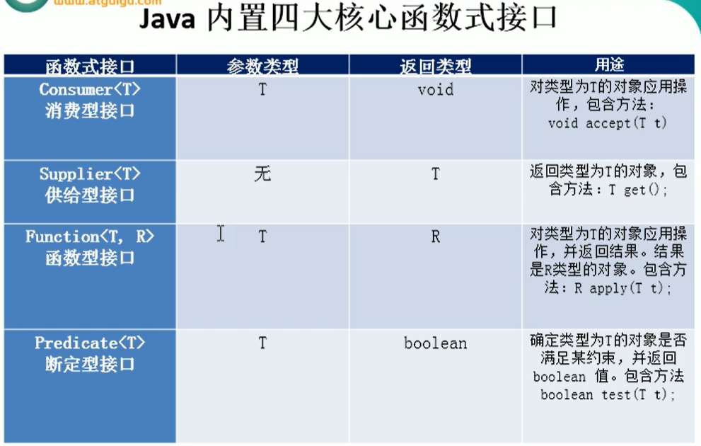
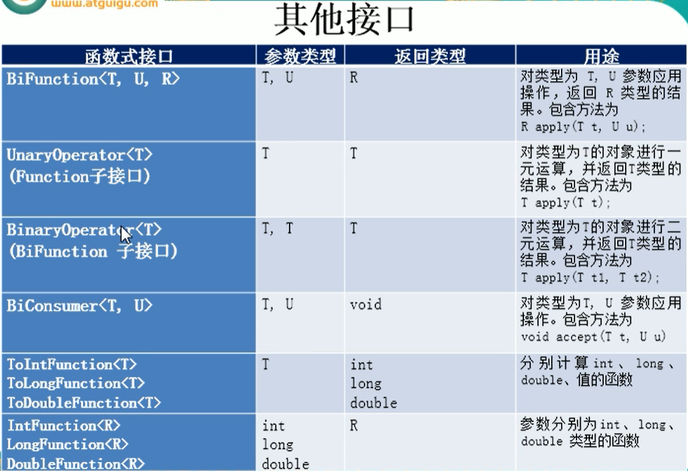

# Lambda表达式

## 为什么要用Lambda表达式

Lambda是一个匿名函数，我们可以把Lambda表达式理解为是一段可以传递的代码，将代码像数据一样传递，这样可以写出更简洁、更灵活的代码，作为一个更紧凑的代码风格，使Java语言表达能力得到了提升

## 实例代码

Lambda表达式最先替代的就是匿名内部类，假设原来我们写一个Comparator比较函数，采用匿名内部类的方式

```
    /**
     * 原来使用匿名内部类
     */
    public static void test() {
        // 使用匿名内部类，重写Intger的 compare方法
        Comparator<Integer> comparator = new Comparator<Integer>() {
            @Override
            public int compare(Integer o1, Integer o2) {
                return Integer.compare(o1, o2);
            }
        };

        // 传入比较的方法
        TreeSet<Integer> ts = new TreeSet<>(comparator);
    }
```

然后在采用Lambda表达式后

```
    /**
     * 使用Lambda表达式解决匿名内部类需要编写大量模板语言的问题
     */
    public static void test2() {
        Comparator<Integer> comparator = (x, y) -> Integer.compare(x, y);

        // 传入比较的方法
        TreeSet<Integer> ts = new TreeSet<>(comparator);
    }
```

## 策略设计模式

假设我们现在有一个需求，就是查找出员工里面年龄超过35的，我们使用策略设计模式

```
/**
 * 员工类
 *
 * @author: 陌溪
 * @create: 2020-04-05-12:13
 */
public class Employee {
    private String name;
    private int age;
    private double salary;
    
    // set get
}
```

然后创建一个接口，这里就是判定条件

```
/**
 * 接口
 * @param <T>
 */
public interface MyPredicte<T> {
    public boolean test(T t);
}

```

我们实现这个接口

```
/**
 * 按年龄过滤
 *
 * @author: 陌溪
 * @create: 2020-04-05-12:23
 */
public class FilterEmployeeByAge implements MyPredicte<Employee> {

    @Override
    public boolean test(Employee employee) {
        return employee.getAge() > 35;
    }
}
```

然后在具体的例子中使用

```
    /**
     * 获取当前公司员工年龄大于35
     */
    public static void test3() {
        List<Employee> employees = Arrays.asList(
                new Employee("张三", 18, 3333),
                new Employee("李四", 38, 55555),
                new Employee("王五", 50, 6666.66),
                new Employee("赵六", 16, 77777.77),
                new Employee("田七", 8, 8888.88)
        );

        MyPredicte<Employee> mp = new FilterEmployeeByAge();
        List<Employee> emps = new ArrayList<>();
        for (Employee emp : emps) {
            if(mp.test(emp)) {
                emps.add(emp);
            }
        }
    }
```

当某一天需求变更了，变成需要查找金额大于60000的，那么只需要在编写一个实现类即可

```
/**
 * 按薪资过滤
 *
 * @author: 陌溪
 * @create: 2020-04-05-12:23
 */
public class FilterEmployeeBySalary implements MyPredicte<Employee> {

    @Override
    public boolean test(Employee employee) {
        return employee.getSalary() > 60000;
    }
}

```

那么具体使用只需要更改为

```
    /**
     * 获取当前公司薪资大于60000
     */
    public static void test3() {
        List<Employee> employees = Arrays.asList(
                new Employee("张三", 18, 3333),
                new Employee("李四", 38, 55555),
                new Employee("王五", 50, 6666.66),
                new Employee("赵六", 16, 77777.77),
                new Employee("田七", 8, 8888.88)
        );

        MyPredicte<Employee> mp = new FilterEmployeeBySalary();
        List<Employee> emps = new ArrayList<>();
        for (Employee emp : emps) {
            if(mp.test(emp)) {
                emps.add(emp);
            }
        }
    }
```

这样一个方法，被称为策略设计模式

## 匿名内部类

使用上面的策略设计模式，我们会发现一个问题，就是每当我需要增加一个条件的时候，就需要增加一个实现类，如果条件多了的话，那么就会有很多实现类，那么为了优化，我们可以采取匿名内部类的方式

```
    /**
     * 优化方式，采用匿名内部类的方式
     */
    public static void test5() {
        List<Employee> employees = Arrays.asList(
                new Employee("张三", 18, 3333),
                new Employee("李四", 38, 55555),
                new Employee("王五", 50, 6666.66),
                new Employee("赵六", 16, 77777.77),
                new Employee("田七", 8, 8888.88)
        );

        // 匿名内部类
        filterEmployee(employees, new MyPredicte<Employee>() {
            @Override
            public boolean test(Employee employee) {
                return employee.getSalary() <= 5000;
            }
        });
    }
```

直接在内部类中，使用我们的过滤条件

## Lambda表达式

```
    /**
     * 使用Lambda表达式优化
     */
    public static void test6() {
        List<Employee> employees = Arrays.asList(
                new Employee("张三", 18, 3333),
                new Employee("李四", 38, 55555),
                new Employee("王五", 50, 6666.66),
                new Employee("赵六", 16, 77777.77),
                new Employee("田七", 8, 8888.88)
        );

        List<Employee> list = filterEmployee(employees, (e) -> e.getSalary() <= 5000);
        list.forEach(System.out::println);
    }
```

或者

```
    /**
     * 不使用策略模式
     */
    public static void test7() {
        List<Employee> employees = Arrays.asList(
                new Employee("张三", 18, 3333),
                new Employee("李四", 38, 55555),
                new Employee("王五", 50, 6666.66),
                new Employee("赵六", 16, 77777.77),
                new Employee("田七", 8, 8888.88)
        );
        employees.stream().filter(e-> e.getSalary() >= 5000).limit(2).forEach(System.out::println);
        
        System.out.println("=========");
        employees.stream().map(Employee::getName).forEach(System.out::println);
    }
```

## 学习Lambda

Lambda表达式基础语法：Java8中引入了一个新的操作符 “->” 该操作符称为箭头操作符 或 Lambda操作符

箭头操作符将Lambda表达式拆分为两部分：

- 左侧：Lambda表达式的参数列表（可以想象成，是上面定义的接口中抽象方法参数的列表）
- 右侧：Lambda表达式中，所需要执行的功能，即Lambda体（需要对抽象方法实现的功能）

### 语法格式

#### 1、无参，无返回值

格式：

```
() -> System.out.println(“hello”);
```

举例：

```
    public static void test() {
        Runnable r = new Runnable() {
            @Override
            public void run() {
                System.out.println("hello");
            }
        };

        System.out.println("=========");

        Runnable runnable = () -> {
            System.out.println("hello lambda");
        };
    }
```

JDK1.8以后，调用Lambda外的值，不需要增加final字段，它默认已经添加了final

```
int n = 10;
Runnable runnable = () -> {
	System.out.println("hello lambda" + n);
};
```

#### 2、有一个参数，有返回值

格式：

```
(x) -> System.out.println(x);
或  (一个参数时，小括号可以省略不写)
x -> System.out.println(x);
```

实例：

```
public static void test2() {
    Consumer<String> consumer = (x) -> System.out.println(x);
    consumer.accept("我在bilibili");
}
```

#### 3、有多个参数，一个返回值

```
    /**
     * 多个参数，有返回值
     */
    public static void test3() {
        Comparator<Integer> comparator = (x, y) -> {
            System.out.println("函数式接口");
            return Integer.compare(x, y);
        };
    }
```


#### 4、有多个参数，只有一条语句

这个时候，可以省略大括号 和 return

```

    /**
     * 多个参数，函数体只有一条，并且有返回值时
     */
    public static void test4() {
        Comparator<Integer> comparator = (x, y) -> Integer.compare(x, y);
    }
```


### 类型推断

Lambda中，表达式的参数列表的数据类型可以省略不写，因为JVM编译器通过上下文推断出，数据类型，即“类型推断”。

```
(Integer x, Integer y) -> Integer.compare(x, y);
```

但是底层的类型检查还是有的，只是JDK底层帮我们做了类型检查这件事


## 函数式接口

Lambda表达式需要“函数式接口”的支持

函数式接口：接口中只有一个抽象方法的接口，称为函数式接口，如：

```
/**
 * 函数式接口 
 */
public interface MyPredicte<T> {
    public boolean test(T t);
}
```

可以使用注解 `@FunctionalInterface` 修饰的，则为函数式接口

```
/**
 * 接口，用于解决重复条件
 * @param <T>
 */
@FunctionalInterface
public interface MyPredicte<T> {
    public boolean test(T t);
}

```

## 场景

对一个数进行某种运算

首先创建一个函数式接口

```
@FunctionalInterface
public interface MyFun {
    public Integer getValue(Integer value);
}
```

然后在定义一个方法，把方法作为参数传递

```
    /**
     * 需求：对一个数进行运算
     */
    public static void test5() {
        Integer value = operation(100, (x) -> x*x);
        System.out.println(value);
    }

    public static Integer operation(Integer num, MyFun myFun) {
        return myFun.getValue(num);
    }
```


## 训练

- 调用Collections.sort()方法，通过定制排序比较两个Employee（先比较年龄比，年龄相同比较姓名），使用Lambda表达式

```
    public static void test() {
        List<Employee> employees = Arrays.asList(
                new Employee("张三", 18, 3333),
                new Employee("李四", 38, 55555),
                new Employee("王五", 50, 6666.66),
                new Employee("赵六", 16, 77777.77),
                new Employee("田七", 8, 8888.88)
        );
        Collections.sort(employees, (e1, e2) -> {
            if(e1.getAge() == e2.getAge()) {
                return e1.getName().compareTo(e2.getName());
            } else {
                return Integer.compare(e1.getAge(), e2.getAge());
            }
        });

        employees.stream().map(Employee::getName).forEach(System.out::println);
    }
```


## Java内置函数接口

## Comsumer 消费型接口

格式：`Comsumer<T>`

传入参数，然后对参数进行操作，没有返回值

```
    /**
     * 消费型接口
     */
    public static void test() {
        happy(1000, (m) -> System.out.println("消费成功：" + m + "元"));
    }
    public static void happy(double money, Consumer<Double> consumer) {
        consumer.accept(money);
    }
```


## Supplier 供给型接口

格式：`Supplier<T>`

T get();

传入参数，对参数进行操作，然后有返回值

```
    /**
     * 供给型接口，供给功能如何实现
     */
    public static void test2() {
        List<Integer> list = getNumList(10, () -> {
          Integer a =   (int)(Math.random() * 10);
          return a;
        });

        list.stream().forEach(System.out::println);
    }

    /**
     * 产生指定个数的整数
     * @param n
     * @return
     */
    public static List<Integer> getNumList(Integer n, Supplier<Integer> supplier) {
        List<Integer> list = new ArrayList<>();
        for (int i = 0; i < n; i++) {
            list.add(supplier.get());
        }
        return list;
    }
```

最后输出结果

```
0
5
9
4
4
3
4
5
0
3
```


## Function 函数型接口

格式：`Function<T,R>`

`R apply(T t);`

```
    /**
     * 函数型接口
     * Function<T, R>
     */
    public static void test3() {
        String str = strHandler("abcdefg", (x) -> {
            return x.toUpperCase().substring(0, 5);
        });
        System.out.println(str);
    }

    /**
     * 需求：用于处理字符串
     */
    public static String strHandler(String str, Function<String, String> function) {
        // 使用apply方法进行处理，怎么处理需要具体实现
        return function.apply(str);
    }
```

输出结果：

```
ABCDE
```


## Predicate 断言型接口

格式：`Predicate<T>`， 用于做一些判断

```
    /**
     * 断言型接口(把长度大于3的str过滤出来)
     */
    public static void test4() {
        List<String> list = Arrays.asList("abc", "abcd", "df", "cgg", "aaab");
        List<String> result = strPredict(list, (x) -> x.length() > 3);
        result.forEach(item -> {
            System.out.println(item);
        });
    }

    /**
     * 将满足条件的字符串，放入到集合中
     */
    public static List<String> strPredict(List<String> list, Predicate<String> predicate) {
        List<String> result = new ArrayList<>();
        list.forEach(item -> {
            if(predicate.test(item)) {
                result.add(item);
            }
        });
        return result;
    }
```


## 扩展

上述的四大核心接口，并不能被适用于一个特殊的应用场景，只能满足大部分的需求

因为他们对于参数的参入有局限性



同时后面针对这样的情况，后面也使用子接口，进行了解决

