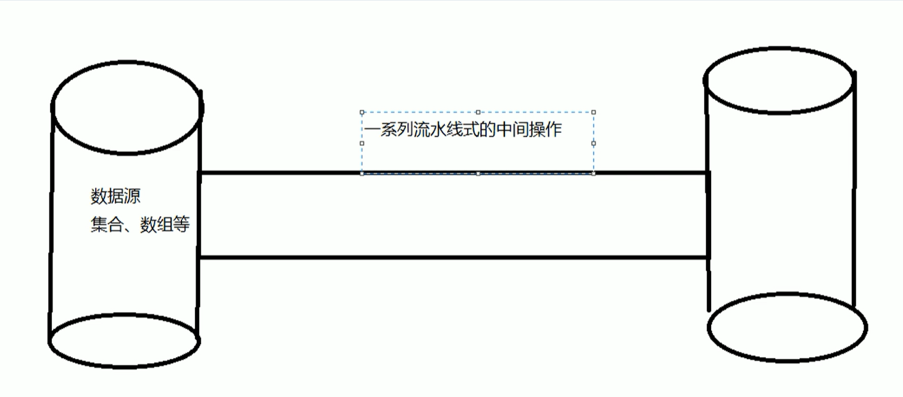
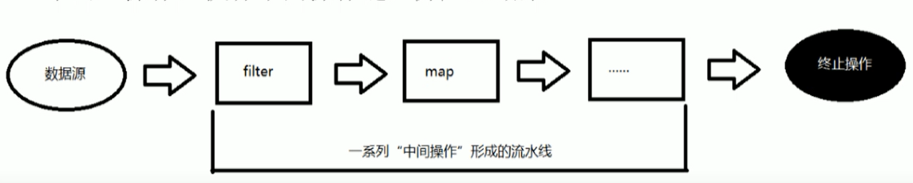

# Stream API

## 了解Stream

Java8中有两个比较大的改变

- Lambda表达式
- Stream API （java.util.stream.*）

Stream是Java8中处理集合的关键抽象概念，它可以指定你希望对集合进行的操作，可以执行非常复杂的查找，过滤和映射数据等操作。使用Stream API对集合数据进行操作，就类似于使用SQL执行的数据库查询，也可以使用Stream API来并行操作，简而言之，Stream API提供了一种高效且易于使用的处理数据的方式。


## 区别

这里的Stream流和IO流是有区别的，这里是我们在数据源流向 目标源的时候，会产生一系列流水线式的中间操作，最后产生一个新流，同时原来的数据源是不会改变的。

这里的中间操作可能是：切片，排序，筛选等



## 什么是Stream

Stream是数据渠道，用于操作数据源（集合，数组等）所生成的元素序列，“集合讲的是数据，流讲的是计算”！

注意：

- Stream 自己不会存储元素
- Stream 不会改变源对象，相反，他们会返回一个持有结果的新Stream
- Stream 操作是延迟的，这就意味着他们会等到需要结果的时候才执行的


## Stream操作的三部曲

### 创建流

一个数据源（如：集合，数组），获取一个流

- 通过Collection系列集合的 stream() 或者 parallelStream() 获取流

```
List<String> list = new ArrayList<>();
Stream<String> stream =  list.stream();
```

- 通过Arrays 中的静态方法，获取数组流

```
Employee[] employees = new Employee[10];
Stream<Employee> stream1 = Arrays.stream(employees);
```

- 通过Stream中的静态方法of()，获取流

```
Stream<String> stream3 = Stream.of("aa", "bb", "cc");
```

- 创建无限流

```
Stream<Integer> stream4 = Stream.iterate(0, (x) -> x +2 );
```

### 中间操作

一个中间操作链，对数据源的数据进行处理

### 终止操作

一个终止操作，执行中间操作链，并产生结果




## Stream流的操作

多中间操作可以连接起来形成一个流水线，除非流水线上触发终止操作，否者中间操作不会执行任何的处理，而在终止操作时一次性全部处理，这样被称为 惰性求值

### 筛选与切片

- filter( Predicate p)：接收Lambda，从流中排除某些元素
- distinct()：筛选，通过流所生成的hashCode()和equals()去除重复元素
- limit(long maxSize)：截断流，使其元素不超过给定数量
- skip(long n)：跳过元素，返回一个扔掉了前n个元素的流，若流中元素不足n个，则返回一个空流

```
        List<Employee> employees = Arrays.asList(
                new Employee("张三", 18, 3333),
                new Employee("李四", 38, 55555),
                new Employee("王五", 50, 6666.66),
                new Employee("赵六", 16, 77777.77),
                new Employee("田七", 8, 8888.88)
        );
        Stream<Employee> stream = employees.stream();
        stream.filter((x) -> x.getAge() > 30)
                .limit(2)
                .forEach(System.out::println);
```


### 映射

map接收Lambda，将元素转换成其它形式或提取信息，接收一个函数作为参数，该函数会被应用到每个元素上，并将其映射成一个新元素。flatMap 接收一个函数作为参数，将流中的每个值都转换成另一个流，然后把所有流连接成一个流。

```
    public static void test2() {
        List<String> list = Arrays.asList("aaa", "bbb", "ccc", "ddd");
        list.stream().map((x) -> x.toUpperCase()).forEach(System.out::println);
    }
```


### 排序

- sorted()：自然排序
- sorted(Comparator com)：定制排序

```
    public static void test3() {
        List<String> list = Arrays.asList("aaa", "bbb", "ccc", "ddd");
        // 自然排序，按照字典进行排序
        list.stream().sorted().forEach(System.out::println);

        // 定制排序
        List<Employee> employees = Arrays.asList(
                new Employee("张三", 18, 3333),
                new Employee("李四", 38, 55555),
                new Employee("王五", 50, 6666.66),
                new Employee("赵六", 16, 77777.77),
                new Employee("田七", 8, 8888.88)
        );
        employees.stream().sorted((e1, e2) -> {
            if(e1.getAge() == e2.getAge()) {
                return e1.getName().compareTo(e2.getName());
            } else {
                return Integer.compare(e1.getAge(), e2.getAge());
            }
        }).forEach(System.out::println);
    }
```

输出结果：

```
aaa
bbb
ccc
ddd
Employee{name='田七', age=8, salary=8888.88}
Employee{name='赵六', age=16, salary=77777.77}
Employee{name='张三', age=18, salary=3333.0}
Employee{name='李四', age=38, salary=55555.0}
Employee{name='王五', age=50, salary=6666.66}
```


### 终止操作

执行下列操作后，Stream流就会进行终止执行

查找与匹配

- allMatch：检查是否匹配所有元素
- anyMatch：检查是否至少匹配一个元素
- noneMatch：检查是否一个都没匹配
- findFirst：返回第一个元素
- findAny：返回当前流中任意一个元素
- count：返回流中元素的个数
- max：返回当前流中最大值
- min：返回当前流中最小值
- forEach：内部迭代

```
    public static void test4() {
        // 定制排序
        List<Employee> employees = Arrays.asList(
                new Employee("张三", 18, 3333),
                new Employee("李四", 38, 55555),
                new Employee("王五", 50, 6666.66),
                new Employee("赵六", 16, 77777.77),
                new Employee("田七", 8, 8888.88)
        );
        Boolean isAllMatch = employees.stream().allMatch((x) -> x.getAge() > 10);
        System.out.println("是否匹配所有元素:" + isAllMatch);

        Boolean isAnyMatch = employees.stream().anyMatch((x) -> x.getAge() > 10);
        System.out.println("是否匹配至少一个元素:" + isAnyMatch);
    }
```


### 规约

格式：reduce(T identity, BinaryOperator) / reduce(BinaryOperator)

可以将流中元素反复结合，得到一个新值

这个reduce，其实有点类似于Hadoop中的mapReduce，先做map操作，然后做reduce操作

```
List<Integer> list = Arrays.asList(1, 2, 3, 4, 5 ,6 ,7 ,8 , 9, 10);
// 按照下面的规则进行累加操作
// reduce的规约，就是把前面定义的起始值，作为了x
Integer num = list.stream().reduce(0, (x, y) -> x + y);
System.out.println(num);
```


### 收集

Collection将流转换成其它形式，接收一个Collector接口实现，用于给Stream中元素做汇总的方法

格式：collect(Collector c)

Collector接口实现方法的实现决定了如何对流执行收集操作（如收集到List，Set，Map）。但是Collectors实用类提供了很多静态方法，可以方便地创建常用收集器实例

```
    /**
     * 收集器
     */
    public static void test6() {
        List<Employee> employees = Arrays.asList(
                new Employee("张三", 18, 3333),
                new Employee("李四", 38, 55555),
                new Employee("王五", 50, 6666.66),
                new Employee("赵六", 16, 77777.77),
                new Employee("田七", 8, 8888.88)
        );
        // 收集放入list中
        List<String> list = employees.stream().map(Employee::getName).collect(Collectors.toList());
        list.forEach(System.out::println);
    }
```

