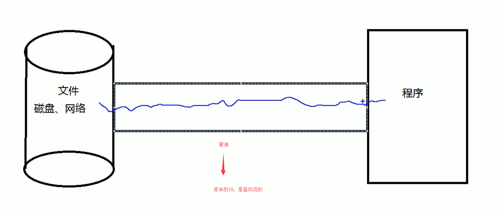
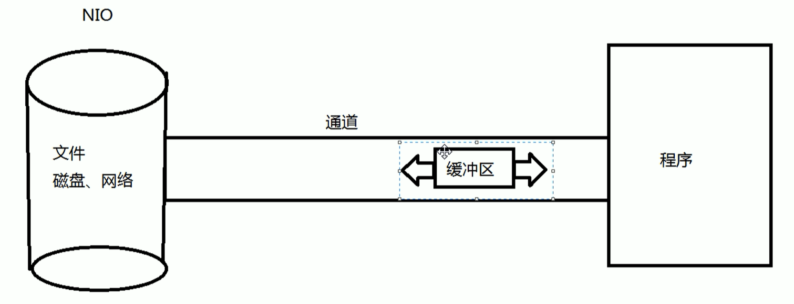
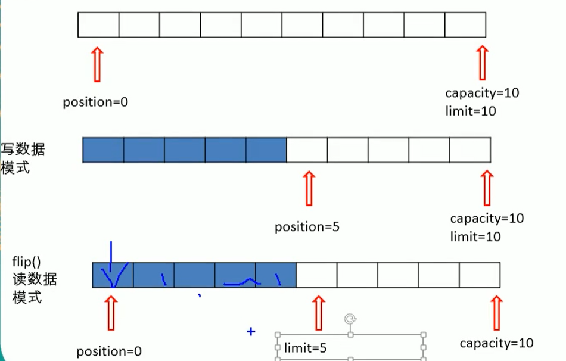
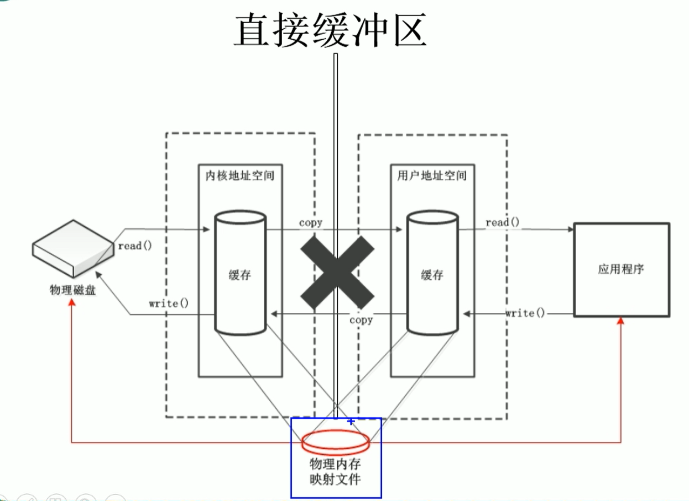
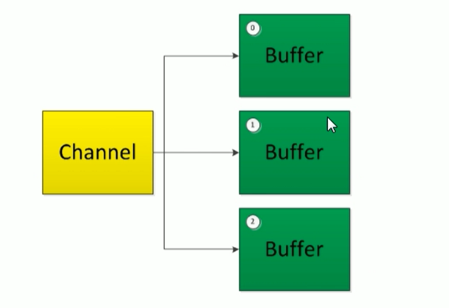
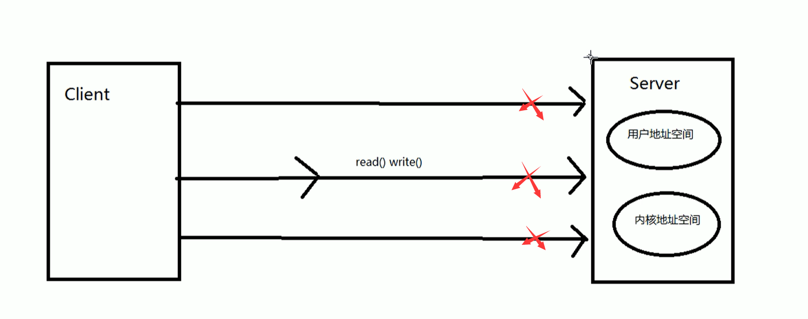
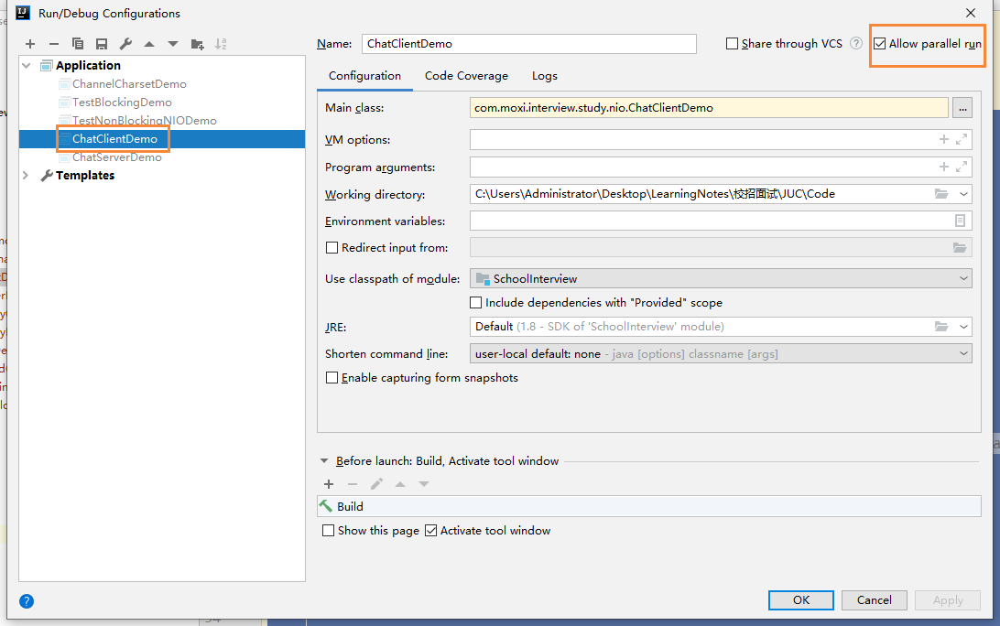
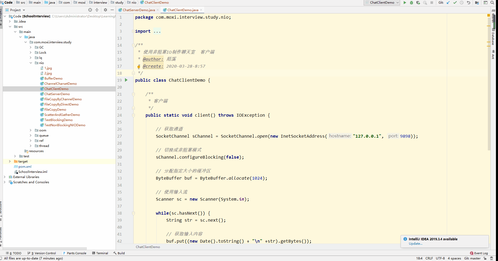
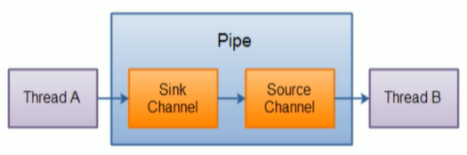

# Java NIO

## 概念

Java NIO（New IO），No Blocking IO 非阻塞IO，是从Java1.4版本开始引入的一个新的IO API，可以替代标准的Java IO API。NIO与原来的IO有同样的作用和目的，但是使用的方式完全不同，NIO支持面向缓冲区的，基于通道的IO操作。NIO将以更加高效的方式进行文件读写操作

## IO和NIO的区别

| IO                        | NIO                           |
| ------------------------- | ----------------------------- |
| 面向流（Stream Oriented） | 面向缓冲区（Buffer Oriented） |
| 阻塞IO（Blocking IO）     | 非阻塞IO（Non Blocking IO）   |
| 无                        | 选择器（Selectors）           |



- 传统的IO是单向的
  - 也就是需要建立输入流和输出流两个管道，数据的流动只能是单向的




- NIO是双向的
  - 里面的缓存区是可以双向传输的

- NIO里面引入的通道的概念
  - 通道可以理解为我们生活中的铁路，它是用于源地址和目的地址连接的
  - 如果需要实际传输的话，那么需要依赖里面的缓冲区
  - 通道负责连接，缓冲区负责传输


## 通道和缓冲区

Java NIO系统的核心在于：通道（Channel）和缓冲区（Buffer）。通道表示打开到IO设备（例如：文件、套接字）的连接。若需要使用NIO系统，需要获取用于连接IO设备的通道以及用于容纳数据的缓冲区。然后操作缓冲区，对数据进行处理

简而言之：Channel负责传输，Buffer负责存储


## 缓冲区 Buffer

在Java NIO中负责数据的存取。缓冲区就是数组。用于存储不同类型的数据根据数据类型不同，提供相同类型的缓冲区（除了Boolean）

- ByteBuffer：字节缓冲区（最常用的）
- CharBuffer
- ShortBuffer
- IntBuffer
- LongBuffer
- FloatBuffer
- DoubleBuffer

### 缓冲区中的方法

上面缓冲区的管理方式几乎一致， 通过 allocate() 获取缓冲区

缓冲区存取数据的两个核心方法

- put()：存入数据到缓冲区中
- get()：获取缓冲区中的数据
- hasRemaining()：判断缓冲区是否还有剩余的数据
- remaining()：获取缓冲区还有多少剩余数据
- mark()：标记postion的位置
- reset()：恢复到刚标记的地方

### 缓冲区中的核心属性


- capacity：容量，表示缓冲区中最大存储数据的容量，一旦申明不可改变。
- limit：界限，表示缓冲区中的可以操作数据的大小。（limit 后数据不能进行读写）
- position：位置，表示缓冲区中正在操作的位置
- mark：标记，表示记录当前 position 的位置，可以通过reset() 恢复到 mark的位置

最后它们之间的关系是：0 <= mark <= position <= limit <= capacity

### 相关操作

我们首先操作一个大小为1024字节的缓冲区ByteBuffer

```
// 分配一个指定大小的缓冲区
ByteBuffer buf = ByteBuffer.allocate(1024);
System.out.println("初始化");
System.out.println("position：" + buf.position());
System.out.println("limit：" + buf.limit());
System.out.println("capacity：" + buf.capacity());
```

然后在传入字符串到缓冲区

```
// 存入数据到缓冲区
String str = "abcde";
buf.put(str.getBytes());

System.out.println("存入数据");
System.out.println("position：" + buf.position());
System.out.println("limit：" + buf.limit());
System.out.println("capacity：" + buf.capacity());
```

然后开始读取数据，在读取数据前，我们需要使用flip切换到读取数据模式

```
// 切换读取数据模式
buf.flip();
System.out.println("切换读取数据模式");
System.out.println("position：" + buf.position());
System.out.println("limit：" + buf.limit());
System.out.println("capacity：" + buf.capacity());
```

然后在进行读取操作，我们需要创建一个byte[] 数组，将需要读取出来的数据放进去

```
// 开始读取数据
System.out.println("开始读取数据");
byte[] dst = new byte[buf.limit()];
buf.get(dst);
System.out.println(new String(dst, 0, dst.length));
```

下面这个图，是我们在执行各个步骤时， position，limit，capacity的变换



完整代码：

```
/**
 * 缓冲区：Buffer
 * 在Java NIO中负责数据的存取。缓冲区就是数组。用于存储不同类型的数据
 * 根据数据类型不同，提供相同类型的缓冲区（除了Boolean）
 * ByteBuffer
 * CharBuffer
 * @author: 陌溪
 * @create: 2020-03-27-14:48
 */
public class BufferDemo {

    public static void main(String[] args) {
        // 分配一个指定大小的缓冲区
        ByteBuffer buf = ByteBuffer.allocate(1024);
        System.out.println("初始化");
        System.out.println("position：" + buf.position());
        System.out.println("limit：" + buf.limit());
        System.out.println("capacity：" + buf.capacity());

        // 存入数据到缓冲区
        String str = "abcde";
        buf.put(str.getBytes());
        System.out.println("存入数据");
        System.out.println("position：" + buf.position());
        System.out.println("limit：" + buf.limit());
        System.out.println("capacity：" + buf.capacity());

        // 切换读取数据模式
        buf.flip();
        System.out.println("切换读取数据模式");
        System.out.println("position：" + buf.position());
        System.out.println("limit：" + buf.limit());
        System.out.println("capacity：" + buf.capacity());

        // 开始读取数据
        System.out.println("开始读取数据");
        byte[] dst = new byte[buf.limit()];
        buf.get(dst);
        System.out.println(new String(dst, 0, dst.length));

        System.out.println("数据读取完毕");
        System.out.println("position：" + buf.position());
        System.out.println("limit：" + buf.limit());
        System.out.println("capacity：" + buf.capacity());

        // rewind()：表示重复读
        buf.rewind();
        System.out.println("rewind");
        System.out.println("position：" + buf.position());
        System.out.println("limit：" + buf.limit());
        System.out.println("capacity：" + buf.capacity());

        // clear()：清空缓冲区，但是缓冲区中的数据仍然存储，但是处于被遗忘状态
        buf.clear();
        System.out.println("clear");
        System.out.println("position：" + buf.position());
        System.out.println("limit：" + buf.limit());
        System.out.println("capacity：" + buf.capacity());
    }
}

```

最后运行结果：

```
初始化
position：0
limit：1024
capacity：1024
存入数据
position：5
limit：1024
capacity：1024
切换读取数据模式
position：0
limit：5
capacity：1024
开始读取数据
abcde
数据读取完毕
position：5
limit：5
capacity：1024
```

从上述输出我们能够发现，postion一直代表我们能够操作的角标，但切换到读取模式的时候，那么就会从0开始，并且limit限制我们能够读取的范围


### 直接缓冲区和非直接缓冲区

- 非直接缓冲区：通过 `allocate()  ` 方法分配缓冲区，将缓冲区建立在JVM的内存中


传统IO和非直接缓冲区都需要中间进行一步Copy的过程，是比较耗费时间的


- 直接缓冲区：通过`allocateDirect()` 方法分配直接缓冲区，将缓冲区建立在操作系统的物理内存中，可以提高效率。



写入物理内存中的数据，已经不归JVM来管辖了，因此JVM不会自动收集物理内存中的数据


- 字节缓冲区要么直接的，要么非直接的，如果为字节缓冲区，则Java虚拟机会尽最大努力直接在此缓冲区上执行本机I/O操作。也就是说，在每次调用基础操作系统的一个本机I/O操作之前，虚拟机都会尽量避免将缓冲区的内容复制到中间缓冲区（或从中间缓冲区中复制内容）
- 直接缓冲区可以通过调用此类的 `allocateDirect()工厂方法` 来创建。此方法返回的缓冲区进行分配和取消分配所需成本通常高于非直接缓冲区。直接缓冲区的内容可以驻留在常规的垃圾回收堆之外，因此，他们对应用程序的内存需求量造成 的影响可能不明显。所以，建议将直接缓冲区主要分配给那些易受基础系统的本机I/O操作影响的大型、持久的缓冲区。一般情况下，最好仅在直接缓冲区能在程序性能方面带来明显好处时分配它们。
- 直接缓冲区还可以通过`FileChannel的map()方法` 将文件区域直接映射到内存中来创建，该方法返回`MappedByteBuffer` 。Java平台的实现有助于JNI从本机代码创建直接字节缓冲区。如果以上这些缓冲区中的某个缓冲区实例指的是不可访问的内存区域。则试图访问该区域不会更改该缓冲区的内容，并且将会在访问期间或稍后的某个时间导致抛出不确定的异常。
- 字节缓冲区是直接缓冲区还是非直接缓冲区可以通过调用其 `isDirect()` 方法来确定，提供此方法是为了能够在性能关键型代码中执行显示缓冲区管理。


## 通道 Channel

### 概念

由`java.nio.channels`包定义的。Channel表示IO源与目标打开的连接。Channel类似于传统的流，只不过Channel本身不能直接访问数据，Channel只能与Buffer进行交互。

开始的时候，CPU是直接提供IO接口来进行处理应用程序的IO请求的，但是因为IO请求会占用CPU的时间


后来在内存中，又提供了一条DMA（直接内存存取）线路，直接和IO接口进行交互，但是DMA在进行操作时候，需要首先向CPU申请权限，获得权限后即可进行IO操作，CPU就可以进行其它的操作了


但是当应用程序发送大量的IO请求时候，内存会向CPU申请多条DMA总线，但是当DMA连线更多时候，又会出现其它的问题，因此后面提出了Channel 通道的方式，Channel是一个完全独立的处理器，用于IO操作，这样可以省略向CPU请求的时间

其实：通道和原来的 流 也没有本质的区别，只是原来的DMA改成了 通道


### 相关实现类

通道 Channel，用于源节点与目标节点的连接，在Java NIO中 负责缓冲区中的数据传输。Channel本身不存储数据，因此需要配合缓冲区进行传输。

通道的主要实现类

- java.nio.channels.Channels
  - FileChannel：文件通道
  - SocketChannel：套接字通道
  - ServerSocketChannel：套接字通道
  - DatagramChannel：用于网络

### 获取通道

Java 针对支持通道的类，提供了一个getChannel() 方法

- 本地IO
  - FileInputStream 
  - FileOutputStream
  - RandomAccessFile
- 网络IO
  - Socket
  - ServerSocket
  - DatagramSocket

在JDK 1.7 中NIO.2 针对各通道提供了静态方法：` open()`

在JDK 1.7 中NIO.2 的Files工具类提供了一个静态方法：`newByteChannel()`

### 利用通道完成文件的复制

- 使用非直接缓冲区，完成文件的复制

```
/**
 * 利用通道完成文件的复制
 * @author: 陌溪
 * @create: 2020-03-27-16:36
 */
public class FileCopyDemo {

    public static void main(String[] args) {

        FileInputStream fis = null;
        FileOutputStream fos = null;
        FileChannel inChannel = null;
        FileChannel outChannel = null;
        try {
            fis = new FileInputStream("1.jpg");
            fos = new FileOutputStream("2.jpg");

            // 获取通道
            inChannel = fis.getChannel();
            outChannel = fos.getChannel();

            //分配一个指定大小的缓冲区
            ByteBuffer buf = ByteBuffer.allocate(1024);

            // 将通道中的数据，存入缓冲区
            while (inChannel.read(buf) != -1) {
                // 切换成读取数据的模式
                buf.flip();

                // 将缓冲区中的数据写入通道
                outChannel.write(buf);

                // 清空缓冲区
                buf.clear();
            }

        } catch (Exception e) {
            e.printStackTrace();
        } finally {
            try {
                // 关闭流
                if(fis != null) {
                    fis.close();
                }
                if(fos != null) {
                    fos.close();
                }

                // // 关闭通道
                if(outChannel != null) {
                    outChannel.close();
                }
                if(inChannel != null) {
                    inChannel.close();
                }
            } catch (Exception e) {
                e.printStackTrace();
            } finally {

            }
        }
    }
}
```

- 利用直接缓冲区，完成文件复制

```
/**
 * 利用通道完成文件的复制（直接缓冲区，内存映射）
 * @author: 陌溪
 * @create: 2020-03-27-16:36
 */
public class FileCopyByDirectDemo {

    public static void main(String[] args) throws IOException {

        // 获取通道
        FileChannel inChannel = FileChannel.open(Paths.get("1.jpg"), StandardOpenOption.READ);
        FileChannel outChannel = FileChannel.open(Paths.get("2.jpg"), StandardOpenOption.WRITE, StandardOpenOption.READ, StandardOpenOption.CREATE_NEW);

        // 得到的一个内存映射文件
        // 这个的好处是，直接将文件存储在内存中了
        MappedByteBuffer inMappedBuf = inChannel.map(FileChannel.MapMode.READ_ONLY, 0, inChannel.size());
        MappedByteBuffer outMappedBuf = outChannel.map(FileChannel.MapMode.READ_WRITE, 0, inChannel.size());

        // 直接对缓冲区进行数据的读写操作
        byte [] dst = new byte[inMappedBuf.limit()];
        inMappedBuf.get(dst);
        outMappedBuf.put(dst);

        inChannel.close();
        outChannel.close();
    }
}
```

- 通道之间数据传输

  ```
  /**
   * 利用通道直接进行数据传输
   * @author: 陌溪
   * @create: 2020-03-27-16:36
   */
  public class FileCopyByChannelDemo {
  
      public static void main(String[] args) throws IOException {
  
          // 获取通道
          // 获取通道
          FileChannel inChannel = FileChannel.open(Paths.get("1.jpg"), StandardOpenOption.READ);
          FileChannel outChannel = FileChannel.open(Paths.get("2.jpg"), StandardOpenOption.WRITE, StandardOpenOption.READ, StandardOpenOption.CREATE_NEW);
  
          // 从 inChannel通道 到 outChannel通道
          inChannel.transferTo(0, inChannel.size(), outChannel);
  
          inChannel.close();
          outChannel.close();
      }
  }
  ```

  

### 分散读取与聚集写入

- 分散读取（Scatter）：将通道中的数据分散到多个缓冲区中



注意：按照缓冲区的顺序，写入position和limit之间的数据到Channel

下面我们定义了两个缓冲区，然后通过通道将我们的内容分别读取到两个缓冲区中，这就实现了分散读取

```
    /**
     * 分散读取
     * @throws IOException
     */
    private static void Scatteer() throws IOException {
        RandomAccessFile raf1 = new RandomAccessFile("1.txt", "rw");

        // 获取通道
        FileChannel channel = raf1.getChannel();

        // 分配指定大小的缓冲区
        ByteBuffer buf1 = ByteBuffer.allocate(10);
        ByteBuffer buf2 = ByteBuffer.allocate(1024);

        // 分散读取
        ByteBuffer[] bufs = {buf1, buf2};
        channel.read(bufs);

        for (ByteBuffer byteBuffer: bufs) {
            // 切换成读模式
            byteBuffer.flip();
        }

        System.out.println(new String(bufs[0].array(), 0, bufs[0].limit()));
        System.out.println(new String(bufs[1].array(), 0, bufs[1].limit()));
    }
```


- 聚集写入（Gather）：将多个缓冲区中的数据都聚集到通道中

```
    /**
     * 聚集写入
     * @throws IOException
     */
    private static void Gather() throws IOException {
        RandomAccessFile raf2 = new RandomAccessFile("2.txt", "rw");
        FileChannel channel2 = raf2.getChannel();

        // 分配指定大小的缓冲区
        ByteBuffer buf1 = ByteBuffer.allocate(10);
        ByteBuffer buf2 = ByteBuffer.allocate(1024);
        ByteBuffer[] bufs = {buf1, buf2};

        // 聚集写入
        channel2.write(bufs);
    }
```


### 字符集

- 编码：字符串转换成字节数组
- 解码：字节数组转换成字符串

```
/**
 * 通道字符集编码
 *
 * @author: 陌溪
 * @create: 2020-03-27-18:20
 */
public class ChannelCharsetDemo {
    public static void main(String[] args) throws CharacterCodingException {

        Charset cs1 = Charset.forName("GBK");

        // 获取编码器
        CharsetEncoder ce = cs1.newEncoder();

        // 获取解码器
        CharsetDecoder cd = cs1.newDecoder();

        CharBuffer cBuf = CharBuffer.allocate(1024);
        cBuf.put("今天天气不错");
        cBuf.flip();

        //编码
        ByteBuffer bBuf = ce.encode(cBuf);

        for(int i=0; i< 12; i++) {
            System.out.println(bBuf.get());
        }

        // 解码
        bBuf.flip();
        CharBuffer cBuf2 = cd.decode(bBuf);
        System.out.println(cBuf2.toString());
    }
}

```


## NIO的非阻塞式网络通信

传统的阻塞式IO必须等待内容获取完毕后，才能够继续往下执行



在NIO中，引入了选择器的概念，它会把每个通道都注册到选择器中，选择器的作用就是监控通道上的IO状态，但某个通道上，某个IO请求已经准备就绪时，那么选择器才会将该客户端的通道分配到服务端的一个或多个线程上


## 使用NIO完成网络通信的三个核心

- 通道（Channel）：负责连接
  - `java.nio.channels.Channel`
    - SelectableChannel
      - SocketChannel
      - ServerSocketChannel：TCP
      - DatagramChannel：UDP
    - Pipe.SinkChannel
    - Pipe.SourceChannel
- 缓冲区（Buffer）：负责数据的存取
- 选择器（Selector）：SelectableChannel的多路复用器，用于监控SelectorableChannel的IO状况

## 使用阻塞式IO完成网络通信

我们首先需要创建一个服务端，用于接收客户端请求

```
    /**
     * 服务端
     */
    public static void server() throws IOException {
        // 获取通道
        ServerSocketChannel ssChannel = ServerSocketChannel.open();
        FileChannel fileChannel = FileChannel.open(Paths.get("D:\\2.jpg"), StandardOpenOption.WRITE, StandardOpenOption.CREATE);

        // 绑定端口号
        ssChannel.bind(new InetSocketAddress(9898));

        // 获取客户端连接的通道
        SocketChannel socketChannel = ssChannel.accept();

        // 分配指定大小的缓冲区
        ByteBuffer buf = ByteBuffer.allocate(1024);

        // 读取客户端的数据，并保存到本地
        while(socketChannel.read(buf) != -1) {
            // 切换成读模式
            buf.flip();

            // 写入
            fileChannel.write(buf);

            // 清空缓冲区
            buf.clear();
        }

        // 关闭通道
        ssChannel.close();
        socketChannel.close();
        fileChannel.close();
    }
```

然后在创建客户端，发送文件

```
    public static void client() throws IOException {
        // 获取通道
        SocketChannel sChannel = SocketChannel.open(new InetSocketAddress("127.0.0.1", 9898));

        FileChannel inChannel = FileChannel.open(Paths.get("D:\\1.jpg"), StandardOpenOption.READ);
        // 分配指定大小的缓冲区
        ByteBuffer buf = ByteBuffer.allocate(1024);

        // 读取本地文件，并发送到服务端
        while (inChannel.read(buf) != -1) {
            // 切换到读数据模式
            buf.flip();

            // 将缓冲区的数据写入管道
            sChannel.write(buf);

            // 清空缓冲区
            buf.clear();
        }

        //关闭通道
        inChannel.close();
        sChannel.close();
    }
```

完整代码：

```

/**
 * 阻塞式NIO
 *
 * @author: 陌溪
 * @create: 2020-03-27-19:16
 */
public class TestBlockingDemo {

    public static void client() throws IOException {
        // 获取通道
        SocketChannel sChannel = SocketChannel.open(new InetSocketAddress("127.0.0.1", 9898));

        FileChannel inChannel = FileChannel.open(Paths.get("D:\\1.jpg"), StandardOpenOption.READ);
        // 分配指定大小的缓冲区
        ByteBuffer buf = ByteBuffer.allocate(1024);

        // 读取本地文件，并发送到服务端
        while (inChannel.read(buf) != -1) {
            // 切换到读数据模式
            buf.flip();

            // 将缓冲区的数据写入管道
            sChannel.write(buf);

            // 清空缓冲区
            buf.clear();
        }

        // 告诉客户端我发送完成了，或者切换成非阻塞模式
        sChannel.shutdownOutput();

        // 接收服务端的反馈
        int len = 0;
        while((len = sChannel.read(buf)) != -1) {
            buf.flip();
            System.out.println(new String(buf.array(), 0, len));
            buf.clear();
        }

        //关闭通道
        inChannel.close();
        sChannel.close();
    }

    /**
     * 服务端
     */
    public static void server() throws IOException {
        // 获取通道
        ServerSocketChannel ssChannel = ServerSocketChannel.open();
        FileChannel fileChannel = FileChannel.open(Paths.get("D:\\2.jpg"), StandardOpenOption.WRITE, StandardOpenOption.CREATE);

        // 绑定端口号
        ssChannel.bind(new InetSocketAddress(9898));

        // 获取客户端连接的通道
        SocketChannel socketChannel = ssChannel.accept();

        // 分配指定大小的缓冲区
        ByteBuffer buf = ByteBuffer.allocate(1024);

        // 读取客户端的数据，并保存到本地
        while(socketChannel.read(buf) != -1) {
            // 切换成读模式
            buf.flip();

            // 写入
            fileChannel.write(buf);

            // 清空缓冲区
            buf.clear();
        }

        //向客户端反馈
        buf.put("服务端数据接收成功".getBytes());
        buf.flip();
        socketChannel.write(buf);

        // 关闭通道
        ssChannel.close();
        socketChannel.close();
        fileChannel.close();
    }

    public static void main(String[] args) {
        new Thread(() -> {
            try {
                server();
            } catch (IOException e) {
                e.printStackTrace();
            }
        }, "t1").start();

        try {
            TimeUnit.SECONDS.sleep(5);
        } catch (InterruptedException e) {
            e.printStackTrace();
        }

        new Thread(() -> {
            try {
                client();
            } catch (IOException e) {
                e.printStackTrace();
            }
        }, "t2").start();
    }
}
```


## 使用非阻塞式IO完成网络通信

```
/**
 * @author: 陌溪
 * @create: 2020-03-28-8:57
 */
public class TestNonBlockingNIODemo {

    /**
     * 客户端
     */
    public static void client() throws IOException {

        // 获取通道
        SocketChannel sChannel = SocketChannel.open(new InetSocketAddress("127.0.0.1", 9898));

        // 切换成非阻塞模式
        sChannel.configureBlocking(false);

        // 分配指定大小的缓冲区
        ByteBuffer buf = ByteBuffer.allocate(1024);

        // 发送数据给服务器
        buf.put(new Date().toString().getBytes());

        // 切换成写模式
        buf.flip();

        // 将缓冲区中的内容写入通道
        sChannel.write(buf);

        // 关闭通道
        sChannel.close();
    }

    /**
     * 服务端
     */
    public static void server() throws IOException {

        // 获取通道
        ServerSocketChannel ssChannel = ServerSocketChannel.open();

        // 切换成非阻塞模式
        ssChannel.configureBlocking(false);

        // 绑定连接
        ssChannel.bind(new InetSocketAddress(9898));

        // 获取选择器
        Selector selector = Selector.open();

        // 将通道注册到选择器上，第二个参数代表选择器监控通道的什么状态
        // 用选择器监听 接收状态，也就是说客户端什么时候发送了，我才会开始获取连接
        ssChannel.register(selector, SelectionKey.OP_ACCEPT);

        // 轮询式的获取选择器上已经准备就绪的事件
        while(selector.select() > 0) {

            // 获取当前选择器中 所有注册的选择键（已就绪的监听事件）
            Iterator<SelectionKey> it = selector.selectedKeys().iterator();

            while(it.hasNext()) {
                // 获取准备就绪的事件
                SelectionKey sk = it.next();

                // 判断是具体什么事件准备就绪

                // 接收事件就绪
                if(sk.isAcceptable()) {
                    // 若 接收就绪，获取客户端连接
                    SocketChannel sChannel = ssChannel.accept();

                    // 切换非阻塞模式
                    sChannel.configureBlocking(false);

                    // 将该通道注册到选择器上，并监听读就绪状态
                    sChannel.register(selector, SelectionKey.OP_READ);

                } else if(sk.isReadable()) {
                    // 读就绪状态就绪

                    // 获取当前选择器上 读就绪 状态的通道
                    SocketChannel sChannel = (SocketChannel) sk.channel();

                    // 读取数据
                    ByteBuffer buf = ByteBuffer.allocate(1024);

                    int len = 0;
                    while((len = sChannel.read(buf)) > 0) {
                        // 切换成读取模式
                        buf.flip();
                        // 打印客户端的发送
                        System.out.println(Thread.currentThread().getName() + "\t  " + new String(buf.array(), 0, len));
                        // 清空缓存
                        buf.clear();
                    }
                }
            }

            // 操作执行完成后，需要将 选择键给取消 SelectionKey
            it.remove();

        }
    }

    public static void main(String[] args) {
        new Thread(() -> {
            try {
                server();
            } catch (IOException e) {
                e.printStackTrace();
            }
        }, "t1").start();

        // 十个客户端发送数据过去
        for (int i = 0; i < 10; i++) {
            new Thread(() -> {
                try {
                    client();
                    try {
                        TimeUnit.SECONDS.sleep(1);
                    } catch (InterruptedException e) {
                        e.printStackTrace();
                    }
                } catch (IOException e) {
                    e.printStackTrace();
                }
            }, String.valueOf(i)).start();
        }

    }
}
```

## 使用非阻塞式IO制作聊天室

我们只需要把上面的代码稍微改一下，就能够实现聊天室的功能了

首先创建一个服务端，然后启动

```
/**
 * 使用非阻塞IO制作聊天室  服务端
 * @author: 陌溪
 * @create: 2020-03-28-8:57
 */
public class ChatServerDemo {

    /**
     * 服务端
     */
    public static void server() throws IOException {

        // 获取通道
        ServerSocketChannel ssChannel = ServerSocketChannel.open();

        // 切换成非阻塞模式
        ssChannel.configureBlocking(false);

        // 绑定连接
        ssChannel.bind(new InetSocketAddress(9898));

        // 获取选择器
        Selector selector = Selector.open();

        // 将通道注册到选择器上，第二个参数代表选择器监控通道的什么状态
        // 用选择器监听 接收状态，也就是说客户端什么时候发送了，我才会开始获取连接
        ssChannel.register(selector, SelectionKey.OP_ACCEPT);

        // 轮询式的获取选择器上已经准备就绪的事件
        while(selector.select() > 0) {

            // 获取当前选择器中 所有注册的选择键（已就绪的监听事件）
            Iterator<SelectionKey> it = selector.selectedKeys().iterator();

            while(it.hasNext()) {
                // 获取准备就绪的事件
                SelectionKey sk = it.next();

                // 判断是具体什么事件准备就绪

                // 接收事件就绪
                if(sk.isAcceptable()) {
                    // 若 接收就绪，获取客户端连接
                    SocketChannel sChannel = ssChannel.accept();

                    // 切换非阻塞模式
                    sChannel.configureBlocking(false);

                    // 将该通道注册到选择器上，并监听读就绪状态
                    sChannel.register(selector, SelectionKey.OP_READ);

                } else if(sk.isReadable()) {
                    // 读就绪状态就绪

                    // 获取当前选择器上 读就绪 状态的通道
                    SocketChannel sChannel = (SocketChannel) sk.channel();

                    // 读取数据
                    ByteBuffer buf = ByteBuffer.allocate(1024);

                    int len = 0;
                    while((len = sChannel.read(buf)) > 0) {
                        // 切换成读取模式
                        buf.flip();
                        // 打印客户端的发送
                        System.out.println(Thread.currentThread().getName() + "\t  " + new String(buf.array(), 0, len));
                        // 清空缓存
                        buf.clear();
                    }
                }
            }

            // 操作执行完成后，需要将 选择键给取消 SelectionKey
            it.remove();
        }
    }

    public static void main(String[] args) throws IOException {
        server();
    }
}
```

然后在创建一个客户端

```
/**
 * 使用非阻塞IO制作聊天室  客户端
 * @author: 陌溪
 * @create: 2020-03-28-8:57
 */
public class ChatClientDemo {

    /**
     * 客户端
     */
    public static void client() throws IOException {

        // 获取通道
        SocketChannel sChannel = SocketChannel.open(new InetSocketAddress("127.0.0.1", 9898));

        // 切换成非阻塞模式
        sChannel.configureBlocking(false);

        // 分配指定大小的缓冲区
        ByteBuffer buf = ByteBuffer.allocate(1024);

        // 使用输入流
        Scanner sc = new Scanner(System.in);

        while(sc.hasNext()) {
            String str = sc.next();

            // 获取输入内容
            buf.put((new Date().toString() + "\n" +str).getBytes());
            // 切换成写模式
            buf.flip();
            // 将缓冲区中的内容写入通道
            sChannel.write(buf);
            // 清空缓冲区
            buf.clear();
        }
        // 关闭通道
        sChannel.close();
    }

    public static void main(String[] args) throws IOException {
        client();
    }
}
```

然后我们需要运行两个客户端，但是IDEA默认只能运行一个，因此需要设置并行运行

打开run–>edit configuration



最后看效果




## 管道（Pipe）

Java NIO管道是两个线程之间的单向数据连接。Pipe有一个source通道和一个sink通道，数据会被写入到sink通道，从source通道读取。



代码：

```
/**
 * 管道
 * @author: 陌溪
 * @create: 2020-03-28-10:49
 */
public class PipeDemo {
    public static void main(String[] args) throws IOException {
        // 获取管道
        Pipe pipe = Pipe.open();

        // 将缓冲区的数据写入管道
        ByteBuffer buf = ByteBuffer.allocate(1024);

        // 发送数据（使用sink发送）
        Pipe.SinkChannel sinkChannel = pipe.sink();
        buf.put("通过单向管道发送数据".getBytes());

        buf.flip();
        sinkChannel.write(buf);

        // 读取缓冲区中的数据（使用source接收）
        Pipe.SourceChannel sourceChannel = pipe.source();
        buf.flip();
        int len = sourceChannel.read(buf);
        System.out.println(new String(buf.array(), 0, len));

        sourceChannel.close();
        sinkChannel.close();
    }
}
```

