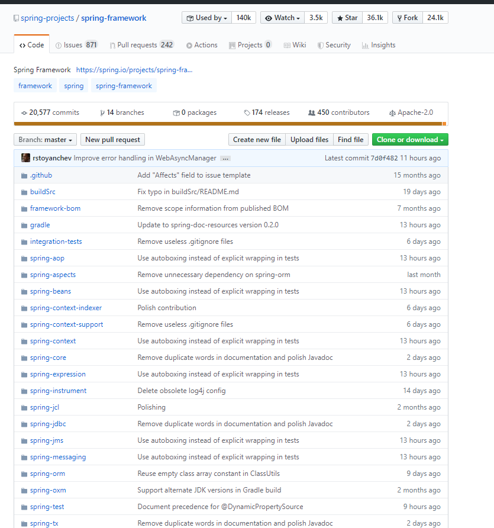
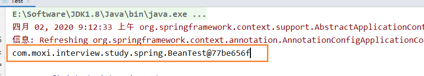
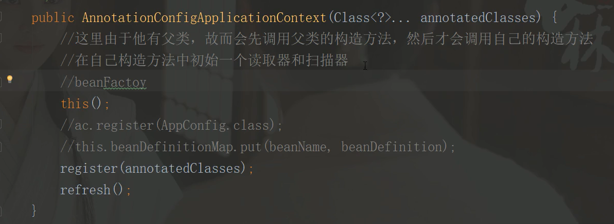
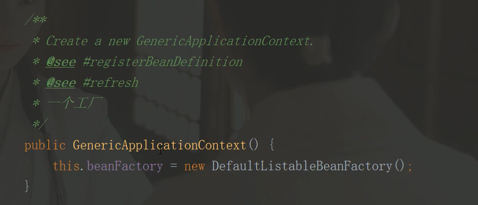
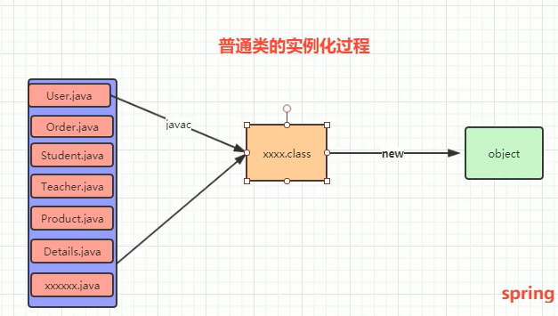
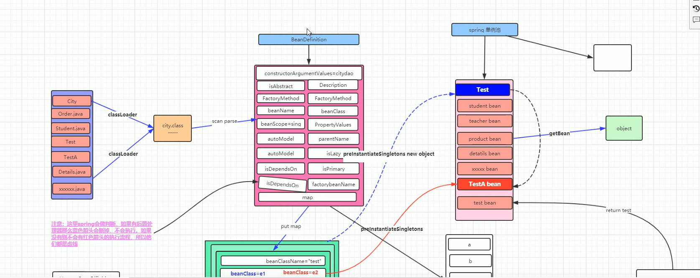
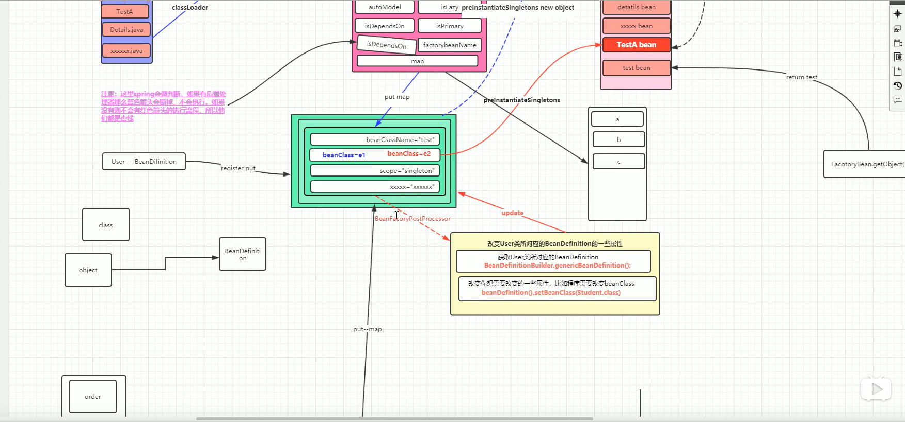
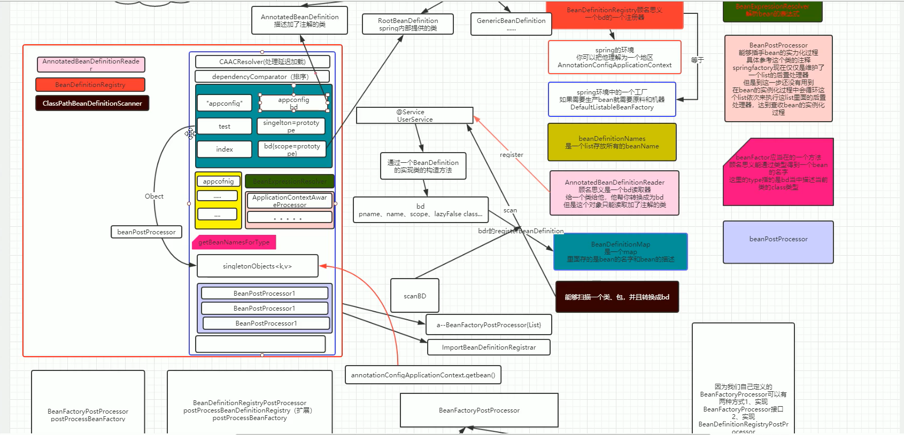

# Spring源码

## Spring源码方面的知识

- Spring bean的生命周期
- Spring 工厂，Spring容器，上下文 
- Spring BeanPostprocessor
- Spring 和 主流框架的源码
- Spring BeanFactory 和 FactoryBean的区别

## 谈谈你对Spring的理解

IOC、AOP只是作为Spring Framework里面一部分，同时还有还有events，resources，i18n，validation，data binding，type conversion，SpEL



## Spring上下文

从代码级别来说，就是指Spring Context

从源码级别，但我们初始化Spring Context的时候，一堆的Spring组件围绕在一起，使其能够正常工作，这个状态就被称为Spring环境

## Spring初始化

首先需要引入Spring的依赖，因为我们暂时只是初始化过程，只需要用到IOC

```
<dependency>
    <groupId>org.springframework</groupId>
    <artifactId>spring-context</artifactId>
    <version>5.0.9.RELEASE</version>
</dependency>
```

为了更加了解Spring初始化的过程，我们需要定义三个类

1、AppConfig.java，可以当成是扫描类，也就是配置我们需要扫描的目录

```
/**
 * 配置类
 *
 * @author: 陌溪
 * @create: 2020-04-02-9:08
 */
@Configuration
@ComponentScan("com.moxi.interview.study.spring")
public class AppConfig {
}

```

2、BeanTest.java，我们需要被扫描到的Bean

```

/**
 * Bean类
 *
 * @author: 陌溪
 * @create: 2020-04-02-9:09
 */
@Component
public class BeanTest {
}
```

3、Test.java，启动测试类

```
/**
 * Spring项目启动
 *
 * @author: 陌溪
 * @create: 2020-04-02-9:07
 */
public class Test {
    public static void main(String[] args) {
        // 初始化
        AnnotationConfigApplicationContext annotationConfigApplicationContext = new AnnotationConfigApplicationContext(AppConfig.class);

        System.out.println(annotationConfigApplicationContext.getBean(BeanTest.class));
    }
}
```

最后我们通过注解的方式，来获取Spring IOC扫描到的Bean，最后打印出来



tip：IDEA点击进去的源码目录，其实是IDEA反编译得到的，和原来的源码会存在一些出入，是IDEA专门优化过的，因此如果你需要修改源码的话，还是需要在官网下载对应的源码包

```
https://github.com/spring-projects/spring-framework
```


## SpringBean的生命周期

Spring中的Bean不可能是直接new关键字创建出来的

- 把类扫描出来（扫描出来后做了什么？）
- 把Bean实例化

初始化Spring环境有两种方法，一种是通过注解的方式，一个是通过XML的方式

```
// 方式1，目前用的比较多
AnnotationConfigApplicationContext annotationConfigApplicationContext = new AnnotationConfigApplicationContext(AppConfig.class)


```

同时在这个方法的内部，使用了this()



调用AnnotationConfigApplicationContext无参构造方法，同时因为该类又继承了一个父类 GenericApplicationContext，子类在初始化的时候，还会调用父类的无参构造方法，在父类中，我们能够看到它初始化了一个BeanFactory，这就是我们经常提到的Spring工厂



这个工厂最重要的功能就是产生Bean

同时在AnnotationConfigApplication方法的最后，还有一个refresh()方法，这个方法是整个Spring最核心的方法，这个方法的内部，同时调用了十多个方法，其中最重要的是 invokeBeanFactoryPostProcessors()

```
invokeBeanFactoryPostProcessors() {
	// 扫描类：
	// 处理了各种import：例如@import("xxx.xml"), @MapperScanner, @CompoentScanner ..... 
}
```


### 普通类的实例化

普通类的实例化，就是通过javac编译成xxx.class文件，然后某一天通过new关键字进行实例化，JVM就会把这个class类加载到JVM内存中，这里面就涉及到了方法区，堆栈存储等。



### Spring Bean实例化过程

- 首先Spring会将全部的Class类，通过classLoader加载到JVM中

- 然后在通过扫描，创建很多BeanDefinition，我们通过反射将对应Class的信息填充到BeanDefinition中

  - 这里的BeanDefinition是用来描述Bean的，也就是Bean的一些信息存储

    ```
    RootBeanDefinition rootBeanDefinition = new RootBeanDefinition();
    rootBeanDefinition.setBeanClassName("BeanTest");
    rootBeanDefinition.setBeanClass(BeanTest.class);
    rootBeanDefinition.setScope("prototype");
    rootBeanDefinition.setLazyInit();
    ```

    

- 然后在把填充好的BeanDefinition一个个放入到Map中，Spring扫描了几个类，Map中就有几个类，这个Map被称为 BeanDefinitionMap




- 最后我们将这个BeanDefinationMap放入了Spring单例池中



完整的加载图，左边红色部分就是Spring的加载过程，然后开放的原则，它还提供了很多扩展接口，让你可以干扰到Sring的加载过程，使得




例如，很多需要对Spring进行扩展的，例如Mybatis，其实都是实现了 BeanFactoryPostProcessor接口

在执行扫描的时候，它会扫描Spring 提供的 BeanFactoryPostProcessor，以及程序员扩展的

```

/**
 * 扩展的BeanFactory
 * @author: 陌溪
 * @create: 2020-04-02-10:52
 */
public class TestBeanFactoryPostProcessor implements BeanFactoryPostProcessor {
    @Override
    public void postProcessBeanFactory(ConfigurableListableBeanFactory beanFactory) throws BeansException {

    }
}
```

