## Mysql默认搜索引擎

Mysql5.5以后默认使用InnoDB为搜索引擎

MyISAM是表锁，不支持事务和主外键

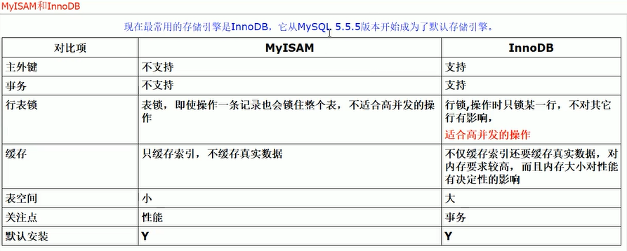

InnoDB默认可以创建16个索引

- InnoDB支持事务，MyIsam不支持事务，对于InnoDB每一条SQL语言都默认封装成事务，自动提交，这样会影响速度，所以最好把多条SQL语言放到begin 和 commit之间，组成一个事务；
- InnoDB支持外键，而MyIsam不支持，对一个包含外键的InnoDB表转成MyIsam表会失败
- InnoDB是聚集索引，数据文件和索引绑定在一块，必须要有主键，通过主键索引效率很高，但是辅助索引需要两次查询，先查询到主键，然后在通过主键查询到数据。因此主键不应该过大。主键过大的时候，其它索引也会很大。而MyIsam是非聚集索引，数据和文件是分离的，索引保存的是数据文件的指针，主键索引和辅助索引是独立的。
- InnoDB不支持全文检索，而MyIsam支持全文检索，查询效率上MyIsam要高

## 硬盘

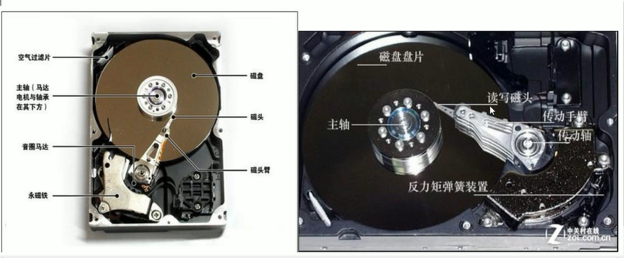

Mysql是存储在硬盘上，因此Redis比Mysql快

## 索引

Mysql官方对索引的定位为：索引是帮助Mysql高效获取数据的数据结构，可以得到索引的本质就是，索引是数据结构。

可以简单的理解为：排好序的快速查找B+树数据结构，B+树中的B代表平衡(balance) 而不是 二叉（binary）

## 检索原理

在数据之外，数据库系统还维护着满足特定查找算法的数据结构，这些数据结构以某种方式引用（指向）数据，这样就可以在这些数据上实现高级查找算法，这种数据结构，就是索引。下图就是一种可能的索引方式示例：

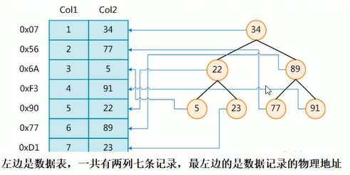

为了加快Col2的查找，可以维护一个左边所示的二叉树，每个节点分别包含索引键值和一个指向对应数据记录的物理地址的指针，这样就可以运用二叉树在一定的复杂度内获取相应数据，从而快速的检索出符合条件的记录。

## 聚簇索引和非聚簇索引

- 聚簇索引：将数据存储与索引放到一块，索引结构的叶子节点保存了行数据
- 非聚簇索引：将数据与索引分开，索引结构的叶子节点指向了数据对应的位置

在InnoDB中，在聚簇索引之上创建的索引被称为辅助索引，非聚簇索引都是辅助索引，像复合索引，前缀索引，唯一索引。辅助索引叶子节点存储不再是行的物理位置，而是主键值，辅助索引访问数据总是需要二次查找，这个就被称为 回表操作

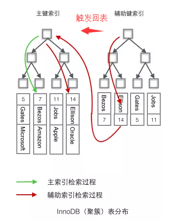

InnoDB使用的是聚簇索引，将主键组织到一棵B+树中，而行数据就储存在叶子节点上，若使用"where id = 14"这样的条件查找主键，则按照B+树的检索算法即可查找到对应的叶节点，之后获得行数据。

若对Name列进行条件搜索，则需要两个步骤：第一步在辅助索引B+树中检索Name，到达其叶子节点获取对应的主键。第二步使用主键在主索引B+树种再执行一次B+树检索操作，最终到达叶子节点即可获取整行数据。（重点在于通过其他键需要建立辅助索引）

**聚簇索引具有唯一性**，由于聚簇索引是将数据跟索引结构放到一块，因此一个表仅有一个聚簇索引。

**表中行的物理顺序和索引中行的物理顺序是相同的**，**在创建任何非聚簇索引之前创建聚簇索引**，这是因为聚簇索引改变了表中行的物理顺序，数据行 按照一定的顺序排列，并且自动维护这个顺序；

**聚簇索引默认是主键**，如果表中没有定义主键，InnoDB 会选择一个**唯一且非空的索引**代替。如果没有这样的索引，InnoDB 会**隐式定义一个主键（类似oracle中的RowId）**来作为聚簇索引。如果已经设置了主键为聚簇索引又希望再单独设置聚簇索引，必须先删除主键，然后添加我们想要的聚簇索引，最后恢复设置主键即可。

MyISAM使用的是非聚簇索引，**非聚簇索引的两棵B+树看上去没什么不同**，节点的结构完全一致只是存储的内容不同而已，主键索引B+树的节点存储了主键，辅助键索引B+树存储了辅助键。表数据存储在独立的地方，这两颗B+树的叶子节点都使用一个地址指向真正的表数据，对于表数据来说，这两个键没有任何差别。由于**索引树是独立的，通过辅助键检索无需访问主键的索引树**。

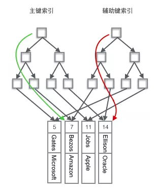

### 使用聚簇索引的优势

**每次使用辅助索引检索都要经过两次B+树查找，**看上去聚簇索引的效率明显要低于非聚簇索引，这不是多此一举吗？聚簇索引的优势在哪？

1.由于行数据和聚簇索引的叶子节点存储在一起，同一页中会有多条行数据，访问同一数据页不同行记录时，已经把页加载到了Buffer中（缓存器），再次访问时，会在内存中完成访问，不必访问磁盘。这样主键和行数据是一起被载入内存的，找到叶子节点就可以立刻将行数据返回了，如果按照主键Id来组织数据，获得数据更快。

2.辅助索引的叶子节点，存储主键值，而不是数据的存放地址。好处是当行数据放生变化时，索引树的节点也需要分裂变化；或者是我们需要查找的数据，在上一次IO读写的缓存中没有，需要发生一次新的IO操作时，可以避免对辅助索引的维护工作，只需要维护聚簇索引树就好了。另一个好处是，因为辅助索引存放的是主键值，减少了辅助索引占用的存储空间大小。

注：我们知道一次io读写，可以获取到16K大小的资源，我们称之为读取到的数据区域为Page。而我们的B树，B+树的索引结构，叶子节点上存放好多个关键字（索引值）和对应的数据，都会在一次IO操作中被读取到缓存中，所以在访问同一个页中的不同记录时，会在内存里操作，而不用再次进行IO操作了。除非发生了页的分裂，即要查询的行数据不在上次IO操作的换村里，才会触发新的IO操作。

3.因为MyISAM的主索引并非聚簇索引，那么他的数据的物理地址必然是凌乱的，拿到这些物理地址，按照合适的算法进行I/O读取，于是开始不停的寻道不停的旋转。聚簇索引则只需一次I/O。（强烈的对比）

4.不过，如果涉及到大数据量的排序、全表扫描、count之类的操作的话，还是MyISAM占优势些，因为索引所占空间小，这些操作是需要在内存中完成的。

### **聚簇索引需要注意的地方**

当使用主键为聚簇索引时，主键最好不要使用uuid，因为uuid的值太过离散，不适合排序且可能出线新增加记录的uuid，会插入在索引树中间的位置，导致索引树调整复杂度变大，消耗更多的时间和资源。

建议使用int类型的自增，方便排序并且默认会在索引树的末尾增加主键值，对索引树的结构影响最小。而且，主键值占用的存储空间越大，辅助索引中保存的主键值也会跟着变大，占用存储空间，也会影响到IO操作读取到的数据量。

**为什么主键通常建议使用自增id**

**聚簇索引的数据的物理存放顺序与索引顺序是一致的**，即：**只要索引是相邻的，那么对应的数据一定也是相邻地存放在磁盘上的**。如果主键不是自增id，那么可以想 象，它会干些什么，不断地调整数据的物理地址、分页，当然也有其他一些措施来减少这些操作，但却无法彻底避免。但，如果是自增的，那就简单了，它只需要一 页一页地写，索引结构相对紧凑，磁盘碎片少，效率也高。

## B+树

B树：Balance Tree，多路平衡查找树

B+树：加强版多路平衡查找树

tip：没有B-树，B-树就是B树，中间不是减号而是横线

## Mysql搜索引擎的发展之路

Mysql InnoDB的搜索引擎 的 底层也不是一来就是 B+树的，而是经过了不断的迭代过程

- 全部遍历
- Hash
- 二叉树
- 平衡二叉树（AVL）
- B树
- B+树


### 全部遍历

相当于全表查询，把每条数据都查找一遍

### Hash

加速查找速度的数据结构，常见的有两类

- 哈希，例如HashMap，查询、插入、修改、删除的平均时间复杂度都是O(1)
- 树：例如平衡二叉搜索树，查询、插入、修改、删除的平均事件复杂度都是O(log<sub>2</sub> (n))

可以看到，不管是读请求，还是写请求，哈希类型的索引，都要比树型的索引更快一些，为什么不用Hash做索引呢，而要设计成树型结构呢？

假设SQL语句为：

```
select * from student where age = 15
```

我们能够通过Hash就可以很好的用Hash进行解决

但是随着SQL的复杂化，对于以下范围查找，Hash就搞不定了，也就是说Hash就只能解决查1的问题

```
select * from student where age > 15 and age < 20
```

想想范围/排序等其它SQL条件：

哈希型的索引，时间复杂度会退化O(n) 而树型的“有序” 特性，依然能够保持 O(log<sub>2</sub>(n) )

InnoDB：并不支持Hash索引

### 二叉树

二叉树的特点

- 一个节点只能有两个子节点，也就是一个节点的度不能超过2
- 左子节点小于本节点，右子节点大于等于本节点，比我大的向右，比我小的向做

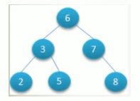

对该二叉树的节点查找发现：

深度为1的节点查找次数为：1

深度为2的节点查找次数为：2

深度为N的节点查找次数为：N

结论：因此其平均查找长度为：(1+2+2+3+3+3) / 6 = 2.3次

#### 问题

- 如果ID是持续递增的话，会出现什么样的结构？

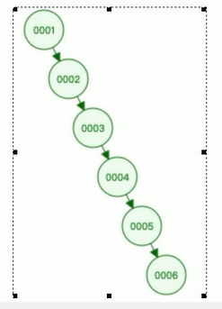

这样树型结构，又会退化到 O(n) 的时间复杂度


### 平衡二叉树（AVL）

#### 结构图

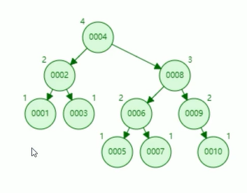

#### 问题

可以看出平衡二叉树的缺点就是

- 维护平衡过程的成本代价很高，因为每次删除一个节点或者增加一个节点的话，需要一次或多次的左旋和右旋去维护平衡状态
- 查询的效率不稳定，还要看运气的成分在里面
- 如果节点很多的话，那么这个AVL树的高度还是会很高的，查询效率会很低。

从算法的数学逻辑来讲，二叉树的查找速度和比较次数都是最小的，那为什么我们选择BTree?因为AVL还有一个问题，那就是 磁盘IO的问题

- 磁盘IO的次数，就是由树高来决定的，也即磁盘的IO次数最坏的情况下就等于树的高度。

因为节点存储的数据太少，没有很好的利用操作系统和磁盘数据交换的特性，也没有利用好磁盘IO的预读能力。因为操作系统和磁盘之间一次数据交换是以页为单位的，一页 = 4K，即每次IO操作系统会将4K数据加载镜像内存。但是在二叉树每个节点的结构只保存一个关键字 和 数据区，两个子节点的引用，并不能填满4K的内容，辛辛苦苦的做了一次IO操作，却只加载了一个关键字，在树的高度很高，恰好要搜索的关键字位于叶子节点或支节点的时候，取一个关键字要做很多次的IO。因此平衡二叉树不太适合MySQL的查询结构。

#### 解决方法

我们需要解决的就是树的高度问题，导致磁盘IO过多

那么就需要将树进行压缩，也就是将原来的瘦高 -> 矮胖，通过降低树的高度达到减少IO的次数

### B树

B树，又被称为 2-3树，也就是B树上的节点，可能是2，也可能是3

#### 结构图：

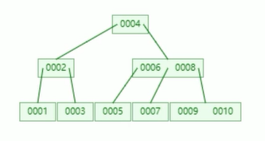

#### 底层原理

数据库索引是存储在磁盘上的，如果数据很大，必然导致索引的大小也会很大，超过几个G（好比新华字典字数多必然导致目录厚）

当我们利用索引查询时，是不可能将全部几个G的索引都加载进内存的，我们能做的只能是：

逐一加载每一个磁盘页，因为磁盘页对应着索引树的节点。

InnoDB的 page_size

```
SHOW GLOBAL STATUS LIKE 'Innodb_page_size';
```

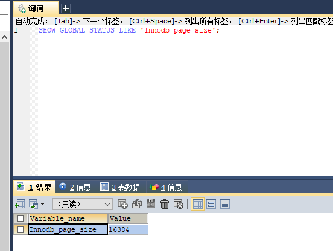

系统从磁盘读取数据到内存时是以磁盘块（block）为单位的，位于同一磁盘块中的数据会被一次性读取出来，而不是需要什么取什么

InnoDB存储引擎中有页(Page)的概念，页是其磁盘管理的最小单位。

系统一个磁盘块的存储空间往往没有这么大，因此InnoDB每次申请磁盘空间时都会是若干地址连续磁盘块来达到页的大小16KB。InnoDB在把磁盘数据读入到磁盘时会以页为基本单位，在查询数据时如果一个页中每条数据都有助于定位数据记录的位置，这将会减少磁盘I/O次数，提高效率。

一句话说：就是多个块填充到一页大小

#### 检索原理

B树比平衡二叉树减少了一次IO操作


每个节点占用一个盘块的磁盘空间，一个节点上有两个升序排序的关键字和三个指向子树根节点的指针，指针存储的是子节点所在磁盘块的地址。

模拟查找关键字29的过程

- 根据根节点找到磁盘块1，读入内存【磁盘IO操作1次】
- 比较关键字29在区间(17, 35)，找到磁盘块1的指针P2。
- 根据P2指针找到磁盘块3，读入内存。【磁盘IO操作第2次】
- 比较关键字29在区间(26, 30)，找到磁盘块3的指针P2。
- 根据P2指针找到磁盘块8，读入内存。【磁盘IO操作3次】
- 在磁盘块8中的关键字列表，找到关键字29

分析上述过程，发现需要3次IO操作，和3次内存查找操作，由于内存中的关键字是一个有序表结构，可以利用二分法查找提高效率。而3次磁盘IO操作是影响整个BTree查找效率的决定性因素。BTree相对于AVLTree缩减了节点个数，使每次磁盘IO取到内存的数据都发挥了作用，从而提高了查找效率。

### B+树

B+树把所有数据放在叶子节点，形成了链表，我们查找数据更方便

好查，好排序，好划定范围

#### B+树结构图

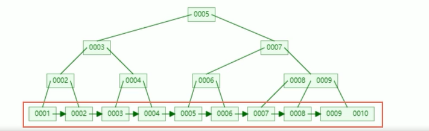

把两种数据结构集成在一块了：树 + 链表

图中可以看出所有的data信息都移动叶子节点中，而且子节点和子节点之间会有指针指向，这个也是B+树的核心点，这样可以大大提升范围查找效率，也方便遍历整个树。

- 非叶子节点不在存储数据，数据只存储在同一层的叶子节点上
- 叶子之间，增加链表，获取所有节点，不再需要中序遍历
- 这也说明了，B+树的检索性能比B树强

#### 检索原理

由于B+树的非叶子只存储键值信息，假设每个磁盘块能存储4个键值及指针信息，那就变成如下结构

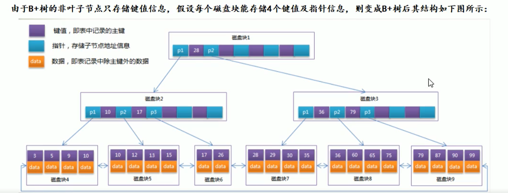

B树结构图中可以看出每个节点不仅包含数据的key值，还有data值，而每一页的存储空间是有限的，如果data数据较大时将会导致每个节点（即一个页）能存储的key的数量很小，当存储数量很大时同样会导致B树的深度较大，增大查询时的磁盘IO次数进而影响查询效率。

## Mysql为什么是B+树

B+树中，所有数据记录节点都是按照键值大小顺序存放在同一层叶子节点上，而非叶子节点上只存储key值信息，这样可以大大加大每个节点存储的key值数量，降低B+树的高度。

- InnoDB存储引擎的最小存储单元是页，页可以用于存放数据，也可以用于存放键值+指针，在B+树中叶子节点存放数据，而非叶子节点存放键值+指针
- 索引组织表通过非叶子节点的二分查找法以及指针确定数据在哪个页中，首先找到根页进而去数据页查找到需要的数据

B+树算法：通过集成B树的特征，B+树相比B树，新增叶子节点与非叶子节点关系，叶子节点包含了键值和数据，非叶子节点只是包含键值和子节点引用，不包含数据。

通过非叶子节点查询叶子节点获取相应的数据，所有相邻的叶子节点包含非叶子节点使用链表进行结合，叶子节点是顺序并且相邻节点有顺序引用关系。

#### 结论

从B树到B+树，B+树在B树的基础上的一种优化使其更适合实现外存储索引结构，InnoDB存储引擎就是用B+树实现的索引结构

一般我们存储的数据在百万级别的话，B+树的高度都是三层左右

B树和B+树的不同之处

- 非叶子节点只存储键值信息
- 所有叶子节点之间都有双向链指针
  - 可以基于叶子节点之间的范围查找
  - 或者基于根节点的查找
- 数据记录都存放在叶子节点中

## 参考

https://blog.csdn.net/qq_36520235/article/details/94317993

https://my.oschina.net/xiaoyoung/blog/3046779