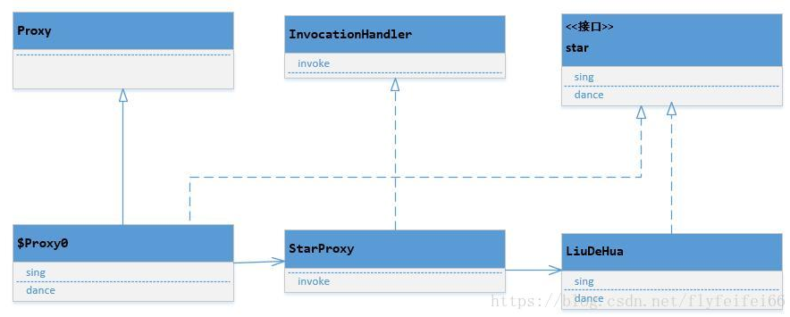

# Java两种动态代理JDK动态代理和CGLIB动态代理

## 代理模式

代理模式是23种设计模式的一种，他是指一个对象A通过持有另一个对象B，可以具有B同样的行为的模式。为了对外开放协议，B往往实现了一个接口，A也会去实现接口。但是B是“真正”实现类，A则比较“虚”，他借用了B的方法去实现接口的方法。A虽然是“伪军”，但它可以增强B，在调用B的方法前后都做些其他的事情。Spring AOP就是使用了动态代理完成了代码的动态“织入”。

使用代理好处还不止这些，一个工程如果依赖另一个工程给的接口，但是另一个工程的接口不稳定，经常变更协议，就可以使用一个代理，接口变更时，只需要修改代理，不需要一一修改业务代码。从这个意义上说，所有调外界的接口，我们都可以这么做，不让外界的代码对我们的代码有侵入，这叫防御式编程。代理其他的应用可能还有很多。

上述例子中，类A写死持有B，就是B的静态代理。如果A代理的对象是不确定的，就是动态代理。动态代理目前有两种常见的实现，jdk动态代理和cglib动态代理。

## JDK动态代理

jdk动态代理是jre提供给我们的类库，可以直接使用，不依赖第三方。先看下jdk动态代理的使用代码，再理解原理。首先有个“明星”接口类，有唱、跳两个功能：

```java
public interface Star
{
    String sing(String name);
    
    String dance(String name);
}
```

然后有明星实现类，“刘德华”

```java

public class LiuDeHua implements Star
{   
    @Override
    public String sing(String name)
    {
         System.out.println("给我一杯忘情水");
 
        return "唱完" ;
    }
    
    @Override
    public String dance(String name)
    {
        System.out.println("开心的马骝");
 
        return "跳完" ;
    }
}
```

明星演出前需要有人收钱，由于要准备演出，自己不做这个工作，一般交给一个经纪人。便于理解，它的名字以Proxy结尾，但他不是代理类，原因是它没有实现我们的明星接口，无法对外服务，它仅仅是一个wrapper。

```
package proxy;
 
import java.lang.reflect.InvocationHandler;
import java.lang.reflect.Method;
import java.lang.reflect.Proxy;
 
public class StarProxy implements InvocationHandler
{
    // 目标类，也就是被代理对象
    private Object target;
    
    public void setTarget(Object target)
    {
        this.target = target;
    }
    
    @Override
    public Object invoke(Object proxy, Method method, Object[] args) throws Throwable
    {
        // 这里可以做增强
        System.out.println("收钱");
        
        Object result = method.invoke(target, args);
        
        return result;
    }
    
    // 生成代理类
    public Object CreatProxyedObj()
    {
        return Proxy.newProxyInstance(target.getClass().getClassLoader(), target.getClass().getInterfaces(), this);
    }  
   
}
```

上述例子中，方法CreatProxyedObj返回的对象才是我们的代理类，它需要三个参数，前两个参数的意思是在同一个classloader下通过接口创建出一个对象，该对象需要一个属性，也就是第三个参数，它是一InvocationHandler。需要注意的是这个CreatProxyedObj方法不一定非得在我们的StarProxy类中，往往放在一个工厂类中。上述代理的代码使用过程一般如下：

- new一个目标对象

- new一个InvocationHandler，将目标对象set进去

- 通过CreatProxyedObj创建代理对象，强转为目标对象的接口类型即可使用，实际上生成的代理对象实现了目标接口。

```
Star ldh = new LiuDeHua();

StarProxy proxy = new StarProxy();

proxy.setTarget(ldh); 

Object obj = proxy.CreatProxyedObj();

Star star = (Star)obj;
```

Proxy（jdk类库提供）根据B的接口生成一个实现类，我们称为C，它就是动态代理类（该类型是 $Proxy+数字 的“新的类型”）。生成过程是：由于拿到了接口，便可以获知接口的所有信息（主要是方法的定义），也就能声明一个新的类型去实现该接口的所有方法，这些方法显然都是“虚”的，它调用另一个对象的方法。当然这个被调用的对象不能是对象B，如果是对象B，我们就没法增强了，等于饶了一圈又回来了。

所以它调用的是B的包装类，这个包装类需要我们来实现，但是jdk给出了约束，它必须实现InvocationHandler，上述例子中就是StarProxy， 这个接口里面有个方法，它是所有Target的所有方法的调用入口（invoke），调用之前我们可以加自己的代码增强。

看下我们的实现，我们在InvocationHandler里调用了对象B（target）的方法，调用之前增强了B的方法。

```java
@Override
public Object invoke(Object proxy, Method method, Object[] args) throws Throwable
{
    // 这里增强
    System.out.println("收钱");

    Object result = method.invoke(target, args);

    return result;
}
```

所以可以这么认为C代理了InvocationHandler，InvocationHandler代理了我们的类B，两级代理。

整个JDK动态代理的秘密也就这些，简单一句话，动态代理就是要生成一个包装类对象，由于代理的对象是动态的，所以叫动态代理。由于我们需要增强，这个增强是需要留给开发人员开发代码的，因此代理类不能直接包含被代理对象，而是一个InvocationHandler，该InvocationHandler包含被代理对象，并负责分发请求给被代理对象，分发前后均可以做增强。从原理可以看出，JDK动态代理是“对象”的代理。

下面看下动态代理类到底如何调用的InvocationHandler的，为什么InvocationHandler的一个invoke方法能为分发target的所有方法。C中的部分代码示例如下，通过反编译生成后的代码查看，摘自链接地址。Proxy创造的C是自己（Proxy）的子类，且实现了B的接口，一般都是这么修饰的：

```java
public final class XXX extends Proxy implements XXX
```

一个方法代码如下

```java
 
  public final String SayHello(String paramString)
  {
    try
    {
      return (String)this.h.invoke(this, m4, new Object[] { paramString });
    }
    catch (Error|RuntimeException localError)
    {
      throw localError;
    }
    catch (Throwable localThrowable)
    {
      throw new UndeclaredThrowableException(localThrowable);
    }
}    
```

可以看到，C中的方法全部通过调用h实现，其中h就是InvocationHandler，是我们在生成C时传递的第三个参数。这里还有个关键就是SayHello方法（业务方法）跟调用invoke方法时传递的参数m4一定要是一一对应的，但是这些对我们来说都是透明的，由Proxy在newProxyInstance时保证的。留心看到C在invoke时把自己this传递了过去，InvocationHandler的invoke的第一个方法也就是我们的动态代理实例类，业务上有需要就可以使用它。（所以千万不要在invoke方法里把请求分发给第一个参数，否则很明显就死循环了）C类中有B中所有方法的成员变量

```
private static Method m1;
private static Method m3;
private static Method m4;
private static Method m2;
private static Method m0;
```

这些变量在static静态代码块初始化，这些变量是在调用invocationhander时必要的入参，也让我们依稀看到Proxy在生成C时留下的痕迹。

```
static
  {
    try
    {
      m1 = Class.forName("java.lang.Object").getMethod("equals", new Class[] { Class.forName("java.lang.Object") });
      m3 = Class.forName("jiankunking.Subject").getMethod("SayGoodBye", new Class[0]);
      m4 = Class.forName("jiankunking.Subject").getMethod("SayHello", new Class[] { Class.forName("java.lang.String") });
      m2 = Class.forName("java.lang.Object").getMethod("toString", new Class[0]);
      m0 = Class.forName("java.lang.Object").getMethod("hashCode", new Class[0]);
      return;
    }
    catch (NoSuchMethodException localNoSuchMethodException)
    {
      throw new NoSuchMethodError(localNoSuchMethodException.getMessage());
    }
    catch (ClassNotFoundException localClassNotFoundException)
    {
      throw new NoClassDefFoundError(localClassNotFoundException.getMessage());
    }
  }
```

从以上分析来看，要想彻底理解一个东西，再多的理论不如看源码，底层的原理非常重要。

jdk动态代理类图如下



## CGLIB动态代理

我们了解到，“代理”的目的是构造一个和被代理的对象有同样行为的对象，一个对象的行为是在类中定义的，对象只是类的实例。所以构造代理，不一定非得通过持有、包装对象这一种方式。

通过“继承”可以继承父类所有的公开方法，然后可以重写这些方法，在重写时对这些方法增强，这就是cglib的思想。根据里氏代换原则（LSP），父类需要出现的地方，子类可以出现，所以cglib实现的代理也是可以被正常使用的。

先看下代码

```java
package proxy;
 
import java.lang.reflect.Method;
 
import net.sf.cglib.proxy.Enhancer;
import net.sf.cglib.proxy.MethodInterceptor;
import net.sf.cglib.proxy.MethodProxy;
 
public class CglibProxy implements MethodInterceptor
{
    // 根据一个类型产生代理类，此方法不要求一定放在MethodInterceptor中
    public Object CreatProxyedObj(Class<?> clazz)
    {
        Enhancer enhancer = new Enhancer();
        
        enhancer.setSuperclass(clazz);
        
        enhancer.setCallback(this);
        
        return enhancer.create();
    }
    
    @Override
    public Object intercept(Object arg0, Method arg1, Object[] arg2, MethodProxy arg3) throws Throwable
    {
        // 这里增强
        System.out.println("收钱");
        
        return arg3.invokeSuper(arg0, arg2);
    } 
}
```

从代码可以看出，它和jdk动态代理有所不同，对外表现上看CreatProxyedObj，它只需要一个类型clazz就可以产生一个代理对象， 所以说是“类的代理”，且创造的对象通过打印类型发现也是一个新的类型。不同于jdk动态代理，jdk动态代理要求对象必须实现接口（三个参数的第二个参数），cglib对此没有要求。

cglib的原理是这样，它生成一个继承B的类型C（代理类），这个代理类持有一个MethodInterceptor，我们setCallback时传入的。 C重写所有B中的方法（方法名一致），然后在C中，构建名叫“CGLIB”+“$父类方法名$”的方法（下面叫cglib方法，所有非private的方法都会被构建），方法体里只有一句话super.方法名()，可以简单的认为保持了对父类方法的一个引用，方便调用。

这样的话，C中就有了重写方法、cglib方法、父类方法（不可见），还有一个统一的拦截方法（增强方法intercept）。其中重写方法和cglib方法肯定是有映射关系的。

C的重写方法是外界调用的入口（LSP原则），它调用MethodInterceptor的intercept方法，调用时会传递四个参数，第一个参数传递的是this，代表代理类本身，第二个参数标示拦截的方法，第三个参数是入参，第四个参数是cglib方法，intercept方法完成增强后，我们调用cglib方法间接调用父类方法完成整个方法链的调用。

这里有个疑问就是intercept的四个参数，为什么我们使用的是arg3而不是arg1?

```
    @Override
    public Object intercept(Object arg0, Method arg1, Object[] arg2, MethodProxy arg3) throws Throwable
    {
        System.out.println("收钱");
        
        return arg3.invokeSuper(arg0, arg2);
    }
```

 因为如果我们通过反射 arg1.invoke(arg0, ...)这种方式是无法调用到父类的方法的，子类有方法重写，隐藏了父类的方法，父类的方法已经不可见，如果硬调arg1.invoke(arg0, ...)很明显会死循环。

所以调用的是cglib开头的方法，但是，我们使用arg3也不是简单的invoke，而是用的invokeSuper方法，这是因为cglib采用了fastclass机制，不仅巧妙的避开了调不到父类方法的问题，还加速了方法的调用。

fastclass基本原理是，给每个方法编号，通过编号找到方法执行避免了通过反射调用。

对比JDK动态代理，cglib依然需要一个第三者分发请求，只不过jdk动态代理分发给了目标对象，cglib最终分发给了自己，通过给method编号完成调用。cglib是继承的极致发挥，本身还是很简单的，只是fastclass需要另行理解。

## JDK动态代理和CGLIB的区别

DK动态代理只能对实现了接口的类生成代理，而不能针对类。

CGLIB是针对类实现代理，主要是对指定的类生成一个子类，覆盖其中的方法，并覆盖其中方法实现增强，但是因为采用的是继承，所以该类或方法最好不要声明成final， 对于final类或方法，是无法继承的

使用CGLib实现动态代理，CGLib底层采用ASM字节码生成框架，使用字节码技术生成代理类，在jdk6之前比使用Java反射效率要高。唯一需要注意的是，CGLib不能对声明为final的方法进行代理，因为CGLib原理是动态生成被代理类的子类

在jdk6、jdk7、jdk8逐步对JDK动态代理优化之后，在调用次数较少的情况下，JDK代理效率高于CGLIB代理效率，只有当进行大量调用的时候，jdk6和jdk7比CGLIB代理效率低一点，但是到jdk8的时候，jdk代理效率高于CGLIB代理，总之，每一次jdk版本升级，jdk代理效率都得到提升，而CGLIB代理消息确有点跟不上步伐Spring如何选择用

JDK还是CGLIB？

- 当Bean实现接口时，Spring就会用JDK的动态代理。
- 当Bean没有实现接口时，Spring使用CGlib是实现。

为什么继承只能使用CGLib，因为JDK代理生成的代理类，默认会继承一个类，由于java是单继承，所以当原始类继承一个类的时候，只能使用CGLib动态代理

## 总结

- 如果目标对象实现了接口，默认情况下会采用JDK的动态代理实现AOP。
- 如果目标对象实现了接口，可以强制使用CGLIB实现AOP。
- 如果目标对象没有实现了接口，必须采用CGLIB库，Spring会自动在JDK动态代理和CGLIB之间转换


JDK代理是不需要第三方库支持，只需要JDK环境就可以进行代理，使用条件:

- 实现InvocationHandler 

- 使用Proxy.newProxyInstance产生代理对象

- 被代理的对象必须要实现接口


CGLib必须依赖于CGLib的类库，但是它需要类来实现任何接口代理的是指定的类生成一个子类，


## 来源

https://blog.csdn.net/yhl_jxy/article/details/80635012

https://blog.csdn.net/flyfeifei66/article/details/81481222