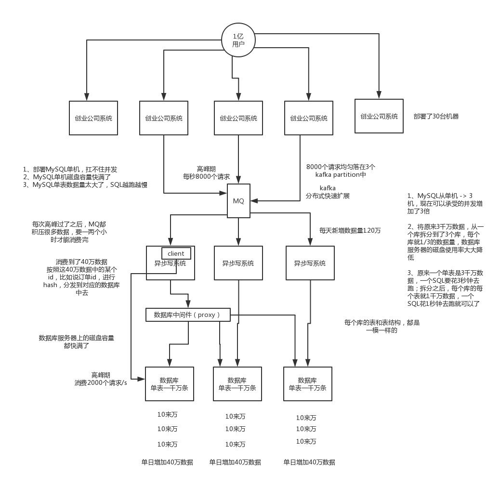
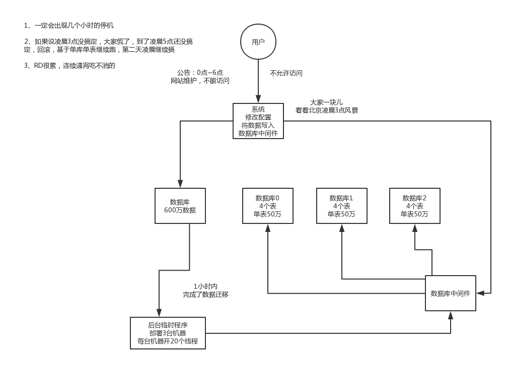
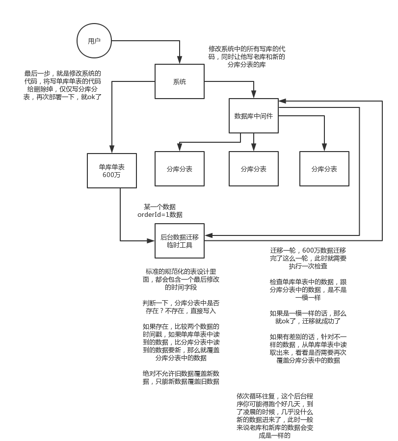

# 数据库分库分表的面试连环炮

## 面试题

- 为什么要分库分表？（设计高并发系统的时候，数据库层面该如何设计）
- 用过哪些分库分表中间件？
- 不同的分库分表中间件都有什么优缺点？
- 你们具体是如何对数据库如何进行垂直拆分或水平拆分的？
- 现在有一个未分库分表的系统，未来要分库分表，如何设计才可以让系统从未分库分表动态切换到分库分表上？
- 如何设计可以动态扩容缩容的分库分表方案？
- 分库分表后，ID主键如何处理？

## 为什么要分库分表？

说白了，分库分表是两回事儿，大家可别搞混了，可能是光分库不分表，也可能是光分表不分库，都有可能。我先给大家抛出来一个场景。

假如我们现在是一个小创业公司（或者是一个BAT公司刚兴起的一个新部门），现在注册用户就20万，每天活跃用户就1万，每天单表数据量就1000，然后高峰期每秒钟并发请求最多就10。。。天，就这种系统，随便找一个有几年工作经验的，然后带几个刚培训出来的，随便干干都可以。

结果没想到我们运气居然这么好，碰上个CEO带着我们走上了康庄大道，业务发展迅猛，过了几个月，注册用户数达到了2000万！每天活跃用户数100万！每天单表数据量10万条！高峰期每秒最大请求达到1000！同时公司还顺带着融资了两轮，紧张了几个亿人民币啊！公司估值达到了惊人的几亿美金！这是小独角兽的节奏！

好吧，没事，现在大家感觉压力已经有点大了，为啥呢？因为每天多10万条数据，一个月就多300万条数据，现在咱们单表已经几百万数据了，马上就破千万了。但是勉强还能撑着。高峰期请求现在是1000，咱们线上部署了几台机器，负载均衡搞了一下，数据库撑1000 QPS也还凑合。但是大家现在开始感觉有点担心了，接下来咋整呢。。。。。。

再接下来几个月，我的天，CEO太牛逼了，公司用户数已经达到1亿，公司继续融资几十亿人民币啊！公司估值达到了惊人的几十亿美金，成为了国内今年最牛逼的明星创业公司！天，我们太幸运了。

但是我们同时也是不幸的，因为此时每天活跃用户数上千万，每天单表新增数据多达50万，目前一个表总数据量都已经达到了两三千万了！扛不住啊！数据库磁盘容量不断消耗掉！高峰期并发达到惊人的5000~8000！别开玩笑了，哥。我跟你保证，你的系统支撑不到现在，已经挂掉了！

好吧，所以看到你这里你差不多就理解分库分表是怎么回事儿了，实际上这是跟着你的公司业务发展走的，你公司业务发展越好，用户就越多，数据量越大，请求量越大，那你单个数据库一定扛不住。

 比如你单表都几千万数据了，你确定你能抗住么？绝对不行，单表数据量太大，会极大影响你的sql执行的性能，到了后面你的sql可能就跑的很慢了。一般来说，就以我的经验来看，单表到几百万的时候，性能就会相对差一些了，你就得分表了。

 分表是啥意思？就是把一个表的数据放到多个表中，然后查询的时候你就查一个表。比如按照用户id来分表，将一个用户的数据就放在一个表中。然后操作的时候你对一个用户就操作那个表就好了。这样可以控制每个表的数据量在可控的范围内，比如每个表就固定在200万以内。

 分库是啥意思？就是你一个库一般我们经验而言，最多支撑到并发2000，一定要扩容了，而且一个健康的单库并发值你最好保持在每秒1000左右，不要太大。那么你可以将一个库的数据拆分到多个库中，访问的时候就访问一个库好了。

 这就是所谓的分库分表，为啥要分库分表？你明白了吧



## 用过哪些分库分表中间件？

### 分类

数据库中间件分为两类

- proxy：中间经过一层代理，需要独立部署
- client：在客户端就知道指定到那个数据库

### 各个中间件

这个其实就是看看你了解哪些分库分表的中间件，各个中间件的优缺点是啥？然后你用过哪些分库分表的中间件。

 比较常见的包括：cobar、TDDL、atlas、sharding-jdbc、mycat

 cobar：阿里b2b团队开发和开源的，属于proxy层方案。早些年还可以用，但是最近几年都没更新了，基本没啥人用，差不多算是被抛弃的状态吧。而且不支持读写分离、存储过程、跨库join和分页等操作。

 TDDL：淘宝团队开发的，属于client层方案。不支持join、多表查询等语法，就是基本的crud语法是ok，但是支持读写分离。目前使用的也不多，因为还依赖淘宝的diamond配置管理系统。

 atlas：360开源的，属于proxy层方案，以前是有一些公司在用的，但是确实有一个很大的问题就是社区最新的维护都在5年前了。所以，现在用的公司基本也很少了。

 sharding-jdbc：当当开源的，属于client层方案。确实之前用的还比较多一些，因为SQL语法支持也比较多，没有太多限制，而且目前推出到了2.0版本，支持分库分表、读写分离、分布式id生成、柔性事务（最大努力送达型事务、TCC事务）。而且确实之前使用的公司会比较多一些（这个在官网有登记使用的公司，可以看到从2017年一直到现在，是不少公司在用的），目前社区也还一直在开发和维护，还算是比较活跃，个人认为算是一个现在也可以选择的方案。

 mycat：基于cobar改造的，属于proxy层方案，支持的功能非常完善，而且目前应该是非常火的而且不断流行的数据库中间件，社区很活跃，也有一些公司开始在用了。但是确实相比于sharding jdbc来说，年轻一些，经历的锤炼少一些。

### 总结

 所以综上所述，现在其实建议考量的，就是sharding-jdbc和mycat，这两个都可以去考虑使用。

sharding-jdbc这种client层方案的优点在于不用部署，运维成本低，不需要代理层的二次转发请求，性能很高，但是如果遇到升级啥的需要各个系统都重新升级版本再发布，各个系统都需要耦合sharding-jdbc的依赖；

mycat这种proxy层方案的缺点在于需要部署，自己及运维一套中间件，运维成本高，但是好处在于对于各个项目是透明的，如果遇到升级之类的都是自己中间件那里搞就行了。

通常来说，这两个方案其实都可以选用，但是我个人建议中小型公司选用sharding-jdbc，client层方案轻便，而且维护成本低，不需要额外增派人手，而且中小型公司系统复杂度会低一些，项目也没那么多；

但是中大型公司最好还是选用mycat这类proxy层方案，因为可能大公司系统和项目非常多，团队很大，人员充足，那么最好是专门弄个人来研究和维护mycat，然后大量项目直接透明使用即可。

我们，数据库中间件都是自研的，也用过proxy层，后来也用过client层

## 如何对数据库如何进行垂直拆分或水平拆分的？

### 拆分方法

- 垂直拆分
- 水平拆分

### 水平拆分

 水平拆分的意思，就是把一个表的数据给弄到多个库的多个表里去，但是每个库的表结构都一样，只不过每个库表放的数据是不同的，所有库表的数据加起来就是全部数据。水平拆分的意义，就是将数据均匀放更多的库里，然后用多个库来抗更高的并发，还有就是用多个库的存储容量来进行扩容。

### 垂直拆分

垂直拆分的意思，就是把一个有很多字段的表给拆分成多个表，或者是多个库上去。每个库表的结构都不一样，每个库表都包含部分字段。一般来说，会将较少的访问频率很高的字段放到一个表里去，然后将较多的访问频率很低的字段放到另外一个表里去。因为数据库是有缓存的，你访问频率高的行字段越少，就可以在缓存里缓存更多的行，性能就越好。这个一般在表层面做的较多一些。

 这个其实挺常见的，不一定我说，大家很多同学可能自己都做过，把一个大表拆开，订单表、订单支付表、订单商品表。

 还有表层面的拆分，就是分表，将一个表变成N个表，就是让每个表的数据量控制在一定范围内，保证SQL的性能。否则单表数据量越大，SQL性能就越差。一般是200万行左右，不要太多，但是也得看具体你怎么操作，也可能是500万，或者是100万。你的SQL越复杂，就最好让单表行数越少。

 好了，无论是分库了还是分表了，上面说的那些数据库中间件都是可以支持的。就是基本上那些中间件可以做到你分库分表之后，中间件可以根据你指定的某个字段值，比如说userid，自动路由到对应的库上去，然后再自动路由到对应的表里去。

 你就得考虑一下，你的项目里该如何分库分表？一般来说，垂直拆分，你可以在表层面来做，对一些字段特别多的表做一下拆分；水平拆分，你可以说是并发承载不了，或者是数据量太大，容量承载不了，你给拆了，按什么字段来拆，你自己想好；分表，你考虑一下，你如果哪怕是拆到每个库里去，并发和容量都ok了，但是每个库的表还是太大了，那么你就分表，将这个表分开，保证每个表的数据量并不是很大。

 而且这儿还有两种分库分表的方式，一种是按照range来分，就是每个库一段连续的数据，这个一般是按比如时间范围来的，但是这种一般较少用，因为很容易产生热点问题，大量的流量都打在最新的数据上了；或者是按照某个字段hash一下均匀分散，这个较为常用。

 range来分，好处在于说，后面扩容的时候，就很容易，因为你只要预备好，给每个月都准备一个库就可以了，到了一个新的月份的时候，自然而然，就会写新的库了；缺点，但是大部分的请求，都是访问最新的数据。实际生产用range，要看场景，你的用户不是仅仅访问最新的数据，而是均匀的访问现在的数据以及历史的数据

 hash分法，好处在于说，可以平均分配没给库的数据量和请求压力；坏处在于说扩容起来比较麻烦，会有一个数据迁移的这么一个过程

## 如何让系统不停机迁移到分库分表

现在有一个未分库分表的系统，未来要分库分表，如何设计才可以让系统从未分库分表动态切换到分库分表上？

### 剖析

你看看，你现在已经明白为啥要分库分表了，你也知道常用的分库分表中间件了，你也设计好你们如何分库分表的方案了（水平拆分、垂直拆分、分表），那问题来了，你接下来该怎么把你那个单库单表的系统给迁移到分库分表上去？所以这都是一环扣一环的，就是看你有没有全流程经历过这个过程

假设，你现有有一个单库单表的系统，在线上在跑，假设单表有600万数据，3个库，每个库里分了4个表，每个表要放50万的数据量

假设你已经选择了一个分库分表的数据库中间件，sharding-jdbc，mycat，都可以，你怎么把线上系统平滑地迁移到分库分表上面去

### 停机迁移方案

我先给你说一个最low的方案，就是很简单，大家伙儿凌晨12点开始运维，网站或者app挂个公告，说0点到早上6点进行运维，无法访问。。。。。。

接着到0点，停机，系统挺掉，没有流量写入了，此时老的单库单表数据库静止了。然后你之前得写好一个导数的一次性工具，此时直接跑起来，然后将单库单表的数据哗哗哗读出来，写到分库分表里面去。

导数完了之后，就ok了，修改系统的数据库连接配置啥的，包括可能代码和SQL也许有修改，那你就用最新的代码，然后直接启动连到新的分库分表上去。

验证一下，ok了，完美，大家伸个懒腰，看看看凌晨4点钟的北京夜景，打个滴滴回家吧

但是这个方案比较low，谁都能干，我们来看看高大上一点的方案

 

### 双写迁移方案

这个是我们常用的一种迁移方案，比较靠谱一些，不用停机，不用看北京凌晨4点的风景

简单来说，就是在线上系统里面，之前所有写库的地方，增删改操作，都除了对老库增删改，都加上对新库的增删改，这就是所谓双写，同时写俩库，老库和新库。

然后系统部署之后，新库数据差太远，用之前说的导数工具，跑起来读老库数据写新库，写的时候要根据gmt_modified这类字段判断这条数据最后修改的时间，除非是读出来的数据在新库里没有，或者是比新库的数据新才会写。

接着导万一轮之后，有可能数据还是存在不一致，那么就程序自动做一轮校验，比对新老库每个表的每条数据，接着如果有不一样的，就针对那些不一样的，从老库读数据再次写。反复循环，直到两个库每个表的数据都完全一致为止。

接着当数据完全一致了，就ok了，基于仅仅使用分库分表的最新代码，重新部署一次，不就仅仅基于分库分表在操作了么，还没有几个小时的停机时间，很稳。所以现在基本玩儿数据迁移之类的，都是这么干了。



## 如何设计可以动态扩容的分库分表方案？

### 思考步骤

- 选择一个数据库中间件，调研、学习、测试
- 设计你的分库分表的一个方案，你要分成多少个库，每个库分成多少个表，3个库每个库4个表
- 基于选择好的数据库中间件，以及在测试环境建立好的分库分表的环境，然后测试一下能否正常进行分库分表的读写
- 完成单库单表到分库分表的迁移，双写方案
- 线上系统开始基于分库分表对外提供服务
- 扩容了，扩容成6个库，每个库需要12个表，你怎么来增加更多库和表呢？

这个是你必须面对的一个事儿，就是你已经弄好分库分表方案了，然后一堆库和表都建好了，基于分库分表中间件的代码开发啥的都好了，测试都ok了，数据能均匀分布到各个库和各个表里去，而且接着你还通过双写的方案咔嚓一下上了系统，已经直接基于分库分表方案在搞了。 

那么现在问题来了，你现在这些库和表又支撑不住了，要继续扩容咋办？这个可能就是说你的每个库的容量又快满了，或者是你的表数据量又太大了，也可能是你每个库的写并发太高了，你得继续扩容。

### 停机扩容

这个方案就跟停机迁移一样，步骤几乎一致，唯一的一点就是那个导数的工具，是把现有库表的数据抽出来慢慢倒入到新的库和表里去。但是最好别这么玩儿，有点不太靠谱，因为既然分库分表就说明数据量实在是太大了，可能多达几亿条，甚至几十亿，你这么玩儿，可能会出问题。

从单库单表迁移到分库分表的时候，数据量并不是很大，单表最大也就两三千万

写个工具，多弄几台机器并行跑，1小时数据就导完了

3个库+12个表，跑了一段时间了，数据量都1亿~2亿了。光是导2亿数据，都要导个几个小时，6点，刚刚导完数据，还要搞后续的修改配置，重启系统，测试验证，10点才可以搞完

###  优化后的方案

一开始上来就是32个库，每个库32个表，1024张表

我可以告诉各位同学说，这个分法，第一，基本上国内的互联网肯定都是够用了，第二，无论是并发支撑还是数据量支撑都没问题

每个库正常承载的写入并发量是1000，那么32个库就可以承载32 * 1000 = 32000的写并发，如果每个库承载1500的写并发，32 * 1500 = 48000的写并发，接近5万/s的写入并发，前面再加一个MQ，削峰，每秒写入MQ 8万条数据，每秒消费5万条数据。

有些除非是国内排名非常靠前的这些公司，他们的最核心的系统的数据库，可能会出现几百台数据库的这么一个规模，128个库，256个库，512个库，1024张表，假设每个表放500万数据，在MySQL里可以放50亿条数据

每秒的5万写并发，总共50亿条数据，对于国内大部分的互联网公司来说，其实一般来说都够了

谈分库分表的扩容，第一次分库分表，就一次性给他分个够，32个库，1024张表，可能对大部分的中小型互联网公司来说，已经可以支撑好几年了

一个实践是利用32 * 32来分库分表，即分为32个库，每个库里一个表分为32张表。一共就是1024张表。根据某个id先根据32取模路由到库，再根据32取模路由到库里的表。

刚开始的时候，这个库可能就是逻辑库，建在一个数据库上的，就是一个mysql服务器可能建了n个库，比如16个库。后面如果要拆分，就是不断在库和mysql服务器之间做迁移就可以了。然后系统配合改一下配置即可。

比如说最多可以扩展到32个数据库服务器，每个数据库服务器是一个库。如果还是不够？最多可以扩展到1024个数据库服务器，每个数据库服务器上面一个库一个表。因为最多是1024个表么。

这么搞，是不用自己写代码做数据迁移的，都交给dba来搞好了，但是dba确实是需要做一些库表迁移的工作，但是总比你自己写代码，抽数据导数据来的效率高得多了。


哪怕是要减少库的数量，也很简单，其实说白了就是按倍数缩容就可以了，然后修改一下路由规则。

```
对2 ^ n取模

orderId 模 32 = 库

orderId / 32 模 32 = 表

259      3        8

1189     5        5

352      0        11

4593     17       15
```

### 总结

- 设定好几台数据库服务器，每台服务器上几个库，每个库多少个表，推荐是32库 * 32表，对于大部分公司来说，可能几年都够了
- 路由的规则，orderId 模 32 = 库，orderId / 32 模 32 = 表
- 扩容的时候，申请增加更多的数据库服务器，装好mysql，倍数扩容，4台服务器，扩到8台服务器，16台服务
- 由dba负责将原先数据库服务器的库，迁移到新的数据库服务器上去，很多工具，库迁移，比较便捷
-  我们这边就是修改一下配置，调整迁移的库所在数据库服务器的地址
-  重新发布系统，上线，原先的路由规则变都不用变，直接可以基于2倍的数据库服务器的资源，继续进行线上系统的提供服务