# 消息队列的面试连环炮

## 前言

- 你用过消息队列么？
- 说说你们项目里是怎么用消息队列的？
  - 我们有一个订单系统，订单系统会每次下一个新订单的时候，就会发送一条消息到ActiveMQ里面去，后台有一个库存系统，负责获取消息，然后更新库存。
- 为什么使用消息队列？
  - 你的订单系统不发送消息到MQ，而是直接调用库存系统的一个接口，然后直接调用成功了，库存也更新了，那就不需要使用消息队列了呀
  - 使用消息队列的主要作用是：异步、解耦、削峰
- 消息队列都有什么优缺点？
- Kafka、activeMQ、RibbitMQ、RocketMQ都有什么优缺点？
- 如何保证消息队列的高可用？
- 如何保证消息不被重复消费？如何保证消息消费时的幂等性？
- 如何保证消息的可靠性传输，要是消息丢失了怎么办？
- 如何保证消息的顺序性？
- 如何解决消息队列的延时以及过期失效问题？消息队列满了以后该怎么处理？有几百万消息持续积压几小时，说说怎么解决？
- 如果让你写一个消息队列，该如何进行架构设计，说一下你的思路？

面试官问的问题不是发散的，而是从点、铺开，比如先聊一聊高并发的话题，就这个话题里面继续聊聊缓存、MQ等等东西。对于每个小话题，比如说MQ，就会从浅入深。

## 为什么使用消息队列？

### 剖析

首先明白为什么系统中要使用到消息队列这种东西？

因为之前面试的大量候选人，说自己项目中使用了Redis，MQ，但是其实他们并不清楚为什么要用这个东西，说白了就是为了用而用，或者是别人设计的架构，从头到尾就没有思考过。

没有对自己的架构问过为什么的人，一定是平时没有思考的人，面试官对这类候选人印象通常不好。

### 解答

其实就是问问你消息队列有哪些场景，然后你项目里面的具体是什么场景，说说你在这个场景里用什么消息队列是什么？

消息队列的场景使用场景很多，主要是三个：解耦、异步、和削峰

### 解耦

#### 不使用MQ时

A系统发送数据到B、C、D系统，但没有使用消息队列时候的耦合场景

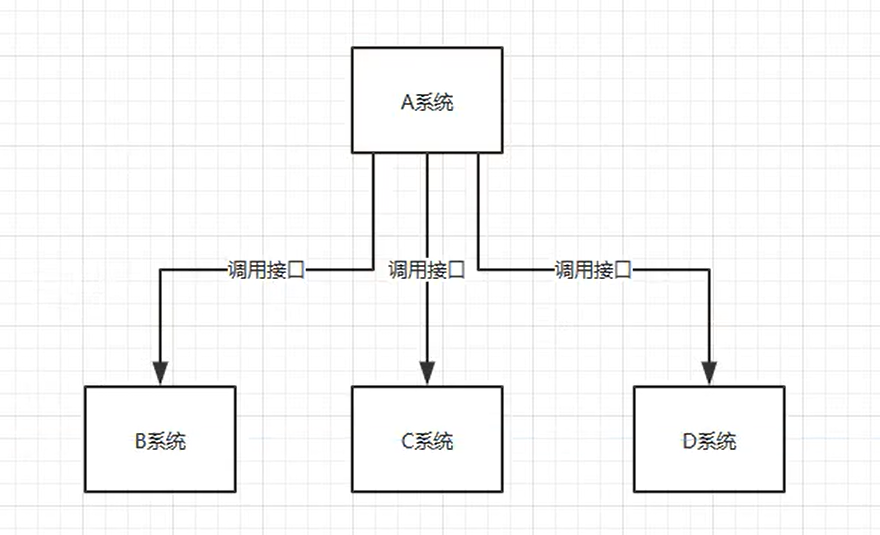

当后面系统不断增加，比如 E，F系统的加入，以及D系统的移除

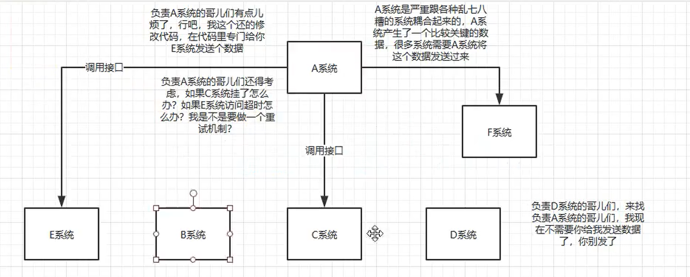

因为A系统和其它各种系统耦合起来，那么需要处理的事情会给出多

#### 使用MQ后

系统A发送一条消息，到消息队列中，哪个系统需要获取到哪里，那么从MQ中消费数据，如果新系统E加入的话，那么只需要编写代码，然后也直接从MQ中消费即可，当系统D不需要这个数据时，那么只需要不对该消息进行消费即可。系统A不需要考虑给谁发送数据，也不需要维护这个代码，不需要考虑人家是否调用成功、失败、超时等等情况


总结：通过一个MQ，发布和订阅模型，Pub/Sub模型，系统A就和其它系统彻底解耦。

需要考虑一下负责的系统中，是否有类似的场景，就是一个系统或者一个模块，调用了多个系统，互相之间的调用很复杂，维护起来很麻烦。但是其实这个调用是不需要同步调用接口的，如果用MQ给他异步化解耦，也是可以的，这个时候可以考虑在自己的项目中，是不是可以运用这个MQ来进行系统的解耦。

### 异步

#### 不用MQ的同步高延时请求场景

下面的一个场景就是系统A，调用了其它三个系统的服务，我们发现用户在执行一个请求后，需要花费很长的时间

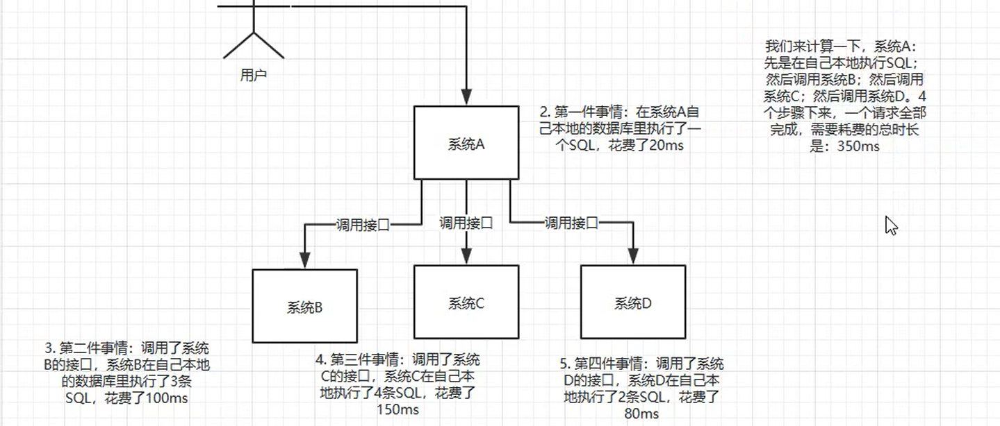

我们发现，用户执行一个接口，就需要花费350毫秒，假设我们将每个接口的耗时增加，可能会将近花费1秒，这个时候一般用户几乎不能接受，因为一般互联网类的企业，对用户的直接操作，一般要求是每个请求都必须在200ms以内完成，因为这个是对用户是无感知的

#### 使用MQ进行异步化

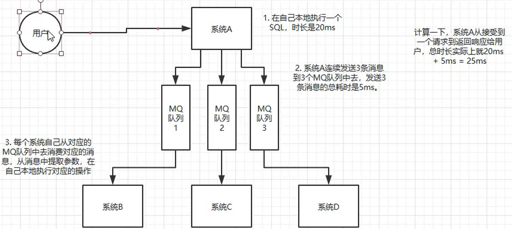

系统A只需要发送消息到MQ中就直接返回了，然后其它系统各自在MQ中进行消费。用户在执行系统A的时候，就会感觉非常快就得到响应了。

### 削峰

#### 没有用MQ的削峰


一般的MySQL，抗到QPS=2000的时候就已经达到了瓶颈，如果每秒请求达到了5000的话，可能直接就把MySQL打死了。如果MySQL被打死，然后整个系统就崩溃，然后系统就没法使用。

但是中午的高峰期过了之后，到下午的时候，就成了低峰期，可能也就一万用户同时在网站上操作，每秒的请求数量可能就50个请求，对整个系统几乎没有任何压力。

#### 使用MQ来进行削峰

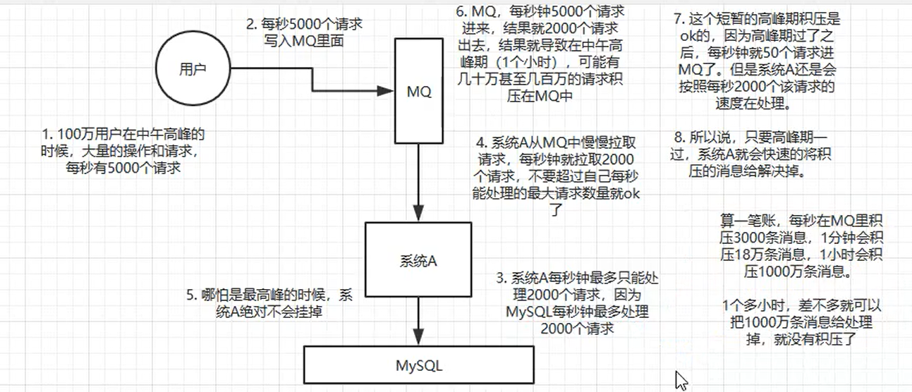

削峰就是大量的请求过来，然后MQ将其消化掉了，然后通过其它系统从MQ中取消息，在逐步进行消费，保证系统的有序运行。一般高峰期不会持续太长，在一段时间后，就会被下游系统消化掉。

## 消息队列有什么优点和缺点？

优点上面已经说了：解耦、异步、削峰，缺点呢？显而易见的

- 系统可用性降低：系统引入的外部依赖越多，越容易挂掉，本来你就是A系统调用BCD三个系统接口就好了，人家ABCD四个系统好好的，没啥问题，这个时候却加入了MQ进来，万一MQ挂了怎么办？MQ挂了整套系统也会崩溃了。
- 系统复杂性提高：硬生生加个MQ进来，你怎么保证消息没有重复消费？怎么处理消息丢失的情况？怎么保证消息传递的顺序性？
- 一致性问题：A系统处理完了直接返回成功了，人都以为你的请求成功了，但是问题是，要在BCD三个系统中，BD两个系统写库成功了，结果C系统写库失败了，这样就会存在数据不一致的问题。
- 所以说消息队列实际上是一种复杂的架构，你引入它有好多好处，但是也得针对它带来的坏处做各种额外的技术方案和架构来规避掉，最后发现系统复杂性提升了一个数量级，也许是复杂10倍，但是关键时刻，用还是得用。


## 有什么区别，以及适用场景？

主流MQ包括：kafka、ActiveMQ、RabbitMQ和RocketMQ

常见的MQ其实就上面的四种

| 特性       | ActiveMQ                                                     | RabbitMQ                                                     | RocketMQ                                                     | Kafka                                                        |
| ---------- | ------------------------------------------------------------ | ------------------------------------------------------------ | ------------------------------------------------------------ | ------------------------------------------------------------ |
| 单机吞吐量 | 万级，吞吐量比RocketMQ和Kafka要低一个数量级                  | 万级，吞吐量比RocketMQ和Kafka要低一个数量级                  | 10万级，RocketMQ也是可以支撑高吞吐的一种MQ                   | 10万级1这是kafka最大的优点，就是吞吐量高。一般配置和数据类的系统进行实时数据计算、日志采集等场景 |
| 时效性     | ms级                                                         | 微妙级，这是RabbitMQ的一大特点，就是延迟最低                 | ms级                                                         | 延迟在ms级内                                                 |
| 可用性     | 基于主从架构实现高可用                                       | 高，基于主从架构实现高可用                                   | 非常高，分布式架构                                           | 非常高，kafka是分布式的，一个数据多个副本，少数机器宕机后，不会丢失数据，不会导致不可用 |
| 消息可靠性 | 有较低的概率丢失数据                                         | 消息不丢失                                                   | 经过参数优化配置，可以做到0丢失                              | 经过参数优化配置可以做到0丢失                                |
| 核心特点   | MQ领域的功能及其完备                                         | 基于Erlang开发，所以并发能力强，性能及其好，延时很低         | MQ功能较为完善，还是分布式的，扩展性好                       | 功能较为简单，主要支持简单的MQ功能，在大数据领域的实时计算以及日志采集被大规模使用，是实时上的标准。 |
|            | 非常成熟，功能强大，在业内大量公司以及项目都有应用。  但是偶尔消息丢失的概率，并且现在社区以及国内应用都越来越少，官方社区对ActiveMQ5.X维护越来越少，而且确实主要是基于解耦和异步来用的，较少在大规模吞吐场景中使用 | erlang语言开发的，性能及其好，延时很低。而且开源的版本，就提供的管理界面非常棒，在国内一些互联网公司近几年用RabbitMQ也是比较多一些，特别适用于中小型的公司 缺点显而易见，就是吞吐量会低一些，这是因为它做的实现机制比较中，因为使用erlang开发，目前没有多少公司使用其开发。所以针对源码界别的定制，非常困难，因此公司的掌控非常弱，只能依赖于开源社区的维护。 | 接口简单易用，毕竟在阿里大规模应用过，有阿里平台保障，日处理消息上 百亿之多，可以做到大规模吞吐，性能也非常好，分布式扩展也很方便，社区维护还可以，可靠性和可用性都是OK的，还可以支撑大规模的topic数量，支持复杂MQ业务场景。 | 仅仅提供较少的核心功能，但是提供超高的吞吐量，ms级别的延迟，极高的可用性以及可靠性，分布式可以任意扩展。    同时kafka最好是支撑较少的topic数量即可，保证其超高的吞吐量。 |

综上所述：

- 一般的业务要引入MQ，最早大家都是用ACviceMQ，但是现在大家用的不多了，没有经过大规模吞吐量场景的验证，社区也不是很活跃，所以大家还是算了，不太图鉴使用
- RabbitMQ后面被大量的中小型公司所使用，但是erlang语言阻碍了大量的Java工程师深入研究和掌握它，对公司而言，几乎处于不可控的状态，但是RabbitMQ目前开源稳定，活跃度也表较高。
- RocketMQ是阿里开源的一套消息中间件，目前也已经经历了天猫双十一，同时底层使用Java进行开发

如果中小型企业技术实力一般，技术挑战不是很高，可以推荐，RabbitMQ。如果公司的基础研发能力很强，想精确到源码级别的掌握，那么推荐使用RocketMQ。同时如果项目是聚焦于大数据领域的实时计算，日志采集等场景，那么Kafka是业内标准。


## 

## 如何保证消息队列的高可用？

### 剖析

这个问题用的很好，不会具体到某个MQ，而是问一个整体，然后通过你使用的MQ，来具体谈谈该MQ的可用性的理解。

### RabbitMQ高可用性

RabbitMQ是比较有代表性的，因为是基于主从做高可用性的。

RabbitMQ 三种模式：单机模式，普通集群模式，镜像集群模式

#### 单机模式

就是demo级别的，一般就是本地启动后玩一玩，没有人生产环境中使用。

#### 普通集群模式

- 意思就是在多台机器上启动多个RabbitMQ实例，每台机器启动一个，但是创建的Queue，只会放在一个RabbitMQ实例上，但是每个实例都同步queue元数据，在消费的时候，实际上是连接到另外一个实例上，那么这个实例会从queue所在实例上拉取数据过来，这种方式确实很麻烦，也不怎么好，没做到所谓的分布式 ，就是个普通集群。因为这导致你要么消费每次随机连接一个实例，然后拉取数据，要么固定连接那个queue所在实例消费数据，前者有数据拉取的开销，后者导致单实例性能瓶颈。
- 而且如果那个放queue的实例宕机了，会导致接下来其它实例无法从那个实例拉取，如果 你开启了消息持久化，让rabbitmq落地存储消息的话，消息不一定会丢，得等到这个实例恢复了，然后才可以继续从这个queue拉取数据。


这里没有什么所谓的高可用性可言，这个方案主要就是为了解决吐吞量，就是集群中的多个节点来服务于某个queue的读写操作。

存在两个缺点

- 可能会在RabbitMQ中存在大量的数据传输
- 可用性没有什么保障，如果queue所在的节点宕机，就会导致queue的消息丢失

#### 集群镜像模式

这种模式，才是RabbitMQ的高可用模式，和普通的集群模式不一样的是，你创建的queue无论元数据还是queue里的消息都会存在与多个实例中，然后每次你写消息到queu的时候，都会自动把消息推送到多个实例的queue中进行消息同步。

这样的好处在于，你任何一个机器宕机了，别的机器都可以用。坏处在于，性能开销提升，消息同步所有的机器，导致网络带宽压力和消耗增加，第二就是没有什么扩展性科研，如果某个queue负载很重，你加机器，新增的机器也包含了这个queue的所有数据，并没有办法线性扩展你的queue

那么如何开启集群镜像策略呢？就是在RabbitMQ的管理控制台，新增一个策略，这个策略就是镜像集群模式下的策略，指定的时候，可以要求数据同步到所有的节点，也可以要求就 同步到指定数量的节点，然后再次创建queue的时候，应用这个策略，就会自动将数据同步到其它节点上去了。


集群镜像模式下，任何一个节点宕机了都是没问题的，因为其他节点还包含了这个queue的完整的数据，别的consumer可以到其它活着的节点上消费数据。

但是这个模式还存在问题：就是不是分布式的，如果这个queue的数据量很大，大到这个机器上的容量无法容纳的时候，此时应该怎么办呢？


### kafka实现高可用

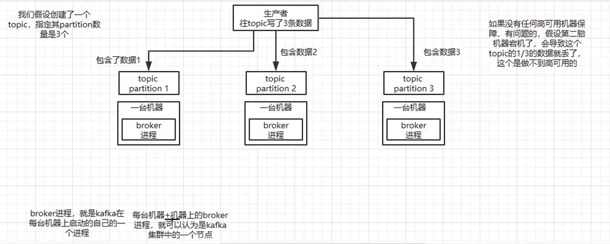

kafka一个最基本的架构认识：多个broker组件，每个broker是一个节点，你创建一个topic，这个topic可以划分成多个partition，每个partition可以存在于不同的broker上，每个partition就放一部分数据。

这就是天然的分布式消息队列，就是说一个topic的数据，是分散在多个机器上的，每个机器上就放一部分数据。

实际上RabbitMQ之类的，并不是分布式消息队列，他就是传统的消息队列，只不过提供了一些集群、HA的机制而已，因为无论怎么玩，RabbitMQ一个queue的数据都放在一个节点里了，镜像集群下，也是每个节点都放这个queu的完整数据。

kafka0.8以前，是没有HA机制的，就是任何一个broker宕机了，那个broker上的partition就废了，没法读也没办法写，没有什么高可用可言，而在0.8版本后，提供了HA机制，就是replica副本机制，每个partition的数据都会同步到其它机器上，形成自己的多个replica副本，然后所有的replica就是follower，写的时候，leader会负责数据都同步到所有的follower上，读的时候就直接读取leader上的数据即可。只能读写leader？很简单，要是你能随意读写每个follower，那么就需要保证数据一致性的问题，系统复杂度太高，很容易出问题，kafka会均匀的将一个partition的所有replica分布在不同的机器上，这样才能够提高容错性

每个副本不会存储节点的全部数据，而是数据可能分布在不同的机器上。


同时多个副本中，会选取一个作为leader，其它的副本是作为follower，并且只有leader能对外提供读写，同时leader在写入数据后，它还会把全部的数据同步到follower中，保证数据的备份。

此时，高可用的架构就出来了，假设现在某个机器宕机了，比如其中的一个leader宕机了，但是因为每个leader下还有多个follower，并且每个follower都进行了数据的备份，因此kafka会自动感知leader已经宕机，同时将其它的follower给选举出来，作为新的leader，并向外提供服务支持。


## 如果保证消息的重复消费？

面试题：如何保证消息的重复消费？如何保证消息消费的幂等性？

### 剖析

其实这是一个常见的问题，既然是消费消息，那肯定是要考虑会不会重复消费？能不能避免重复消费？或者重复消费了也别造成系统异常可以吗？关于消息重复消费的问题，其实本质上就是问你使用消息队列如何保证幂等性，这个是你架构中要考虑的问题。

首先是比尔RabbitMQ、RocketMQ、Kafka都会出现消息重复消费的问题，因为这个问题通常不是MQ自己保证的，而是保证消息的不丢失，我们首先从Kafka上来说：

kafka实际上有个offset的概念，就是每个消息写进去，都有一个offset，代表他的序号，然后consumer消费了数据之后，每隔一段时间，会把自己消费过的消息offset提交一下，代表我已经消费过了，下次我要是重启啥的，你就让我从上次消费到的offset来继续消费。

但是凡事总有以外，比如我们之前生产经常遇到的，就是你有时候重启系统，看你怎么重启，如果碰到着急的，直接kill杀死进程，然后重启，这就会导师consumer有些消息处理了没来得及提交offset，然后重启后，就会造成少数消息重复消费的问题。

重复消费不可怕，重要的是有没有考虑过重复消费之后，怎么保证幂等性？

例如：有个系统，消费一条数据往数据库插入一条，要是消息重复消费了两次，那么就插入两条数据了，这个数据也就出错了。


消费者如果在准备提交offset，但是还没有提交的时候，消费者进程被重启，那么此时已经消费过数据的offset并没有提交，kafka也就不知道你已经消费了，那么消费者再次上线进行消费的时候，会把已经消费的数据，重新在传递过来，这就是消息重复消费的问题。

### 幂等性是什么？

通俗点说：幂等性就是一个数据，或者一个请求，给你执行多次，得保证对应的数据不会改变，并且不能出错，这就是幂等性。

## 怎么保证消息队列消费的幂等性？

一条数据重复出现两次，但是数据库里只有一条数据，这就保证了系统的幂等性。

### 解决思路

- 比如那个数据要写库，首先根据主键查一下，如果这个数据已经有了，那就别插入了，执行update即可
- 如果用的是redis，那就没问题了，因为每次都是set操作，天然的幂等性
- 如果不是上面的两个场景，那就做的稍微复杂一点，需要让生产者发送每条消息的时候，需要加一个全局唯一的id，类似于订单id之后的东西，然后你这里消费到了之后，先根据这个id去redis中查找，之前消费过了么，如果没有消费过，那就进行处理，然后把这个id写入到redis中，如果消费过了，那就别处理了，保证别重复消费相同的消息即可。
- 还有比如基于数据库唯一键来保证重复数据不会重复插入多条，我们之前线上系统就有这个问题，就是拿到数据的时候，每次重启可能会重复，因为Kafka消费者还没来得及田炯offset，重复数据拿到了以后，我们进行插入的时候，因为有了唯一键约束了，所以重复数据只会插入报错，不会导致数据库中出现脏数据。


## 如何保证消息传输不丢失？

面试题：如何保证消息的可靠性传输（如何处理消息丢失的问题）？

### 剖析

消息队列有三个重要原则：消息不能多，不能少

不能多，指的就是刚刚提到的重复消费和幂等性问题，不能少，指的是数据在传输过程中，不会丢失。

如果说使用MQ用来传递非常核心的消息，比如说计费，扣费的一些消息，比如设计和研发一套核心的广告平台，计费系统是一个很重的业务，操作是很耗时的，所以说广告系统整体的架构里面，实际是将计费做成异步化的，然后中间就是加了一个MQ。例如在广告主投放了一个广告，约定的是每次用户点击一次就扣费医院，结果是用户动不动就点击了一次，扣费的时候搞的消息丢了，公司就会不断的少几块钱。这样积少成多，这就是造成了公司的巨大损失。

### 为什么会丢数据

丢数据，一般分为两种，要么是MQ自己弄丢了，要么是我们消费的时候弄丢了。我们可以从RabbitMQ和Kafka分别来进行分析。

RabbitMQ一般来说都是承载公司的核心业务的，数据是绝对不能弄丢的。

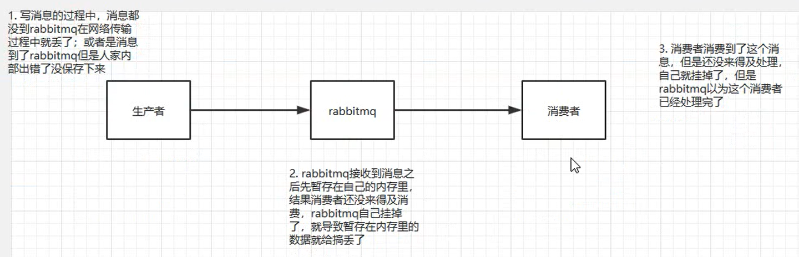


#### 生产者弄丢了数据

生产者将数据发送到RabbitMQ的时候，可能数据就在半路给搞丢了，因为网络啥的问题，都有可能。

此时i选择用RabbitMQ提供的事务功能，就是生产者发送数据之前，开启RabbitMQ事务（channel.txSelect），然后发送消息，此时就可以回滚事务（channel.txRollback），然后重试发送消息，如果收到了消息，那么可以提交事务，但是问题是，RabbitMQ事务机制一搞，基本上吞吐量会下来，因为太损耗性能。


所以一般来说，如果你要确保写RabbitMQ消息别丢，可以开启confirm模式，在生产者那里设置了开启confirm模式之后，RabbitMQ会给你回传一个ack消息，告诉你这个消息OK了，如果RabbitMQ没能处理这个消息，会给你回调一个接口，告诉你这个消息接收失败，你可以重试

```
// 开启事务
try {
 // 发送消息
} catch(Exception e) {
 // 重试发送消息
}
//  提交
```

但是，因为事务机制，是同步的

针对于上述事务造成性能下降的问题，下面的方法是开启confirm模式

- 首先把channel设置成confirm模式

- 然后发送一个消息
- 发送完消息之后，就不用管了
- RabbitMQ如果接收到这个消息的话，就会回调你生产者本地的一个接口，通知你说这条消息我们已经收到了
- RabbitMQ如果在接收消息的时候出错了，就会回调这个接口

一般生产者如果要保证消息不丢失，一般是用confirm机制，因为是异步的模式，在发送消息之后，不会阻塞，直接可以发送下一条消息，这样吞吐量会更高一些。


#### RabbitMQ丢失数据

这个就是RabbitMQ自己丢失数据，这个时候就必须开启RabbitMQ的持久化，就是消息写入之后，同时需要持久化到磁盘中，哪怕是RabbitMQ自己宕机了，也能够从磁盘中读取之前存储的消息，这样数据一般就不会丢失了，但是存在一个极端的情况，就是RabbitMQ还没持久化的时候，就已经宕机了，那么可能会造成少量的数据丢失，但是这个概率是比较小的。

设置持久化的两个步骤，第一个是创建queue的时候，将其持久化的，这样就保证了RabbitMQ持久化queue的元数据，但是不会持久化queue中的数据，第二个就是发送消息的时候，将消息的deliveryMode设置为2，就是将消息设置为持久化的，此时RabbitMQ将会将消息持久化到磁盘上，必须同时设置两个持久化才行，哪怕是Rabbit挂了，也会从磁盘中恢复queue 和 queue中的数据。

而且持久化可以跟生产者那边的confirm机制配置起来，只有消息被持久化到磁盘后，才会通知生产者ACK了，所以哪怕是在持久化磁盘之前，RabbitMQ挂了，数据丢了，生产者收不到ACK，你也是可以自己重发的。


#### 消费者丢失数据

消费者丢失数据，主要是因为打开了AutoAck的机制，消费者会自动通知RabbitMQ，表明自己已经消费完这条数据了，但是如果你消费到了一条消息，还在处理中，还没处理完，此时消费者就会自动AutoAck了，通知RabbitMQ说这条消息已经被消费了，此时不巧的是，消费者系统宕机了，这条消息就会丢失，因为RabbitMQ以为这条消息已经处理掉。

在消费者层面上，我们需要将AutoAck给关闭，然后每次自己确定已经处理完了一条消息后，你再发送ack给RabbitMQ，如果你还没处理完就宕机了，此时RabbitMQ没收到你发的Ack消息，然后RabbitMQ就会将这条消息分配给其它的消费者去处理。


## 如何保证消息的顺序性？

### 场景

以前做过一个MySQL binlog同步系统，压力还是非常大的，日同步数据要达到上亿。常见一点的在于 大数据项目中，就需要同步一个mysql库过来，然后对公司业务的系统做各种的复杂操作。

在mysql里增删改一条数据，对应出来的增删改3条binlog，接着这三条binlog发送到MQ里面，到消费出来依次执行，这个时候起码得保证能够顺序执行，不然本来是：增加、修改、删除，然后被换成了：删除、修改、增加，不全错了呢。

本来这个数据同步过来，应该是最后删除的，结果因为顺序搞错了，最后这个数据被保留了下来，数据同步就出错

- RabbitMQ：一个queue，多个consumer，这不明显乱了
- Kafka：一个topic，一个partition，一个consumer，内部多线程，就会乱套

在消息队列中，一个queue中的数据，一次只会被一个消费者消费掉

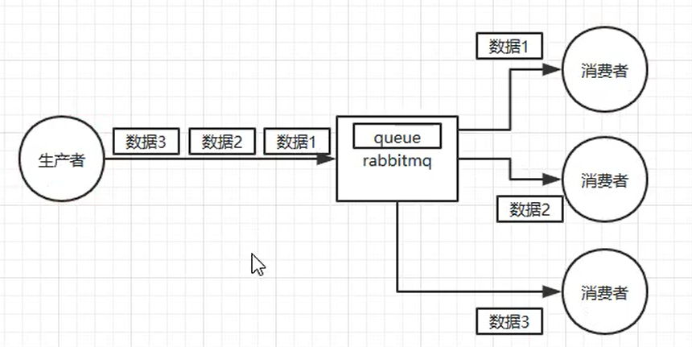

但因为不同消费者的执行速度不一致，在存入数据库后，造成顺序不一致的问题

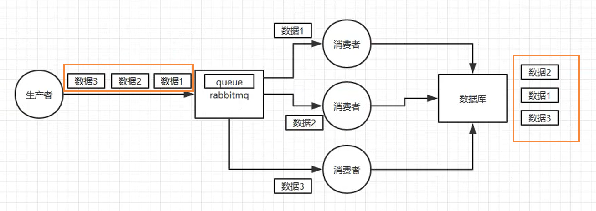

### RabbitMQ保证消息顺序性

RabbitMQ：拆分多个queue，每个queue一个consumer，就是多一些queue而已，确实是麻烦，或者就是一个queue，但是对应一个consumer，然后这个consumer内部用内存队列做排队，然后分发给底层不同的worker来处理。

下图为：一个consumer 对应 一个 queue，这样就保证了消息消费的顺序性。

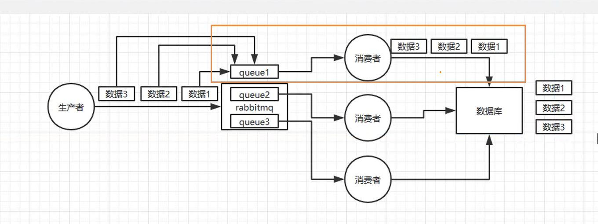

### Kafka保证消息消息顺序性

一个topic，一个partition，一个consumer，内部单线程消费，写N个内存，然后N个线程分别消费一个内存queu即可。注意，kafka中，写入一个partition中的数据，一定是有顺序的，

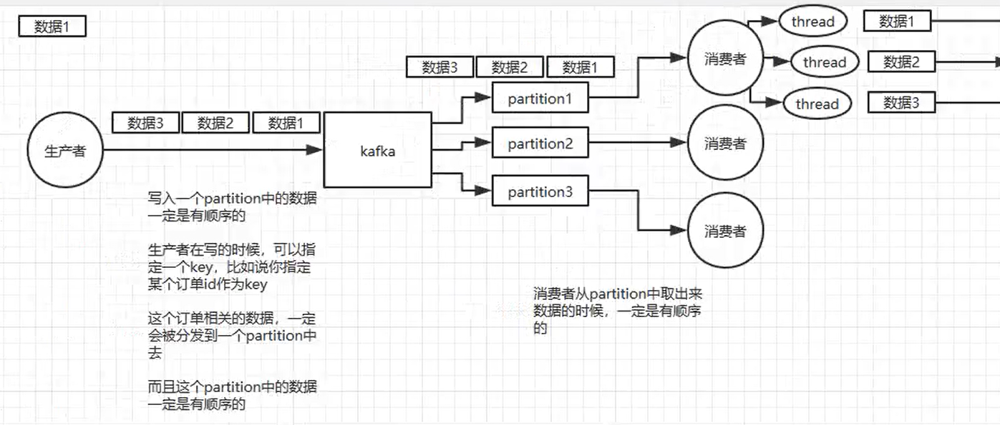

但是在一个消费者的内部，假设有多个线程并发的进行数据的消费，那么这个消息又会乱掉

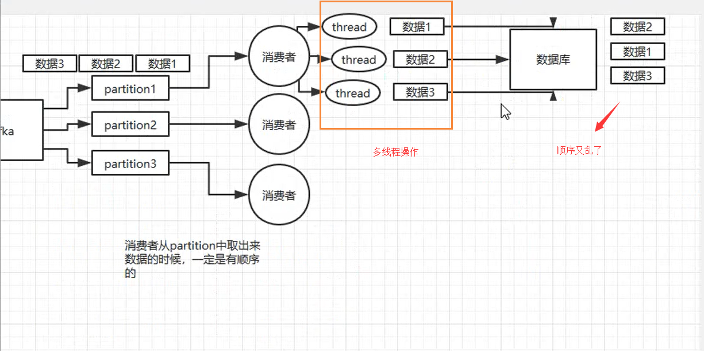

这样时候，我们需要引入内存队列，然后我们通过消息的key，然后我们通过hash算法，进行hash分发，将相同订单key的散列到我们的同一个内存队列中，然后每一个线程从这个Queue中拉数据，同一个内存Queue也是有顺序的。

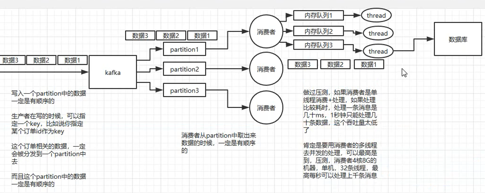


## 百万消息积压在队列中如何处理？

如何解决消息队列的延时以及过期失效问题？消息队列满了以后该怎么处理？有百万消息积压接小时，说说解决思路？

### 剖析

MQ大幅度积压这件事挺常见的，一般不出，出了的话就是大型生产事故，例如：消费端每次消费之后要写MySQL，结果MySQL挂了，消费端就不动了，或者一直出错，导致消息消费速度极其慢。

### 场景1：积压大量消息

几千万的消息积压在MQ中七八个小时，这也是一个真实遇到过的一个场景，确实是线上故障了，这个时候要不然就是修复consumer，让他恢复消费速度，然后傻傻的等待几个小时消费完毕，但是很显然这是一种比较不机智的做法。

假设1个消费者1秒消费1000条，1秒3个消费者能消费3000条，一分钟就是18万条，1000万条也需要花费1小时才能够把消息处理掉，这个时候在设备允许的情况下，如何才能够快速处理积压的消息呢？

一般这个时候，只能够做紧急的扩容操作了，具体操作步骤和思路如下所示：

- 先修复consumer的问题，确保其恢复消费速度，然后将现有consumer都停止
- 临时建立好原先10倍或者20倍的queue数量
- 然后写一个临时的分发数据的consumer程序，这个程序部署上去消费积压的数据，消费之后不做耗时的处理，直接均匀轮询写入临时建立好的10倍数量的queue
- 接着临时征用10倍机器来部署consumer，每一批consumer消费一个临时queue的数据
- 这种做法相当于临时将queue资源和consumer资源扩大了10倍，以正常的10倍速度

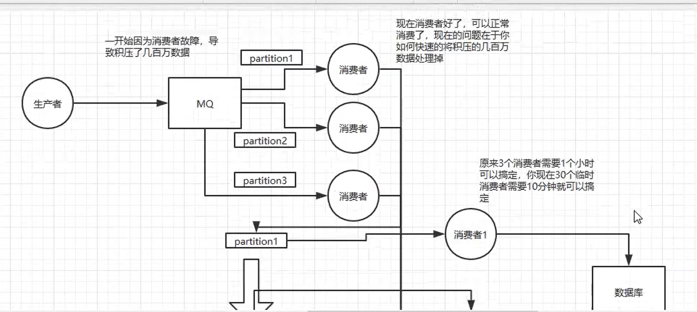

也就是让消费者把消息，重新写入MQ中，然后在用 10倍的消费者来进行消费。

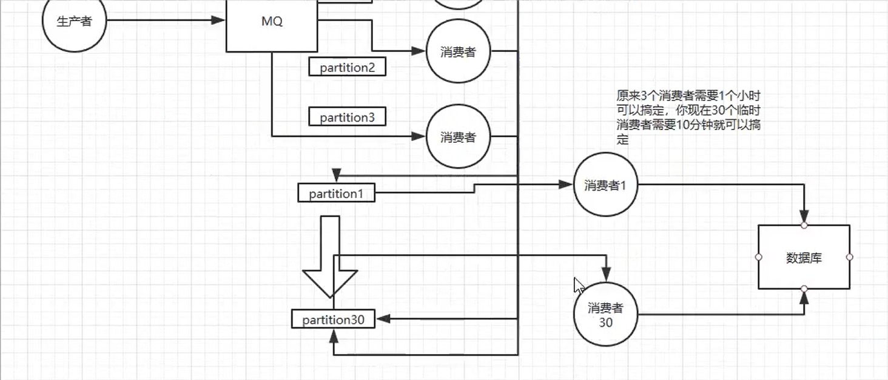


### 场景2：大量消息积压，并且设置了过期时间

假设你用的是RabbitMQ，RabbitMQ是可以设置过期时间的，就是TTL，如果消息在queue中积压超过一定的时间，就会被RabbitMQ给清理掉，这个数据就没了。这个时候就不是数据被大量积压的问题，而是大量的数据被直接搞丢了。

这种情况下，就不是说要增加consumer消费积压的消息，因为实际上没有啥积压的，而是丢了大量的消息，我们可以采取的一个方案就是，批量重导，这个之前线上也有遇到类似的场景，就是大量的消息积压的时候，然后就直接丢弃了数据，然后等高峰期过了之后，例如在晚上12点以后，就开始写程序，将丢失的那批数据，写个临时程序，一点点查询出来，然后重新 添加MQ里面，把白天丢的数据，全部补回来。

假设1万个订单积压在MQ里面，没有处理，其中1000个订单都丢了，你只能手动写程序把那1000个订单查询出来，然后手动发到MQ里面去再补一次。


### 场景3：大量消息积压，导致MQ磁盘满了

如果走的方式是消息积压在MQ里，那么如果你很长时间都没有处理掉，此时导致MQ都快写满了，咋办？

这个时候，也是因为方案一执行的太慢了，只能写一个临时程序，接入数据来消费，然后消费一个丢弃一个，都不要了，快速消费掉所有的消息。然后走第二个方案，到凌晨的时候，在把消息填入MQ中进行消费。


## 如何设计一个消息中间件架构？

如果让你写一个消息队列，该如何进行架构设计？说下你的思路

这种问题，说白了，起码不求你看过那些技术的源码，但是你应该大概知道那些技术的基本原理，核心组成部分，基本架构个构成，然后参照一些开源技术把一个系统设计出来的思路说一下就好了。

### 思路

- 首先MQ得支持可伸缩性，那就需要快速扩容，就可以增加吞吐量和容量，可以设计一个分布式的系统，参考kafka的设计理念，broker - > topic -> partition，每个partition放一台机器，那就存一部分数据，如果现在资源不够了，可以给topic增加partition，然后做数据迁移，增加机器，不就可以存放更多的数据，提高更高的吞吐量。
- 其次得考虑一下这个MQ的数据要不要落地磁盘？也就是需不需要保证消息持久化，因为这样可以保证数据的不丢失，那落地盘的时候怎么落？顺序写，这样没有磁盘随机读写的寻址开销，磁盘顺序读的性能是很高的，这就是kafka的思路。
- 其次需要考虑MQ的可用性？这个可以具体到我们上面提到的消息队列保证高可用，提出了多副本 ，leader 和follower模式，当一个leader宕机的时候，马上选取一个follower作为新的leader对外提供服务。
- 需不需要支持数据0丢失？可以参考kafka零丢失方案

其实一个MQ肯定是很复杂的，问这个问题其实是一个开放性问题，主要是想看看有没有从架构的角度整体构思和设计的思维以及能力


## 消息队列相关问题总结

一般而言，如果一个面试官水平还不错，会沿着从浅入深挖一个点，然后按着这个思路一直问下去，除了这里的七大问题之后，甚至还能挑着你熟悉的一个MQ一直问到源码级别，还可能结合项目来仔细问，先讲讲具体的业务细节，然后将业务跟这些MQ的问题场景结合起来，看看你的每个细节是如何处理和实现的。