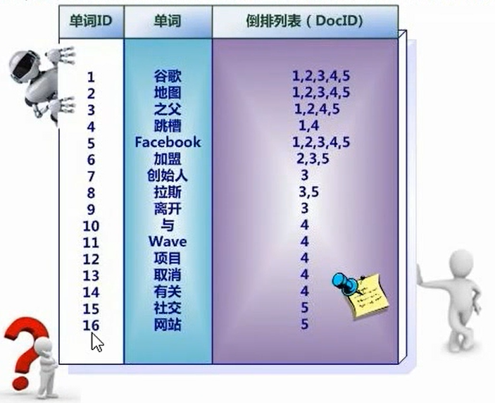
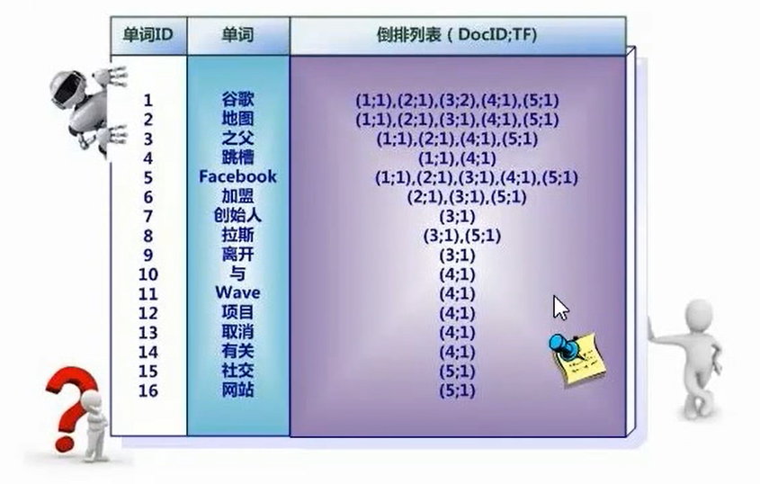

# 分布式搜索引擎的面试连环炮

业内目前来说事实上的一个标准，就是分布式搜索引擎一般大家都是用ElasticSearch，（原来的话使用的是Solr），但是确实，这两年大家一般都用更加易用的es。

ElasticSearch 和 Solr 底层都是基于Lucene，而Lucene的底层原理是 **倒排索引**

## 倒排索引是什么

倒排索引适用于快速的全文检索，一个倒排索引由文档中所有不重复词的列表构成，对于其中每个词，有一个包含它的文档列表

例如：

假设文档集合中包含五个文档，每个文档的内容如下所示，在图中最左端一栏是每个文档对应的编号，我们的任务就是对这个文档集合建立倒排索引


中文和英文等语言不通，单词之间没有明确分割符号，所以首先要用分词系统将文档自动切分成单词序列，这样每个文档就转换为由单词序列构成的数据流，为了系统后续处理方便，需要对每个不同的单词赋予唯一的单词编号，同时记录下哪些文档包含这个单词，在如此处理结束后，我们就可以得到最简单的倒排索引了



索引系统还可以记录除此之外的更多信息，下图是记录了单词出现的频率（TF）即这个单词在文档中出现的次数，之所以要记录这个信息，是因为词频信息在搜索结果排序时，计算查询和文档相似度是很重要的一个计算因子，所以将其记录在倒排列表中，以便后续排序时进行分值计算。



倒排列表还可以记录单词在某个文档出现的位置信息

```
(1, <11>, 1), (2, <7>, 1), (3, <3, 9>, 2)
```

有了这个索引系统，搜索引擎可以很方便地响应用户的查询，比如用户输入查询词 "Facebook"，搜索系统查找倒排索引，从中可以读出包含这个单词的文档，这些文档就是提供给用户的搜索结果，而利用单词频率信息，文档频率信息即可以对这些候选搜索结果进行排序，计算文档和查询的相似性，按照相似性得分由高到低排序输出，此即为搜索系统的部分内部流程。

## ES的分布式架构原理能说一下么？

ES的分布式架构原理

## ES查询和读取数据的工作原理是什么？

## ES在数据量很大的情况下（数十亿级别）如何提高查询性能？

## ES生产集群的部署架构是什么？每个索引的数据量大概是多少？么给索引大概有多少分片？