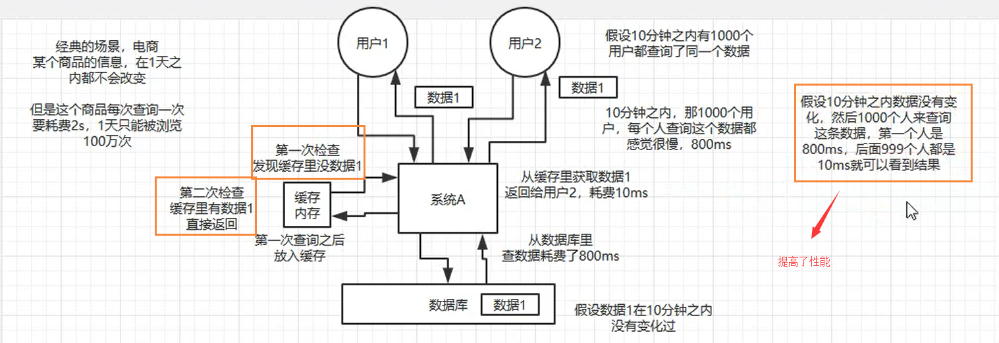
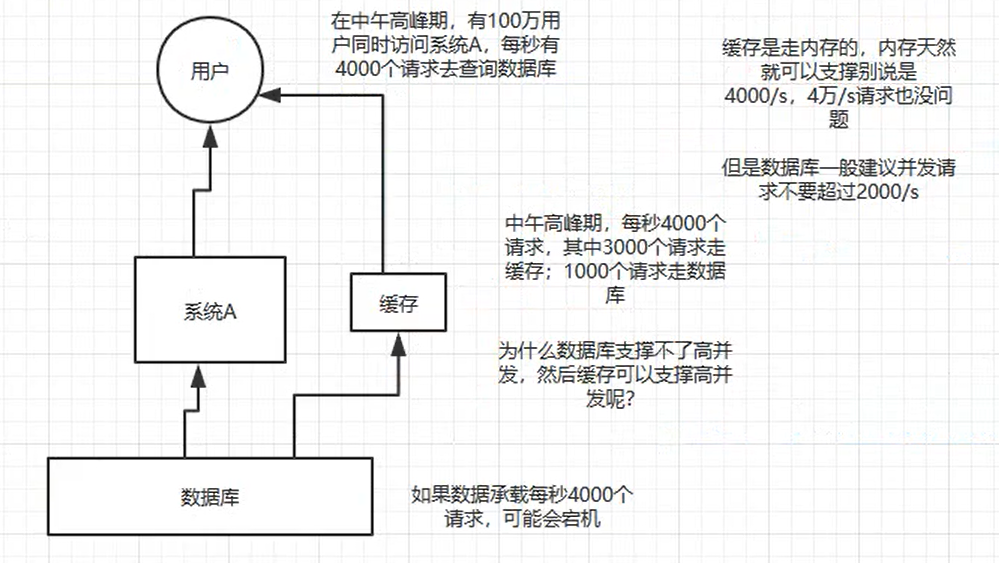

# 分布式缓存

在项目中缓存是如何使用的？缓存如果使用不当会造成什么后果？

## 为啥在项目里要用缓存？

用缓存，主要是两个用途：高性能 和 高并发

### 高性能

假设有这么个场景，有一个操作，一个请求过来，然后执行N条SQL语句，然后半天才查询出一个结果，耗时600ms，但是这个结果可能接下来几个小时就不会变了，或者变了也可以不用立即反馈给用户，这个时候就可以使用缓存了。

我们可以把花费了600ms查询出来的数据，丢进缓存中，一个key对应一个value，下次再有人来查询的时候，就不走mysql了，而是直接从缓存中读取，通过key直接查询出value，耗时2ms，性能提升300倍。这就是所谓的高性能。

就是把一些复杂操作耗时查询出来的结果，如果确定后面不怎么变化了，但是马上还有很多读请求，这个时候，就可以直接把结果存放在缓存中，后面直接读取缓存即可。

就第一次从数据库中获取，后面直接从缓存中获取即可，性能提升很高

### 高并发

MySQL这么重的数据库，并不适合于高并发，虽然可以使用，但是天然支持的就不好，因为MySQL的单机撑到2000QPS的时候，就容易报警了

#### 为什么缓存可以支持高并发

首先因为缓存是走内存的，内存天然就可以支持高并发，但是数据库因为是存储在硬盘上的，因此不要超过2000QPS

#### 场景

所以要是有一个系统，高峰期过来每秒的请求有1W个，要是MySQL单机的话，一定会宕机的，这个时候就只能用上缓存，把很多数据放到缓存中，这样请求过来了之后，就直接从缓存中获取数据，而不查询数据库。缓存的功能很简单，说白了就是一个 key - value式数据库，单机支撑的并发量轻松超过一秒几万 到 十多万，单机的承载量是mysql单机的几十倍。

#### 缓存带来的不良后果

场景的缓存问题有三个

- 缓存与数据库双写不一致的问题
- 缓存穿透
- 缓存雪崩
- 缓存并发竞争

