# Redis集群模式

## 面试题

- Redis集群模式的工作原理？
- 在集群模式下，redis的key是如何寻址的？
- 分布式寻址都有哪些算法？
- 了解一致性Hash算法么？
- 如何应对缓存雪崩以及缓存穿透问题？
- 如何保证缓存与数据库双写时的数据一致性？
- Redis的并发竞争问题是什么？怎么解决？
- 了解Redis事务的CAS方案？

## 剖析

在以前，如果前几年的时候，一般来说，redis如果要搞几个节点，每个节点存储一部分的数据，得借助一些中间件来实现，比如说有codis，或者twemproxy，都有。有一些redis中间件，你读写redis中间件，redis中间件负责将你的数据分布式存储在多台机器上的redis实例中。

这两年，redis不断在发展，redis也不断的有新的版本，redis cluster，redis集群模式，你可以做到在多台机器上，部署多个redis实例，每个实例存储一部分的数据，同时每个redis实例可以挂redis从实例，自动确保说，如果redis主实例挂了，会自动切换到redis从实例顶上来。

现在redis的新版本，大家都是用redis cluster的，也就是redis原生支持的redis集群模式，那么面试官肯定会就redis cluster对你来个几连炮。要是你没用过redis cluster，正常，以前很多人用codis之类的客户端来支持集群，但是起码你得研究一下redis cluster吧。


## Redis集群模式的工作原理

### 单机瓶颈

Redis在单机架构下的瓶颈：master节点的数据和slave节点的数据量一样，也就是master容纳多少，slave也只能容纳多少，如果需要放1T数据，在缓存中，那么就遇到的性能瓶颈了。

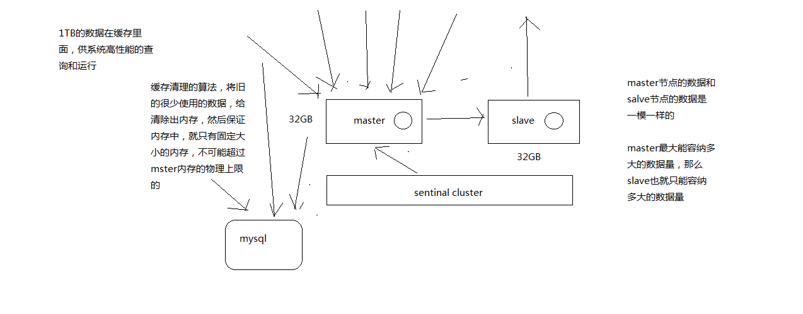

### 集群模式

支撑N个redis master node，每个master node都可以挂载多个slave node，读写分离的架构，对于每个master来说，写就写到master，然后读就从mater对应的slave去读，高可用，因为每个master都有salve节点，那么如果mater挂掉，redis cluster这套机制，就会自动将某个slave切换成master，redis cluster（多master + 读写分离 + 高可用），我们只要基于redis cluster去搭建redis集群即可，不需要手工去搭建replication复制+主从架构+读写分离+哨兵集群+高可用

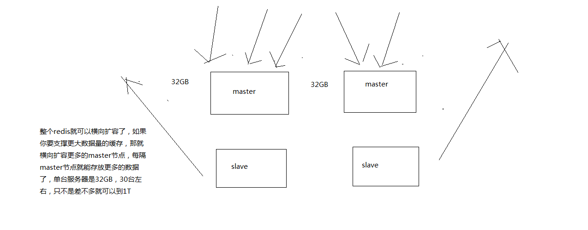

### Redis cluster  和 Replication + sentinel

#### Redis Cluster

是Redis的集群模式

- 自动将数据进行分片，每个master上放一部分数据
- 提供内置的高可用支持，部分master不可用时，还是可以继续工作的

在redis cluster架构下，每个redis要放开两个端口号，比如一个是6379，另外一个就是加10000的端口号，比如16379端口号是用来进行节点间通信的，也就是cluster bus的东西，集群总线。cluster bus的通信，用来进行故障检测，配置更新，故障转移授权

#### Redis replication + sentinel：高可用模式

如果你的数据量很少，主要是承载高并发高性能的场景，比如你的缓存一般就几个G，单机足够了，replication，一个mater，多个slave，要几个slave跟你的要求的读吞吐量有关系，然后自己搭建一个sentinal集群，去保证redis主从架构的高可用性，就可以了

redis cluster，主要是针对海量数据+高并发+高可用的场景，海量数据，如果你的数据量很大，那么建议就用redis cluster


## 分布式数据存储的核心算法，数据分布的算法

hash算法  ->  一致性hash算法（memcached） ->  redis cluster，hash slot 算法

用不同的算法，就决定了在多个master节点的时候，数据如何分布到这些节点上去，解决这个问题

### Hash算法

最老土的hash算法和弊端（大量缓存重建），属于最简单的数据分布算法

但是如果某一台master宕机了，会导致 1/3的数据全部失效，从而大量的数据将会进入MySQL

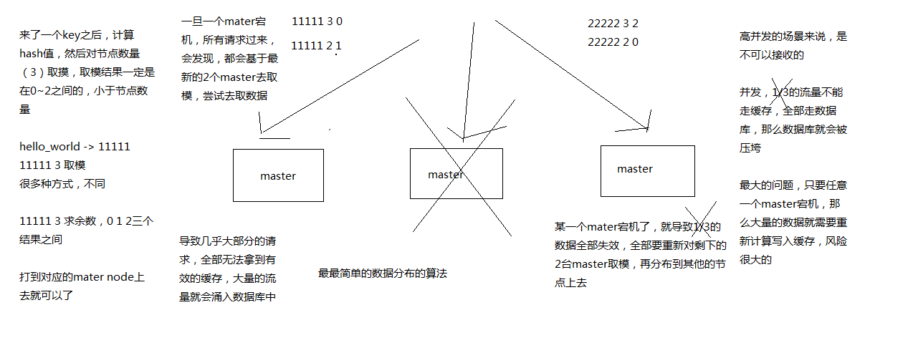

### 一致性Hash算法

Memcache中使用的是一致性Hash算法

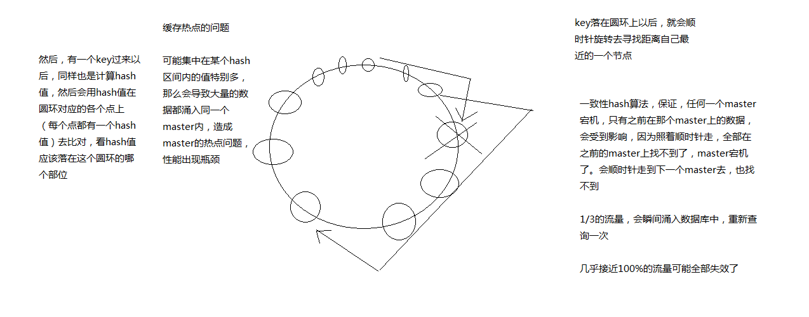

### 缓存热点问题

因为上面的一致性Hash环，不能解决缓存热点问题，即集中在某个Hash区间内的值特别多，这样就会导致大量的请求同时涌入一个master节点，而其它的节点处于空闲状态，从而造成master热点问题。

这个时候就引入了虚拟环（虚拟节点）的概念，目的是为了让每个master都做了均匀分布，这样每个区间内的数据都能够 均衡的分布到不同的节点中，而不是按照顺时针去查找，从而造成涌入一个master上的问题。


### Redis Cluster

Redis Cluster有固定的16384个Hash slot，对每个key计算CRC16值，然后对16384取模，可以获取key对应的hash slot，redis cluster中每个master都会持有部分slot，比如有3个master，那么可能每个master持有5000多个hash slot，hash slot让node的增加和移除很简单，增加一个master，就将其他master的hash slot移动部分过去，减少一个master，就将它的hash slot移动到其他master上去，移动hash slot的成本是非常低的，客户端的api，可以对指定的数据，让他们走同一个hash slot，通过hash tag来实现

如果有一台master宕机了，其它节点上的缓存几乎不受影响，因为它取模运算是根据 Hash slot来的，也就是 16384，而不是根据Redis的机器数。

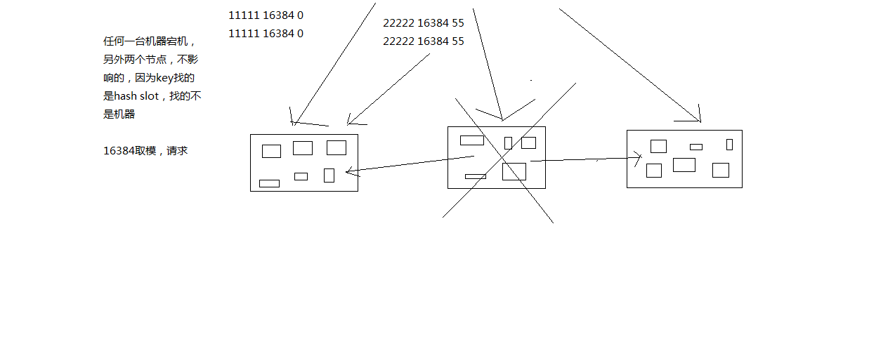

### Redis Cluster节点通信

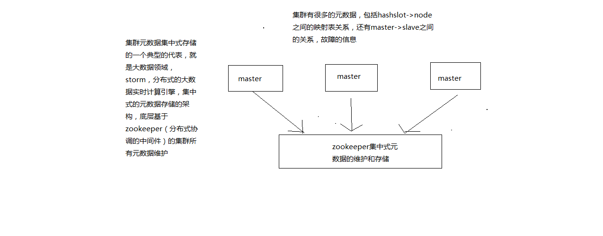

#### 基础通信原理

（1）redis cluster节点间采取gossip协议进行通信

跟集中式不同，不是将集群元数据（节点信息，故障，等等）集中存储在某个节点上，而是互相之间不断通信，保持整个集群所有节点的数据是完整的

维护集群的元数据用得，集中式，一种叫做gossip

集中式：好处在于，元数据的更新和读取，时效性非常好，一旦元数据出现了变更，立即就更新到集中式的存储中，其他节点读取的时候立即就可以感知到; 不好在于，所有的元数据的跟新压力全部集中在一个地方，可能会导致元数据的存储有压力

gossip：好处在于，元数据的更新比较分散，不是集中在一个地方，更新请求会陆陆续续，打到所有节点上去更新，有一定的延时，降低了压力; 缺点，元数据更新有延时，可能导致集群的一些操作会有一些滞后

我们刚才做reshard，去做另外一个操作，会发现说，configuration error，达成一致

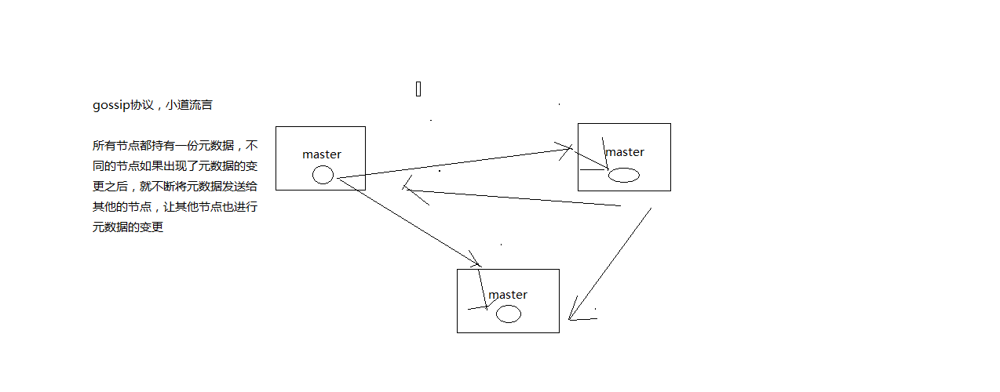

（2）10000端口

每个节点都有一个专门用于节点间通信的端口，就是自己提供服务的端口号+10000，比如7001，那么用于节点间通信的就是17001端口

每隔节点每隔一段时间都会往另外几个节点发送ping消息，同时其他几点接收到ping之后返回pong

（3）交换的信息

故障信息，节点的增加和移除，hash slot信息，等等

#### gossip协议

gossip协议包含多种消息，包括ping，pong，meet，fail，等等

meet: 某个节点发送meet给新加入的节点，让新节点加入集群中，然后新节点就会开始与其他节点进行通信

```
redis-trib.rb add-node
```

其实内部就是发送了一个gossip meet消息，给新加入的节点，通知那个节点去加入我们的集群

ping: 每个节点都会频繁给其他节点发送ping，其中包含自己的状态还有自己维护的集群元数据，互相通过ping交换元数据,每个节点每秒都会频繁发送ping给其他的集群，频繁的互相之间交换数据，互相进行元数据的更新

pong: 返回ping和meet，包含自己的状态和其他信息，也可以用于信息广播和更新

fail: 某个节点判断另一个节点fail之后，就发送fail给其他节点，通知其他节点，指定的节点宕机了

#### ping消息深入

ping很频繁，而且要携带一些元数据，所以可能会加重网络负担，每个节点每秒会执行10次ping，每次会选择5个最久没有通信的其他节点，当然如果发现某个节点通信延时达到了cluster_node_timeout / 2，那么立即发送ping，避免数据交换延时过长，落后的时间太长了

比如说，两个节点之间都10分钟没有交换数据了，那么整个集群处于严重的元数据不一致的情况，就会有问题，所以cluster_node_timeout可以调节，如果调节比较大，那么会降低发送的频率，每次ping，一个是带上自己节点的信息，还有就是带上1/10其他节点的信息，发送出去，进行数据交换，至少包含3个其他节点的信息，最多包含总节点-2个其他节点的信息


#### 面向集群的Jedis内部实现原理

开发，jedis，redis的java client客户端，redis cluster，jedis cluster api

jedis cluster api与redis cluster集群交互的一些基本原理

1、基于重定向的客户端

redis-cli -c，自动重定向

（1）请求重定向

客户端可能会挑选任意一个redis实例去发送命令，每个redis实例接收到命令，都会计算key对应的hash slot

如果在本地就在本地处理，否则返回moved给客户端，让客户端进行重定向

cluster keyslot mykey，可以查看一个key对应的hash slot是什么

用redis-cli的时候，可以加入-c参数，支持自动的请求重定向，redis-cli接收到moved之后，会自动重定向到对应的节点执行命令

（2）计算hash slot

计算hash slot的算法，就是根据key计算CRC16值，然后对16384取模，拿到对应的hash slot

用hash tag可以手动指定key对应的slot，同一个hash tag下的key，都会在一个hash slot中，比如set mykey1:{100}和set mykey2:{100}

（3）hash slot查找

节点间通过gossip协议进行数据交换，就知道每个hash slot在哪个节点上

2、smart jedis

（1）什么是smart jedis

基于重定向的客户端，很消耗网络IO，因为大部分情况下，可能都会出现一次请求重定向，才能找到正确的节点

所以大部分的客户端，比如java redis客户端，就是jedis，都是smart的

本地维护一份hashslot -> node的映射表，缓存，大部分情况下，直接走本地缓存就可以找到hashslot -> node，不需要通过节点进行moved重定向

（2）JedisCluster的工作原理

在JedisCluster初始化的时候，就会随机选择一个node，初始化hashslot -> node映射表，同时为每个节点创建一个JedisPool连接池

每次基于JedisCluster执行操作，首先JedisCluster都会在本地计算key的hashslot，然后在本地映射表找到对应的节点

如果那个node正好还是持有那个hashslot，那么就ok; 如果说进行了reshard这样的操作，可能hashslot已经不在那个node上了，就会返回moved

如果JedisCluter API发现对应的节点返回moved，那么利用该节点的元数据，更新本地的hashslot -> node映射表缓存

重复上面几个步骤，直到找到对应的节点，如果重试超过5次，那么就报错，JedisClusterMaxRedirectionException

jedis老版本，可能会出现在集群某个节点故障还没完成自动切换恢复时，频繁更新hash slot，频繁ping节点检查活跃，导致大量网络IO开销

jedis最新版本，对于这些过度的hash slot更新和ping，都进行了优化，避免了类似问题

（3）hashslot迁移和ask重定向

如果hash slot正在迁移，那么会返回ask重定向给jedis

jedis接收到ask重定向之后，会重新定位到目标节点去执行，但是因为ask发生在hash slot迁移过程中，所以JedisCluster API收到ask是不会更新hashslot本地缓存

已经可以确定说，hashslot已经迁移完了，moved是会更新本地hashslot->node映射表缓存的


#### 高可用性与主备切换原理

redis cluster的高可用的原理，几乎跟哨兵是类似的

1、判断节点宕机

如果一个节点认为另外一个节点宕机，那么就是pfail，主观宕机，如果多个节点都认为另外一个节点宕机了，那么就是fail，客观宕机，跟哨兵的原理几乎一样，sdown，odown，在cluster-node-timeout内，某个节点一直没有返回pong，那么就被认为pfail，如果一个节点认为某个节点pfail了，那么会在gossip ping消息中，ping给其他节点，如果超过半数的节点都认为pfail了，那么就会变成fail

2、从节点过滤

对宕机的master node，从其所有的slave node中，选择一个切换成master node，检查每个slave node与master node断开连接的时间，如果超过了cluster-node-timeout * cluster-slave-validity-factor，那么就没有资格切换成master，这个也是跟哨兵是一样的，从节点超时过滤的步骤

3、从节点选举

哨兵：对所有从节点进行排序，slave priority，offset，run id，每个从节点，都根据自己对master复制数据的offset，来设置一个选举时间，offset越大（复制数据越多）的从节点，选举时间越靠前，优先进行选举，所有的master node开始slave选举投票，给要进行选举的slave进行投票，如果大部分master node（N/2 + 1）都投票给了某个从节点，那么选举通过，那个从节点可以切换成master，从节点执行主备切换，从节点切换为主节点

4、与哨兵比较

整个流程跟哨兵相比，非常类似，所以说，redis cluster功能强大，直接集成了replication和sentinal的功能


## 缓存雪崩和缓存穿透？

### 面试题

了解什么是redis的雪崩和穿透？redis崩溃之后会怎么样？系统该如何应对这种情况？如何处理redis的穿透？

### 剖析

其实这是问到缓存必问的，因为缓存雪崩和穿透，那是缓存最大的两个问题，要么不出现，一旦出现就是致命性的问题。所以面试官一定会问你

### 缓存雪崩发生的现象

因为缓存宕机，大量的请求打入数据库，导致整个系统宕机

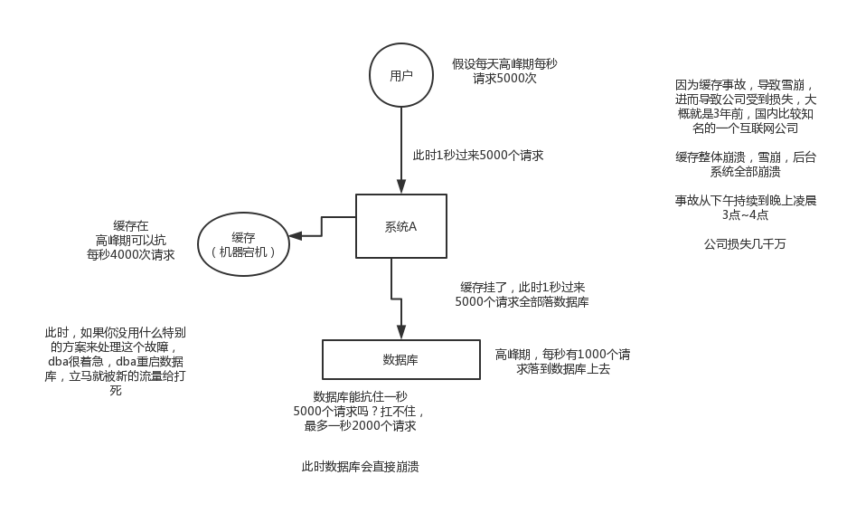

### 如何解决缓存雪崩

缓存雪崩的事前事中事后的解决方案

事前：redis高可用，主从+哨兵，redis cluster，避免全盘崩溃

事中：本地ehcache缓存 + hystrix限流&降级，避免MySQL被打死

事后：redis持久化，快速恢复缓存数据，一般重启，自动从磁盘上加载数据恢复内存中的数据。

 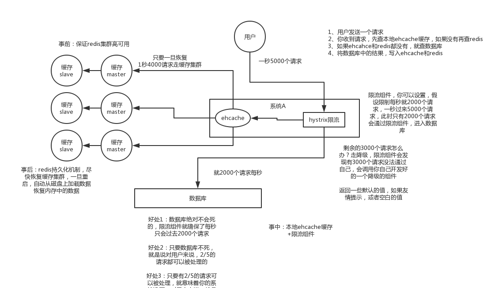


### 缓存穿透的现象

缓存穿透也就是，由黑客发出的非法请求，请求大量的无效key，导致无法命中缓存，同时数据库也查询不到，最终导致缓存穿透把数据库打死了。

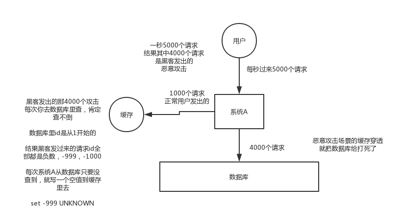

### 如何解决缓存穿透

解决方案，每次系统从系统库只要没有查询到，就写一个空值到缓存中查找。


## 如何保证缓存与数据库的双写一致性？

只要用到了缓存，就可能会涉及到缓存与数据库双存储双写，就一定会有数据一致性的问题，那么你如何解决一致性问题呢

### Cache Aside Pattern

最经典的缓存+数据库读写的模式，cache aside pattern

（1）读的时候，先读缓存，缓存没有的话，那么就读数据库，然后取出数据后放入缓存，同时返回响应

（2）更新的时候，先删除缓存，然后再更新数据库

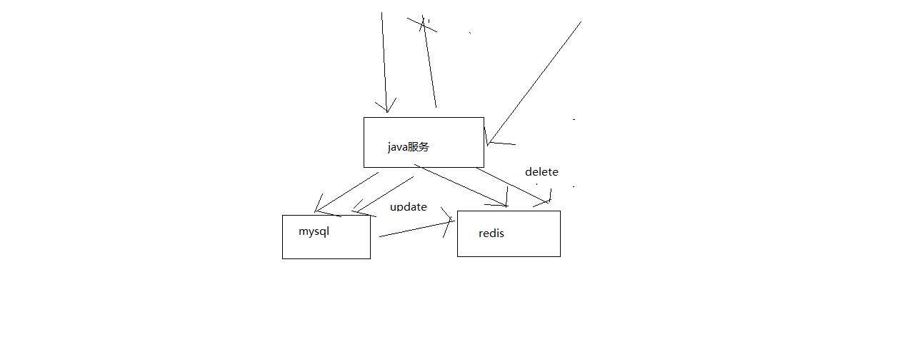

### 为什么是删除缓存，而不是更新缓存呢？

原因很简单，很多时候，复杂点的缓存的场景，因为缓存有的时候，不简单是数据库中直接取出来的值

商品详情页的系统，修改库存，只是修改了某个表的某些字段，但是要真正把这个影响的最终的库存计算出来，可能还需要从其他表查询一些数据，然后进行一些复杂的运算，才能最终计算出

现在最新的库存是多少，然后才能将库存更新到缓存中去，比如可能更新了某个表的一个字段，然后其对应的缓存，是需要查询另外两个表的数据，并进行运算，才能计算出缓存最新的值的

更新缓存的代价是很高的，是不是说，每次修改数据库的时候，都一定要将其对应的缓存去更新一份？也许有的场景是这样的，但是对于比较复杂的缓存数据计算的场景，就不是这样了

如果你频繁修改一个缓存涉及的多个表，那么这个缓存会被频繁的更新，频繁的更新缓存，但是问题在于，这个缓存到底会不会被频繁访问到？？？

举个例子，一个缓存涉及的表的字段，在1分钟内就修改了20次，或者是100次，那么缓存更新20次，100次; 但是这个缓存在1分钟内就被读取了1次，有大量的冷数据

28法则，黄金法则，20%的数据，占用了80%的访问量

实际上，如果你只是删除缓存的话，那么1分钟内，这个缓存不过就重新计算一次而已，开销大幅度降低

每次数据过来，就只是删除缓存，然后修改数据库，如果这个缓存，在1分钟内只是被访问了1次，那么只有那1次，缓存是要被重新计算的，用缓存才去算缓存

其实删除缓存，而不是更新缓存，就是一个lazy计算的思想，不要每次都重新做复杂的计算，不管它会不会用到，而是让它到需要被使用的时候再重新计算

mybatis，hibernate，懒加载，思想

查询一个部门，部门带了一个员工的list，没有必要说每次查询部门，都里面的1000个员工的数据也同时查出来啊

80%的情况，查这个部门，就只是要访问这个部门的信息就可以了

先查部门，同时要访问里面的员工，那么这个时候只有在你要访问里面的员工的时候，才会去数据库里面查询1000个员工


### 数据库双写不一致问题分析与解决方案设计

从哪一步开始做，从比较简单的那一块开始做，实时性要求比较高的那块数据的缓存去做，实时性比较高的数据缓存，选择的就是库存的服务，库存可能会修改，每次修改都要去更新这个缓存数据; 每次库存的数据，在缓存中一旦过期，或者是被清理掉了，前端的nginx服务都会发送请求给库存服务，去获取相应的数据，库存这一块，写数据库的时候，直接更新redis缓存，实际上没有这么的简单，这里，其实就涉及到了一个问题，数据库与缓存双写，数据不一致的问题，围绕和结合实时性较高的库存服务，把数据库与缓存双写不一致问题以及其解决方案

### 最初级的缓存不一致问题

问题：先修改数据库，再删除缓存，如果删除缓存失败了，那么会导致数据库中是新数据，缓存中是旧数据，数据出现不一致，解决思路是：先删除缓存，再修改数据库，如果删除缓存成功了，如果修改数据库失败了，那么数据库中是旧数据，缓存中是空的，那么数据不会不一致，因为读的时候缓存没有，则读数据库中旧数据，然后更新到缓存中


假设删除缓存成功，但是更新数据库失败了，那么不会出现双写不一致的问题

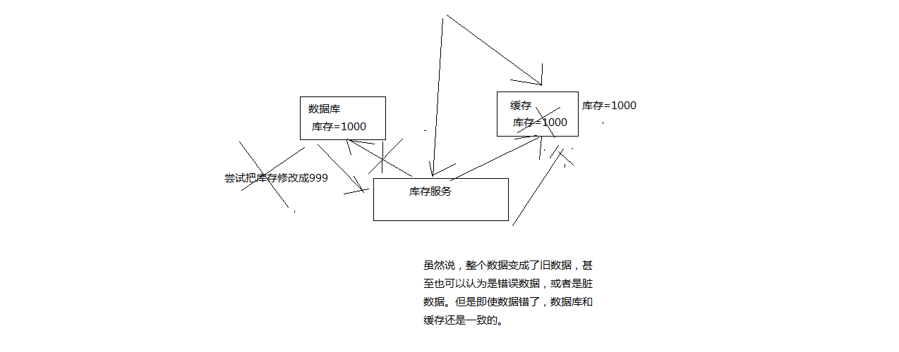

### 复杂的数据不一致问题

数据发生了变更，先删除了缓存，然后要去修改数据库，此时还没修改

一个请求过来，去读缓存，发现缓存空了，去查询数据库，查到了修改前的旧数据，放到了缓存中

数据变更的程序完成了数据库的修改

完了，数据库和缓存中的数据不一样了。。。。

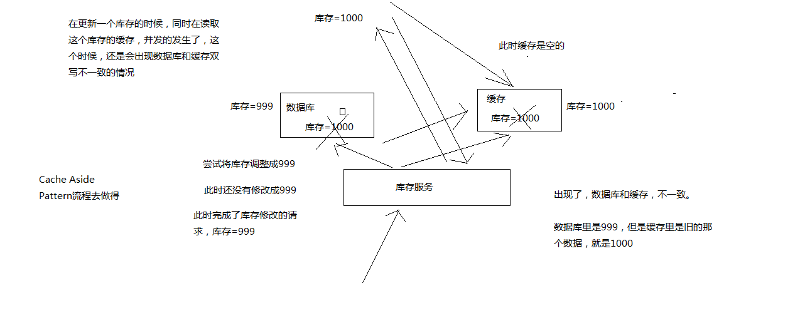

### 上亿流量高并发场景下，缓存会出现这个问题？

只有在对一个数据在并发的进行读写的时候，才可能会出现这种问题

其实如果说你的并发量很低的话，特别是读并发很低，每天访问量就1万次，那么很少的情况下，会出现刚才描述的那种最初不一致的场景。

但是问题是，如果每天的是上亿的流量，每秒并发读是几万，每秒只要有数据更新的请求，就可能会出现上述的数据库+缓存不一致的情况。

### 数据库与缓存更新与读取操作进行异步串行化

更新数据的时候，根据数据的唯一标识，将操作路由之后，发送到一个jvm内部的队列中，读取数据的时候，如果发现数据不在缓存中，那么将重新读取数据+更新缓存的操作，根据唯一标识路由之后，也发送同一个jvm内部的队列中，一个队列对应一个工作线程，每个工作线程串行拿到对应的操作，然后一条一条的执行

这样的话，一个数据变更的操作，先执行，删除缓存，然后再去更新数据库，但是还没完成更新

此时如果一个读请求过来，读到了空的缓存，那么可以先将缓存更新的请求发送到队列中，此时会在队列中积压，然后同步等待缓存更新完成

这里有一个优化点，一个队列中，其实多个更新缓存请求串在一起是没意义的，因此可以做过滤，如果发现队列中已经有一个更新缓存的请求了，那么就不用再放个更新请求操作进去了，直接等待前面的更新操作请求完成即可

待那个队列对应的工作线程完成了上一个操作的数据库的修改之后，才会去执行下一个操作，也就是缓存更新的操作，此时会从数据库中读取最新的值，然后写入缓存中

如果请求还在等待时间范围内，不断轮询发现可以取到值了，那么就直接返回; 如果请求等待的时间超过一定时长，那么这一次直接从数据库中读取当前的旧值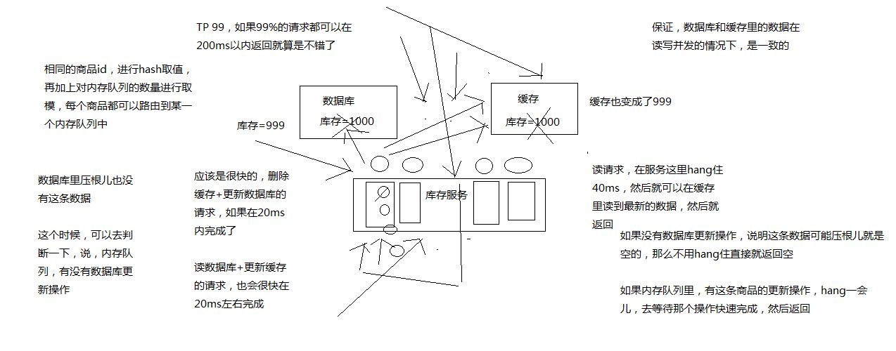

假设出现了数据库没有这条数据的场景时：

这个时候需要判断一下，内存队列中有没有数据库更新操作，如果没有数据库更新操作，说明这条数据压根可能就是空的，那么不用hang住，直接就返回空。

### 更新与读取请求串行化缺点

一般来说，如果你的系统不是严格要求缓存 + 数据库必须一致性的话，缓存可以稍微的跟数据库偶尔有不一致的情况，最好不要使用这个方案，因为读请求 和 写请求 串行化，串到一个内存队列中去，这样就可以保证一定不会出现不一致的情况。

串行化之后，就会导致系统的吞吐量大幅度的降低，用比较正常情况下多几倍的机器去支撑线上的请求。

### 高并发的场景下，该解决方案要注意的问题

#### 读请求长时阻塞

由于读请求进行了非常轻度的异步化，所以一定要注意读超时的问题，每个读请求必须在超时时间范围内返回

该解决方案，最大的风险点在于说，可能数据更新很频繁，导致队列中积压了大量更新操作在里面，然后读请求会发生大量的超时，最后导致大量的请求直接走数据库

务必通过一些模拟真实的测试，看看更新数据的频繁是怎样的

另外一点，因为一个队列中，可能会积压针对多个数据项的更新操作，因此需要根据自己的业务情况进行测试，可能需要部署多个服务，每个服务分摊一些数据的更新操作

如果一个内存队列里居然会挤压100个商品的库存修改操作，每隔库存修改操作要耗费10ms区完成，那么最后一个商品的读请求，可能等待10 * 100 = 1000ms = 1s后，才能得到数据

这个时候就导致读请求的长时阻塞

一定要做根据实际业务系统的运行情况，去进行一些压力测试，和模拟线上环境，去看看最繁忙的时候，内存队列可能会挤压多少更新操作，可能会导致最后一个更新操作对应的读请求，会hang多少时间，如果读请求在200ms返回，如果你计算过后，哪怕是最繁忙的时候，积压10个更新操作，最多等待200ms，那还可以的

如果一个内存队列可能积压的更新操作特别多，那么你就要加机器，让每个机器上部署的服务实例处理更少的数据，那么每个内存队列中积压的更新操作就会越少

其实根据之前的项目经验，一般来说数据的写频率是很低的，因此实际上正常来说，在队列中积压的更新操作应该是很少的

针对读高并发，读缓存架构的项目，一般写请求相对读来说，是非常非常少的，每秒的QPS能到几百就不错了

一秒，500的写操作，5份，每200ms，就100个写操作

单机器，20个内存队列，每个内存队列，可能就积压5个写操作，每个写操作性能测试后，一般在20ms左右就完成

那么针对每个内存队列中的数据的读请求，也就最多hang一会儿，200ms以内肯定能返回了

写QPS扩大10倍，但是经过刚才的测算，就知道，单机支撑写QPS几百没问题，那么就扩容机器，扩容10倍的机器，10台机器，每个机器20个队列，200个队列

大部分的情况下，应该是这样的，大量的读请求过来，都是直接走缓存取到数据的

少量情况下，可能遇到读跟数据更新冲突的情况，如上所述，那么此时更新操作如果先入队列，之后可能会瞬间来了对这个数据大量的读请求，但是因为做了去重的优化，所以也就一个更新缓存的操作跟在它后面

等数据更新完了，读请求触发的缓存更新操作也完成，然后临时等待的读请求全部可以读到缓存中的数据

#### 读请求并发量过高

这里还必须做好压力测试，确保恰巧碰上上述情况的时候，还有一个风险，就是突然间大量读请求会在几十毫秒的延时hang在服务上，看服务能不能抗的住，需要多少机器才能抗住最大的极限情况的峰值

但是因为并不是所有的数据都在同一时间更新，缓存也不会同一时间失效，所以每次可能也就是少数数据的缓存失效了，然后那些数据对应的读请求过来，并发量应该也不会特别大

按1:99的比例计算读和写的请求，每秒5万的读QPS，可能只有500次更新操作

如果一秒有500的写QPS，那么要测算好，可能写操作影响的数据有500条，这500条数据在缓存中失效后，可能导致多少读请求，发送读请求到库存服务来，要求更新缓存

一般来说，1:1，1:2，1:3，每秒钟有1000个读请求，会hang在库存服务上，每个读请求最多hang多少时间，200ms就会返回

在同一时间最多hang住的可能也就是单机200个读请求，同时hang住

单机hang200个读请求，还是ok的

1:20，每秒更新500条数据，这500秒数据对应的读请求，会有20 * 500 = 1万

1万个读请求全部hang在库存服务上，就死定了

#### 多服务实例部署的请求路由

可能这个服务部署了多个实例，那么必须保证说，执行数据更新操作，以及执行缓存更新操作的请求，都通过nginx服务器路由到相同的服务实例上

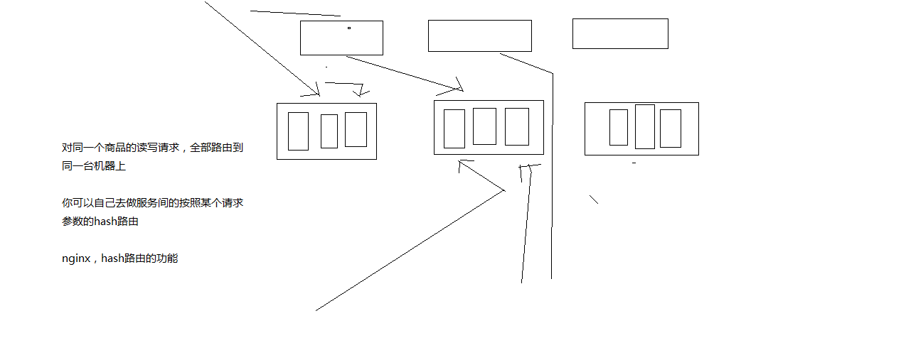

#### 热点商品的路由问题，导致请求的倾斜

万一某个商品的读写请求特别高，全部打到相同的机器的相同的队列里面去了，可能造成某台机器的压力过大

就是说，因为只有在商品数据更新的时候才会清空缓存，然后才会导致读写并发，所以更新频率不是太高的话，这个问题的影响并不是特别大，但是的确可能某些机器的负载会高一些


## Redis并发竞争的问题是什么？

这个也是线上非常常见的一个问题，就是多客户端同时并发写一个key，可能本来应该先到的数据后到了，导致数据版本错了。或者是多客户端同时获取一个key，修改值之后再写回去，只要顺序错了，数据就错了

如下图所示：我们有好几个系统同时取访问缓存，并且发起了一个写缓存的操作

- set V1、V2、V3、V4
- 我们期望的是它是有顺序的去执行，但是最后却没有顺序了
- 变成了：set V1、V3、V4、V2
- 一般解决这种问题，就是使用分布式锁

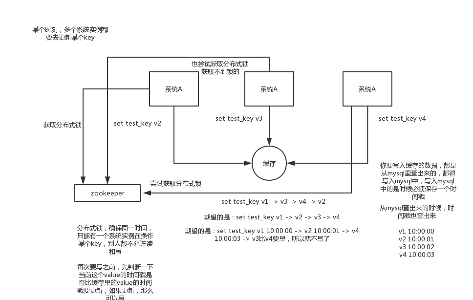

### 基于Zookeeper的分布式锁

分布式锁：确保同一时间，只有一个系统实例在操作某个key，别人都不需要读和写

这里修改的时候，就需要引入时间戳，因为写入缓存的数据，都是从mysql中查询出来的，都得写入mysql中，写入mysql的时候，是必须保存一个时间戳，同时查询的时候，也需要把时间戳也查询出来

```
v1 10.00.00
v2 10.00.01
v3 10.00.02
v4 10.00.03
```

每次要写入之前，首先判断一下当前这个value的时间戳是否比缓存的value的时间戳大，如果比缓存中的时间戳更大，那么就执行写入操作，如果更小，就不能用旧的数据覆盖新的数据。


## Redis的事务

可以一次执行多个命令，本质是一组命令的集合。一个事务中的所有命令都会序列化，按顺序串行化的执行而不会被其他命令插入。Redis中，单条命令是原子性执行的，但事务不保证原子性，且没有回滚。事务中任意命令执行失败，其余的命令仍会被执行。

其中，Redis事务分为三个阶段

- 开始事务
- 命令入队
- 执行事务

### 正常执行

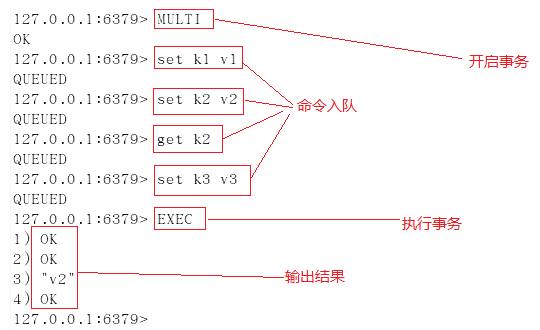

### 放弃事务

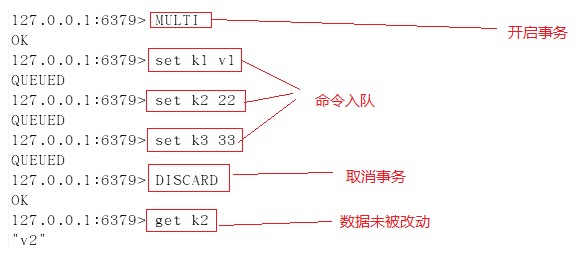

### 事务执行出错 - 命令错误

若在事务队列中存在命令性错误（类似于java编译性错误），则执行EXEC命令时，所有命令都不会执行


### 事务执行出错 - 抛异常

若在事务队列中存在语法性错误（类似于java的1/0的运行时异常），则执行EXEC命令时，其他正确命令会被执行，错误命令抛出异常

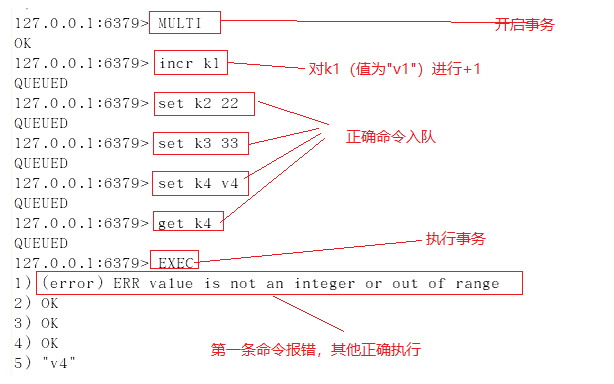

### Watch使用

使用watch检测balance，事务期间balance数据未变动，事务执行成功

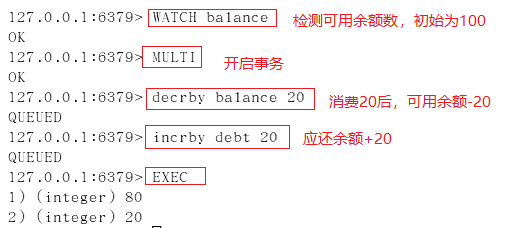

使用watch检测balance，在开启事务后（标注1处），在新窗口执行标注2中的操作，更改balance的值，模拟其他客户端在事务执行期间更改watch监控的数据，然后再执行标注1后命令，执行EXEC后，事务未成功执行。

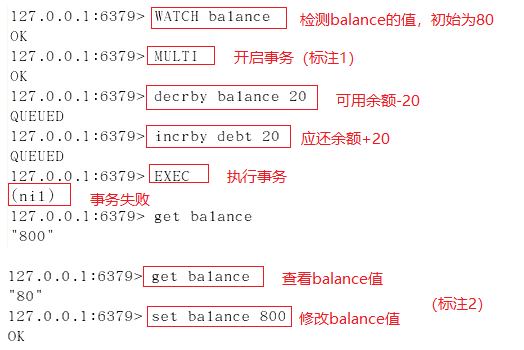

一但执行 EXEC 开启事务的执行后，无论事务使用执行成功， WARCH 对变量的监控都将被取消。故当事务执行失败后，需重新执行WATCH命令对变量进行监控，并开启新的事务进行操作

watch指令类似于乐观锁，在事务提交时，如果watch监控的多个KEY中任何KEY的值已经被其他客户端更改，则使用EXEC执行事务时，事务队列将不会被执行，同时返回Nullmulti-bulk应答以通知调用者事务执行失败。


## 线上生产环境的Redis是怎么部署的？

看看你了解不了解你们公司的redis生产集群的部署架构，你的redis是主从架构？集群架构？用了哪种集群方案？有没有做高可用保证？有没有开启持久化机制确保可以进行数据恢复？线上redis给几个G的内存？设置了哪些参数？压测后你们redis集群承载多少QPS？

### 剖析

redis cluster，10台机器，5台机器部署了redis主实例，另外5台机器部署了redis的从实例，每个主实例挂了一个从实例，5个节点对外提供读写服务，每个节点的读写高峰qps可能可以达到每秒5万，5台机器最多是25万读写请求/s。

机器是什么配置？32G内存+8核CPU+1T磁盘，但是分配给redis进程的是10g内存，一般线上生产环境，redis的内存尽量不要超过10g，超过10g可能会有问题。

5台机器对外提供读写，一共有50g内存。因为每个主实例都挂了一个从实例，所以是高可用的，任何一个主实例宕机，都会自动故障迁移，redis从实例会自动变成主实例继续提供读写服务

你往内存里写的是什么数据？每条数据的大小是多少？商品数据，每条数据是10kb。100条数据是1mb，10万条数据是1g。常驻内存的是200万条商品数据，占用内存是20g，仅仅不到总内存的50%。

目前高峰期每秒就是3500左右的请求量，比如我们吧，大型的公司，其实基础架构的team，会负责缓存集群的运维

## 总结

 说实话，这一套东西基本构成了缓存这块你必须知道的基础性的知识，如果你不知道，那么说明你有点失职，确实平时没好好积累。

因为这些问题确实不难，如果我往深了问，可以问的很细，结合项目扣的很细，比如你们公司线上系统高峰QPS 3000？那请求主要访问哪些接口？redis抗了多少请求？mysql抗了多少请求？你到底是怎么实现高并发的？咱们聊聊redis的内核吧，看看你对底层了解的多么？如果要缓存几百GB的数据会有什么坑该这么弄？如果缓存出现热点现象该这么处理？某个value特别大把网卡给打死了怎么办？等等等等，可以深挖的东西其实有很多。。。。。

但是如果你掌握好了这套东西的回答，那么你在面试的时候，如果面试官没有全都问到，你可以自己主动合盘脱出。比如你可以说，我们线上的缓存，做了啥啥机制，防止雪崩、防止穿透、保证双写时的数据一致性、保证并发竞争时的数据一致性，我们线上咋部署的，啥架构，怎么玩儿的。这套东西你可以自己说出来，展示一下你对缓存这块的掌握。