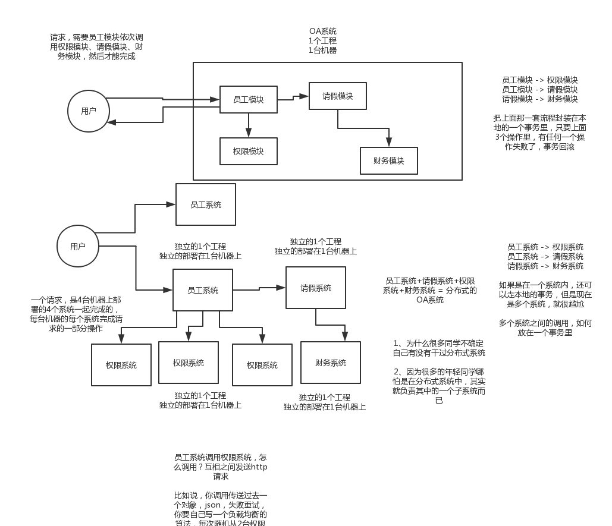
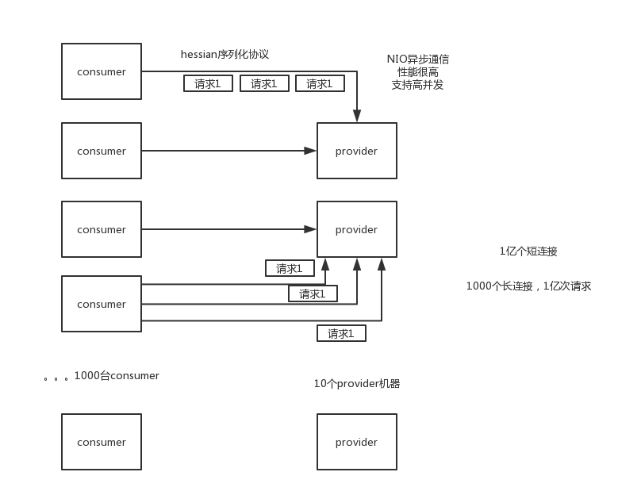
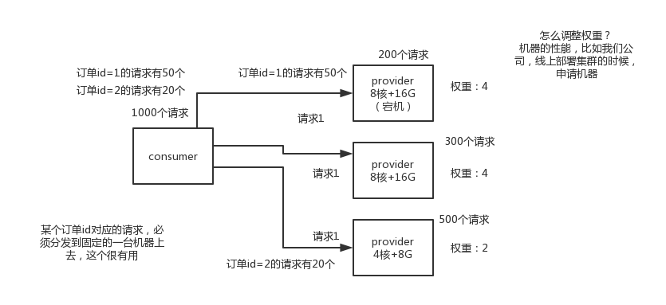
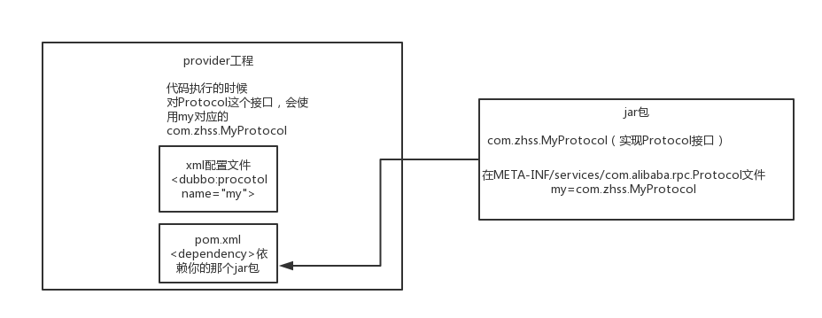

# 分布式系统的面试连环炮

## 面试题

- 什么是分布式系统？
- 为什么要进行系统拆分？如何进行系统拆分？拆分后不用dubbo可以吗？dubbo和thrift有什么区别呢？
- 分布式服务框架
- Dubbo的工作原理？
- Dubbo支持哪些通信协议？
- Dubbo负载均衡策略和集群容错策略？
- Dubbo的SPI思想是什么？

## 什么是分布式系统

现在互联网公司，一般都是做分布式的系统，大家都不是做底层的分布式系统，分布式存储系统，hadoop hdfs，分布式计算系统，hadoop mapreduce，spark，分布式流式计算系统，storm。

分布式业务系统，把原来用java开发的一个大块系统，给拆分成多个子系统，多个子系统之间互相调用，形成一个大系统的整体。假设原来你做了一个OA系统，里面包含了权限模块、员工模块、请假模块、财务模块，一个工程，里面包含了一堆模块，模块与模块之间会互相去调用，1台机器部署。

现在如果你把他这个系统给拆开，权限系统，员工系统，请假系统，财务系统，4个系统，4个工程，分别在4台机器上部署

一个请求过来，完成这个请求，这个员工系统，调用权限系统，调用请假系统，调用财务系统，4个系统分别完成了一部分的事情，最后4个系统都干完了以后，才认为是这个请求已经完成了

单体架构与分布式架构：




## 为什么要把系统拆分成分布式？为什么要使用Dubbo？

### 发展变迁

早些年，我印象中在2010年初的时候，整个IT行业，很少有人谈分布式，更不用说微服务，虽然很多BAT等大型公司，因为系统的复杂性，很早就是分布式架构，大量的服务，只不过微服务大多基于自己搞的一套框架来实现而已。

但是确实，那个年代，大家很重视ssh2，很多中小型公司几乎大部分都是玩儿struts2、spring、hibernate，稍晚一些，才进入了spring mvc、spring、mybatis的组合。那个时候整个行业的技术水平就是那样，当年oracle很火，oracle管理员很吃香，oracle性能优化啥的都是IT男的大杀招啊。连大数据都没人提，当年OCP、OCM等认证培训机构，火的不行。

但是确实随着时代的发展，慢慢的，很多公司开始接受分布式系统架构了，这里面尤为对行业有至关重要影响的，是阿里的dubbo，某种程度上而言，阿里在这里推动了行业技术的前进。

正是因为有阿里的dubbo，很多中小型公司才可以基于dubbo，来把系统拆分成很多的服务，每个人负责一个服务，大家的代码都没有冲突，服务可以自治，自己选用什么技术都可以，每次发布如果就改动一个服务那就上线一个服务好了，不用所有人一起联调，每次发布都是几十万行代码，甚至几百万行代码了。

直到今日，我很高兴的看到分布式系统都成行业面试标配了，任何一个普通的程序员都该掌握这个东西，其实这是行业的进步，也是所有IT码农的技术进步。所以既然分布式都成标配了，那么面试官当然会问了，因为很多公司现在都是分布式、微服务的架构，那面试官当然得考察考察你了。

### 为什么要将系统拆分成分布式？

#### 假设不拆分

要是不拆分，一个大系统几十万行代码，20个人维护一份代码，简直是悲剧啊。代码经常改着改着就冲突了，各种代码冲突和合并要处理，非常耗费时间；经常我改动了我的代码，你调用了我，导致你的代码也得重新测试，麻烦的要死；然后每次发布都是几十万行代码的系统一起发布，大家得一起提心吊胆准备上线，几十万行代码的上线，可能每次上线都要做很多的检查，很多异常问题的处理，简直是又麻烦又痛苦；而且如果我现在打算把技术升级到最新的spring版本，还不行，因为这可能导致你的代码报错，我不敢随意乱改技术。

假设一个系统是20万行代码，其中小A在里面改了1000行代码，但是此时发布的时候是这个20万行代码的大系统一块儿发布。就意味着20万上代码在线上就可能出现各种变化，20个人，每个人都要紧张地等在电脑面前，上线之后，检查日志，看自己负责的那一块儿有没有什么问题。

小A就检查了自己负责的1万行代码对应的功能，确保ok就闪人了；结果不巧的是，小A上线的时候不小心修改了线上机器的某个配置，导致另外小B和小C负责的2万行代码对应的一些功能，出错了

几十个人负责维护一个几十万行代码的单块应用，每次上线，准备几个礼拜，上线 -> 部署 -> 检查自己负责的功能

最近从2013年到现在，5年的时间里，2013年以前，基本上都是BAT的天下；2013年开始，有几个小巨头开始快速的发展，上市，几百亿美金，估值都几百亿美金；2015年，出现了除了BAT以外，又有几个互联网行业的小巨头出现。

有某一个小巨头，现在估值几百亿美金的小巨头，5年前刚开始搞的时候，核心的业务，几十个人，维护一个单块的应用，维护单块的应用，在从0到1的环节里，是很合适的，因为那个时候，是系统都没上线，没什么技术挑战，大家有条不紊的开发。ssh + mysql + tomcat，可能会部署几台机器吧。

结果不行了，后来系统上线了，业务快速发展，10万用户 -> 100万用户 -> 1000万用户 -> 上亿用户了

#### 拆分后

拆分了以后，整个世界清爽了，几十万行代码的系统，拆分成20个服务，平均每个服务就1~2万行代码，每个服务部署到单独的机器上。20个工程，20个git代码仓库里，20个码农，每个人维护自己的那个服务就可以了，是自己独立的代码，跟别人没关系。再也没有代码冲突了，爽。每次就测试我自己的代码就可以了，爽。每次就发布我自己的一个小服务就可以了。技术上想怎么升级就怎么升级，保持接口不变就可以了

所以简单来说，一句话总结，如果是那种代码量多达几十万行的中大型项目，团队里有几十个人，那么如果不拆分系统，开发效率极其低下，问题很多。但是拆分系统之后，每个人就负责自己的一小部分就好了，可以随便玩儿随便弄。分布式系统拆分之后，可以大幅度提升复杂系统大型团队的开发效率。

但是同时，也要提醒的一点是，系统拆分成分布式系统之后，大量的分布式系统面临的问题也是接踵而来，所以后面的问题都是在围绕分布式系统带来的复杂技术挑战在说。

### 如何进行系统的拆分

这个问题说大可以很大，可以扯到领域驱动模型设计上去，说小了也很小，我不太想给大家太过于学术的说法，因为你也不可能背这个答案，过去了直接说吧。还是说的简单一点，大家自己到时候知道怎么回答就行了。

系统拆分分布式系统，拆成多个服务，拆成微服务的架构，拆很多轮的。上来一个架构师第一轮就给拆好了，第一轮；团队继续扩大，拆好的某个服务，刚开始是1个人维护1万行代码，后来业务系统越来越复杂，这个服务是10万行代码，5个人；第二轮，1个服务 -> 5个服务，每个服务2万行代码，每人负责一个服务

如果是多人维护一个服务，<=3个人维护这个服务；最理想的情况下，几十个人，1个人负责1个或2~3个服务；某个服务工作量变大了，代码量越来越多，某个同学，负责一个服务，代码量变成了10万行了，他自己不堪重负，他现在一个人拆开，5个服务，1个人顶着，负责5个人，接着招人，2个人，给那个同学带着，3个人负责5个服务，其中2个人每个人负责2个服务，1个人负责1个服务

我个人建议，一个服务的代码不要太多，1万行左右，两三万撑死了吧

大部分的系统，是要进行多轮拆分的，第一次拆分，可能就是将以前的多个模块该拆分开来了，比如说将电商系统拆分成订单系统、商品系统、采购系统、仓储系统、用户系统，等等吧。

但是后面可能每个系统又变得越来越复杂了，比如说采购系统里面又分成了供应商管理系统、采购单管理系统，订单系统又拆分成了购物车系统、价格系统、订单管理系统。

扯深了实在很深，所以这里先给大家举个例子，你自己感受一下，核心意思就是根据情况，先拆分一轮，后面如果系统更复杂了，可以继续分拆。你根据自己负责系统的例子，来考虑一下就好了。

#### 拆分后不用dubbo可以吗？

当然可以了，大不了最次，就是各个系统之间，直接基于spring mvc，就纯http接口互相通信呗，还能咋样。但是这个肯定是有问题的，因为http接口通信维护起来成本很高，你要考虑超时重试、负载均衡等等各种乱七八糟的问题，比如说你的订单系统调用商品系统，商品系统部署了5台机器，你怎么把请求均匀地甩给那5台机器？这不就是负载均衡？你要是都自己搞那是可以的，但是确实很痛苦。

所以dubbo说白了，是一种rpc框架，就是本地就是进行接口调用，但是dubbo会代理这个调用请求，跟远程机器网络通信，给你处理掉负载均衡了、服务实例上下线自动感知了、超时重试了，等等乱七八糟的问题。那你就不用自己做了，用dubbo就可以了。


## Dubbo的工作原理是啥？

### 工作原理


- 第一层：service层，接口层，给服务提供者和消费者来实现的
- 第二层：config层，配置层，主要是对dubbo进行各种配置的
- 第三层：proxy层，服务代理层，透明生成客户端的stub和服务单的skeleton
- 第四层：registry层，服务注册层，负责服务的注册与发现
- 第五层：cluster层，集群层，封装多个服务提供者的路由以及负载均衡，将多个实例组合成一个服务
- 第六层：monitor层，监控层，对rpc接口的调用次数和调用时间进行监控
- 第七层：protocol层，远程调用层，封装rpc调用
- 第八层：exchange层，信息交换层，封装请求响应模式，同步转异步
- 第九层：transport层，网络传输层，抽象mina和netty为统一接口
- 第十层：serialize层，数据序列化层

### 工作流程

- 第一步，provider向注册中心去注册
- 第二步，consumer从注册中心订阅服务，注册中心会通知consumer注册好的服务
- 第三步，consumer调用provider
- 第四步，consumer和provider都异步的通知监控中心

### 注册中心宕机了后可以继续通信么？

可以，因为刚开始初始化的时候，消费者会将提供者的地址等信息拉取到本地缓存，所以注册中心挂了可以继续通信

## Dubbo支持哪些通信协议？支持哪些序列化协议？



### Dubbo通信协议

#### dubbo协议

dubbo://192.168.0.1:20188

默认就是走dubbo协议的，单一长连接，NIO异步通信，基于hessian作为序列化协议

适用的场景就是：传输数据量很小（每次请求在100kb以内），但是并发量很高

为了要支持高并发场景，一般是服务提供者就几台机器，但是服务消费者有上百台，可能每天调用量达到上亿次！此时用长连接是最合适的，就是跟每个服务消费者维持一个长连接就可以，可能总共就100个连接。然后后面直接基于长连接NIO异步通信，可以支撑高并发请求。

否则如果上亿次请求每次都是短连接的话，服务提供者会扛不住。

而且因为走的是单一长连接，所以传输数据量太大的话，会导致并发能力降低。所以一般建议是传输数据量很小，支撑高并发访问。

####  rmi协议

走java二进制序列化，多个短连接，适合消费者和提供者数量差不多，适用于文件的传输，一般较少用

#### hessian协议

走hessian序列化协议，多个短连接，适用于提供者数量比消费者数量还多，适用于文件的传输，一般较少用

#### http议

走json序列化

#### webservice

走SOAP文本序列化

### dubbo支持的序列化协议

所以dubbo实际基于不同的通信协议，支持hessian、java二进制序列化、json、SOAP文本序列化多种序列化协议。但是hessian是其默认的序列化协议。

## dubbo负载均衡策略和集群容错策略都有哪些？



### dubbo负载均衡策略

#### random loadbalance

默认情况下，dubbo是random load balance随机调用实现负载均衡，可以对provider不同实例设置不同的权重，会按照权重来负载均衡，权重越大分配流量越高，一般就用这个默认的就可以了。

#### roundrobin loadbalance

还有roundrobin loadbalance，这个的话默认就是均匀地将流量打到各个机器上去，但是如果各个机器的性能不一样，容易导致性能差的机器负载过高。所以此时需要调整权重，让性能差的机器承载权重小一些，流量少一些。

跟运维同学申请机器，有的时候，我们运气，正好公司资源比较充足，刚刚有一批热气腾腾，刚刚做好的一批虚拟机新鲜出炉，配置都比较高。8核+16g，机器，2台。过了一段时间，我感觉2台机器有点不太够，我去找运维同学，哥儿们，你能不能再给我1台机器，4核+8G的机器。我还是得要。

#### leastactive loadbalance

这个就是自动感知一下，如果某个机器性能越差，那么接收的请求越少，越不活跃，此时就会给不活跃的性能差的机器更少的请求

#### consistanthash loadbalance

一致性Hash算法，相同参数的请求一定分发到一个provider上去，provider挂掉的时候，会基于虚拟节点均匀分配剩余的流量，抖动不会太大。如果你需要的不是随机负载均衡，是要一类请求都到一个节点，那就走这个一致性hash策略。

### dubbo集群容错策略

#### failover cluster模式

失败自动切换，自动重试其他机器，默认就是这个，常见于读操作

#### failfast cluster模式

一次调用失败就立即失败，常见于写操作

#### failsafe cluster模式

出现异常时忽略掉，常用于不重要的接口调用，比如记录日志

#### failbackc cluster模式

失败了后台自动记录请求，然后定时重发，比较适合于写消息队列这种

#### forking cluster

并行调用多个provider，只要一个成功就立即返回

#### broadcacst cluster

逐个调用所有的provider

### dubbo动态代理策略

默认使用javassist动态字节码生成，创建代理类

但是可以通过spi扩展机制配置自己的动态代理策略


## Dubbo的SPI思想是什么？



spi，简单来说，就是service provider interface，说白了是什么意思呢，比如你有个接口，现在这个接口有3个实现类，那么在系统运行的时候对这个接口到底选择哪个实现类呢？这就需要spi了，需要根据指定的配置或者是默认的配置，去找到对应的实现类加载进来，然后用这个实现类的实例对象。

接口A -> 实现A1，实现A2，实现A3

配置一下，接口A = 实现A2

在系统实际运行的时候，会加载你的配置，用实现A2实例化一个对象来提供服务

比如说你要通过jar包的方式给某个接口提供实现，然后你就在自己jar包的META-INF/services/目录下放一个跟接口同名的文件，里面指定接口的实现里是自己这个jar包里的某个类。ok了，别人用了一个接口，然后用了你的jar包，就会在运行的时候通过你的jar包的那个文件找到这个接口该用哪个实现类。

这是jdk提供的一个功能。

比如说你有个工程A，有个接口A，接口A在工程A里是没有实现类的 -> 系统在运行的时候，怎么给接口A选择一个实现类呢？

你就可以自己搞一个jar包，META-INF/services/，放上一个文件，文件名就是接口名，接口A，接口A的实现类=com.zhss.service.实现类A2。让工程A来依赖你的这个jar包，然后呢在系统运行的时候，工程A跑起来，对接口A，就会扫描自己依赖的所有的jar包，在每个jar里找找，有没有META-INF/services文件夹，如果有，在里面找找，有没有接口A这个名字的文件，如果有在里面找一下你指定的接口A的实现是你的jar包里的哪个类？

SPI机制，一般来说用在哪儿？插件扩展的场景，比如说你开发的是一个给别人使用的开源框架，如果你想让别人自己写个插件，插到你的开源框架里面来，扩展某个功能。

经典的思想体现，大家平时都在用，比如说jdbc

java定义了一套jdbc的接口，但是java是没有提供jdbc的实现类

但是实际上项目跑的时候，要使用jdbc接口的哪些实现类呢？一般来说，我们要根据自己使用的数据库，比如msyql，你就将mysql-jdbc-connector.jar，引入进来；oracle，你就将oracle-jdbc-connector.jar，引入进来。

在系统跑的时候，碰到你使用jdbc的接口，他会在底层使用你引入的那个jar中提供的实现类

但是dubbo也用了spi思想，不过没有用jdk的spi机制，是自己实现的一套spi机制。

```
Protocol protocol = ExtensionLoader.getExtensionLoader(Protocol.class).getAdaptiveExtension();
```

Protocol接口，dubbo要判断一下，在系统运行的时候，应该选用这个Protocol接口的哪个实现类来实例化对象来使用呢？

他会去找一个你配置的Protocol，他就会将你配置的Protocol实现类，加载到jvm中来，然后实例化对象，就用你的那个Protocol实现类就可以了

微内核，可插拔，大量的组件，Protocol负责rpc调用的东西，你可以实现自己的rpc调用组件，实现Protocol接口，给自己的一个实现类即可。

这行代码就是dubbo里大量使用的，就是对很多组件，都是保留一个接口和多个实现，然后在系统运行的时候动态根据配置去找到对应的实现类。如果你没配置，那就走默认的实现好了，没问题。

```
@SPI("dubbo") 

public interface Protocol { 

  int getDefaultPort(); 

  @Adaptive 

  <T> Exporter<T> export(Invoker<T> invoker) throws RpcException; 

  @Adaptive 

  <T> Invoker<T> refer(Class<T> type, URL url) throws RpcException; 

  void destroy(); 

} 
```


在dubbo自己的jar里，在/META_INF/dubbo/internal/com.alibaba.dubbo.rpc.Protocol文件中：

```
dubbo=com.alibaba.dubbo.rpc.protocol.dubbo.DubboProtocol
http=com.alibaba.dubbo.rpc.protocol.http.HttpProtocol
hessian=com.alibaba.dubbo.rpc.protocol.hessian.HessianProtocol
```

所以说，这就看到了dubbo的spi机制默认是怎么玩儿的了，其实就是Protocol接口，@SPI(“dubbo”)说的是，通过SPI机制来提供实现类，实现类是通过dubbo作为默认key去配置文件里找到的，配置文件名称与接口全限定名一样的，通过dubbo作为key可以找到默认的实现了就是com.alibaba.dubbo.rpc.protocol.dubbo.DubboProtocol。

dubbo的默认网络通信协议，就是dubbo协议，用的DubboProtocol

如果想要动态替换掉默认的实现类，需要使用@Adaptive接口，Protocol接口中，有两个方法加了@Adaptive注解，就是说那俩接口会被代理实现。

比如这个Protocol接口搞了俩@Adaptive注解标注了方法，在运行的时候会针对Protocol生成代理类，这个代理类的那俩方法里面会有代理代码，代理代码会在运行的时候动态根据url中的protocol来获取那个key，默认是dubbo，你也可以自己指定，你如果指定了别的key，那么就会获取别的实现类的实例了。

通过这个url中的参数不通，就可以控制动态使用不同的组件实现类

好吧，那下面来说说怎么来自己扩展dubbo中的组件

自己写个工程，要是那种可以打成jar包的，里面的src/main/resources目录下，搞一个META-INF/services，里面放个文件叫：com.alibaba.dubbo.rpc.Protocol，文件里搞一个my=com.zhss.MyProtocol。自己把jar弄到nexus私服里去。

然后自己搞一个dubbo provider工程，在这个工程里面依赖你自己搞的那个jar，然后在spring配置文件里给个配置：

```
<dubbo:protocol name=”my” port=”20000” />
```

这个时候provider启动的时候，就会加载到我们jar包里的my=com.zhss.MyProtocol这行配置里，接着会根据你的配置使用你定义好的MyProtocol了，这个就是简单说明一下，你通过上述方式，可以替换掉大量的dubbo内部的组件，就是扔个你自己的jar包，然后配置一下即可。

dubbo里面提供了大量的类似上面的扩展点，就是说，你如果要扩展一个东西，只要自己写个jar，让你的consumer或者是provider工程，依赖你的那个jar，在你的jar里指定目录下配置好接口名称对应的文件，里面通过key=实现类。

然后对对应的组件，用类似<dubbo:protocol>用你的哪个key对应的实现类来实现某个接口，你可以自己去扩展dubbo的各种功能，提供你自己的实现。


## 基于Dubbo如何做服务治理、服务降级和重试

服务治理，这个问题如果问你，其实就是看看你有没有服务治理的思想，因为这个是做过复杂微服务的人肯定会遇到的一个问题。

服务降级，这个是涉及到复杂分布式系统中必备的一个话题，因为分布式系统互相来回调用，任何一个系统故障了，你不降级，直接就全盘崩溃？那就太坑爹了吧

失败重试，分布式系统中网络请求如此频繁，要是因为网络问题不小心失败了一次，是不是要重试？

超时重试，同上，如果不小心网络慢一点，超时了，如何重试？

- dubbo工作原理：服务注册，注册中心，消费者，代理通信，负载均衡
- 网络通信、序列化：dubbo协议，长连接，NIO，hessian序列化协议
- 负载均衡策略，集群容错策略，动态代理策略：dubbo跑起来的时候一些功能是如何运转的，怎么做负载均衡？怎么做集群容错？怎么生成动态代理？
- dubbo SPI机制：你了解不了解dubbo的SPI机制？如何基于SPI机制对dubbo进行扩展？
- dubbo的服务治理、降级、重试

### 服务治理

#### 调用链路自动生成

一个大型的分布式系统，或者说是用现在流行的微服务架构来说吧，分布式系统由大量的服务组成。那么这些服务之间互相是如何调用的？调用链路是啥？说实话，几乎到后面没人搞的清楚了，因为服务实在太多了，可能几百个甚至几千个服务。

那就需要基于dubbo做的分布式系统中，对各个服务之间的调用自动记录下来，然后自动将各个服务之间的依赖关系和调用链路生成出来，做成一张图，显示出来，大家才可以看到对吧。

服务A -> 服务B -> 服务C

​        -> 服务E

   -> 服务D

​        -> 服务F

   -> 服务W

#### 服务访问压力以及时长统计

需要自动统计各个接口和服务之间的调用次数以及访问延时，而且要分成两个级别。一个级别是接口粒度，就是每个服务的每个接口每天被调用多少次，TP50，TP90，TP99，三个档次的请求延时分别是多少；第二个级别是从源头入口开始，一个完整的请求链路经过几十个服务之后，完成一次请求，每天全链路走多少次，全链路请求延时的TP50，TP90，TP99，分别是多少。

这些东西都搞定了之后，后面才可以来看当前系统的压力主要在哪里，如何来扩容和优化啊

#### 其他的

服务分层（避免循环依赖），调用链路失败监控和报警，服务鉴权，每个服务的可用性的监控（接口调用成功率？几个9）99.99%，99.9%，99%

### 服务降级

比如说服务A调用服务B，结果服务B挂掉了，服务A重试几次调用服务B，还是不行，直接降级，走一个备用的逻辑，给用户返回响应

 ```
public interface HelloService {
  void sayHello();
}

public class HelloServiceImpl implements HelloService {

  public void sayHello() {
​    System.out.println("hello world......");
  }
}


<?xml version="1.0" encoding="UTF-8"?>

<beans xmlns="http://www.springframework.org/schema/beans"

  xmlns:xsi="http://www.w3.org/2001/XMLSchema-instance" xmlns:dubbo="http://code.alibabatech.com/schema/dubbo"

  xsi:schemaLocation="http://www.springframework.org/schema/beans    http://www.springframework.org/schema/beans/spring-beans.xsd    http://code.alibabatech.com/schema/dubbo    http://code.alibabatech.com/schema/dubbo/dubbo.xsd">

  <dubbo:application name="dubbo-provider" />

  <dubbo:registry address="zookeeper://127.0.0.1:2181" />

  <dubbo:protocol name="dubbo" port="20880" />

  <dubbo:service interface="com.zhss.service.HelloService" ref="helloServiceImpl" timeout="10000" />

  <bean id="helloServiceImpl" class="com.zhss.service.HelloServiceImpl" />

</beans>

<?xml version="1.0" encoding="UTF-8"?>

<beans xmlns="http://www.springframework.org/schema/beans"

  xmlns:xsi="http://www.w3.org/2001/XMLSchema-instance"

  xmlns:dubbo="http://code.alibabatech.com/schema/dubbo"

  xsi:schemaLocation="http://www.springframework.org/schema/beans    http://www.springframework.org/schema/beans/spring-beans.xsd    http://code.alibabatech.com/schema/dubbo    http://code.alibabatech.com/schema/dubbo/dubbo.xsd">

  <dubbo:application name="dubbo-consumer" />

  <dubbo:registry address="zookeeper://127.0.0.1:2181" />

  <dubbo:reference id="fooService" interface="com.test.service.FooService" timeout="10000" check="false" mock="return null">

  </dubbo:reference>

</beans>
 ```

现在就是mock，如果调用失败统一返回null

但是可以将mock修改为true，然后在跟接口同一个路径下实现一个Mock类，命名规则是接口名称加Mock后缀。然后在Mock类里实现自己的降级逻辑。

```
public class HelloServiceMock implements HelloService {
    public void sayHello() {

    // 降级逻辑

    }
}
```

### 失败重试和超时重试

所谓失败重试，就是consumer调用provider要是失败了，比如抛异常了，此时应该是可以重试的，或者调用超时了也可以重试。

```
<dubbo:reference id="xxxx" interface="xx" check="true" async="false" retries="3" timeout="2000"/>
```

某个服务的接口，要耗费5s，你这边不能干等着，你这边配置了timeout之后，我等待2s，还没返回，我直接就撤了，不能等你

如果是超时了，timeout就会设置超时时间；如果是调用失败了自动就会重试指定的次数

你就结合你们公司的具体的场景来说说你是怎么设置这些参数的，timeout，一般设置为200ms，我们认为不能超过200ms还没返回

retries，3次，设置retries，还一般是在读请求的时候，比如你要查询个数据，你可以设置个retries，如果第一次没读到，报错，重试指定的次数，尝试再次读取2次

 