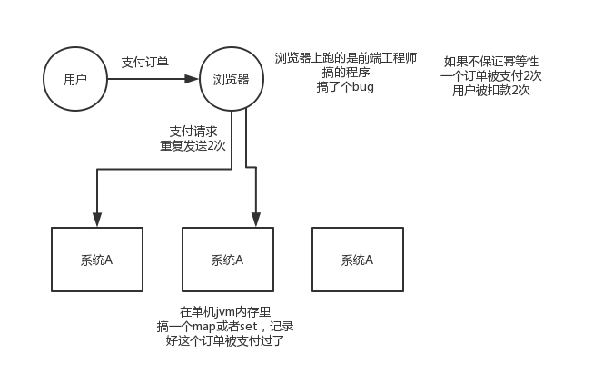
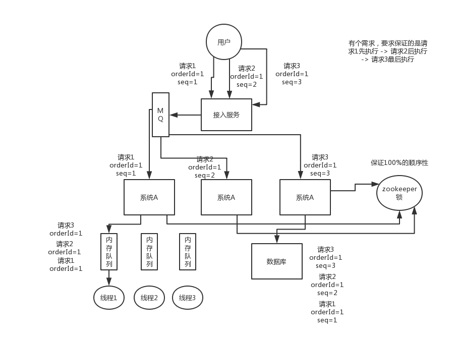
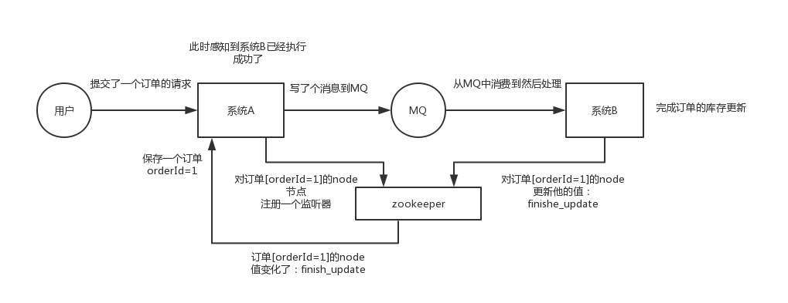
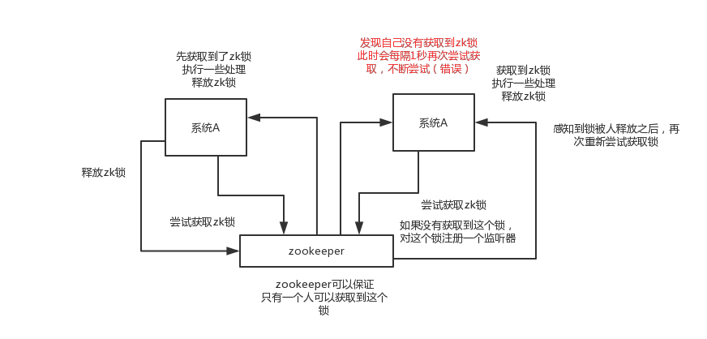
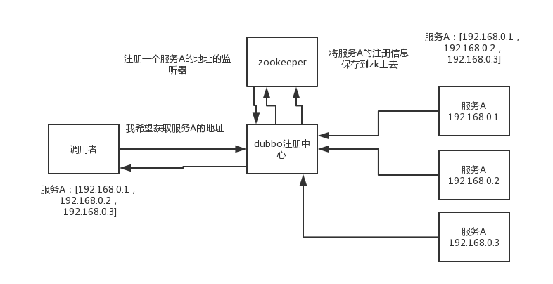
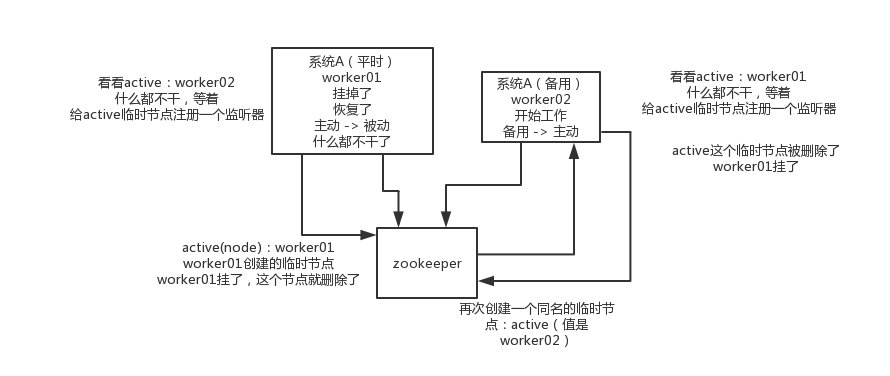
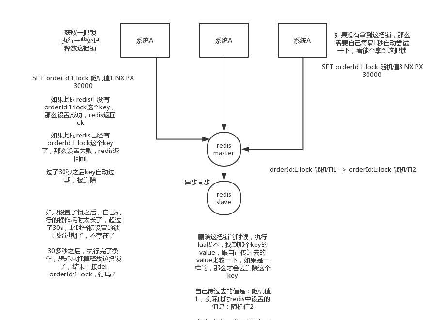
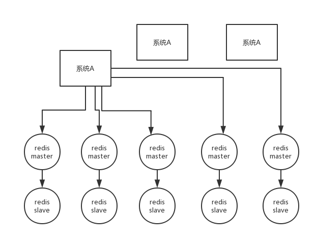
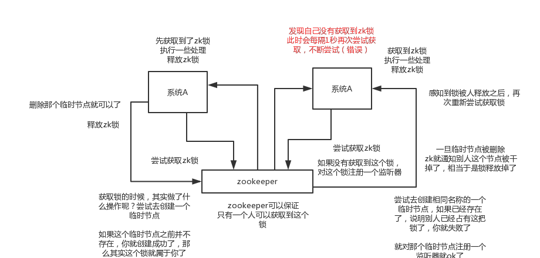

# 分布式系统幂等性与顺序性及分布式锁

## 分布式服务接口的幂等性如何设计

### 什么是幂等性

一个分布式系统中的某个接口，要保证幂等性，该如何保证？这个事儿其实是你做分布式系统的时候必须要考虑的一个生产环境的技术问题。啥意思呢？

你看，假如你有个服务提供一个接口，结果这服务部署在了5台机器上，接着有个接口就是付款接口。然后人家用户在前端上操作的时候，不知道为啥，总之就是一个订单不小心发起了两次支付请求，然后这俩请求分散在了这个服务部署的不同的机器上，好了，结果一个订单扣款扣两次？尴尬了。。。

或者是订单系统调用支付系统进行支付，结果不小心因为网络超时了，然后订单系统走了前面我们看到的那个重试机制，咔嚓给你重试了一把，好，支付系统收到一个支付请求两次，而且因为负载均衡算法落在了不同的机器上，尴尬了。。。

所以你肯定得知道这事儿，否则你做出来的分布式系统恐怕容易埋坑

网络问题很常见，100次请求，都ok；1万次，可能1次是超时会重试；10万，10次；100万，100次；如果有100个请求重复了，你没处理，导致订单扣款2次，100个订单都扣错了；每天被100个用户投诉；一个月被3000个用户投诉

我们之前生产就遇到过，是往数据库里写入数据，重复的请求，就导致我们的数据经常会错，出现一些重复数据，就会导致一些问题



如果是单机的环境，只需要维护一个map或者set即可，每次判断订单ID是否被支付过。

这个不是技术问题，这个没有通用的一个方法，这个是结合业务来看应该如何保证幂等性的，你的经验。

 所谓幂等性，就是说一个接口，多次发起同一个请求，你这个接口得保证结果是准确的，比如不能多扣款，不能多插入一条数据，不能将统计值多加了1。这就是幂等性，不给大家来学术性词语了。

### 保证幂等性

其实保证幂等性主要是三点：

- 对于每个请求必须有一个唯一的标识，举个例子：订单支付请求，肯定得包含订单id，一个订单id最多支付一次，对吧
- 每次处理完请求之后，必须有一个记录标识这个请求处理过了，比如说常见的方案是在mysql中记录个状态啥的，比如支付之前记录一条这个订单的支付流水，而且支付流水采
- 每次接收请求需要进行判断之前是否处理过的逻辑处理，比如说，如果有一个订单已经支付了，就已经有了一条支付流水，那么如果重复发送这个请求，则此时先插入支付流水，orderId已经存在了，唯一键约束生效，报错插入不进去的。然后你就不用再扣款了。
- 上面只是给大家举个例子，实际运作过程中，你要结合自己的业务来，比如说用redis用orderId作为唯一键。只有成功插入这个支付流水，才可以执行实际的支付扣款。

要求是支付一个订单，必须插入一条支付流水，order_id建一个唯一键，unique key

所以你在支付一个订单之前，先插入一条支付流水，order_id就已经进去了

你就可以写一个标识到redis里面去，set order_id payed，下一次重复请求过来了，先查redis的order_id对应的value，如果是payed就说明已经支付过了，你就别重复支付了

然后呢，你再重复支付这个订单的时候，你写尝试插入一条支付流水，数据库给你报错了，说unique key冲突了，整个事务回滚就可以了

来保存一个是否处理过的标识也可以，服务的不同实例可以一起操作redis。

 

## 分布式服务接口请求的顺序如何保证？

其实分布式系统接口的调用顺序，也是个问题，一般来说是不用保证顺序的。但是有的时候可能确实是需要严格的顺序保证。给大家举个例子，你服务A调用服务B，先插入再删除。好，结果俩请求过去了，落在不同机器上，可能插入请求因为某些原因执行慢了一些，导致删除请求先执行了，此时因为没数据所以啥效果也没有；结果这个时候插入请求过来了，好，数据插入进去了，那就尴尬了。

 本来应该是先插入 -> 再删除，这条数据应该没了，结果现在先删除 -> 再插入，数据还存在，最后你死都想不明白是怎么回事。所以这都是分布式系统一些很常见的问题



首先，一般来说，我个人给你的建议是，你们从业务逻辑上最好设计的这个系统不需要这种顺序性的保证，因为一旦引入顺序性保障，会导致系统复杂度上升，而且会带来效率低下，热点数据压力过大，等问题。

下面我给个我们用过的方案吧，简单来说，首先你得用dubbo的一致性hash负载均衡策略，将比如某一个订单id对应的请求都给分发到某个机器上去，接着就是在那个机器上因为可能还是多线程并发执行的，你可能得立即将某个订单id对应的请求扔一个内存队列里去，强制排队，这样来确保他们的顺序性。

但是这样引发的后续问题就很多，比如说要是某个订单对应的请求特别多，造成某台机器成热点怎么办？解决这些问题又要开启后续一连串的复杂技术方案。。。曾经这类问题弄的我们头疼不已，所以，还是建议什么呢？

最好是比如说刚才那种，一个订单的插入和删除操作，能不能合并成一个操作，就是一个删除，或者是什么，避免这种问题的产生。

### 采用MQ以及内存队列来解决

方式1，也是最友好的方式就是使用消息队列和内存队列来解决，首先我们需要做的就是把需要保证顺序的请求，通过Hash算法分发到特定的同一台机器上，然后机器内部在把请求放到内存队列中，线程从内存队列中获取消费，保证线程的顺序性

但是这种方式能解决99%的顺序性，但是接入服务还是可能存在问题，比如把请求 123，弄成231，导致送入MQ队列中顺序也不一致

### 采用分布式锁来解决

分布式锁能够保证强一致性，但是因为引入这种重量级的同步机制，会导致并发量急剧降低，因为需要频繁的获取锁，释放锁的操作。


## 如何设计一个类似Dubbo的RPC框架

遇到这类问题，起码从你了解的类似框架的原理入手，自己说说参照dubbo的原理，你来设计一下，举个例子，dubbo不是有那么多分层么？而且每个分层是干啥的，你大概是不是知道？那就按照这个思路大致说一下吧。

- 上来你的服务就得去注册中心注册吧，你是不是得有个注册中心，保留各个服务的信息，可以用zookeeper来做，对吧
- 然后你的消费者需要去注册中心拿对应的服务信息吧，对吧，而且每个服务可能会存在于多台机器上
- 接着你就该发起一次请求了，咋发起？蒙圈了是吧。当然是基于动态代理了，你面向接口获取到一个动态代理，这个动态代理就是接口在本地的一个代理，然后这个代理会找到服务对应的机器地址
- 然后找哪个机器发送请求？那肯定得有个负载均衡算法了，比如最简单的可以随机轮询是不是
- 接着找到一台机器，就可以跟他发送请求了，第一个问题咋发送？你可以说用netty了，nio方式；第二个问题发送啥格式数据？你可以说用hessian序列化协议了，或者是别的，对吧。然后请求过去了。。
- 服务器那边一样的，需要针对你自己的服务生成一个动态代理，监听某个网络端口了，然后代理你本地的服务代码。接收到请求的时候，就调用对应的服务代码，对吧。


## 说说Zookeeper的使用场景有哪些？

分布式锁这个东西，很常用的，你做java系统开发，分布式系统，可能会有一些场景会用到。最常用的分布式锁就是zookeeper来做分布式锁。

其实说实话，问这个问题，一般就是看看你是否了解zk，因为zk是分布式系统中很常见的一个基础系统。而且问的话常问的就是说zk的使用场景是什么？看你知道不知道一些基本的使用场景。但是其实zk挖深了自然是可以问的很深很深的。

### 分布式协调

这个其实是zk很经典的一个用法，简单来说，就好比，你A系统发送个请求到mq，然后B消息消费之后处理了。那A系统如何知道B系统的处理结果？用zk就可以实现分布式系统之间的协调工作。A系统发送请求之后可以在zk上对某个节点的值注册个监听器，一旦B系统处理完了就修改zk那个节点的值，A立马就可以收到通知，完美解决。



### 分布式锁 

对某一个数据连续发出两个修改操作，两台机器同时收到了请求，但是只能一台机器先执行另外一个机器再执行。那么此时就可以使用zk分布式锁，一个机器接收到了请求之后先获取zk上的一把分布式锁，就是可以去创建一个znode，接着执行操作；然后另外一个机器也尝试去创建那个znode，结果发现自己创建不了，因为被别人创建了。。。。那只能等着，等第一个机器执行完了自己再执行。



### 元数据/配置信息管理

zk可以用作很多系统的配置信息的管理，比如kafka、storm等等很多分布式系统都会选用zk来做一些元数据、配置信息的管理，包括dubbo注册中心不也支持zk



###  HA高可用性

这个应该是很常见的，比如hadoop、hdfs、yarn等很多大数据系统，都选择基于zk来开发HA高可用机制，就是一个重要进程一般会做主备两个，主进程挂了立马通过zk感知到切换到备用进程

## 分布式锁

### 面试题

- 一般实现分布式锁都有哪些方式？
- 使用redis如何设计分布式锁？
- 使用zk来设计分布式锁可以吗？
- 这两种分布式锁的实现方式哪种效率比较高？

### Redis实现分布式锁

官方叫做RedLock算法，是redis官方支持的分布式锁算法。

这个分布式锁有3个重要的考量点，互斥（只能有一个客户端获取锁），不能死锁，容错（大部分redis节点或者这个锁就可以加可以释放）

第一个最普通的实现方式，如果就是在redis里创建一个key算加锁

SET my:lock 随机值 NX PX 30000，这个命令就ok，这个的NX的意思就是只有key不存在的时候才会设置成功，PX 30000的意思是30秒后锁自动释放。别人创建的时候如果发现已经有了就不能加锁了。

释放锁就是删除key，但是一般可以用lua脚本删除，判断value一样才删除：



关于redis如何执行lua脚本，自行百度

```
if redis.call("get",KEYS[1]) == ARGV[1] then

return redis.call("del",KEYS[1])

else

  return 0

end
```

为啥要用随机值呢？因为如果某个客户端获取到了锁，但是阻塞了很长时间才执行完，此时可能已经自动释放锁了，此时可能别的客户端已经获取到了这个锁，要是你这个时候直接删除key的话会有问题，所以得用随机值加上面的lua脚本来释放锁。

但是这样是肯定不行的。因为如果是普通的redis单实例，那就是单点故障。或者是redis普通主从，那redis主从异步复制，如果主节点挂了，key还没同步到从节点，此时从节点切换为主节点，别人就会拿到锁。

 

第二个问题，RedLock算法

- 这个场景是假设有一个redis cluster，有5个redis master实例。然后执行如下步骤获取一把锁：
- 获取当前时间戳，单位是毫秒
- 跟上面类似，轮流尝试在每个master节点上创建锁，过期时间较短，一般就几十毫秒
- 尝试在大多数节点上建立一个锁，比如5个节点就要求是3个节点（n / 2 +1）
- 客户端计算建立好锁的时间，如果建立锁的时间小于超时时间，就算建立成功了
- 要是锁建立失败了，那么就依次删除这个锁
- 只要别人建立了一把分布式锁，你就得不断轮询去尝试获取锁

 

### ZK实现分布式锁

zk分布式锁，其实可以做的比较简单，就是某个节点尝试创建临时znode，此时创建成功了就获取了这个锁；这个时候别的客户端来创建锁会失败，只能注册个监听器监听这个锁。释放锁就是删除这个znode，一旦释放掉就会通知客户端，然后有一个等待着的客户端就可以再次重新加锁。



ZK实现分布式锁，就是不需要执行轮询算法，而是注册监听器，但有人释放锁的时候，会通知需要获取锁的进程。

同时ZK获取锁的时候，其实就是创建了一个临时节点，如果这个临时节点之前不存在，那么就创建成功，也就是说这个锁就是属于该线程的。

同时其它的线程会尝试创建相同名称的一个临时节点，如果已经存在，说明别人已经占有了这把锁，那么就创建失败。

一旦临时节点被删除，zk就通知别人这个锁已经被释放掉了，相当于锁被释放掉了。

假设这个时候，持有锁的服务器宕机了，那么Zookeeper会自动将该锁给释放掉。


### ZK实现分布式锁代码

```
/**
 * ZooKeeperSession
 * @author Administrator
 *
 */
public class ZooKeeperSession {
	
	private static CountDownLatch connectedSemaphore = new CountDownLatch(1);
	
	private ZooKeeper zookeeper;
private CountDownLatch latch;

	public ZooKeeperSession() {
		try {
			this.zookeeper = new ZooKeeper(
					"192.168.31.187:2181,192.168.31.19:2181,192.168.31.227:2181", 
					50000, 
					new ZooKeeperWatcher());			
			try {
				connectedSemaphore.await();
			} catch(InterruptedException e) {
				e.printStackTrace();
			}

			System.out.println("ZooKeeper session established......");
		} catch (Exception e) {
			e.printStackTrace();
		}
	}
	
	/**
	 * 获取分布式锁
	 * @param productId
	 */
	public Boolean acquireDistributedLock(Long productId) {
		String path = "/product-lock-" + productId;
	
		try {
			zookeeper.create(path, "".getBytes(), 
					Ids.OPEN_ACL_UNSAFE, CreateMode.EPHEMERAL);
return true;
		} catch (Exception e) {
while(true) {
				try {
Stat stat = zk.exists(path, true); // 相当于是给node注册一个监听器，去看看这个监听器是否存在
if(stat != null) {
this.latch = new CountDownLatch(1);
this.latch.await(waitTime, TimeUnit.MILLISECONDS);
this.latch = null;
}
zookeeper.create(path, "".getBytes(), 
						Ids.OPEN_ACL_UNSAFE, CreateMode.EPHEMERAL);
return true;
} catch(Exception e) {
continue;
}
}

// 很不优雅，我呢就是给大家来演示这么一个思路
// 比较通用的，我们公司里我们自己封装的基于zookeeper的分布式锁，我们基于zookeeper的临时顺序节点去实现的，比较优雅的
		}
return true;
	}
	
	/**
	 * 释放掉一个分布式锁
	 * @param productId
	 */
	public void releaseDistributedLock(Long productId) {
		String path = "/product-lock-" + productId;
		try {
			zookeeper.delete(path, -1); 
			System.out.println("release the lock for product[id=" + productId + "]......");  
		} catch (Exception e) {
			e.printStackTrace();
		}
	}
	
	/**
	 * 建立zk session的watcher
	 * @author Administrator
	 *
	 */
	private class ZooKeeperWatcher implements Watcher {

		public void process(WatchedEvent event) {
			System.out.println("Receive watched event: " + event.getState());

			if(KeeperState.SyncConnected == event.getState()) {
				connectedSemaphore.countDown();
			} 

if(this.latch != null) {  
this.latch.countDown();  
}
		}
		
	}
	
	/**
	 * 封装单例的静态内部类
	 * @author Administrator
	 *
	 */
	private static class Singleton {
		
		private static ZooKeeperSession instance;
		
		static {
			instance = new ZooKeeperSession();
		}
		
		public static ZooKeeperSession getInstance() {
			return instance;
		}
		
	}
	
	/**
	 * 获取单例
	 * @return
	 */
	public static ZooKeeperSession getInstance() {
		return Singleton.getInstance();
	}
	
	/**
	 * 初始化单例的便捷方法
	 */
	public static void init() {
		getInstance();
	}
	
}
```


### Redis分布式锁和ZK分布式锁

redis分布式锁，其实需要自己不断去尝试获取锁，比较消耗性能

 zk分布式锁，获取不到锁，注册个监听器即可，不需要不断主动尝试获取锁，性能开销较小

 另外一点就是，如果是redis获取锁的那个客户端bug了或者挂了，那么只能等待超时时间之后才能释放锁；而zk的话，因为创建的是临时znode，只要客户端挂了，znode就没了，此时就自动释放锁

 redis分布式锁大家每发现好麻烦吗？遍历上锁，计算时间等等。。。zk的分布式锁语义清晰实现简单

 所以先不分析太多的东西，就说这两点，我个人实践认为zk的分布式锁比redis的分布式锁牢靠、而且模型简单易用