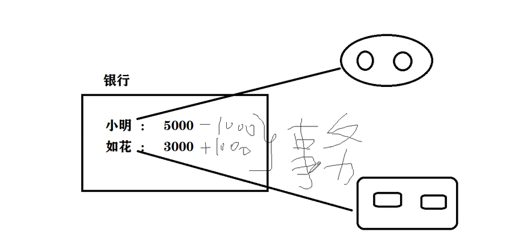
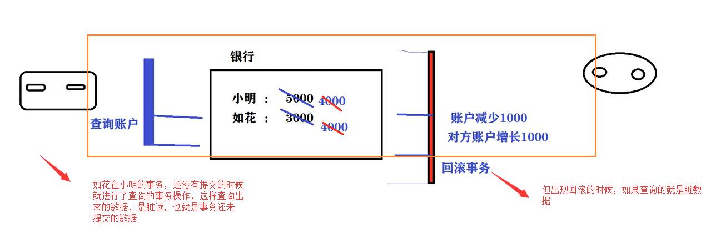
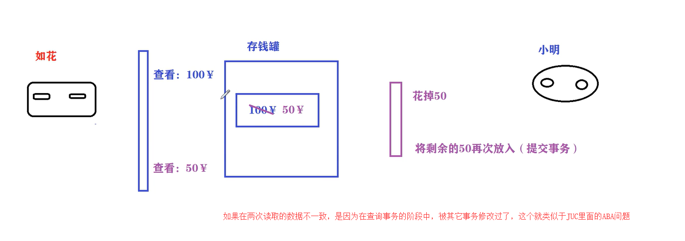
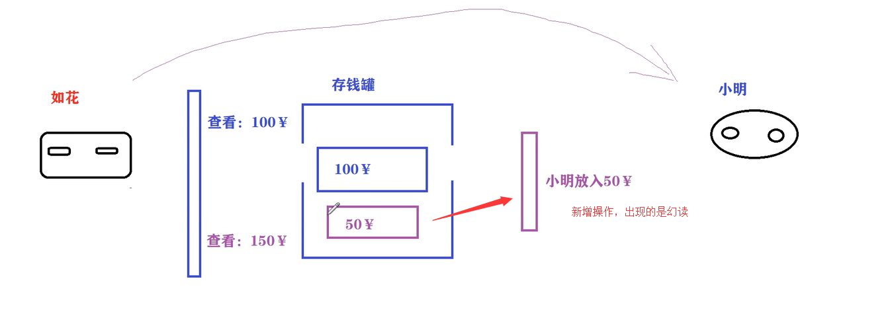
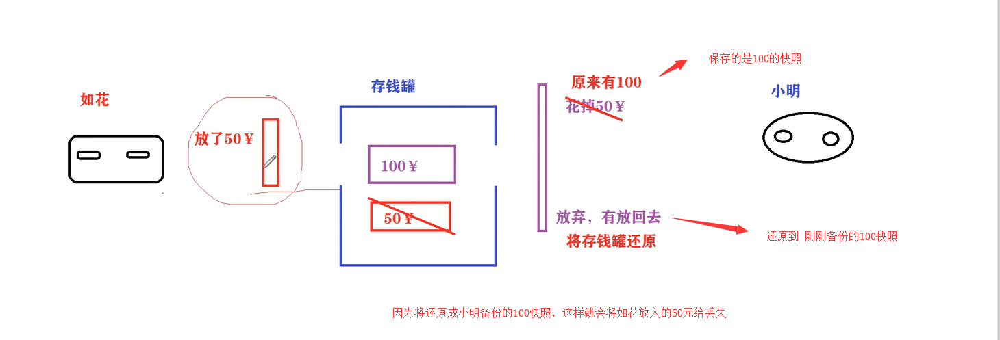
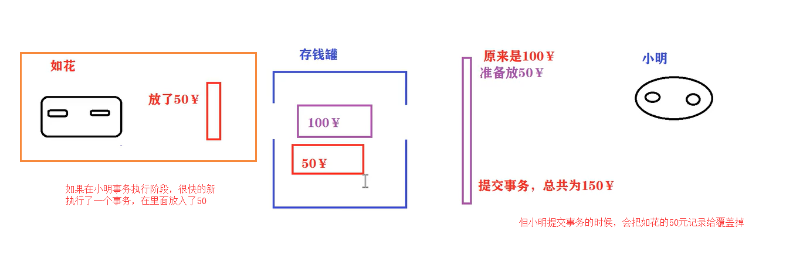
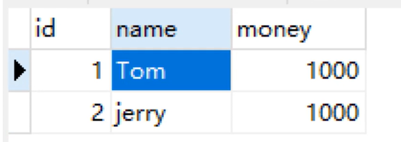
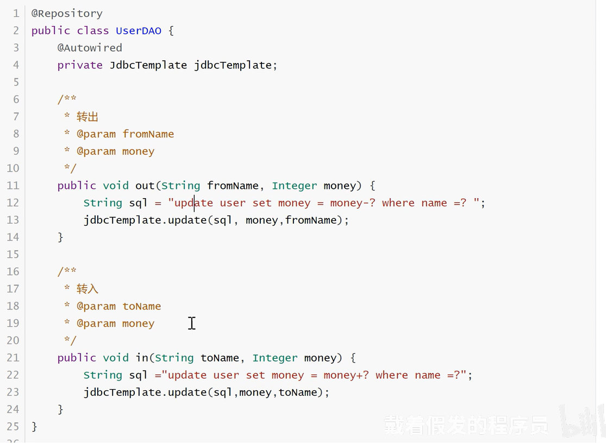
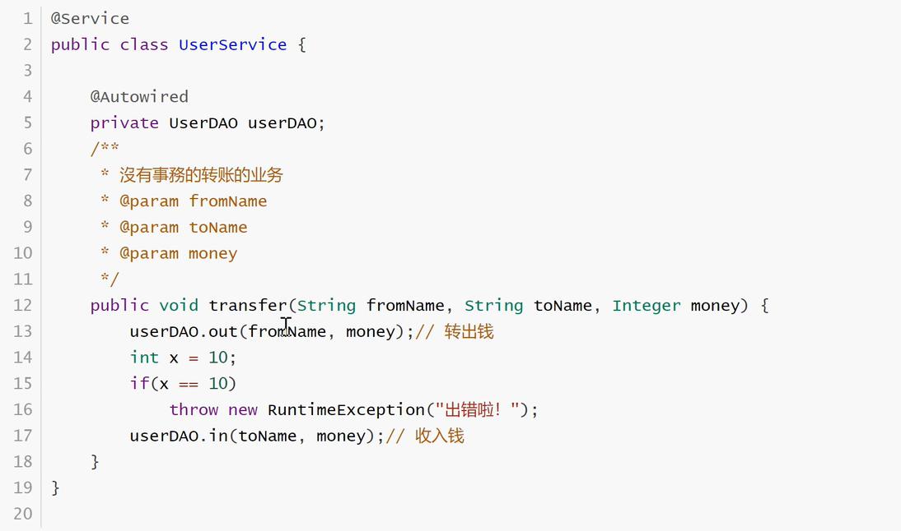
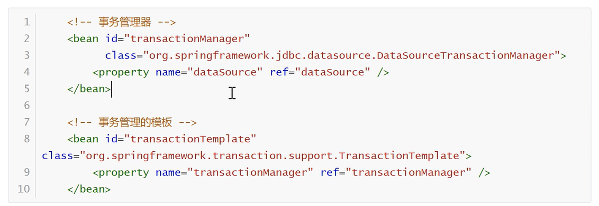

# Spring中的事务

来源：https://www.bilibili.com/video/BV1EE411p7dD

## 什么是事务

事务：是数据库操作的最小工作单元，是作为单个逻辑工作单元执行的一系列操作，这些操作作为一个整体像系统提交，要么都执行，要么都不执行；事务是一组不可再分割的操作集合（工作逻辑单元）

通俗点说就是为了达到某个目的而做的一系列的操作要么一起成功（事务提交），要么一起失败（事务回滚）

最常见的例子就是转账：

小明给如花转账：

```
开启事务-------
① 从小明的账户扣除1000元
② 给如花的账户增加1000元
事务提交-------
```

从上面的例子的任何步骤一旦出现问题，都会导致事务回滚。



从搭讪到结婚就是事务提交，女方要求男方重新追求她一次就是事务回滚~

## 事务的四大特征

ACID是事务的基本特征：口诀（一原持久隔离）

- 原子性（Atomicity）：事务是一个原子操作，由一系列动作组成。事务的原子性确保动作要么全部完成，要么完全不起作用。
- 一致性（Consistency）：事务执行后，数据库状态与其它业务规则保持一致，如转账业务，无论事务执行成功与否，参与转账的两个账号余额之和应该是不变的
- 隔离性（Isolation）：隔离性指在并发操作中，不同事务之间应该隔离开来，使每个并发中的事务不会相互干扰。
- 持久性（Durability）：一旦事务提交成功，事务中所有的数据操作都必须持久化到数据库中，即使提交事务后，数据库马上崩溃，在数据库重启时，也必须保证通过某种机制恢复数据。

## 原生JDBC事务操作

```
try {
	// 设置是否自动提交
	connection.setAutoCommit(false)
	
	// 数据库操作 insert，update，delete
	
	connection.commit()
} catch(Exception ex) {
	// 回滚
	connection.rollback()
} finally {
	connection.setAutoCommit(true)
}
```

## 事务隔离级别

数据库事务的隔离级别有4中，由低到高分别是：`Read uncomomitted（读取未被提交的数据）`、`Read committed（读取以被提交的数据）`、`Repeatable read（可重复读）`、`Serializable（完全隔离）`。而且，在事务的并发操作中，可能出现脏读、不可重复读、幻读、事务丢失

### 四种隔离级别

#### Read UnCommitted

读未提交，顾名思义，就是一个事务可以读取另一个未提交事务的数据，会产生脏读

#### Read Committed

`这种使用的概率比较高，因为很多时候我们就以最后一次读取的为准`

读提交，顾名思义，就是一个事务要等另一个事务提交后才能读取数据，会产生不可重复读。

#### Repeatable Read

`相当于加锁，MySQL的默认级别`

重复读，就是在开始读取数据（事务开启）时，不在允许修改操作，可能会产生幻读。

#### Serializable

最高的事务隔离级别，在改级别下，事务串行化顺序执行，可以避免脏读，不可重复读与幻读。但是这种事务隔离级别效率低下，比较耗数据库性能，一般不使用

#### 总结

大多数数据库默认的事务隔离级别是：`Read Committed`，比如SqlServer，Oracle

MySQL的默认隔离级别是Repeatable Read

### 可能出现的问题

#### 脏读

`读取了未提交的新事务，然后被回滚了`

事务A读取了事务B中尚未提交的数据，如果事务B回滚，则A读取使用了错误的数据



#### 不可重复读

`读取了提交的新事物，指更新操作`

不可重复读是指对于数据库中某个数据，一个事务范围内多次查询却反悔不同的数值，这是由于在查询间隔，被另一个事务修改并提交了



解决不可重复读的一个解决方案，就是调整隔离级别。

#### 幻读

`读取了提交的新事物，指增删操作`

在事务A多次读取构成中，事务B对数据进行了新增操作，导致事务A多次读取的数据不一致



对于幻读的另外一个理解，可以为：

`幻读就是指新增了数据记录条数，第一次查询数据记录数为1000，再次查询的时候，变成了1001，这个就是幻读`

#### 不可重复读和幻读的区别

很多人容易搞混不可重复读和幻读，确实这两者有些相似。但不可重复读重点在于update和delete，而幻读的重点在于insert

- 不可重复读,  只需要锁住满足条件的记录 `避免不可重复读需要锁行就行`
- 幻读  要锁住满足条件及其相近的记录 `避免幻读则需要锁表`

所以说不可重复读和幻读最大的区别，就在于如何通过锁机制来解决他们产生的问题

## 事务丢失

### 第一类事务丢失

`称为：回滚丢失`

对于第一类事务丢失，就是比如A和B同时在执行一个数据，然后B事务已经提交了，然后A事务回滚了，这样B事务的操作就因A事务回滚而丢失了。



### 第二类事务丢失

`称为：覆盖丢失`

对于第二类事务丢失，也称为覆盖丢失，就是A和B一起执行一个数据，两个同时取到一个数据，然后B事务首先提交，但是A事务接下来又提交，这样就覆盖了B事务



## Spring怎么配置事务

`具体说出一些关键的xml元素`

准备数据表：



实体类：

```
public class User {
	private Integer id;
	private String name;
	private Integer money;
}
```

Dao：



Service：默认一个出错的场景




### 编程式事务

XML配置事务：在applicationContext.xml中添加事务管理器和事务管理器模板的配置



注解方式配置事务管理器和事务管理器模板


### 声明式事务

`基于AspectJ XML方式`

注：基于TransactionProxyFactoryBean，代理的方式是比较古老的方式，我们这里就不叙述了

删除applicationContext.xml中的事务管理模版的配置，就是下面的配置：

```
<!-- 事务管理的模板 -->
<bean id="transactionTemplate"
class="org.springframework.transaction.support.TransactionTemplate">
	<property name="transactionManager" ref="transactionManager" />
</bean>
```

添加事务定义和AOP配置

```
<!--基于AspectJ 申明式事务XML配置方式-->
<!-- 定义一个增强 -->
<tx:advice id="txAdvice"
transaction-manager="transactionManager">
<!-- 增强(事务)的属性的配置 -->
    <tx:attributes>
    <!-- isolation：DEFAULT ，事务的隔离级别。
    propagation：事务的传播行为.
    read-only：false，不是只读
    timeout：-1
    no-rollback-for：发生哪些异常不回滚
    rollback-for：发生哪些异常回滚事务
    -->
    <tx:method name="transfer" isolation="DEFAULT" propagation="REQUIRED"/>
    </tx:attributes>
</tx:advice>
<!-- aop配置定义切面和切点的信息 -->
<aop:config>
    <!-- 定义切点:哪些类的哪些方法应用增强 -->
    <aop:pointcut
    expression="execution(* com.dk.beans.service..*.*(..))"
    id="mypointcut" />
    <!-- 定义切面: -->
    <aop:advisor advice-ref="txAdvice" pointcut-ref="mypointcut" />
</aop:config>
```

业务类改成原来的方式

```
/**
* 沒有事務的转账的业务
* @param fromName
* @param toName
* @param money
*/
public void transfer(String fromName, String toName, Integer money) {
    userDAO.out(fromName, money);// 转出钱
    int x = 10;
    if(x == 10)
    throw new RuntimeException("出错啦！");
    userDAO.in(toName, money);// 收入钱
}
```

基于注解的申明式事务：
在配置类上配置@EnableTransactionManagement开启事务。删除注解类中和事务相关的@Bane

在UserService类上方或者方法上方通过@Transactional完成事务配置：

```
@Service
@Transactional
public class UserService {

}
```

申明式事务可以按照对应什么开头的方法 给配置事务

```
<!-- 以insert开头的方法配置事务 -->
<tx:method name="insert*" isolation="DEFAULT" propagation="REQUIRED"/>
```


### Spring事务传播特性

指的就是当一个事务方法被另一个事务方法调用时，这个事务方法应该如何进行。举例子

```
public class PersonService {
    @Transactional
    public void laoda(){
        System.out.println("老大的方法");
        xiaodi();
    }
    @Transactional
    public void xiaodi(){
        System.out.println("小弟方法");
    }
}
```

也就是当老大的方法，调用小弟的方法时，小弟的事务该怎么办？

假设老大的方法出现异常，那么小弟的需不需要回滚？

假设小弟的方法出现异常，那么老大的放法需不需要回滚？

#### 死活不要事务的

- PROPAGATION_NEVER：没有就非事务执行，有就抛出异常
- PROPAGATION_NOT_SUPPORTED：没有就非事务执行，有就直接挂起，然后非事务执行
  - 这个容易出现死锁

#### 可有可无的

- PROPAGATION_SUPPORTS: 有就用，没有就算了

#### 必须有事务的

- PROPAGATION_REQUIRES_NEW：有没有都新建事务，如果原来有，就将原来的挂起。也就是说事务之间完全隔离，一个事务不影响其它的事务
- PROPAGATION_NESTED: 如果没有，就新建一个事务；如果有，就在当前事务中嵌套其他事务。嵌套事务就是外面的事务出异常，里面的事务全部回滚
- PROPAGATION_REQUIRED: （默认的配置）如果没有，就新建一个事务；如果有，就加入当前事务
- PROPAGATION_MANDATORY: 如果没有，就抛出异常；如果有，就使用当前事务。