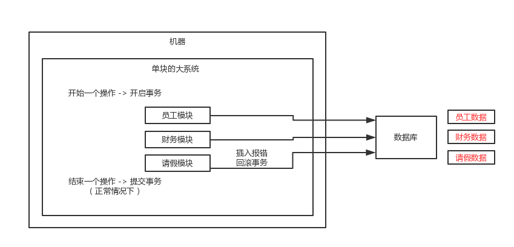
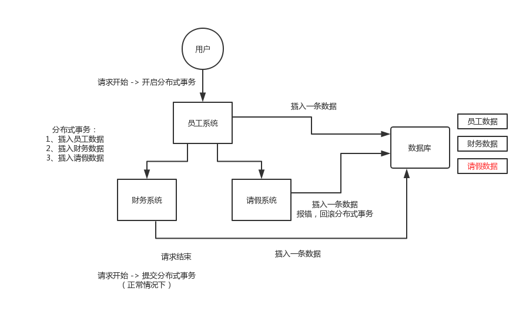
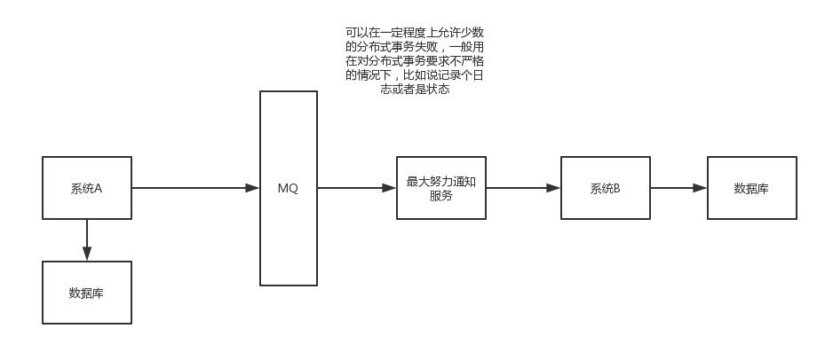

# 分布式事务解决方案

- 分布式事务了解吗
- 你如何解决分布式事务问题
  - 两阶段提交方案/XA方案
  - TCC方案
  - 本地消费表
  - 可靠消息最终一致性方案
  - 最大努力通知方案
- 公司如何处理分布式事务

## 分布式事务

只要聊到你做了分布式系统，必问分布式事务，你对分布式事务一无所知的话，确实会很坑，你起码得知道有哪些方案，一般怎么来做，每个方案的优缺点是什么。

现在面试，分布式系统成了标配，而分布式系统带来的分布式事务也成了标配了。因为你做系统肯定要用事务吧，那你用事务的话，分布式系统之后肯定要用分布式事务吧。先不说你搞过没有，起码你得明白有哪几种方案，每种方案可能有啥坑？比如TCC方案的网络问题、XA方案的一致性问题

### 单机系统下的事务

### 分布式系统下的事务

## 两阶段提交方案/XA方案

 也叫做两阶段提交事务方案，这个举个例子，比如说咱们公司里经常tb是吧（就是团建），然后一般会有个tb主席（就是负责组织团建的那个人）。

tb，team building，团建

第一个阶段，一般tb主席会提前一周问一下团队里的每个人，说，大家伙，下周六我们去滑雪+烧烤，去吗？这个时候tb主席开始等待每个人的回答，如果所有人都说ok，那么就可以决定一起去这次tb。如果这个阶段里，任何一个人回答说，我有事不去了，那么tb主席就会取消这次活动。

第二个阶段，那下周六大家就一起去滑雪+烧烤了

所以这个就是所谓的XA事务，两阶段提交，有一个事务管理器的概念，负责协调多个数据库（资源管理器）的事务，事务管理器先问问各个数据库你准备好了吗？如果每个数据库都回复ok，那么就正式提交事务，在各个数据库上执行操作；如果任何一个数据库回答不ok，那么就回滚事务。

这种分布式事务方案，比较适合单块应用里，跨多个库的分布式事务，而且因为严重依赖于数据库层面来搞定复杂的事务，效率很低，绝对不适合高并发的场景。如果要玩儿，那么基于spring + JTA就可以搞定，自己随便搜个demo看看就知道了。

这个方案，我们很少用，一般来说某个系统内部如果出现跨多个库的这么一个操作，是不合规的。我可以给大家介绍一下， 现在微服务，一个大的系统分成几百个服务，几十个服务。一般来说，我们的规定和规范，是要求说每个服务只能操作自己对应的一个数据库。

如果你要操作别的服务对应的库，不允许直连别的服务的库，违反微服务架构的规范，你随便交叉胡乱访问，几百个服务的话，全体乱套，这样的一套服务是没法管理的，没法治理的，经常数据被别人改错，自己的库被别人写挂。

如果你要操作别人的服务的库，你必须是通过调用别的服务的接口来实现，绝对不允许你交叉访问别人的数据库！

## TCC方案

TCC的全程是：Try、Confirm、Cancel。

这个其实是用到了补偿的概念，分为了三个阶段：

- Try阶段：这个阶段说的是对各个服务的资源做检测以及对资源进行锁定或者预留

- Confirm阶段：这个阶段说的是在各个服务中执行实际的操作

- Cancel阶段：如果任何一个服务的业务方法执行出错，那么这里就需要进行补偿，就是执行已经执行成功的业务逻辑的回滚操作

给大家举个例子吧，比如说跨银行转账的时候，要涉及到两个银行的分布式事务，如果用TCC方案来实现，思路是这样的：

- Try阶段：先把两个银行账户中的资金给它冻结住就不让操作了
- Confirm阶段：执行实际的转账操作，A银行账户的资金扣减，B银行账户的资金增加
- Cancel阶段：如果任何一个银行的操作执行失败，那么就需要回滚进行补偿，就是比如A银行账户如果已经扣减了，但是B银行账户资金增加失败了，那么就得把A银行账户资金给加回去

这种方案说实话几乎很少用人使用，我们用的也比较少，但是也有使用的场景。因为这个事务回滚实际上是严重依赖于你自己写代码来回滚和补偿了，会造成补偿代码巨大，非常之恶心。

比如说我们，一般来说跟钱相关的，跟钱打交道的，支付、交易相关的场景，我们会用TCC，严格严格保证分布式事务要么全部成功，要么全部自动回滚，严格保证资金的正确性，在资金上出现问题

比较适合的场景：这个就是除非你是真的一致性要求太高，是你系统中核心之核心的场景，比如常见的就是资金类的场景，那你可以用TCC方案了，自己编写大量的业务逻辑，自己判断一个事务中的各个环节是否ok，不ok就执行补偿/回滚代码。

而且最好是你的各个业务执行的时间都比较短。

但是说实话，一般尽量别这么搞，自己手写回滚逻辑，或者是补偿逻辑，实在太复杂了，那个业务代码很难维护。

## 本地消费表

这个大概意思是这样的

- A系统在自己本地一个事务里操作同时，插入一条数据到消息表
- 接着A系统将这个消息发送到MQ中去
- B系统接收到消息之后，在一个事务里，往自己本地消息表里插入一条数据，同时执行其他的业务操作，如果这个消息已经被处理过了，那么此时这个事务会回滚，这样保证不会重复处理消息
- B系统执行成功之后，就会更新自己本地消息表的状态以及A系统消息表的状态
- 如果B系统处理失败了，那么就不会更新消息表状态，那么此时A系统会定时扫描自己的消息表，如果有没处理的消息，会再次发送到MQ中去，让B再次处理
- 这个方案保证了最终一致性，哪怕B事务失败了，但是A会不断重发消息，直到B那边成功为止

这个方案说实话最大的问题就在于严重依赖于数据库的消息表来管理事务啥的？？？这个会导致如果是高并发场景咋办呢？咋扩展呢？所以一般确实很少用

## 可靠消息最终一致性方案

这个的意思，就是干脆不要用本地的消息表了，直接基于MQ来实现事务。比如阿里的RocketMQ就支持消息事务。

大概的意思就是：

- A系统先发送一个prepared消息到mq，如果这个prepared消息发送失败那么就直接取消操作别执行了
- 如果这个消息发送成功过了，那么接着执行本地事务，如果成功就告诉mq发送确认消息，如果失败就告诉mq回滚消息
- 如果发送了确认消息，那么此时B系统会接收到确认消息，然后执行本地的事务
- mq会自动定时轮询所有prepared消息回调你的接口，问你，这个消息是不是本地事务处理失败了，所有没发送确认消息？那是继续重试还是回滚？一般来说这里你就可以查下数据库看之前本地事务是否执行，如果回滚了，那么这里也回滚吧。这个就是避免可能本地事务执行成功了，别确认消息发送失败了。
- 这个方案里，要是系统B的事务失败了咋办？重试咯，自动不断重试直到成功，如果实在是不行，要么就是针对重要的资金类业务进行回滚，比如B系统本地回滚后，想办法通知系统A也回滚；或者是发送报警由人工来手工回滚和补偿

这个还是比较合适的，目前国内互联网公司大都是这么玩儿的，要不你举用RocketMQ支持的，要不你就自己基于类似ActiveMQ？RabbitMQ？自己封装一套类似的逻辑出来，总之思路就是这样子的

最终一致性的解决方案：就是生产把消息发送到消息队列中，然后消息队列对消息进行持久化操作，但消费者没有进行处理的时候，就会不断的重试，知道最终处理完成，这就保证了一致性。

## 最大努力通知方案

这个方案的大致意思就是：

- 系统A本地事务执行完之后，发送个消息到MQ

- 这里会有个专门消费MQ的最大努力通知服务，这个服务会消费MQ然后写入数据库中记录下来，或者是放入个内存队列也可以，接着调用系统B的接口

- 要是系统B执行成功就ok了；要是系统B执行失败了，那么最大努力通知服务就定时尝试重新调用系统B，反复N次，最后还是不行就放弃

  

  

可以在一定程度上允许是少数的分布式事务失败，一般用在对分布式要求不严格的情况下，比如说记录日志或状态

## 公司如何处理分布式事务

我们某某特别严格的场景，用的是TCC来保证强一致性；然后其他的一些场景基于了阿里的RocketMQ来实现了分布式事务。你找一个严格资金要求绝对不能错的场景，你可以说你是用的TCC方案；如果是一般的分布式事务场景，订单插入之后要调用库存服务更新库存，库存数据没有资金那么的敏感，可以用可靠消息最终一致性方案

 友情提示一下，rocketmq 3.2.6之前的版本，是可以按照上面的思路来的，但是之后接口做了一些改变，我这里不再赘述了。

 当然如果你愿意，你可以参考可靠消息最终一致性方案来自己实现一套分布式事务，比如基于rabbitmq来玩儿。

老师，我们现在想保证我们的某个系统非常的可靠，任何一个数据都不能错，我们用的是微服务架构，几十个服务。结果我们一盘点，发现，如果到处都要搞的话，一个系统要做几十个分布式事务出来。

 我们的经验，我带几十人的team，最大的一个项目，起码几百个服务，复杂的分布式大型系统，里面其实也没几个分布式事务。

 你其实用任何一个分布式事务的这么一个方案，都会导致你那块儿代码会复杂10倍。很多情况下，系统A调用系统B、系统C、系统D，我们可能根本就不做分布式事务。如果调用报错会打印异常日志。

 每个月也就那么几个bug，很多bug是功能性的，体验性的，真的是涉及到数据层面的一些bug，一个月就几个，两三个？如果你为了确保系统自动保证数据100%不能错，上了几十个分布式事务，代码太复杂；性能太差，系统吞吐量、性能大幅度下跌。

 99%的分布式接口调用，不要做分布式事务，直接就是监控（发邮件、发短信）、记录日志（一旦出错，完整的日志）、事后快速的定位、排查和出解决方案、修复数据。

每个月，每隔几个月，都会对少量的因为代码bug，导致出错的数据，进行人工的修复数据，自己临时动手写个程序，可能要补一些数据，可能要删除一些数据，可能要修改一些字段的值。

 比你做50个分布式事务，成本要来的低上百倍，低几十倍

 trade off，权衡，要用分布式事务的时候，一定是有成本，代码会很复杂，开发很长时间，性能和吞吐量下跌，系统更加复杂更加脆弱反而更加容易出bug；好处，如果做好了，TCC、可靠消息最终一致性方案，一定可以100%保证你那快数据不会出错。

 1%，0.1%，0.01%的业务，资金、交易、订单，我们会用分布式事务方案来保证，会员积分、优惠券、商品信息，其实不要这么搞了