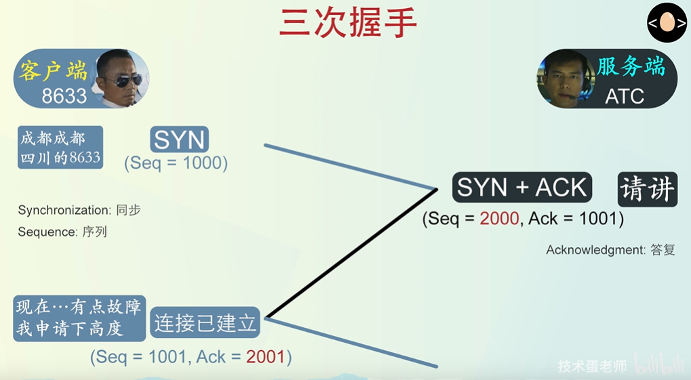
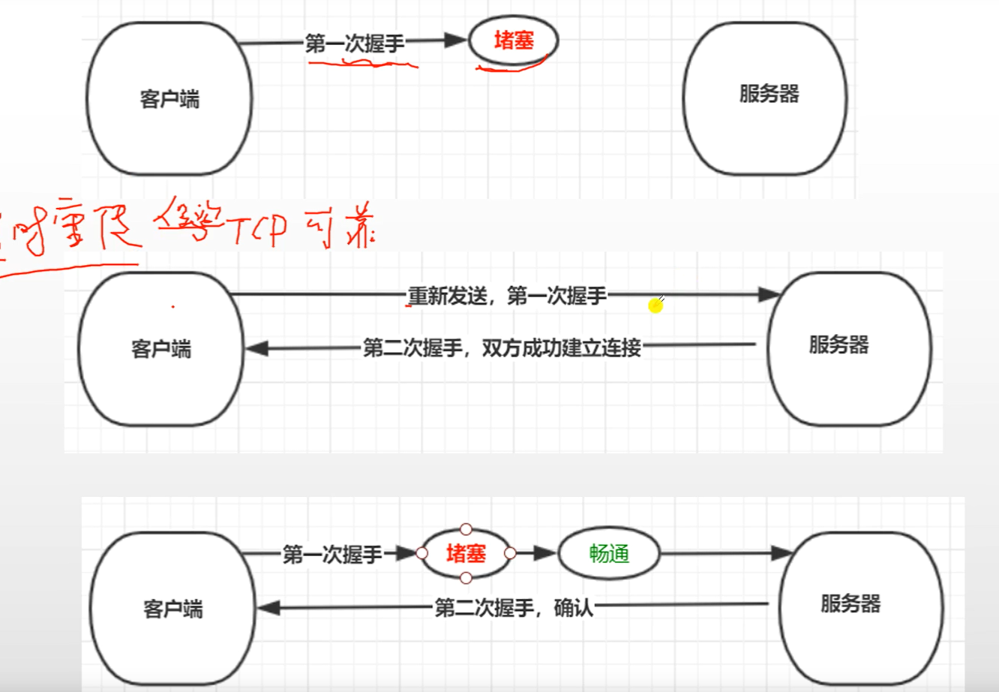
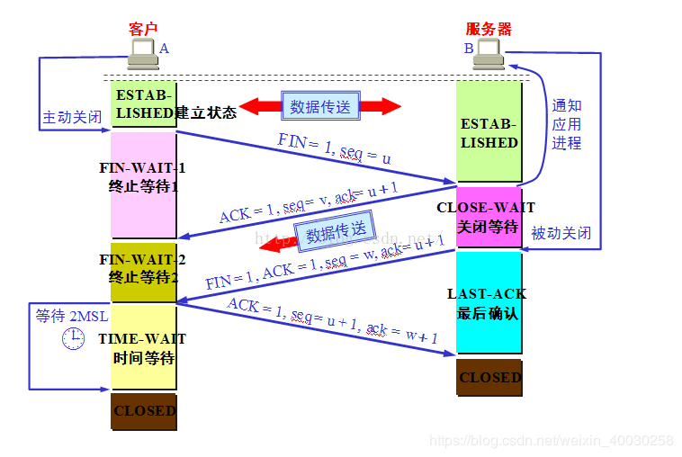
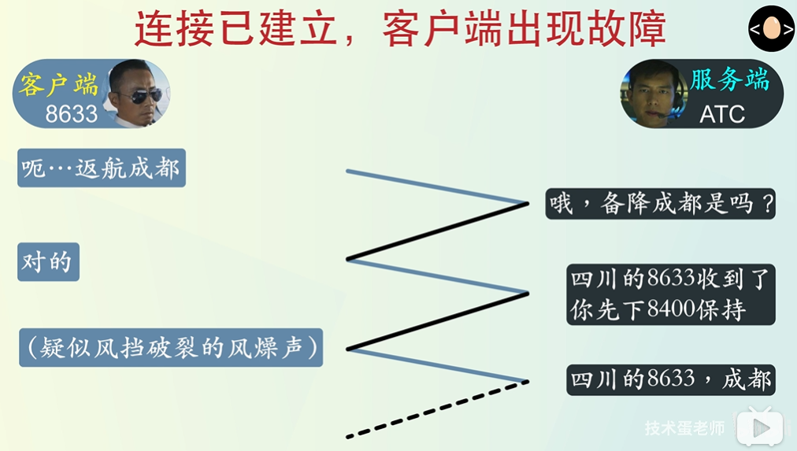
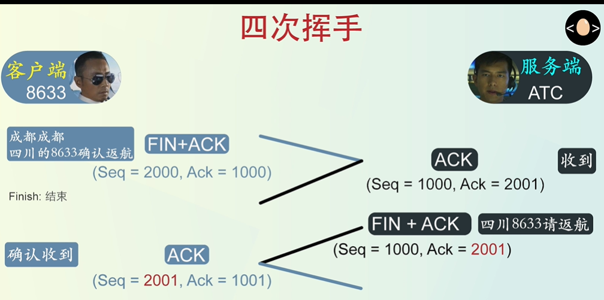

# 三次握手和四次挥手

## 三次握手

### 概念

为什么需要握手：握手的作用就是为了同步一些信息，比如最大滑动窗口

TCP：是一个可靠的连接，也就是客户端和服务器双方必须感知对方的存在，也就是需要经历一个建立连接的过程

用三次握手建立TCP连接，连接有三个阶段

- 建立连接
- 数据传输
- 连接释放

连接的管理就是使连接的建立和释放都能正常地进行，连接阶段过程中要解决以下三个问题

- 要使每一方都能确知对方的存在
- 要允许双方协商一些参数
- 能够对运输实体分配资源

### TCP连接建立过程

TCP建立连接的过程：被称为握手

① 握手过程其实是发送的TCP报文，在这里面有两个字段，SYN 和 seq

- SYN = 1：表示该报文不能携带数据，但是需要消耗一个SEQ（序号），可以想象成我们对消息编号
- seq：TCP的每个字节发送的时候，都有一个序号，主要是为了保证可靠性，比如当我服务器通过TCP报文得到了有N个字节需要接受，但是最后只接受到了N-1个，我们通过序号就知道哪个没有被接收到。
- 客户端进入SYN_SENT状态，即同步已发送

② 当服务器接受到我们的握手请求时，会回复一个确认报文

- SYN：表示不携带数据，同时消耗一个SEQ = y（这里的y是任意数字，可以是1,2,3,4）
- ACK：=1 表示这是一条确定报文
- ack：x+1，其中x是刚刚客户端发送过来的
- 服务器进入SYN_RECVD状态，即同步已收到

③ 当客户端收到确认报文的时候，客户端需要对这个确认报文进行回复

- ACK：=1，表示这是一条确认报文
- seq：= x +1，
- ack：= y+1

经过了这三次握手，两者就进入了连接状态

### 通俗的理解

- 客户端：服务器，我们可以建立连接么？ ->  SYN= 1 ， seq = x
- 服务器：可以啊，我们建立连接吧 ！  -> ACK =1, SYN = 1, seq = y, ack  = x+1
- 客户端：收到，建立连接吧！  ->  ACK = 1,  SYN = 1，seq = x + 1， ack = y + 1

然后建立TCP连接

中国机长版三次握手

### 为什么是三次握手

#### 四次握手

四次连接有点多余，第三次的时候，我们已经互相进行了连接确认

但是因为我们无法保证百分百的可靠性

#### 两次握手：

客户端知道服务器有接收 和 发送的能力，服务器不知道客户端有没有接收数据的能力，因为通过第一次握手，已经知道了客户端能够发送数据，但是能不能接收数据，还是不清楚，因此这个TCP连接是不可靠的。

为什么不能两次握手就建立连接

因为超时重传机制的存在

但客户端发送第一次握手的时候，可能会经历网络拥塞，然后客户端会以为这个连接已经丢失，然后会重新发送一个请求连接的信息到服务器，这次发送的消息很快被服务器接受，然后服务器建立连接就开始建立连接。但是当第一次发送的请求经过一段时间的阻塞后，成功到达服务器，然后服务器又连接连接，而此时客户端是不会理会这次请求的建立，所以服务器一直在等待客户端数据的发送。

## 四次挥手

所谓的四次挥手，就是关闭TCP连接的过程，指的是断开一个TPC连接，需要客户端和服务端总共发送4个包，以确定双方连接的断开。

主要目的：保证TCP连接的全双工连接

### 四次挥手示意图

由于TCP连接是全双工的，因此每个方向都必须单独关闭，这个原则是当以防完成它的数据发送任务后，就能发送一个FIN包来终止这个方向的连接。

收到一个FIN包只意味着这一方向上没有数据流动，一个TCP连接在收到一个FIN后，仍然能发送数据，首先进行关闭的一方将执行主动关闭，而另一方执行被动关闭。

### 四次挥手过程

- **第一次挥手**：客户端发送一个FIN包（FIN=1，seq=U）给服务器，用来关闭客户端到服务器端的数据传输，客户端进入FIN_WAIT_1状态（终止等待）
- **第二次挥手**：服务器端收到FIN包后，发送一个ACK包（ACK=1，ack=u+1，在随机产生一个值v 给seq）给客户端，服务器进入了CLOSE_WAIT状态（关闭等待）
- **第三次挥手**：服务器端发送一个FIN包（FIN=1，ACK=1，ack=u+1，在随机产生 一个w值给seq）给客户端，用来关闭服务器到客户端的数据传输，服务端进入了LAST_ACK（最后确定）状态
- **第四次挥手**：客户端接收FIN包，然后进入TIME_WAIT状态，接着发送一个ACK包（ACK=1，seq=u+1, ack = w+1） 给服务端，服务端确定序号，进入CLOSe状态，完成了四次挥手。

### 挥手中的状态

- CLOSED：表示初始状态
- ESTABLISHED：表示连接已经连接
- FIN_WAIT：状态FIN_WAIT_1和FIN_WAIT_2都表示等待对方的FIN报文，这两个状态的区别是，当主动发送方给对方发送了断开请求时，就进入了FIN_WAIT_1状态，而到被动方在回应后，主动发送方就进入了FIN_WAIT_2。
- **FIN_WAIT_2**：上面已经详细解释了这种状态，实际上FIN_WAIT_2状态下的SOCKET，表示半连接，也即有一方要求close连接，但另外还告诉对方，我暂时还有点数据需要传送给你，稍后再关闭连接 
- CLOSE_WAIT：这个状态的含义是 表示在等待关闭
- LAST_ACK：在被动关闭放发送FIN报文后，最后等待对方的ACK报文，当收到了ACK报文后，就进入了CLOSE状态。

### 为什么TIME_WAIT状态还需要等待2MSL后才能返回CLOSE

这是因为虽然双方都同意了关闭连接，而且握手的4个报文也都协调和发送完毕，按道理可以直接回到CLOSE状态

但是因为我们需要假设网络是不可靠的，你无法保证你最后发送的ACK报文是会一定被对方收到，因此处于LAST_ACK状态下的socket可能会因为超时未收到ACK报文，而重发FIN报文，所以这个TIME_WAIT状态的作用就是用来重发可能丢失的报文。

### 中国机长版四次挥手

当客户端与服务器在规定的时间内没有得到应答

会发送报文进行探测，假设没有应答，那么就会关闭连接

下面是四次挥手的过程

