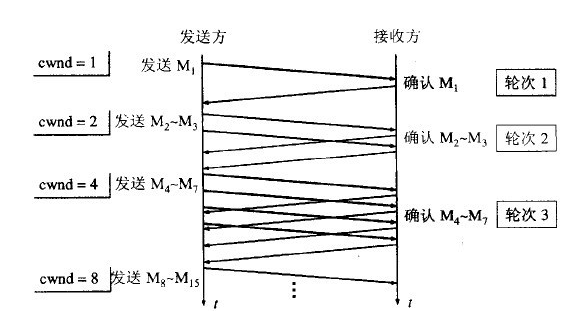
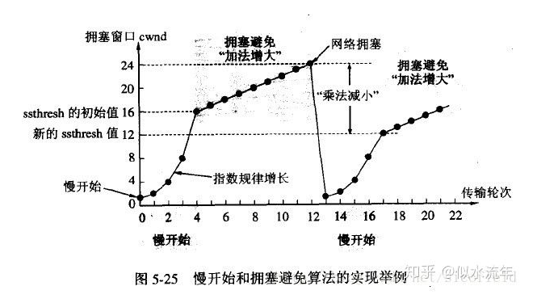
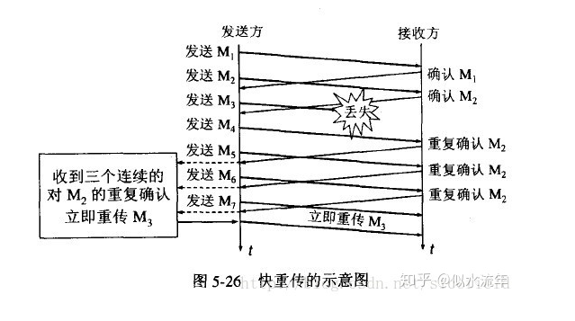
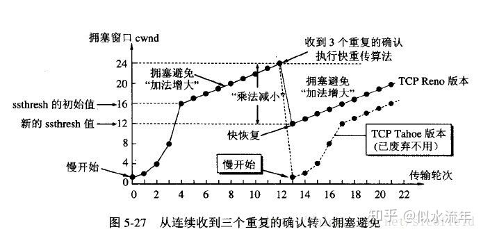

# TCP中的流量控制和拥塞控制

## 流量控制

### 什么是流量控制

如果发送者发送数据过快，接收者来不及接收，那么就会出现分组丢失，为了避免分组丢失，控制发送者的发送速度，使得接收者来得及接收，这就是流量控制。

流量控制的目的是：防止分组丢失，是构成TCP可靠性的一方面。

### 如何实现流量控制

由滑动窗口协议（连续ARQ协议）实现，滑动窗口协议即保证了分组无差错，有序接收，也实现了流量控制。主要的方式就是接收方返回的ACK会包含自己的接受窗口大小，并利用大小来控制发送方的数据发送。

## 拥塞控制

### 什么是拥塞控制

拥塞控制是作用于网络的，它是防止过多的数据注入网络，避免出现网络负载过大的情况，常见的方法就是

- 慢开始，避免拥塞
- 快重传、快恢复

### 拥塞控制算法

我们首先添加几个限定条件

- 数据是单方向传递，另一个窗口只发送确认
- 接收方的缓存足够大，因此发送方的大小由网络的拥塞程度来决定

#### 慢开始算法

发送方维持一个叫做拥塞窗口cwnd（congestion window）的状态变量，拥塞窗口的大小取决于网络的拥塞程度，并且动态地在变化，发送方让自己的发送窗口等于拥塞窗口，另外考虑到接收方的接受能力，发送窗口可能小于拥塞窗口。

慢开始算法的思路就是：不要一开始就发送大量的数据，先测探一下网络的拥塞程度，也就是说从小到大主键增加拥塞窗口的大小。

这里用报文段的个数作为拥塞窗口的大小举例说明慢开始算法，实际的拥塞窗口大小是以字节为单位的。如下图所示：

> 发送方没收到一个确认窗口，就把窗口cwnd加1

从上图可以看到，一个传输轮次所经历的时间其实就是往返时间RTT，而且每经过一个传输轮次，拥塞窗口cwnd就加倍

为了防止cwnd增长过大引起网络拥塞，还需设置一个慢开始门限ssthresh状态变量，ssthresh的用法如下：

- 当 cwnd < ssthresh时：使用慢开始算法
- 当cwnd = ssthresh时：采用 慢开始或拥塞避免中的任意一种
- 当 cwnd > ssthresh时：采用拥塞避免算法

#### 拥塞避免算法

拥塞避免算法让拥塞窗口缓慢增长，即没经过一个往返时间RTT就把发送方的拥塞窗口cwnd加1，而不是加倍，这样能够让拥塞窗口按线性规律增长。

无论是在慢开始阶段，还是在拥塞控制阶段，只要发送方判断网络出现拥塞，就把慢开始门限 ssthressh设置为当前出现拥塞时发送窗口大小的一半（不能小于2），然后将拥塞窗口cwnd设置为1，执行慢开始算法。

这样做的目的是迅速减少主机发送到网络中的分组数，使得发送拥塞的路由器有足够时间把队列中积压的分组处理完毕。

整个拥塞控制的流程图如下图所示：

- 拥塞窗口cwnd初始化为1个报文段，慢开始门限初始值为16
- 执行慢开始算法，指数规律增长到第4轮，即cwnd=16=ssthresh，改为执行拥塞避免算法，拥塞窗口按线性规律增长
- 假定cwnd=24时，网络出现超时（拥塞），则更新后的ssthresh=12，cwnd重新设置为1，并执行慢开始算法。当cwnd=12=ssthresh时，改为执行拥塞避免算法

**乘法减小和加法增大**

- 乘法减小”指的是无论是在慢开始阶段还是在拥塞避免阶段，只要发送方判断网络出现拥塞，就把慢开始门限ssthresh设置为出现拥塞时的发送窗口大小的一半，并执行慢开始算法，所以当网络频繁出现拥塞时，ssthresh下降的很快，以大大减少注入到网络中的分组数。
- 加法增大”是指执行拥塞避免算法后，使拥塞窗口缓慢增大，以防止过早出现拥塞。常合起来成为AIMD算法。

#### 快重传算法

快重传要求接收方在收到一个失序的报文段后，就立即发出重复确定（为的是使发送方及早知道有报文段没有达到对方，可提高网络吞吐量约20%）而不要等到自己发送数据时捎带确定。快重传算法规定，发送方只要一连收到三个重复确定就应当立即重传对方尚为收到的报文段，而不必继续等待设置的重传计时器时间到期，如下所示

#### 快恢复

快重传配合使用的还有快恢复算法，有以下两点要求

- 当发送方连续收到三个重复确认时，就执行乘法减小算法，把ssthresh门限减半（为了预防发送拥塞），但是接下来并不执行慢开始算法
- 考虑到如果网络出现拥塞的话，就不会收到好几个重复的确认，所以发送方现在认为网络可能没有出现拥塞，所以此时不执行慢开始算法，而是将cwnd设置为ssthresh减半后的值，然后执行拥塞避免算法，使cwnd缓慢增大，如下图所示：TCP Reno版本是目前使用最广泛的版本。

> 在采用快恢复算法时，慢开始算法只是在TCP连接建立时和网络出现超时时才使用

## 来源

https://zhuanlan.zhihu.com/p/37379780