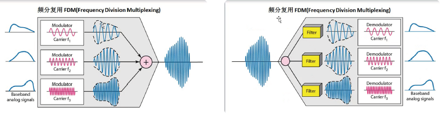
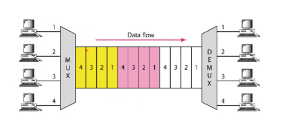

# 计算机网络分层结构 - 物理层

## 两种分层结构

### OSI体系结构

- 应用层
- 表示层
- 会话层
- 运输层
- 网络层
- 数据链路层
- 物理层

### TCP/IP体系结构

- 应用层
- 运输层（TCP、UDP）
- 网络层（IP）
- 数据链路层
- 物理层

## 物理层

### 基本概念

物理层解决如何在连接各种计算机的传输媒体上传输数据比特流，而不是指具体的传输媒体，尽可能的屏蔽掉传输媒体和通信手段的差异。

物理层的主要任务描述为：确定传输媒体的接口的一些特性

- 机械特性：接口形状，引线数目
- 电气特性：规定电压的范围（-5V 到 +5V）
- 功能特性：例：规定 -5V表示0，+5V表示1
- 过程特性：各个相关部件的工作步骤

### 数据通信模型

### 与通信相关的术语

- 数据：运送消息的实体
- 信号：数据电器或电磁的表现
  - 模拟信号：代表消息的参数的取值是连续的
  - 数字信息：代表消息的参数的取值是离散的
- 码元：在使用时间域的波形表示数字信号时，则代表不同离散数值的基本波形就成为了码元

### 有关信道的基本概念

信道一般表示向一个方向上传递信息的媒体，我们平时说的通信线路往往包含一条发送信息的信道和一个接受信息的信道

- 单工通道：只有一个方向上的通信，而没有反方向的交互
- 半双工通信：不能同时发送，只能一个发送，一个接受（例如：对讲机）
- 全双工通信：通信双方可以同时发送和接受（例如：手机）

### 基带信号和带通信号

- 基带信号：来自信源的信号
- 带通信号：是通过将基带信号进行载波调制后，把信号的频率搬到较高的频段

对基带信号的几种调制方式：调幅、调频、调相

### 曼切斯特编码

利用曼彻斯特编码，一个时钟周期只可以表示一个bit，并且必须通过两次采样才能得到一个bit，但它能携带时钟信号，且可表示没有数据传输

### 差分曼彻斯特编码

- bit中间有信号跳变，bit与bit之间也有信号跳变，表示下一个bit为 0
- bit中间有信号跳变，bit与bit之间没有信号跳变，表示下一个bit为 1

差分曼切斯特编码和曼彻斯特编码相同，但是抗干扰性强于曼切斯特编码，例如

### 信道极限容量

#### 奈氏准则

任何信道中，码元的传输速率是有上限的，否则就会出现码间串扰的问题，使得接收端对码元的判决成为不可能。

#### 信噪比：香农定理

香农用信息论的理论，推导出带宽首先且有高斯白噪声干扰的信道的极限，无差错的信息传输速率

信道的极限信息传输传输速度 $c$ 可以表示为
$$
c=w \log _{2}(1 + s / N) \quad b / s  (有噪声干扰的传输速率)
$$
其中：

- w：信道的带宽，以HZ为单位
- S：信道内所传信号的平均功率
- N：信道内部的高斯噪声功率

**结论**：香农公式表明，信道的带宽或信道内 的信噪比越大，则信息的极限传输速率就越高。

### 物理层下面的传输媒体

- 导向传输媒体：导向传输媒体中，电磁波沿着固体媒体传播
  - 屏蔽双绞线：STP
  - 非屏蔽双绞线：UTP
  - 同轴电缆：有线电视
  - 光缆
- 非导向传播媒体：无线传输

其中，我们常常说的网线，就是双绞线。

10M 和 100M带宽的网络，只需要使用 1,2,3,6 四根线

而 1000M带宽的网络，8根线都需要使用

### 信道复用技术

信道复用指的就是多个用户共用同一信道进行传输

#### 频分复用

用户 分配到一定的频带后，在通信过程中自始至终都占用这个频带，频分复用的所有用户在同样的时间，占用不同的带宽资源

#### 时分复用

时分复用，指的是每个数据占用一个时间片，时分复用可能会导致线路资源的浪费

#### 波分复用

波分复用就是光的频分复用

#### 数字传输系统

主要用于广域网上的传输，脉码调制PCM体制最初是为了在电话局之间的中继线上传送多路的电话，由于历史的原因，PCM有两个互不兼容的国际标准：

- 欧洲标准：（EI），我国目前采用广度
- 北美标准：（TI）

#### 宽带接入技术

- XDSL：用数字技术对现有的模拟电话用户线进行改造
  - 电话信号频率：300~3400HZ
  - 然后把更高频率用于用户上网，使用的就是频分复用技术
- DMT技术：把更多的信道用于下行，少数信道用户上行
  - 这是因为上传流量远远小于下载流量

