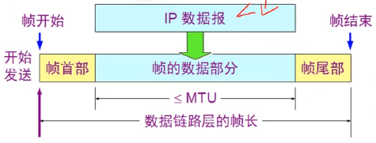
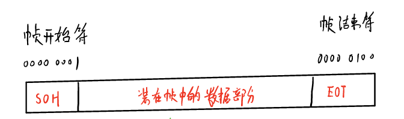
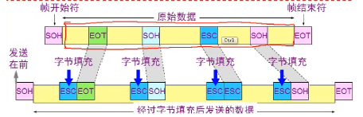
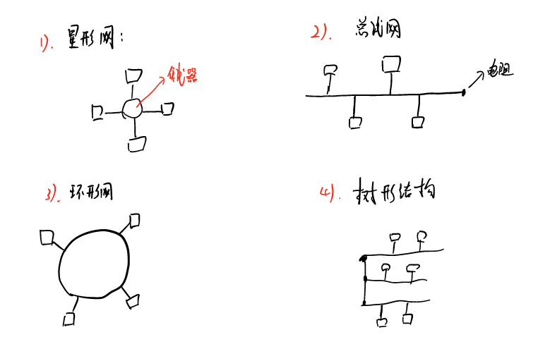

# 数据链路层

## 链路和数据链路

### 链路

一条点到点的物理线路段，中间没有其它的交换节点，一条链路只是一条通路的一个组成部分

### 数据链路

除物理链路外，还必须有通信协议来控制这些数据的传输，若把实现这些协议的硬件和软件加到链路上，就构成了数据链路。现常见的方法就是使用适配器（网卡）来实现这些协议的硬件和软件。

数据链路层相当于一个管道，传输的是一条条的帧信息

## 数据链路层的主要功能

- 封装成帧
- 透明传输
- 差错控制

## 封装成帧

封装成帧就是一段数据的前后分别添加首部和尾部，然后构成一个帧，确定帧的界限

首部和尾部的一个重要作用就是进行帧定界

下图是使用控制字符进行帧定界的方法举例

若帧数据部分有 开始标记 和 结束标记怎么办？

发送端的数据链路层在数据中出现控制字符 “SOH” 或 “EOT”的前面插入一个转移字符 “ESC”

这个时候就需要用到字节填充 或 字符填充，也就是接收端的数据链路层在数据送往网络层之间删除插入的转义字符。

如果转移字符也出现在数据中，那么应该在转义字符的前面在插入一个转义字符。当接收端连续收到两个转义字符的时候，就删除掉前面的一个

## 差错控制

传输的过程中可能会产生比特差错,1可能变成0，而0也可能变成1。

在一段时间内，传输错误的比特占所传输比特总数的比率称为 误码率 BER（Bit error Rate），其中误码率和信噪比有很大的关系。

### CPC循环冗余检验

CRC是一种常用的检错方法，而FCS是添加在数据后面的冗余码

FCS可以用CRC这种方法得出，并且CRC是用来获取FCS的唯一方法

我们得到 FCS后，将其拼接到我们传送数据的末端

接收端对收到的每一帧进行CRC检验

- 若得出的余数  R = 0，则判定这个帧没有差错，就接受
- 若余数不为0，则判定有差错，丢弃

特点

- 这种差错检测的方法不能确定是哪一位出现了问题
- 只需使用足够的余数，就能检测出来

## 两种情况的数据链路

- 点到点：PPP协议（全世界使用最多的），只实现无差错接收
- 零比特填充：5个连续的1，后面添加一个0

## 局域网的拓扑结构

## CSMA/CD

- 多点接入：表示许多计算机以多点接入的方式连接在一根总线上
- 载波监听：是指每一站在发送数据之前，先检测一下总线上是否有其它数据

## 碰撞检测

碰撞检测就是计算机发送数据时，检测链路上信号电压的大小

使用CSMA/CD协议的以太网不能进行全双工通信，而只能进行双向交替通信（半双工通信），每个站发送数据之后一小段时间，可能会遭遇碰撞的可能性。

发生碰撞的站停止发送数据后，需要延迟一个随机时间 才能再发送数据，确定基本退避时间，一般是取2T，当重传16次后，仍然不成功，即丢弃该帧，并向高层报告。

## 以太网

只要满足载波监听，多路访问的都是以太网。

同时局域网数据链路层拆分成了两个子层

- 逻辑链路控制LLC子层
- 媒体接入控制MAC子层，现在的网卡只有MAC子层

以太网提供的服务是不可靠的交付，即尽最大努力的交付。

## 信道利用率

$$
\partial=\frac{\tau}{T_{0}}
$$

## 流量控制协议

### 单工停等协议

stop and wait，链路不出错，但有可能出现流量不匹配的情况，发送方每发一帧停下来，每收到一帧后，上交网络层，再发一个确认给发送方，表示收到。发送方收到确认在发送下一个。

### 连续ARQ

自动请求重发协议。

- 发送端：在发送完一个数据帧后，不是停下来等待应答帧，而是可以连接再发送下面的数据帧。如果这时收到了接收端发来的确认帧，那么还可以接着再发送下面的数据帧。如果超时时间到，仍然没有收到相应的确认帧，则重新从这个帧开始重传。（go back  N ARQ）
- 接收端：连续接收帧，当接收到一个坏帧时，简单丢弃这个帧和这个帧以后的所有帧，让他们在发送端超时，这道收到这个帧为止。

### 停止等待协议和连续ARQ协议的问题

#### 停止等待协议

发送 - 停止 - 等待，效率较低，当传播时间比发送时间大得多时，性能变得不可接受

#### 连续ARQ协议

- 未经确定的帧一次传送过多，如果出错，重传的代价太大
- 序号站的位数过多，影响效率，一次能传送1024个帧，10位编号
- 实际协议中，一次连续传输的帧的个数是有限的

### 滑动窗口协议

它是停止等待协议 和 连续ARQ协议的折中

一次发送为确定的帧的个数是有限的

- 发送端：一次发送未经确定的帧是收到发送窗口的控制的，只有落在发送窗口的帧才是可以发送的
- 接收端：只有落在接收窗口的帧才是可以接收的。

出现差错的处理办法

一段收到出错的帧后进行丢弃，不发送确定报文，让发送方超时重发。对后面陆续到达的正确的帧进行同样的处理办法 

- 当wr = 1时
  - 接收方：全部丢弃（drop），链路层只按顺序接收帧
  - 发送方：2号帧超时后，从2号帧开始发送
  - 回退n帧，（go back N protocol）
- 当 wr > 1时
  - 接收方：陆续接收出错的后续各个帧，但不提交给网络层，知道接收到2号帧以后，加上以后存储的各帧，按顺序交给网络层
  - 发送方：2号帧超时后，发完2号帧之后，从第6号帧开始，选择性重传

